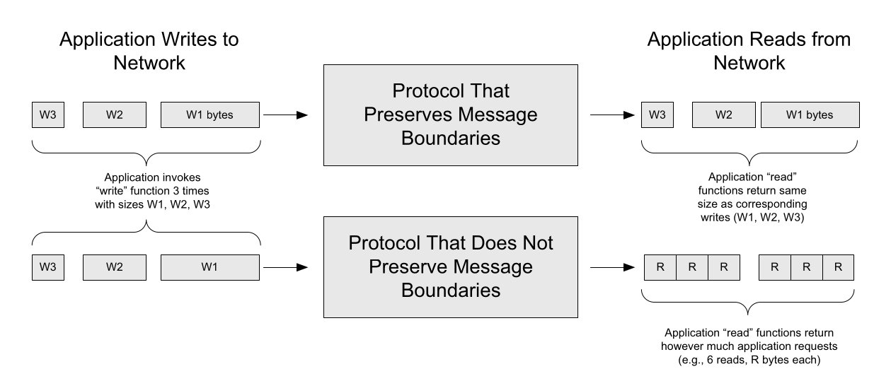
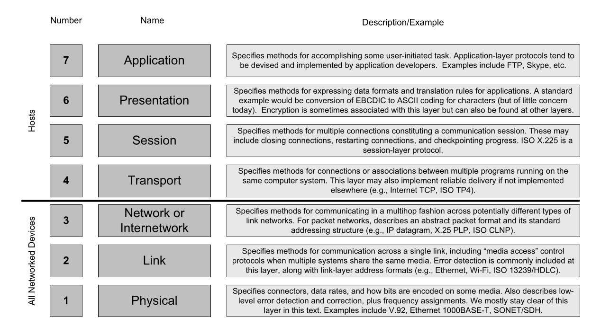
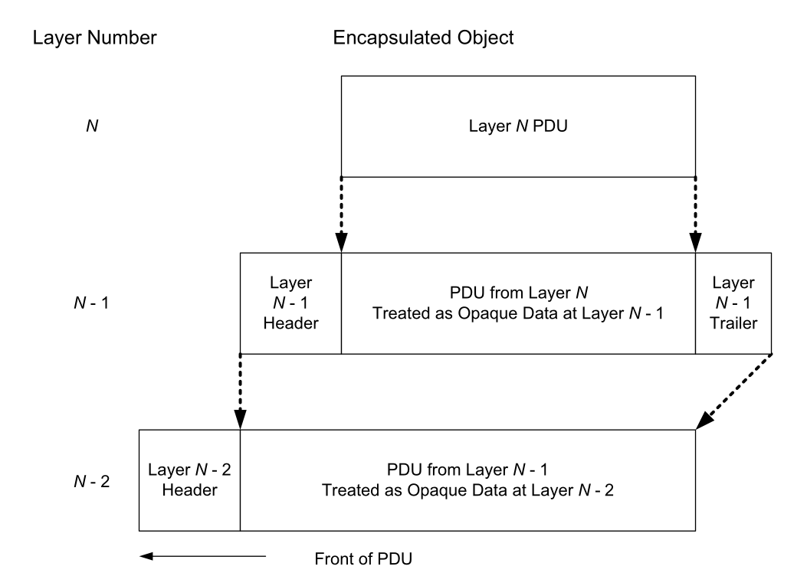
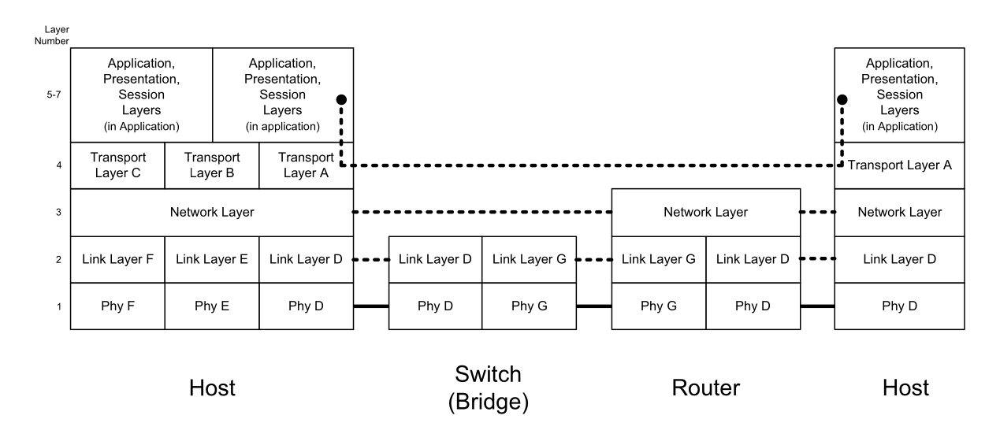
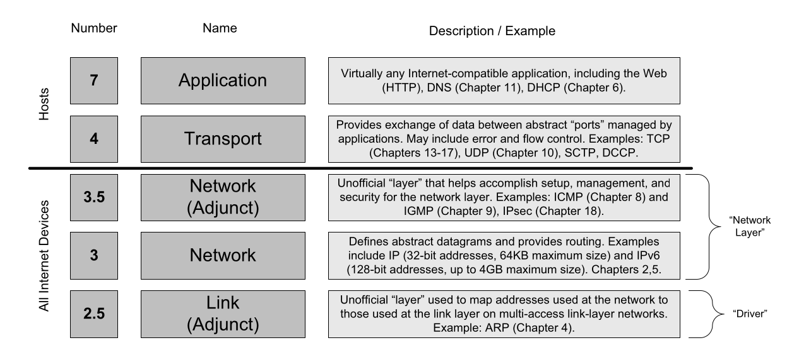
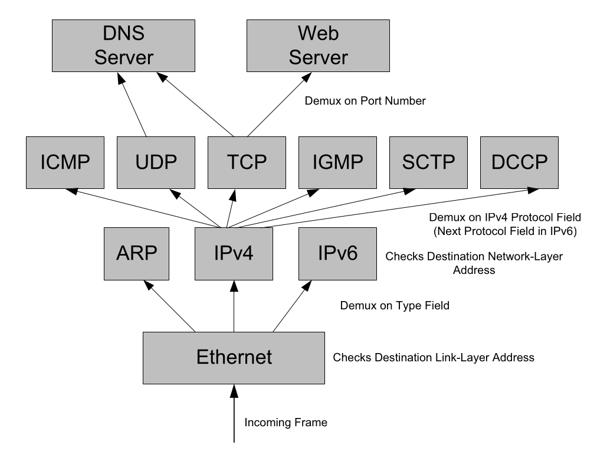

# Chapter 1. Introduction

- 과목: Computer Network
- 기준 교재: TCP/IP Illustrated, Volume 1
- 관련 페이지: PDF pp. 40-69
- 우선순위: 필수

## 개요

TCP/IP는 하나의 protocol이 아니라 여러 protocol이 함께 동작하는 protocol suite다. protocol suite 안에서 각 protocol이 어떤 책임을 맡고 어떤 순서와 관계로 배치되는지를 정한 큰 설계가 architecture 또는 reference model이다. 이 장은 Internet architecture가 왜 packet switching, datagram, end-to-end design, layering, multiplexing/demultiplexing을 택했는지 설명하는 출발점이다.

Internet은 World Wide Web(WWW)과 같은 말이 아니다. Internet은 computer 사이에서 message를 전달하는 기본 communication infrastructure이고, WWW는 그 위에서 동작하는 application이다. TCP/IP는 ARPANET Reference Model(ARM)에서 출발했고, 서로 다른 packet-switched network를 gateway, 이후 router로 연결하는 internetwork라는 생각에서 발전했다.

## 핵심 개념

- protocol: 통신 참여자가 공통으로 따르는 규칙과 절차다. message 형식, 처리 순서, 오류 처리, 주소 지정 같은 약속이 여기에 포함된다.
- protocol suite: TCP, IP, UDP, ICMP, ARP, DNS처럼 관련 protocol을 하나의 체계로 묶은 집합이다.
- architecture/reference model: protocol suite 내부에서 기능을 어디에 둘지, 계층을 어떻게 나눌지, protocol 간 책임을 어떻게 배분할지 정한 설계다.
- packet switching: 정보를 packet 단위로 나누고, packet switch/router가 queue에 저장했다가 독립적으로 전달하는 방식이다.
- datagram: source와 final destination 식별 정보를 packet 자체에 담는 connectionless packet이다. router에 per-connection state를 두지 않아도 된다.
- statistical multiplexing: traffic의 실제 도착 패턴에 따라 link와 switch capacity를 공유하는 방식이다. utilization은 높지만 delay와 throughput 예측성은 낮아질 수 있다.

## 세부 정리

### 1.1 Architectural Principles

TCP/IP protocol suite는 서로 다른 vendor, operating system, device class가 같은 network에서 통신하게 해 주는 open system이다. Internet architecture의 primary goal은 이미 존재하는 여러 network를 interconnect하고, 그 결과 만들어진 internetwork 위에서 여러 통신 활동이 동시에 돌아가게 하는 것이었다.

이 목표에서 몇 가지 설계 요구가 따라온다. communication은 network나 gateway 일부가 손실되어도 계속되어야 하고, 여러 종류의 communication service를 지원해야 하며, 다양한 network를 수용해야 한다. 또 distributed management, cost-effectiveness, 쉬운 host attachment, resource accountability도 중요했다. 이 요구들은 이후 “network core는 단순하게, end host는 똑똑하게”라는 방향을 뒷받침한다.

#### 1.1.1 Packets, Connections, and Datagrams

전화망 기반 circuit switching은 통화 동안 endpoint 사이에 circuit을 설정하고 bandwidth를 예약한다. 이 방식은 latency와 capacity가 비교적 예측 가능하지만, 사용자가 아무 말도 하지 않는 시간에도 예약된 resource가 묶인다. constant bit rate voice에는 잘 맞지만 bursty data traffic에는 낭비가 생긴다.

packet switching은 digital information을 packet이라는 chunk로 나누어 서로 다른 source의 traffic을 같은 link와 switch에서 섞어 보낸다. packet switch는 보통 buffer 또는 queue에 packet을 저장하고 FCFS(first-come-first-served), FIFO(first-in-first-out) 방식으로 처리한다. 이런 단순한 queueing과 on-demand scheduling은 Internet의 기본 traffic mixing 방식인 statistical multiplexing과 잘 맞는다.

statistical multiplexing의 장점은 bottleneck에 보낼 traffic이 있으면 capacity를 놀리지 않고 쓸 수 있다는 점이다. 단점은 predictability다. 한 application이 보는 performance는 동시에 같은 network를 공유하는 다른 application의 traffic pattern에 좌우된다. TDM(time-division multiplexing)이나 static multiplexing은 더 예측 가능하지만 예약된 resource가 놀 수 있다.

connection-oriented packet network, 예를 들어 X.25의 virtual circuit(VC)은 switch마다 per-flow state를 둔다. packet은 logical channel identifier(LCI) 또는 logical channel number(LCN) 같은 작은 식별자를 담고, switch는 state table을 보고 next switch를 결정한다. 이 구조는 signaling protocol로 connection establishment/clearing/status를 관리해야 한다.

Internet은 datagram 방식을 택했다. datagram은 source와 destination 정보를 packet 자체에 담으므로 router가 per-connection state를 유지하지 않아도 되고, 별도의 복잡한 signaling protocol 없이 connectionless network를 만들 수 있다. 대신 packet header overhead가 커지고, 순서 보장, reliable delivery, flow control 같은 성질은 network core가 자동으로 제공하지 않는다.

message boundary 또는 record marker는 application이 여러 번 write한 경계가 receiver에게 그대로 보이는지의 문제다. TCP 같은 streaming protocol은 byte stream을 제공하고 write boundary를 보존하지 않는다. 따라서 application이 message 단위를 알아야 한다면 length prefix, delimiter, fixed-size record 같은 framing 규칙을 application-layer protocol이 직접 마련해야 한다.

<p align="center"></p>
<p align="center"><sub>Figure 1-1 · PDF p. 44 · message boundary를 보존하는 protocol과 보존하지 않는 streaming protocol의 차이</sub></p>

Figure 1-1은 sender가 세 번 write한 data가 receiver에서 반드시 세 번 read되는 것은 아니라는 점을 보여준다. message boundary를 보존하는 protocol은 write 경계를 receiver에게 전달하지만, TCP 같은 stream protocol은 receiver가 요청한 byte 수만큼 읽게 하므로 application-level framing이 필요하다.

#### 1.1.2 The End-to-End Argument and Fate Sharing

end-to-end argument는 "어떤 기능을 어디에 둘 것인가"에 대한 TCP/IP 설계의 핵심 원칙이다. communication system 자체가 application의 의도를 완전히 알 수 없으므로, correctness와 completeness가 중요한 기능은 endpoint application 또는 endpoint host의 도움 없이는 완전하게 구현되기 어렵다. 대표 예는 error control, encryption, delivery acknowledgment다.

이 원칙은 network core가 아무 기능도 하면 안 된다는 뜻이 아니다. 낮은 layer나 network 내부의 기능은 endpoint의 일을 쉽게 하거나 performance enhancement를 줄 수 있다. 다만 낮은 layer가 application 요구를 완벽히 추측해 correctness를 보장하려고 하면 불완전해지기 쉽다. 그래서 TCP/IP는 "dumb network, smart end hosts"라는 성향을 갖는다.

fate sharing은 active communication association, 예를 들어 virtual connection을 유지하는 데 필요한 state를 communicating endpoints와 같은 실패 운명에 두자는 원칙이다. connection state가 network 중간 장비에 넓게 흩어져 있으면 중간 장비 하나의 failure가 endpoint는 살아 있어도 communication 자체를 깨뜨릴 수 있다. 반대로 state를 end host 쪽에 두면, endpoint가 죽지 않는 한 network 내부 일부 connectivity failure가 잠시 발생해도 다른 path가 살아 있으면 통신을 이어갈 수 있다.

이 두 원칙은 서로 맞물린다. end-to-end argument는 기능의 최종 책임을 endpoint에 두도록 밀고, fate sharing은 communication state를 endpoint와 함께 두도록 민다. Internet에서 TCP virtual connection이 network 내부의 일시적 장애에도 유지될 수 있는 배경이 여기에 있다. 동시에 오늘날 Internet architecture의 긴장도 여기서 생긴다. cache, NAT, firewall, middlebox, CDN처럼 network 안에 기능을 넣을수록 성능과 관리성은 좋아질 수 있지만, end-to-end transparency와 fate sharing은 약해질 수 있다.

#### 1.1.3 Error Control and Flow Control

error control은 network 안에서 data가 손상되거나 lost 되는 상황을 다루는 기능이다. bit error는 hardware fault, transmission 중 radiation, wireless range 문제 등으로 발생할 수 있다. 작은 bit error는 error-detecting code, checksum, 또는 error-correcting code로 detect/repair할 수 있고, 이런 처리는 link나 network 내부에서도 흔히 수행된다.

더 큰 손상에서는 packet retransmission이 필요하다. circuit-switched 또는 VC-switched network, 예를 들어 X.25는 network 내부에서 retransmission을 수행하는 성향이 강하다. 이 방식은 strict in-order, error-free delivery가 필요한 application에는 편리하지만, 모든 application이 그 비용을 원하지는 않는다. connection establishment, in-network retransmission delay, head-of-line 형태의 지연은 application 특성에 따라 낭비가 될 수 있다.

Internet Protocol(IP)은 best-effort delivery를 택한다. best-effort network는 오류나 누락 없이 전달하려고 큰 노력을 들이지 않는다. destination을 잘못 해석하게 만드는 header corruption 같은 오류는 checksum 또는 error-detecting code로 잡고, 문제가 있는 datagram은 보통 조용히 discard한다. 그 이후의 recovery는 endpoint protocol과 application의 몫이다.

flow control은 fast sender가 receiver의 처리 능력을 초과하지 않도록 조절하는 기능이다. best-effort IP network에서는 network core가 sender를 직접 느리게 만들지 않고, higher layer와 endpoint에서 조절한다. TCP가 end host에서 receiver window, congestion control 등으로 rate를 조절하는 구조는 Chapter 15와 Chapter 16의 핵심 주제로 이어진다. 여기서는 flow control이 end-to-end argument와 fate sharing의 직접적인 결과라는 점이 중요하다.

### 1.2 Design and Implementation

protocol architecture와 implementation architecture는 구분해야 한다. protocol architecture는 어떤 개념과 관계로 protocol suite가 구성되는지를 말하고, implementation architecture는 그것을 실제 software 구조로 어떻게 구현할지를 말한다. architecture가 특정 구현 방식을 반드시 강제하지는 않는다.

ARPANET protocol 구현자들은 operating system 구조화 경험의 영향을 받았다. 큰 software system의 correctness를 다루기 위해 hierarchical structure를 사용하는 생각이 protocol suite 구현에도 들어왔고, 이것이 layering의 배경이 되었다. layering은 protocol suite를 여러 layer로 나누어 각 layer가 communication의 다른 facet을 책임지게 하는 방식이다.

#### 1.2.1 Layering

layering의 장점은 separation of concerns다. 각 layer가 자기 역할에 집중하면, 서로 다른 전문성을 가진 개발자들이 system의 일부를 독립적으로 발전시킬 수 있다. 예를 들어 physical transmission, local link delivery, internetwork forwarding, reliable transport, application semantics를 한 덩어리로 구현하는 대신 layer boundary를 두면 변화의 영향을 줄일 수 있다.

가장 널리 알려진 protocol layering model은 ISO의 OSI(Open Systems Interconnection) model이다. OSI model은 7개의 logical layer를 제시하지만, Internet의 TCP/IP architecture는 보통 더 단순한 5-layer 관점으로 설명된다. OSI 자체가 Internet에서 그대로 채택된 것은 아니지만, OSI terminology와 layer number는 여전히 network 설명에서 자주 쓰이고, ISO protocol suite의 일부 아이디어나 protocol, 예를 들어 IS-IS는 TCP/IP 환경에서도 사용된다.

<p align="center"></p>
<p align="center"><sub>Figure 1-2 · PDF p. 48 · ISO OSI seven-layer model과 각 layer의 대표 책임</sub></p>

OSI model을 아래에서 위로 읽으면 각 layer의 관심사가 분리된다.

| OSI layer | 핵심 책임 | TCP/IP 학습에서의 의미 |
|---|---|---|
| 1 Physical | connector, data rate, bit encoding, low-level signal | 이 책에서는 깊게 다루지 않지만 Ethernet 1000BASE-T, SONET/SDH 같은 물리 전송 기반 |
| 2 Link/Data-link | 같은 medium 또는 같은 link의 neighbor와 통신, media access control, link-layer address, error detection | Ethernet, Wi-Fi처럼 multi-access link에서 누가 언제 medium을 쓸지 결정 |
| 3 Network/Internetwork | 여러 link network를 지나 multihop으로 packet 전달, addressing, routing | IP datagram format, IP address, routing algorithm의 자리 |
| 4 Transport | end host의 program 사이 association, reliability/flow 등 transport service | TCP, UDP, SCTP, DCCP가 위치하는 자리 |
| 5 Session | 여러 connection으로 이루어진 session, restart, checkpointing | Internet protocol suite에는 formal session layer가 없고 application이 필요시 구현 |
| 6 Presentation | data format conversion, encoding, 때로 encryption | Internet에서는 application 또는 library가 담당하는 경우가 많음 |
| 7 Application | user task를 수행하는 application-layer protocol | FTP, HTTP, DNS 등 사용자에게 가장 보이는 protocol이 계속 새로 생기는 영역 |

Internet protocol stack에서 특히 중요한 경계는 layer 3 아래와 layer 4 이상이다. physical/link/network layer는 host뿐 아니라 forwarding에 참여하는 networked devices도 구현한다. transport layer 이상은 원칙적으로 end host에서 동작하는 end-to-end protocol이다. 그래서 IP는 여러 link technology 위에서 공통 datagram을 제공하고, TCP/UDP 같은 transport protocol은 그 위에서 application의 communication abstraction을 만든다.

#### 1.2.2 Multiplexing, Demultiplexing, and Encapsulation in Layered Implementations

layered architecture의 큰 이점은 protocol multiplexing이다. 같은 infrastructure 위에서 여러 protocol이 공존할 수 있고, 같은 protocol의 여러 instance, 예를 들어 여러 TCP connection도 서로 헷갈리지 않고 동시에 동작할 수 있다.

multiplexing은 각 layer마다 다른 identifier를 사용한다. link layer의 Ethernet/Wi-Fi frame에는 어떤 상위 protocol을 담고 있는지 알려주는 protocol identifier field가 있고, IP layer는 IP address로 host/interface를 구분하며, transport layer는 port number로 application endpoint를 구분한다. receiver는 이 identifier를 보고 올바른 upper-layer protocol 또는 program으로 넘기는데, 이 과정을 demultiplexing 또는 demux라고 한다.

PDU(protocol data unit)는 특정 layer가 다루는 message object다. layer N의 PDU가 아래 layer N-1로 내려가면, layer N-1은 그 PDU를 opaque data로 취급하고 자기 header를 붙여 새로운 PDU를 만든다. 이것이 encapsulation이다. receiver에서는 반대로 header를 해석해 demux identifier를 확인하고, payload를 upper layer로 넘기는 decapsulation이 일어난다.

<p align="center"></p>
<p align="center"><sub>Figure 1-3 · PDF p. 50 · lower layer가 upper-layer PDU를 opaque data로 감싸는 encapsulation 구조</sub></p>

encapsulation의 핵심은 "아래 layer는 위 layer의 내부 의미를 모른다"는 점이다. IP는 TCP segment 안의 application byte stream을 이해하지 않고, Ethernet은 IP datagram 안의 transport header를 이해하지 않아도 된다. 이 불투명성 덕분에 layer를 독립적으로 발전시킬 수 있지만, header overhead가 쌓이고 layer boundary를 넘는 최적화는 어려워진다.

TCP/IP에서 자주 만나는 demux identifier는 hardware address, IP address, port number다. 예를 들어 Ethernet frame의 EtherType은 payload가 IPv4인지 IPv6인지 알려주고, IP header의 Protocol/Next Header field는 TCP인지 UDP인지 알려주며, TCP/UDP header의 port number는 어느 socket/application으로 넘길지 결정한다.

```
Application data
      ↓
TCP/UDP header + application data          = transport PDU / segment 또는 datagram
      ↓
IP header + transport PDU                  = IP datagram
      ↓
Link header + IP datagram + optional trailer = link-layer frame
```

<p align="center"></p>
<p align="center"><sub>Figure 1-4 · PDF p. 51 · end host, router, switch/bridge가 protocol stack의 서로 다른 subset을 구현하는 모습</sub></p>

pure layering 관점에서는 모든 networked device가 모든 layer를 구현할 필요가 없다. end host는 application까지 모든 layer를 구현하지만, switch/bridge는 보통 link layer 이하를 처리하고, router는 network layer까지 처리한다. router는 서로 다른 link-layer network를 연결해야 하므로 각 interface가 속한 link technology의 link/physical layer도 구현해야 한다.

Figure 1-4의 구분은 end system과 intermediate system을 이해하는 데 중요하다. transport layer 이상은 end-to-end protocol이므로 end systems에만 필요하다. network layer는 hop-by-hop forwarding에 관여하므로 end systems와 router 모두에 필요하다. switch/bridge는 network-layer address로 직접 지정되는 장비가 아니라 link layer에서 투명하게 동작하므로, router와 host 입장에서는 대체로 보이지 않는다.

현실의 switch와 router는 관리 기능 때문에 이상적인 그림보다 더 많은 layer를 구현한다. 예를 들어 remote login, web management, monitoring을 제공하려면 장비 자체가 host처럼 transport/application protocol을 실행해야 한다. 또한 두 개 이상의 network interface를 가진 system은 multihomed라고 하며, host도 multihomed일 수 있다. 다만 interface 사이에서 packet을 forward하도록 동작하지 않으면 router라고 부르지 않는다.

인터넷의 강력함은 physical topology와 lower-layer protocol heterogeneity를 application에서 숨기는 데 있다. 두 host가 둘 다 Ethernet으로 붙어 있어도 중간에 다른 link-layer protocol, 여러 router, switch가 섞일 수 있다. application은 이런 내부 구조를 몰라도 같은 protocol로 동작하고, 달라지는 것은 주로 performance 특성이다.

### 1.3 The Architecture and Protocols of the TCP/IP Suite

TCP/IP suite라는 이름은 TCP와 IP만을 뜻하지 않는다. Internet에서 쓰이는 protocol family 전체를 가리키는 관용적 이름이다. 이 절의 핵심은 OSI 7-layer와 다른, ARPANET reference model(ARM)에 기반한 Internet layering과 그 주변 helper protocol을 이해하는 것이다.

#### 1.3.1 The ARPANET Reference Model

TCP/IP layering은 OSI보다 단순하지만 실제 구현은 깔끔한 5층 도식만으로 설명되지 않는다. 특히 ARP, ICMP, IGMP, IPsec처럼 특정 layer의 보조 기능을 수행하지만 전통적인 layer 칸에 딱 맞지 않는 adjunct/helper protocol이 중요하다.

<p align="center"></p>
<p align="center"><sub>Figure 1-5 · PDF p. 53 · ARPANET Reference Model(ARM) 기반 TCP/IP suite layering과 adjunct protocol</sub></p>

Figure 1-5의 아래쪽에는 unofficial layer 2.5가 있다. 대표 protocol은 ARP(Address Resolution Protocol)다. ARP는 IPv4에서 IP layer address와 link-layer address를 mapping하기 위해 사용되며, Ethernet/Wi-Fi 같은 multi-access link-layer network에서 중요하다. IPv6에서는 같은 address-mapping 성격의 기능이 ICMPv6의 Neighbor Discovery로 들어간다.

layer 3의 중심은 IP다. IP가 link-layer protocol에 넘기는 PDU는 IP datagram이며, 문맥이 분명하면 그냥 packet이라고도 부른다. IPv4 datagram은 최대 64KB, IPv6는 훨씬 큰 payload 구조를 가질 수 있지만, 실제 link-layer frame이 더 작으면 fragmentation이 필요할 수 있다. fragmentation은 큰 datagram을 여러 fragment로 나누어 보내고 destination에서 reassembly하는 기능이며, 이후 Chapter 10에서 자세히 이어진다.

IPv4와 IPv6의 가장 눈에 띄는 차이는 address size다. IPv4 address는 32 bits, IPv6 address는 128 bits다. 하지만 architecture 수준에서는 둘 다 datagram service를 제공한다는 점이 더 중요하다. 각 datagram은 source/destination IP address를 담고, destination address를 보고 next hop을 결정해 보내는 과정이 forwarding이다.

IP address type은 forwarding 의미를 바꾼다. unicast는 single host를 향하고, broadcast는 특정 network의 모든 host를 향하며, multicast는 multicast group에 가입한 host set을 향한다. 이 주소 구조는 Chapter 2의 Internet Address Architecture와 직접 연결된다.

ICMP(Internet Control Message Protocol)는 IP의 adjunct, 즉 layer 3.5 protocol로 볼 수 있다. IP layer가 다른 host나 router의 IP layer와 error message와 operational information을 주고받을 때 사용한다. ICMPv4는 IPv4에서, ICMPv6는 IPv6에서 쓰이며, ICMPv6는 Neighbor Discovery와 address autoconfiguration 같은 기능까지 포함해 더 복잡하다. ping과 traceroute 같은 diagnostic tool도 ICMP를 사용한다. ICMP message는 transport PDU처럼 IP datagram 안에 encapsulated 된다.

IGMP(Internet Group Management Protocol)는 IPv4 multicast와 관련된 adjunct protocol이다. multicast destination address로 traffic을 받고 싶은 host들이 어떤 multicast group의 member인지 관리한다. IPv6에서는 대응되는 기능으로 MLD(Multicast Listener Discovery)가 쓰인다.

transport layer의 대표 protocol은 TCP와 UDP다. TCP(Transmission Control Protocol)는 IP가 고치지 않는 packet loss, duplication, reordering 문제를 다루며, connection-oriented 방식으로 reliable byte stream을 제공한다. TCP는 message boundary를 보존하지 않고, application data를 network에 맞는 chunk로 나누며, acknowledgment와 timeout을 사용해 reliability를 제공한다. TCP가 IP에 넘기는 PDU는 TCP segment다.

UDP(User Datagram Protocol)는 IP 위에 아주 얇은 transport service를 제공한다. UDP는 datagram message boundary를 보존하지만, delivery guarantee, rate control, error recovery를 거의 제공하지 않는다. UDP가 해주는 핵심은 port number 기반 multiplexing/demultiplexing과 data integrity checksum이다. 따라서 reliability가 필요하면 application layer가 직접 추가해야 한다.

DCCP(Datagram Congestion Control Protocol)는 TCP와 UDP 사이에 있는 성격이다. unreliable datagram exchange를 connection-oriented로 제공하면서 congestion control을 포함한다. SCTP(Stream Control Transmission Protocol)는 TCP처럼 reliable delivery를 제공하지만 strict byte-stream ordering만을 강제하지 않고, 한 connection 안에 multiple streams와 message abstraction을 제공한다.

application layer는 특정 application의 의미와 protocol을 책임진다. lower three layers는 application 내용을 모르고 communication detail을 처리한다. 이 분리는 Internet의 확장성을 만든다. transport/network/link가 공통 서비스를 제공하면 application 개발자는 file transfer, Web, DNS, DHCP처럼 새로운 application-layer protocol을 비교적 독립적으로 만들 수 있다.

#### 1.3.2 Multiplexing, Demultiplexing, and Encapsulation in TCP/IP

TCP/IP host가 incoming frame을 처리할 때는 addressing information과 demultiplexing identifier를 층마다 확인한다. 먼저 link layer에서 destination MAC address와 Ethernet Type을 본다. Ethernet Type `0x0800`은 IPv4, `0x0806`은 ARP, `0x86DD`는 IPv6를 뜻한다. destination link-layer address가 자기 주소와 맞고 frame 오류가 없으면 payload를 적절한 network-layer protocol로 넘긴다.

IP layer는 destination IP address를 확인한다. destination이 자기 주소이고 header에 오류가 없으면 IPv4 Protocol field 또는 IPv6 Next Header field를 보고 다음 protocol을 고른다. 흔한 값은 ICMP `1`, IGMP `2`, IPv4-in-IP `4`, TCP `6`, UDP `17`이다. IPv6-in-IP를 뜻하는 `41`도 중요하다. IP datagram 안에 다시 IP datagram을 넣는 것은 원래의 strict layering과는 어긋나지만, tunneling의 기반이 된다.

transport layer에서는 TCP/UDP 같은 protocol이 port number를 사용해 receiving application으로 demux한다. 결과적으로 TCP/IP stack은 "주소가 나를 향하는가"와 "어떤 protocol/entity가 처리해야 하는가"를 매 layer에서 함께 확인한다.

<p align="center"></p>
<p align="center"><sub>Figure 1-6 · PDF p. 56 · Ethernet frame에서 application까지 이어지는 TCP/IP demultiplexing 흐름</sub></p>

Figure 1-6을 bottom-up으로 읽으면 demux path가 선명하다. incoming Ethernet frame은 link-layer destination address를 통과한 뒤 Type field로 ARP/IPv4/IPv6 중 하나를 고른다. IPv4/IPv6는 destination network-layer address와 checksum/header validity를 확인한 뒤 Protocol/Next Header field로 ICMP, UDP, TCP, IGMP, SCTP, DCCP 등을 고른다. TCP/UDP/SCTP/DCCP는 port number로 DNS server, Web server 같은 application endpoint를 선택한다.

#### 1.3.3 Port Numbers

port number는 16-bit nonnegative integer, 즉 `0-65535` 범위의 추상 식별자다. 물리적인 port를 뜻하지 않고, 특정 IP address와 transport protocol 위에서 어떤 receiving application으로 data를 넘길지 결정하는 demux key다. client/server application에서는 server가 먼저 특정 port number에 bind하고, client가 특정 machine의 특정 transport protocol과 port number로 connection 또는 datagram을 보낸다.

IANA(Internet Assigned Numbers Authority)는 standard port number를 관리한다. 범위는 크게 well-known port numbers `0-1023`, registered port numbers `1024-49151`, dynamic/private port numbers `49152-65535`로 나뉜다. 전통적으로 well-known port에 bind하려면 administrator 또는 root privilege가 필요했다.

대표 well-known port는 SSH `22`, FTP `20/21`, Telnet `23`, SMTP `25`, DNS `53`, HTTP `80`, HTTPS `443`, IMAP `143`, IMAPS `993`, SNMP `161/162`, LDAP `389` 등이다. HTTP/HTTPS처럼 같은 application-layer protocol 계열이라도 TLS(Transport Layer Security)를 쓰는지에 따라 다른 port number를 갖는 경우가 많다.

registered port는 특정 용도를 위해 IANA registry에 예약될 수 있으므로 새 application 개발 시 임의로 쓰기에는 조심해야 한다. dynamic/private port는 상대적으로 자유롭게 쓰이며, client가 일시적으로 사용하는 ephemeral port number가 여기에 속한다. client의 ephemeral port는 server가 client를 먼저 찾아야 하는 식별자가 아니라, client가 service를 사용하는 동안만 필요한 임시 endpoint 식별자다.

#### 1.3.4 Names, Addresses, and the DNS

TCP/IP에서 각 link-layer interface는 적어도 하나의 IP address를 가진다. IP address만으로 host를 식별할 수 있지만 사람에게는 기억하고 다루기 어렵다. DNS(Domain Name System)는 host name과 IP address 사이의 mapping, 그리고 reverse lookup을 제공하는 distributed database다.

DNS name은 `.com`, `.org`, `.gov`, `.edu`, 국가 코드 domain 같은 hierarchy로 구성된다. 중요한 점은 DNS가 application-layer protocol이라는 사실이다. IP 주소를 찾기 위해 DNS를 쓰지만, DNS 자체도 UDP/TCP/IP 위에서 동작한다. 그래서 DNS가 제대로 동작하지 않으면 TCP/IP 자체가 살아 있어도 Web browser 같은 일반 사용자의 Internet access는 사실상 멈춘 것처럼 보일 수 있다.

application은 보통 OS가 제공하는 API를 호출해 host name을 IP address로 바꾸거나, IP address를 host name으로 역조회한다. 많은 application은 host name뿐 아니라 raw IP address도 입력으로 받을 수 있다. IPv6 literal address를 URL에 넣을 때는 `http://[2001:400:610:102::c9]/...`처럼 대괄호를 사용해 port 구문과 헷갈리지 않게 한다.

### 1.4 Internets, Intranets, and Extranets

lowercase `internet`은 공통 protocol suite로 여러 network를 연결한 일반적인 internetwork를 뜻한다. uppercase `Internet`은 전 세계의 host들이 TCP/IP를 사용해 서로 통신할 수 있는 특정한 global network를 뜻한다. 따라서 Internet은 하나의 internet이지만, 모든 internet이 Internet은 아니다.

internetworking의 가치는 network effect와 관련된다. 고립된 stand-alone computer보다 networked computer가 유용하고, 서로 통하지 않는 여러 network보다 상호 운용되는 더 큰 network가 더 가치 있다. Metcalfe's Law는 network value가 endpoint 수의 제곱에 비례한다고 거칠게 설명하며, Internet idea는 서로 다른 network를 연결해 이 효과를 크게 만든다.

internet을 만드는 가장 쉬운 방법은 두 개 이상의 network를 router로 연결하는 것이다. router는 Ethernet, Wi-Fi, point-to-point link, DSL, cable Internet service 등 서로 다른 physical/link network 사이에서 IP forwarding을 수행한다. 과거 문헌에서는 router를 gateway라고 부르기도 했지만, 오늘날 gateway는 흔히 application-layer gateway(ALG), 즉 서로 다른 protocol suite를 특정 application 수준에서 연결하는 process를 가리키는 경우가 많다.

intranet은 기업이나 조직이 운영하는 private internetwork다. 보통 enterprise 내부 resource에 접근하기 위해 사용하며, 외부 사용자는 VPN(virtual private network)을 통해 authorized access를 얻는다. VPN은 앞서 언급한 tunneling 개념을 사용해 private resource 접근을 보호한다.

extranet은 enterprise 외부의 partner나 associate가 Internet을 통해 특정 server에 접근할 수 있도록 만든 network다. firewall 밖에 놓인 computer와 VPN을 포함할 수 있다. intranet, extranet, Internet은 기술적으로 모두 TCP/IP 기반 internetwork일 수 있지만, usage case와 administrative policy가 다르다.

### 1.5 Designing Applications

지금까지의 network 개념은 결국 다른 computer, 때로는 같은 computer에서 실행되는 program 사이에 byte를 이동시키는 service model로 압축된다. 이 기능을 유용하게 쓰려면 networked application이 필요하며, 대표 구조는 client/server와 peer-to-peer다.

#### 1.5.1 Client/Server

client/server 구조에서 server는 file access 같은 service를 제공하고, client는 그 service를 요청한다. 여기서 client와 server는 hardware가 아니라 application role을 뜻한다. 같은 physical server machine이 여러 server application을 동시에 실행할 수도 있다.

iterative server는 `I1 request 대기 → I2 request 처리 → I3 response 전송 → I1로 복귀`를 반복한다. 구현은 단순하지만 I2가 오래 걸리면 그동안 다른 client를 처리하지 못한다.

concurrent server는 `C1 request 대기 → C2 process/task/thread 등 새 server instance 생성 → C3 다시 request 대기`로 동작한다. 생성된 instance가 한 client의 전체 request를 처리하는 동안 원래 server는 다른 client를 받을 수 있다. multiprogramming을 지원하는 OS에서는 여러 client가 사실상 동시에 service를 받는다. 대부분의 실제 server는 concurrent server에 가깝다.

#### 1.5.2 Peer-to-Peer

peer-to-peer(p2p) application에는 단일 server가 없다. 각 application instance가 client이면서 server로 동작하고, 때로는 request forwarding도 수행한다. 여러 peer가 application-level network를 이루는데, 이를 overlay network라고 한다. Skype나 BitTorrent가 대표 예다.

p2p network의 핵심 문제는 discovery problem이다. peer가 계속 들어오고 나가는 환경에서 "내가 원하는 data/service를 가진 peer를 어떻게 찾는가"가 어렵다. 일반적으로 bootstrapping procedure를 사용한다. 새 client는 처음에 동작 중일 가능성이 높은 peer들의 address와 port number를 알고 시작하고, 연결 후에는 다른 active peer와 그들이 제공하는 service/file 정보를 배운다.

#### 1.5.3 Application Programming Interfaces (APIs)

application은 connection 생성, data write/read 같은 network operation을 OS에 요청해야 한다. 이를 위해 networking API가 제공되며, 가장 널리 알려진 것은 sockets 또는 Berkeley sockets API다. 이 API는 application이 TCP/IP stack을 직접 모두 구현하지 않고도 socket descriptor를 통해 connect, bind, listen, accept, send, recv 같은 operation을 수행하게 해준다.

이 책은 programming text는 아니지만, TCP/IP feature가 sockets API로 드러나는지 여부를 가끔 언급한다. 특히 IPv6 지원을 위해 sockets API에는 address family, sockaddr 구조, ancillary data, multicast option 등 여러 확장이 추가되어 왔다.

### 1.6 Standardization Process

TCP/IP core protocol의 표준화에서 가장 자주 등장하는 조직은 IETF(Internet Engineering Task Force)다. IETF는 IPv4, IPv6, TCP, UDP, DNS 같은 Internet core protocol을 개발, 토론, 합의하는 공개 forum이며, 회의는 누구나 참석할 수 있지만 무료는 아니다. 여기서 말하는 "core"의 경계는 논쟁적일 수 있으나, Internet 동작의 중심 protocol들은 IETF의 영역으로 본다.

IETF 안에는 leadership group이 있다. IAB(Internet Architecture Board)는 architectural guidance를 제공하고 다른 SDOs(standards-defining organizations)와의 liaison 같은 역할을 맡는다. IESG(Internet Engineering Steering Group)는 새 standard의 생성/승인과 기존 standard 수정에 대한 decision-making authority를 가진다. 실제 상세 작업은 대체로 volunteer working group chair가 조율하는 IETF working group에서 이루어진다.

IETF와 가까운 조직으로 IRTF(Internet Research Task Force)와 ISOC(Internet Society)가 있다. IRTF는 아직 standardization 단계로 보기에는 성숙하지 않은 protocol, architecture, procedure를 연구한다. IAB는 ISOC와 함께 Internet technology와 usage에 관한 정책과 교육을 촉진한다.

#### 1.6.1 Request for Comments (RFC)

Internet community의 official standard는 RFC(Request for Comments)로 출판된다. 하지만 모든 RFC가 standard는 아니다. 문서가 RFC로 영구 출판되기 전에는 temporary Internet draft 상태로 comment, editing, review를 거친다. RFC editor는 RFC를 출판하며, RFC stream에는 IETF, IAB, IRTF, independent submission stream 등이 있다.

RFC category를 구분해야 한다. standards-track RFC만 official standard로 간주된다. 그 외에도 BCP(best current practice), informational, experimental, historic category가 있다. 따라서 어떤 문서가 RFC 번호를 갖는다는 사실만으로 IETF가 그것을 표준으로 승인했다고 해석하면 안 된다.

RFC는 `RFC 1122`처럼 번호로 식별되고, 보통 번호가 클수록 더 최근 문서다. Host Requirements RFCs인 `RFC1122`, `RFC1123`은 Internet IPv4 host 구현 요구사항을, Router Requirements RFC `RFC1812`는 IPv4 router 요구사항을, Node Requirements RFC `RFC4294`는 IPv6 system 요구사항을 정리한다. 이런 요구사항 RFC는 개별 protocol RFC를 묶어 구현자가 따라야 할 전체 의미를 정리해 주는 역할을 한다.

#### 1.6.2 Other Standards

IETF가 이 책의 많은 protocol을 표준화하지만, 모든 network standard를 IETF가 맡는 것은 아니다. IEEE(Institute of Electrical and Electronics Engineers)는 Ethernet, Wi-Fi처럼 layer 3 아래 protocol과 link/physical technology에서 중요하다. W3C(World Wide Web Consortium)는 HTML syntax 같은 Web application-layer technology를 다룬다. ITU/ITU-T는 telephone and cellular networks 관련 protocol을 표준화하며, 이는 Internet의 access/network infrastructure와 점점 더 강하게 연결된다.

### 1.7 Implementations and Software Distributions

역사적으로 TCP/IP 구현의 de facto standard는 UC Berkeley의 CSRG(Computer Systems Research Group)가 만든 4.x BSD(Berkeley Software Distribution) 계열과 BSD Networking Releases였다. 이 source code는 많은 TCP/IP implementation의 출발점이 되었다. 이후 Linux, Windows, FreeBSD, Mac OS/macOS 등 각 popular operating system이 자체 TCP/IP stack을 갖게 되었다.

이 책은 구현 예시를 Linux, Windows, 때로는 BSD 계열인 FreeBSD와 Mac OS에서 가져오지만, 대부분의 architecture 설명에서는 특정 implementation 차이가 핵심이 아니다. 중요한 흐름은 1990년대 중반 이후 TCP/IP가 모든 주요 OS에 native support로 들어갔고, IPv6도 modern OS에서 기본 지원된다는 점이다.

### 1.8 Attacks Involving the Internet Architecture

Internet architecture 전체를 직접 겨냥하는 공격은 많지 않지만, datagram forwarding의 기본 성질이 몇 가지 취약성을 만든다. IP datagram은 destination IP address를 기준으로 전달되며, sender가 source IP address field에 어떤 값을 넣었는지 network가 항상 강하게 검증하지 않는다. 이 때문에 attacker가 source IP address를 위조하는 spoofing이 가능하고, receiver는 packet origin을 attribution하기 어려울 수 있다.

DoS(Denial-of-Service) attack은 중요한 resource를 과도하게 사용하게 만들어 legitimate user가 service를 받지 못하게 하는 공격이다. 예를 들어 server가 incoming IP datagram 처리에 모든 시간을 쓰게 만들거나, network를 traffic으로 막아 다른 packet이 지나가지 못하게 할 수 있다. 여러 sending computer를 동원하면 DDoS(distributed DoS) attack이 된다.

unauthorized access attack은 허가 없이 information 또는 resource에 접근하는 공격이다. protocol implementation bug를 악용해 system을 장악하는 경우가 있고, 장악된 system은 zombie 또는 bot으로 불린다. 여러 bot을 묶어 coordinated attack을 수행하는 network는 botnet이다. user credential을 가장하는 masquerading도 unauthorized access의 한 형태다.

초기 Internet protocol은 authentication, integrity, confidentiality를 위한 encryption을 기본 설계 목표로 삼지 않았다. 그래서 network packet을 관찰하는 것만으로 private information을 얻거나, transit 중 packet을 수정해 impersonation 또는 message alteration을 수행할 수 있었다. 오늘날 TLS, IPsec 등 encryption protocol로 많이 줄었지만, 오래되었거나 poorly designed protocol은 여전히 eavesdropping에 취약하다.

link-layer encryption만으로 end-to-end confidentiality가 보장되는 것은 아니다. 예를 들어 Wi-Fi link에서 encryption이 켜져 있어도 IP datagram은 여러 network segment를 지나므로, 최종 목적지까지 보호하려면 IP layer 이상에서 host-to-host encryption이 필요하다. 이 점은 end-to-end argument와도 이어진다. security property의 최종 보장은 communication endpoint의 의도와 state를 알아야 완성된다.

### 1.9 Summary

Chapter 1의 핵심은 Internet architecture가 서로 다른 existing network를 연결하고, 다양한 service/protocol이 동시에 동작하도록 설계되었다는 점이다. packet switching과 datagram은 robustness와 efficiency 때문에 선택되었고, bounded latency나 built-in security는 초기 설계에서 1순위가 아니었다.

TCP/IP suite는 layered design과 encapsulation을 사용한다. 중심 layer는 network layer(IP), transport layer(TCP/UDP 등), application layer이며, link layer는 TCP/IP suite 외부 기술이지만 IP datagram을 실제 medium 위에서 전달하는 데 밀접하게 붙어 있다.

network layer와 transport layer의 구분은 결정적이다. IP는 unreliable datagram service를 제공하고 Internet에서 addressable한 모든 system이 구현해야 한다. TCP와 UDP는 end host의 application에게 end-to-end service를 제공한다. TCP는 in-order reliable stream delivery, flow control, congestion control을 제공하고, UDP는 IP에 port number demux와 checksum을 더한 정도의 단순 service를 제공한다.

각 layer는 address와 demultiplexing identifier를 사용해 protocol과 connection/association을 구분한다. link layer는 흔히 48-bit MAC address를, IPv4는 32-bit address를, IPv6는 128-bit address를, TCP/UDP는 port number를 사용한다. port number는 물리적인 대상이 아니라 application rendezvous를 위한 추상 식별자다.

DNS는 사람이 다루기 어려운 IP address를 hierarchical host name과 연결하는 distributed database application이다. DNS는 application-layer protocol이지만 Internet 사용성에 사실상 필수 infrastructure가 되었다.

application design은 client/server 또는 peer-to-peer pattern을 많이 따른다. client/server에서는 iterative server와 concurrent server 구조가 있고, p2p에서는 overlay network와 discovery problem이 중요하다. application은 sockets/Berkeley sockets 같은 API를 통해 OS의 TCP/IP stack을 사용한다.

보안 관점에서 Internet architecture는 source IP spoofing, DoS/DDoS, unauthorized access, eavesdropping 문제를 남겼다. 현대 protocol은 encryption과 authentication을 추가해 보완하지만, 어느 layer에서 보호하는지에 따라 보호 범위가 달라진다.

## 연결 관계

- Chapter 2 Internet Address Architecture: IPv4/IPv6 address size, unicast/broadcast/multicast, IP address type과 forwarding 의미가 바로 이어진다.
- Chapter 3 Link Layer: Ethernet, Wi-Fi, multi-access network, MAC address, EtherType, tunneling의 기반을 더 자세히 다룬다.
- Chapter 4 ARP: IPv4 address와 link-layer address mapping을 구체적으로 설명한다.
- Chapter 5 IP: IP datagram format, forwarding, routing의 중심 내용을 다룬다.
- Chapter 8 ICMP: ICMPv4/ICMPv6, error message, Neighbor Discovery, diagnostic tool과 연결된다.
- Chapter 10 UDP/fragmentation 관련 내용: best-effort delivery, UDP service, IP fragmentation/reassembly가 구체화된다.
- Chapters 13-17 TCP: reliable stream, flow control, congestion control, timeout, retransmission을 깊게 다룬다.
- Chapter 18 Security: TLS, IPsec, authentication, integrity, confidentiality가 Internet architecture의 보안 결핍을 어떻게 보완하는지 다룬다.

## 오해하기 쉬운 내용

- Internet과 World Wide Web은 같지 않다. Web은 Internet 위의 application이다.
- TCP/IP는 TCP와 IP 두 protocol만이 아니라 ARP, ICMP, UDP, DNS 등까지 포함하는 protocol suite다.
- datagram network가 connection을 전혀 못 쓰는 것은 아니다. IP layer는 connectionless지만 TCP는 end host에서 virtual connection abstraction을 제공한다.
- TCP는 message boundary를 보존하지 않는다. application message 구분이 필요하면 application-layer framing이 필요하다.
- UDP는 항상 빠르고 TCP는 항상 느리다는 식으로 외우면 안 된다. UDP는 reliability/flow/congestion control을 제공하지 않을 뿐이며, 필요한 기능을 application이 부담할 수 있다.
- RFC 번호가 있다고 해서 곧바로 Internet standard는 아니다. standards-track, BCP, informational, experimental, historic을 구분해야 한다.
- link-layer encryption은 한 link 구간만 보호한다. 여러 segment를 지나는 end-to-end 보호는 IP layer 이상 host-to-host encryption이 필요하다.

## 면접 질문

1. end-to-end argument가 TCP/IP design에 어떤 영향을 주었는가?
2. fate sharing이 network 내부 state 배치와 failure tolerance에 주는 의미는 무엇인가?
3. circuit switching, virtual circuit, datagram 방식의 trade-off를 설명하라.
4. message boundary를 보존하지 않는 TCP에서 application protocol은 어떻게 message framing을 할 수 있는가?
5. encapsulation과 demultiplexing을 Ethernet frame에서 application까지 순서대로 설명하라.
6. switch, router, end host가 구현하는 protocol layer subset은 어떻게 다른가?
7. TCP와 UDP가 같은 transport layer protocol이면서도 제공 service가 어떻게 다른가?
8. port number가 physical port가 아니라는 말의 의미는 무엇인가?
9. DNS가 application-layer protocol인데도 Internet infrastructure처럼 느껴지는 이유는 무엇인가?
10. source IP spoofing과 DDoS가 Internet architecture의 어떤 성질과 연결되는가?
