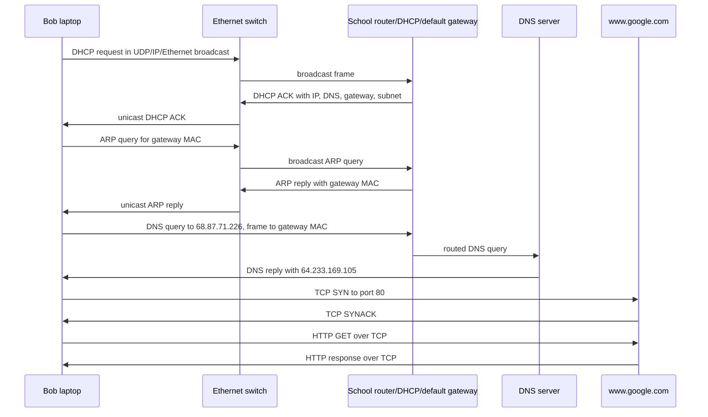

# Chapter 6. The Link Layer and LANs

- 과목: Computer Network
- 기준 교재: Computer Networking: A Top-Down Approach 8th
- 관련 페이지: PDF pp. 460-541
- 우선순위: 필수

## 개요

Chapter 4와 Chapter 5가 network layer를 data plane/control plane으로 나누어 설명했다면, Chapter 6은 protocol stack을 한 단계 더 내려가 `link layer`를 다룬다. network layer의 datagram은 source host에서 destination host까지 한 번에 “날아가는” 것이 아니라, path 위의 여러 adjacent nodes 사이 links를 하나씩 건너 이동한다. link layer의 기본 임무는 network-layer datagram을 `link-layer frame`으로 encapsulation하고, 하나의 communication link를 건너 다음 node로 전달하는 것이다.

이 장의 흐름은 link layer의 서비스와 구현 위치에서 시작해, bit error detection/correction, shared medium에서의 multiple access protocols, switched LAN의 MAC address/ARP/Ethernet/switch/VLAN, link virtualization인 MPLS, data center networking, 그리고 마지막으로 Web page request가 DHCP, UDP, IP, Ethernet, DNS, ARP, routing, TCP, HTTP를 거치며 실제로 어떻게 수행되는지로 이어진다.

link layer의 중요한 관점은 “locality”다. network layer는 end-to-end path와 IP address/prefix를 다루지만, link layer는 adjacent nodes 사이의 single hop을 다룬다. 그래서 같은 end-to-end datagram도 첫 hop에서는 WiFi frame, 중간 hop에서는 point-to-point link frame, 마지막 hop에서는 Ethernet frame처럼 서로 다른 link-layer protocols로 계속 다시 encapsulation될 수 있다.

## 핵심 개념

### 6.1 Introduction to the Link Layer

link layer에서 `node`는 layer 2 protocol을 실행하는 모든 device를 뜻한다. hosts, routers, switches, WiFi access points가 모두 node다. `link`는 end-to-end communication path에서 adjacent nodes를 연결하는 communication channel이다. source host에서 destination host까지 가는 하나의 datagram은 여러 links를 차례로 통과하고, 각 link마다 transmitting node가 datagram을 frame으로 감싸서 보낸다.


<p align="center"><sub>Figure 6.1 · PDF p. 462 · wireless host에서 server까지 datagram이 여섯 link-layer hops를 거치는 예</sub></p>

책의 비유로 보면 tourist가 datagram, travel segment가 link, transportation mode가 link-layer protocol, travel agent가 routing protocol이다. Princeton에서 JFK까지 limousine, JFK에서 Geneva까지 plane, Geneva에서 Lausanne까지 train을 타듯이, 하나의 datagram도 각 segment마다 다른 link-layer protocol을 사용할 수 있다. link layer는 “한 adjacent node에서 다음 adjacent node까지” 책임지고, routing protocol은 전체 path를 고른다.

#### 6.1.1 The Services Provided by the Link Layer

link-layer protocol이 제공할 수 있는 서비스는 protocol마다 다르지만, 대표적으로 다음 네 가지가 있다.

| Link-layer service | 의미 | 설계 포인트 |
|---|---|---|
| `framing` | network-layer datagram을 link-layer frame의 data field에 넣고 header fields를 붙임 | frame format은 link-layer protocol마다 다름 |
| `link access` | frame을 언제 link에 전송할지 정하는 `MAC (medium access control)` protocol | point-to-point link에서는 단순하지만, broadcast link에서는 multiple access problem을 해결해야 함 |
| `reliable delivery` | 한 link를 건너 datagram을 오류 없이 전달하도록 ACK/retransmission 제공 | wireless처럼 error rate가 높은 link에서는 local recovery가 유리하고, fiber/coax/twisted-pair처럼 error rate가 낮은 wired link에서는 overhead일 수 있음 |
| `error detection and correction` | bit errors를 감지하거나 위치를 찾아 수정 | link-layer detection은 보통 hardware에서 더 정교하게 구현되며, Internet checksum보다 강한 기법을 사용 |

여기서 reliable delivery의 범위를 헷갈리면 안 된다. link-layer reliable delivery는 한 link에서의 local reliability이고, TCP의 reliable delivery는 end-to-end process-to-process reliability다. wireless link에서 local retransmission을 쓰면 전체 TCP retransmission을 기다리지 않아도 되어 효율적일 수 있지만, 낮은 error rate의 wired links에서는 추가 ACK/재전송 절차가 불필요한 overhead가 될 수 있다.

#### 6.1.2 Where Is the Link Layer Implemented?

link layer는 protocol stack에서 software와 hardware가 만나는 지점이다. host의 link-layer 기능 대부분은 `network adapter`, 또는 `NIC (network interface controller)`라 불리는 chip/card에 구현된다. Ethernet capability는 motherboard chipset에 통합되거나 dedicated Ethernet chip으로 제공될 수 있다.


<p align="center"><sub>Figure 6.2 · PDF p. 465 · network adapter가 host protocol stack과 physical transmission 사이에서 link-layer 기능을 수행하는 위치</sub></p>

sending side에서 controller는 higher layers가 host memory에 만든 datagram을 가져와 frame fields를 채우고 link-access protocol에 따라 link로 전송한다. receiving side에서 controller는 entire frame을 수신하고, error detection을 수행한 뒤 network-layer datagram을 추출해 host로 올린다. error-detection bits는 sending controller가 frame header에 넣고, receiving controller가 검사한다.

다만 link layer가 전부 hardware는 아니다. link-layer software는 MAC address 같은 addressing information을 조립하고 controller hardware를 활성화하며, receiving side에서는 controller interrupt에 반응해 errors를 처리하고 datagram을 network layer로 전달한다. 즉 link layer는 CPU/OS software와 NIC hardware가 협력하는 경계층이다.

## 세부 정리

### 6.2 Error-Detection and -Correction Techniques

link-layer frame은 physical link를 통과하는 동안 signal attenuation, electromagnetic noise 등으로 bit flips가 생길 수 있다. `error detection and correction`의 목표는 receiving node가 받은 `D'`와 `EDC'`를 보고 original data `D`가 손상되었는지 판단하고, 가능한 경우 손상 위치를 찾아 수정하는 것이다.


<p align="center"><sub>Figure 6.3 · PDF p. 466 · sender가 data D에 EDC bits를 붙이고 receiver가 D'/EDC'로 오류를 검사하는 구조</sub></p>

중요한 점은 receiver가 묻는 질문이 “error가 발생했는가?”가 아니라 “error가 detected되는가?”라는 점이다. 어떤 error-detection scheme도 모든 possible bit errors를 항상 잡아내지는 못한다. 더 정교한 scheme일수록 undetected error probability를 낮추지만, 더 많은 EDC bits와 계산 overhead가 필요하다.

#### 6.2.1 Parity Checks

가장 단순한 error detection은 `single parity bit`다. `even parity`에서는 original `d` data bits와 parity bit를 합친 `d + 1` bits 안의 1의 개수가 even이 되도록 parity bit를 고른다. receiver는 받은 bits에서 1의 개수를 세고, even parity인데 1의 개수가 odd이면 error를 detect한다.


<p align="center"><sub>Figure 6.4 · PDF p. 467 · one-bit even parity가 data bits의 1 개수를 짝수로 맞추는 방식</sub></p>

single parity bit는 odd number of bit errors는 감지할 수 있지만, even number of bit errors는 놓칠 수 있다. bit errors가 독립적이고 매우 드물면 single parity도 의미가 있지만, 실제 links에서는 errors가 `burst errors`처럼 뭉쳐 발생할 수 있다. 이 경우 single-bit parity의 undetected error probability가 크게 올라간다.

`two-dimensional parity`는 data bits를 rows/columns로 나누고 각 row와 column에 parity를 둔다. single bit error가 발생하면 해당 row parity와 column parity가 동시에 틀어지므로, receiver는 오류가 난 bit의 row/column 교차점을 찾아 수정할 수 있다.


<p align="center"><sub>Figure 6.5 · PDF p. 468 · two-dimensional even parity가 single-bit error를 detect하고 correct하는 방식</sub></p>

receiver가 error를 detect할 뿐 아니라 correct하는 능력을 `FEC (forward error correction)`라고 한다. FEC는 retransmission 횟수를 줄이고, receiver가 즉시 error를 고칠 수 있게 한다. 특히 real-time applications나 deep-space links처럼 round-trip propagation delay가 큰 환경에서는 NAK를 보내고 retransmission을 기다리는 것보다 FEC가 훨씬 유리할 수 있다.

#### 6.2.2 Checksumming Methods

`checksum`은 data bits를 k-bit integers의 sequence로 보고 이 값들을 더한 결과를 EDC로 사용하는 방식이다. `Internet checksum`은 bytes를 16-bit integers로 보고 sum을 계산한 뒤, 그 1's complement를 checksum으로 header에 넣는다. receiver는 received data와 checksum을 함께 더해 1's complement를 취하고, 결과가 all 0 bits인지 확인한다.

TCP와 UDP에서는 checksum이 header와 data 전체에 대해 계산된다. IP에서는 IP header에 대해서만 checksum을 계산한다. UDP/TCP segment는 자기 checksum을 따로 갖기 때문이다.

checksum은 overhead가 작고 software implementation이 쉽다. TCP/UDP checksum이 16 bits인 것도 이 맥락이다. 하지만 protection은 CRC보다 약하다. 그래서 software 중심인 transport layer에서는 simple/fast checksum이 적합하고, dedicated adapter hardware가 있는 link layer에서는 더 복잡하지만 강한 `CRC (cyclic redundancy check)`가 널리 쓰인다.

#### 6.2.3 Cyclic Redundancy Check (CRC)

`CRC (cyclic redundancy check)`는 bit string을 polynomial처럼 보고 modulo-2 arithmetic으로 나눗셈을 수행하는 error-detection 기법이다. 그래서 CRC codes는 `polynomial codes`라고도 한다.

sender와 receiver는 먼저 `r + 1` bit generator `G`에 합의한다. sender는 data `D` 뒤에 `r` bits인 `R`을 붙여 `D * 2^r XOR R`이 `G`로 나누어떨어지게 만든다. receiver는 받은 `d + r` bits를 같은 `G`로 나누고, remainder가 nonzero이면 error를 detect한다.


<p align="center"><sub>Figure 6.6 · PDF p. 470 · data bits D 뒤에 CRC bits R을 붙여 generator G로 나누어떨어지게 만드는 구조</sub></p>

CRC에서 addition/subtraction은 carry/borrow 없는 modulo-2 arithmetic이고, bitwise `XOR`와 같다.

```text
1011 XOR 0101 = 1110
1001 XOR 1101 = 0100
```

sender가 `R`을 구하는 식은 다음처럼 요약된다.

```text
R = remainder( D * 2^r / G )
transmitted bits = D * 2^r XOR R
```


<p align="center"><sub>Figure 6.7 · PDF p. 471 · D=101110, G=1001일 때 CRC remainder R을 계산하는 예</sub></p>

CRC 표준 generator는 8-, 12-, 16-, 32-bit 등으로 정의되어 있고, 많은 IEEE link-level protocols는 `CRC-32`를 사용한다. r-bit CRC는 모든 burst errors of fewer than `r + 1` bits를 detect할 수 있고, 조건이 맞으면 더 긴 burst error도 높은 확률로 detect한다. 또한 odd number of bit errors도 detect할 수 있다. 이 때문에 CRC는 adapter hardware에서 수행되는 link-layer error detection에 잘 맞는다.

### 6.3 Multiple Access Links and Protocols

network links는 크게 `point-to-point link`와 `broadcast link`로 나눌 수 있다. point-to-point link는 한쪽 끝의 single sender와 다른 쪽 끝의 single receiver를 연결한다. 반면 broadcast link는 여러 sending/receiving nodes가 하나의 shared broadcast channel에 함께 연결된다. 한 node가 frame을 전송하면 channel이 그 frame을 broadcast하고, 나머지 nodes가 copy를 받는다. Ethernet과 wireless LAN은 broadcast link-layer technologies의 대표 예다.

문제는 shared channel에서 둘 이상의 nodes가 동시에 frames를 보내면 `collision`이 발생한다는 점이다. collision이 발생하면 receivers는 보통 어떤 frame도 해석할 수 없고, collision interval 동안 broadcast channel capacity가 낭비된다. 따라서 active nodes의 transmissions를 조정하는 `multiple access protocol`이 필요하다.


<p align="center"><sub>Figure 6.8 · PDF p. 473 · wired shared channel, wireless, satellite 등 multiple access가 필요한 다양한 broadcast channels</sub></p>

이상적인 multiple access protocol은 다음 성질을 갖는 것이 좋다.

| 바람직한 성질 | 의미 |
|---|---|
| single active node efficiency | 한 node만 보낼 data가 있으면 그 node가 full channel rate `R bps`를 사용 |
| fair sharing | `M` nodes가 active이면 각 node가 평균적으로 `R/M bps` 정도를 얻음 |
| decentralized | single point of failure가 되는 master node가 없음 |
| simple implementation | adapters에 싸고 단순하게 구현 가능 |

multiple access protocols는 거의 모두 세 부류로 나눌 수 있다.

| 부류 | 핵심 아이디어 | 대표 예 |
|---|---|---|
| `channel partitioning protocols` | channel을 time/frequency/code로 나눠 nodes에 할당 | TDM, FDM, CDMA |
| `random access protocols` | collision을 허용하고, collision 후 random delay로 재시도 | ALOHA, slotted ALOHA, CSMA, CSMA/CD |
| `taking-turns protocols` | nodes가 순서를 정해 차례대로 전송 | polling, token passing |

#### 6.3.1 Channel Partitioning Protocols

`TDM (time-division multiplexing)`은 time을 frames와 slots로 나누고, 각 node에게 slot을 할당한다. 여기서 TDM frame은 link-layer frame과 다른 의미다. node는 자기 slot이 돌아왔을 때만 packet bits를 전송한다. `FDM (frequency-division multiplexing)`은 channel bandwidth를 frequency bands로 나누고 각 node에게 하나씩 할당한다.


<p align="center"><sub>Figure 6.9 · PDF p. 475 · 네 nodes가 TDM slots 또는 FDM frequency bands를 나누어 쓰는 예</sub></p>

TDM/FDM의 장점은 collisions가 없고 공정하다는 점이다. N nodes가 있다면 각 node는 dedicated rate `R/N bps`를 얻는다. 하지만 큰 단점도 있다. 어떤 node가 유일하게 active해도 `R/N bps`보다 더 쓸 수 없고, 자기 turn 또는 frequency allocation에 묶인다. bursty traffic이 많은 LAN에서는 이 낭비가 크다.

`CDMA (code division multiple access)`는 time slot이나 frequency 대신 node마다 다른 code를 할당한다. code가 잘 선택되면 여러 nodes가 동시에 전송해도 receiver가 sender의 code를 알고 있으면 해당 sender의 data bits를 복원할 수 있다. CDMA는 anti-jamming 성질 때문에 군사용으로도 쓰였고 cellular telephony에도 널리 쓰인다. 다만 기술적 세부는 wireless channel과 강하게 연결되므로 Chapter 7에서 다룬다.

#### 6.3.2 Random Access Protocols

`random access protocol`에서는 transmitting node가 channel의 full rate `R bps`로 전송한다. collision이 발생하면 collision에 참여한 nodes가 frame을 성공할 때까지 재전송하지만, 즉시 재전송하지 않고 independent random delay를 기다린다. randomization의 목적은 충돌한 nodes가 다시 같은 시점에 재전송해 또 충돌하는 일을 줄이는 것이다.

`slotted ALOHA`는 time을 frame transmission time과 같은 slots로 나누고, nodes가 slot 시작점에서만 frame을 보낼 수 있다고 가정한다. collision이 없으면 성공이고, collision이 있으면 subsequent slots에서 probability `p`로 재전송한다. decentralized이고 단순하며, active node가 하나뿐이면 full rate를 쓸 수 있다. 하지만 multiple active nodes가 있으면 collision slots와 empty slots가 생긴다.


<p align="center"><sub>Figure 6.10 · PDF p. 478 · slotted ALOHA에서 collision, empty, successful slots가 섞이는 예</sub></p>

slotted ALOHA의 efficiency는 long-run fraction of successful slots다. N active nodes가 각 slot에서 probability `p`로 전송한다고 하면, 어떤 slot이 successful일 확률은 `Np(1-p)^(N-1)`이다. N이 매우 클 때 최대 efficiency는 `1/e ≈ 0.37`이다. 즉 channel 자체는 R bps라도 장기적으로 useful throughput은 최대 약 `0.37R`에 그친다.

`pure ALOHA`는 slot synchronization이 없다. frame이 도착하면 node가 즉시 전송한다. 어떤 frame이 time `t0`에 시작되면, 다른 node가 `[t0-1, t0]` 또는 `[t0, t0+1]`에 전송을 시작해도 overlap collision이 발생한다. 이 때문에 vulnerability interval이 slotted ALOHA의 두 배가 되고, 최대 efficiency는 `1/(2e)`로 slotted ALOHA의 절반이다.


<p align="center"><sub>Figure 6.11 · PDF p. 480 · pure ALOHA에서 앞뒤 한 frame time 안의 전송 시작이 collision을 만드는 구조</sub></p>

`CSMA (carrier sense multiple access)`는 “listen before speaking” 규칙을 넣는다. node는 channel을 먼저 듣고, 다른 frame이 전송 중이면 기다린 뒤 idle일 때 전송한다. 하지만 carrier sensing이 있어도 collision이 완전히 사라지지는 않는다. propagation delay 때문에 한 node가 이미 전송을 시작했어도, 그 signal이 멀리 있는 node에 아직 도착하지 않았으면 그 node는 channel을 idle로 오해하고 전송할 수 있다.


<p align="center"><sub>Figure 6.12 · PDF p. 482 · propagation delay 때문에 CSMA에서도 두 nodes의 transmissions가 충돌하는 space-time 예</sub></p>

`CSMA/CD (CSMA with collision detection)`는 “말하다가 겹치면 멈추기”까지 수행한다. adapter는 frame을 전송하면서 channel을 계속 감시하고, collision signal energy를 감지하면 frame transmission을 abort한다. damaged frame 전체를 끝까지 보내지 않으므로 channel 낭비가 줄어든다.


<p align="center"><sub>Figure 6.13 · PDF p. 483 · CSMA/CD에서 collision을 감지한 뒤 transmissions를 중단하는 흐름</sub></p>

CSMA/CD adapter 동작은 다음처럼 요약된다.

```text
1. network layer datagram을 받아 link-layer frame을 만든다.
2. channel idle이면 전송하고, busy이면 idle이 될 때까지 기다린다.
3. 전송 중에도 다른 adapters의 signal energy를 감시한다.
4. collision을 감지하면 transmission을 abort한다.
5. random backoff 후 다시 carrier sensing부터 반복한다.
```

collision 후 fixed delay를 쓰면 충돌한 nodes가 계속 같은 시간에 재시도할 수 있다. 그래서 Ethernet과 DOCSIS는 `binary exponential backoff`를 사용한다. frame이 이미 `n`번 collision을 겪었다면 node는 `K`를 `{0, 1, ..., 2^n - 1}`에서 random하게 고른다. Ethernet에서는 실제 wait time이 `K * 512 bit times`이고, n은 최대 10으로 capped된다. collision이 많을수록 random interval이 지수적으로 커져 large contention에 적응한다.

CSMA/CD efficiency는 propagation delay `dprop`와 maximum frame transmission time `dtrans`의 비율에 좌우된다.

```text
Efficiency ≈ 1 / (1 + 5 dprop / dtrans)
```

`dprop`가 0에 가까울수록 collision을 거의 즉시 감지해 efficiency가 1에 가까워진다. `dtrans`가 매우 크면 한 번 channel을 잡은 frame이 오래 useful transmission을 하므로 역시 efficiency가 높아진다.

#### 6.3.3 Taking-Turns Protocols

`taking-turns protocols`는 random access의 장점과 channel partitioning의 공정성을 절충하려는 시도다. random access protocols는 active node가 하나일 때 full rate를 쓰는 데 좋지만, many active nodes에서 fairness와 collision 문제가 있다.

`polling protocol`은 master node가 nodes를 round-robin으로 poll한다. poll 받은 node는 maximum number of frames까지 전송할 수 있다. collisions와 empty slots를 줄여 efficiency가 높지만, polling delay가 있고 master node failure가 전체 channel failure가 된다.

`token-passing protocol`은 master 없이 special frame인 `token`을 정해진 순서로 넘긴다. token을 받은 node만 frame을 전송할 수 있고, 보낼 것이 없으면 token을 바로 넘긴다. decentralized이고 efficient하지만, node failure나 token loss/미반환 문제가 생기면 recovery procedure가 필요하다.

#### 6.3.4 DOCSIS: The Link-Layer Protocol for Cable Internet Access

`DOCSIS (Data-Over-Cable Service Interface Specifications)`는 cable access network의 architecture와 protocols를 정의한다. cable network에서는 여러 residential cable modems가 cable headend의 `CMTS (cable modem termination system)`에 연결된다.

DOCSIS는 multiple access protocol들의 혼합 사례다. downstream과 upstream을 여러 frequency channels로 나누는 데 `FDM`을 사용하고, upstream channel 안에서는 time intervals/minislots를 사용하는 TDM-like 구조가 있다.


<p align="center"><sub>Figure 6.14 · PDF p. 487 · CMTS가 downstream MAP message로 upstream minislots 사용 권한을 cable modems에 할당하는 구조</sub></p>

downstream은 CMTS가 single transmitter라 multiple access problem이 없다. 반면 upstream은 여러 cable modems가 같은 frequency channel을 공유하므로 collision 가능성이 있다. CMTS는 downstream control message인 `MAP message`로 어느 cable modem이 어느 minislot에 upstream data를 보낼 수 있는지 명시한다. 이렇게 assigned minislots에서는 collision을 피할 수 있다.

하지만 CMTS가 누가 보낼 data가 있는지 알려면 cable modems가 먼저 `mini-slot-request frames`를 보내야 한다. 이 request minislots는 random access 방식으로 공유되므로 collisions가 날 수 있다. cable modem은 upstream channel을 carrier sense하거나 collision detect하지 못하므로, 다음 downstream control message에 자기 allocation이 없으면 request collision이 난 것으로 추론하고 binary exponential backoff로 재시도한다.

따라서 DOCSIS는 한 network 안에 FDM, TDM-like scheduling, centrally allocated time slots, random access, binary exponential backoff가 모두 결합된 실제 예다.

### 6.4 Switched Local Area Networks

Broadcast link와 multiple access를 본 뒤, 책은 switched LAN으로 넘어간다. Switch는 link layer 장비이므로 network-layer datagram이 아니라 link-layer frame을 다루며, IP address가 아니라 MAC address를 보고 frame을 전달한다. 따라서 switch는 OSPF 같은 routing algorithm으로 layer-2 switch 사이의 경로를 계산하지 않는다. 아래 예시는 여러 부서 LAN, 서버, 외부 인터넷으로 향하는 router가 switch들로 묶인 전형적인 institutional network다.


<p align="center"><sub>Figure 6.15 · PDF p. 488 · 네 개의 switch로 부서 LAN, 서버, 외부 인터넷 라우터를 연결한 switched LAN</sub></p>

#### 6.4.1 Link-Layer Addressing and ARP

Link-layer address는 흔히 LAN address, physical address, MAC address라고 부른다. 엄밀히 말하면 MAC address는 host나 router 전체에 붙는 것이 아니라 adapter, 즉 network interface에 붙는다. Host나 router가 여러 interface를 가지면 IP address도 여러 개일 수 있고 MAC address도 여러 개다. 반면 host/router와 연결되는 switch interface에는 일반적으로 MAC address가 필요하지 않다. Switch는 중간에서 투명하게 frame을 운반하므로, host가 중간 switch를 목적지로 명시해 frame을 보내지 않기 때문이다.


<p align="center"><sub>Figure 6.16 · PDF p. 490 · LAN에 연결된 각 interface가 고유한 MAC address를 갖는 모습</sub></p>

Ethernet과 802.11 wireless LAN에서 MAC address는 보통 6 bytes, 즉 48 bits다. 표기는 `1A-23-F9-CD-06-9B`처럼 byte마다 두 자리 hexadecimal로 적는다. IEEE가 MAC address 공간을 관리하며, 제조사는 보통 앞 24 bits에 해당하는 OUI 범위를 배정받고 뒤 24 bits를 조합해 adapter마다 고유한 주소를 만든다. 원래 MAC address는 permanent address로 설계되었지만, 실제 시스템에서는 software로 바꾸는 것도 가능하다.

MAC address와 IP address의 차이는 계층의 역할을 보여준다. MAC address는 flat structure라서 adapter가 어디로 이동해도 원칙적으로 그대로 유지된다. IP address는 hierarchical structure라서 network part와 host part를 가지며, host가 붙은 network가 바뀌면 IP address도 바뀐다. 책의 비유로는 MAC address는 사회보장번호처럼 위치와 무관한 식별자이고, IP address는 이사하면 바뀌는 postal address에 가깝다.

Frame을 받은 adapter는 destination MAC address가 자신의 MAC address와 일치할 때만 payload datagram을 위 계층으로 올리고, 일치하지 않으면 frame을 버린다. 그래서 같은 LAN에서 frame이 보이더라도 모든 host의 network layer가 불필요하게 interrupt되지 않는다. 모든 adapter가 받아야 하는 frame에는 broadcast MAC address `FF-FF-FF-FF-FF-FF`를 destination address로 넣는다.

계층별 주소를 따로 두는 이유는 layer independence다. LAN adapter가 IP address만 사용하면 IP 외의 network-layer protocol을 자연스럽게 지원하기 어렵고, adapter가 이동할 때마다 adapter 내부 주소 설정도 다시 해야 한다. 반대로 adapter가 주소 없이 모든 frame을 host에게 올리면 host가 자기 것이 아닌 frame까지 계속 처리해야 한다. 그래서 application layer의 host name, network layer의 IP address, link layer의 MAC address가 각각 다른 목적을 맡는다.

Address Resolution Protocol (ARP)는 같은 subnet 안에서 IP address를 MAC address로 바꾸는 프로토콜이다. DNS가 host name을 IP address로 바꾸는 것과 비슷하지만 범위가 다르다. DNS는 Internet 어디의 host name도 다룰 수 있지만, ARP는 같은 subnet에 있는 host나 router interface의 IP address만 MAC address로 resolve한다.


<p align="center"><sub>Figure 6.17 · PDF p. 492 · 같은 LAN의 각 interface가 IP address와 MAC address를 함께 갖는 예</sub></p>

각 host와 router는 memory에 ARP table을 둔다. ARP table은 IP address에서 MAC address로 가는 mapping과 TTL을 저장한다. TTL은 mapping이 언제 삭제될지를 나타내며, 전형적인 만료 시간은 entry가 ARP table에 들어간 뒤 약 20분이다. Table에 subnet의 모든 node가 반드시 들어 있는 것은 아니다. 아직 통신하지 않은 node는 없을 수 있고, 오래된 entry는 expire될 수 있다.


<p align="center"><sub>Figure 6.18 · PDF p. 493 · 특정 host가 가진 ARP table의 IP-to-MAC mapping과 TTL</sub></p>

ARP 동작은 query와 response로 나뉜다. Sender의 ARP table에 목적지 IP에 대한 entry가 없으면 sender는 ARP query packet을 만들고, 이를 destination MAC address `FF-FF-FF-FF-FF-FF`인 broadcast frame에 넣어 subnet 전체에 보낸다. 같은 subnet의 모든 adapter가 이 frame을 받아 ARP module로 넘기지만, packet 안의 target IP address와 자신의 IP address가 일치하는 node만 ARP response packet을 돌려준다. 이 response는 broadcast가 아니라 querying host로 향하는 standard unicast frame이다. Sender는 response로 얻은 mapping을 ARP table에 저장한 뒤, 원래 보내려던 IP datagram을 목적지 MAC address가 들어간 frame에 넣어 보낸다.

ARP는 plug-and-play 성격이 강하다. System administrator가 ARP table을 일일이 설정하지 않아도 통신 과정에서 자동으로 만들어지고, node가 subnet에서 사라지면 TTL 만료로 mapping도 결국 삭제된다. 계층 관점에서는 ARP가 깔끔하게 한 계층에만 속하지 않는다. ARP packet은 link-layer frame 안에 encapsulate되므로 link layer 위에 있는 것처럼 보이지만, packet 안에는 IP address와 MAC address가 모두 들어간다. 그래서 ARP는 link layer와 network layer의 경계에 걸친 protocol로 보는 것이 자연스럽다.

##### Sending a Datagram off the Subnet

목적지가 같은 subnet에 있으면 sender는 ARP로 final destination의 MAC address를 알아내 frame을 보낸다. 그러나 목적지가 다른 subnet에 있으면 destination MAC address는 final host의 MAC address가 아니라 first-hop router interface의 MAC address다. 예를 들어 `111.111.111.111`이 `222.222.222.222`로 IP datagram을 보낼 때, Subnet 1의 Ethernet frame destination MAC은 `222.222.222.222`의 adapter가 아니라 router interface `111.111.111.110`의 adapter MAC이다.


<p align="center"><sub>Figure 6.19 · PDF p. 494 · 두 subnet이 router로 연결될 때 ARP와 frame 목적지 MAC이 바뀌는 구조</sub></p>

이 구분이 중요하다. Sender가 다른 subnet에 있는 final host의 MAC address를 Ethernet frame에 넣으면, Subnet 1의 어떤 adapter도 그 MAC address를 자기 주소로 인식하지 않으므로 datagram은 router까지 가지 못한다. Sender는 먼저 ARP를 사용해 first-hop router interface의 MAC address를 얻고, IP datagram의 destination IP는 그대로 `222.222.222.222`로 유지한 채 link-layer frame만 router interface MAC으로 보낸다. Router는 frame을 받아 IP datagram을 꺼내고, forwarding table로 나갈 interface를 정한 뒤, 다음 subnet에서 다시 새 frame에 encapsulate한다. 이때 최종 subnet에서는 ARP를 통해 final destination MAC address를 얻는다. 즉, IP datagram의 source/destination IP는 end-to-end 의미를 유지하지만, link-layer frame의 source/destination MAC은 hop마다 바뀐다.

#### 6.4.2 Ethernet

Ethernet은 wired LAN 시장에서 사실상 지배적인 기술이 되었다. 초기에는 token ring, FDDI, ATM 같은 경쟁 기술이 있었지만, Ethernet은 먼저 널리 배치되어 운영 경험과 장비 생태계를 만들었고, 더 빠른 속도의 표준을 계속 추가했으며, switched Ethernet으로 effective data rate를 크게 높였다. 장비가 commodity가 되면서 adapter와 switch 비용도 낮아졌다.

초기 Ethernet은 coaxial bus topology였다. Bus Ethernet은 한 node가 보낸 frame이 bus에 붙은 모든 adapter에 도달하는 broadcast LAN이며, 동시 전송 시 collision이 발생하므로 Section 6.3.2의 CSMA/CD와 binary exponential backoff가 필요했다. 이후 hub-based star topology가 쓰였지만 hub는 physical-layer device라 bit를 모든 다른 interface로 재생성해 내보낼 뿐이다. 그래서 hub Ethernet도 여전히 broadcast LAN이고 collision이 생긴다. 2000년대 이후에는 hub 대신 switch가 중심이 되는 switch-based star topology가 일반화되었다. Switch는 store-and-forward packet switch이고 layer 2까지만 동작한다.

##### Ethernet Frame Structure

Ethernet frame은 network-layer packet, 대표적으로 IP datagram을 data field에 실어 보낸다. 같은 Ethernet LAN 안에서 adapter A가 adapter B로 datagram을 보낸다고 하면, A는 datagram을 Ethernet frame으로 encapsulate하고 physical layer로 넘기며, B는 frame을 받아 IP datagram을 꺼내 network layer로 올린다.


<p align="center"><sub>Figure 6.20 · PDF p. 497 · Ethernet frame의 preamble, address, type, data, CRC fields</sub></p>

Ethernet frame의 주요 fields는 다음과 같다.

| Field | 크기 | 핵심 의미 |
| --- | ---: | --- |
| `Preamble` | 8 bytes | 앞 7 bytes는 `10101010` 반복으로 receiver clock을 sender clock에 맞추고, 마지막 byte `10101011`의 연속된 `11`로 실제 frame 시작을 알린다. |
| `Destination address` | 6 bytes | 목적지 adapter의 MAC address. 자기 MAC이나 broadcast address면 data field를 위 계층으로 올리고, 아니면 discard한다. |
| `Source address` | 6 bytes | frame을 LAN에 내보낸 sender adapter의 MAC address. |
| `Type` | 2 bytes | data field를 어느 upper-layer protocol로 demultiplex할지 표시한다. IPv4, ARP(`0x0806`) 등 protocol별 type number가 있다. |
| `Data` | 46-1500 bytes | 보통 IP datagram을 담는다. Ethernet MTU는 1500 bytes이며, payload가 46 bytes보다 작으면 padding/stuffing이 붙는다. |
| `CRC` | 4 bytes | receiver가 bit errors를 detect하도록 하는 cyclic redundancy check 값이다. |

`Type field`는 계층을 접착하는 demultiplexing field다. Network layer의 protocol field, transport layer의 port number가 위 계층 protocol을 고르는 것과 같은 역할을 Ethernet에서는 Type field가 맡는다. 예를 들어 frame Type이 ARP를 가리키면 payload는 IP가 아니라 ARP module로 올라간다.

Ethernet은 network layer에 connectionless service를 제공한다. Adapter A가 B에 frame을 보내기 전에 handshake로 connection을 만들지 않는다. 이 점은 IP의 datagram service, UDP의 connectionless service와 닮았다.

Ethernet은 link layer에서 unreliable service도 제공한다. Receiver adapter는 CRC check를 수행하지만, 통과한 frame에 ACK를 보내지 않고 실패한 frame에 NAK를 보내지도 않는다. CRC가 실패하면 frame을 조용히 discard한다. 그래서 sender adapter는 frame이 receiver에 도달해 CRC를 통과했는지 알지 못한다. 이 단순성이 Ethernet을 싸고 단순하게 만들지만, network layer로 올라가는 datagram stream에는 gaps가 생길 수 있다. UDP application은 그 gap을 그대로 볼 수 있고, TCP application은 TCP ACK/timeout/retransmission으로 상위 계층에서 복구한다. 이때 Ethernet이 "재전송"을 아는 것은 아니며, TCP가 다시 내려보낸 datagram을 Ethernet adapter가 새 frame처럼 보낼 뿐이다.

##### Ethernet Technologies

Ethernet은 단일 표준 하나가 아니라 `10BASE-T`, `100BASE-T`, `1000BASE-LX`, `10GBASE-T`, `40GBASE-T`처럼 여러 속도와 물리 매체 조합을 가진 계열이다. 이름의 앞부분은 speed를 나타내고, `BASE`는 baseband Ethernet을 뜻하며, 뒷부분은 physical media를 나타낸다. `T`는 보통 twisted-pair copper wires를 뜻한다. Ethernet은 link-layer specification이면서 동시에 physical-layer specification의 묶음이기도 하다.


<p align="center"><sub>Figure 6.21 · PDF p. 500 · 100 Mbps Ethernet에서 공통 MAC protocol/frame format 위에 다양한 physical layer가 붙는 구조</sub></p>

중요한 지속성은 Ethernet MAC protocol과 frame format이다. 100 Mbps Ethernet은 기존 MAC protocol과 frame format을 유지하면서 copper/fiber용 고속 physical layer를 정의했다. Gigabit Ethernet도 standard Ethernet frame format을 사용해 10BASE-T, 100BASE-T 장비와 backward compatibility를 유지한다.

오늘날의 switch-based Ethernet LAN에서는 예전처럼 MAC protocol이 꼭 필요한 상황이 줄었다. Bus나 hub 기반 Ethernet에서는 여러 nodes가 같은 broadcast link에 동시에 전송해 collision이 생겼고 CSMA/CD가 필요했다. 하지만 switch는 한 interface에 동시에 여러 frame을 forwarding하지 않도록 조정하고, modern switch와 node 사이의 link는 full-duplex라 양방향 동시 전송이 서로 간섭하지 않는다. 따라서 switch-based Ethernet에서는 collision이 없고, 의미상 CSMA/CD 같은 MAC protocol이 필요하지 않다. 그럼에도 frame format과 Ethernet 생태계의 연속성 때문에 여전히 Ethernet이라고 부른다.

#### 6.4.3 Link-Layer Switches

Link-layer switch의 역할은 incoming frame을 받아 적절한 outgoing link로 forward하는 것이다. Switch는 host와 router에게 transparent하다. Host는 frame을 switch가 아니라 최종 host/router의 MAC address로 보낸다. Switch는 중간에서 frame을 받아 처리하지만, end host는 그 사실을 별도로 알 필요가 없다. 단, 어떤 output interface로 들어오는 frame rate가 해당 link capacity를 일시적으로 넘을 수 있으므로 switch output interface에는 router output interface처럼 buffers가 있다.

##### Forwarding and Filtering

Switch의 `filtering`은 frame을 어떤 interface로 보낼지 말지, 즉 drop할지를 결정하는 기능이다. `forwarding`은 frame을 어느 interface로 보낼지 결정하고 output buffer로 옮기는 기능이다. 두 기능 모두 `switch table`을 사용한다. Switch table entry는 보통 `(MAC address, interface, time)`으로 구성된다. 여기서 interface는 그 MAC address가 있는 LAN segment로 향하는 switch interface이고, time은 entry가 table에 들어온 시각이다.


<p align="center"><sub>Figure 6.22 · PDF p. 502 · 특정 switch가 가진 switch table 일부</sub></p>

Frame의 destination MAC address가 `DD-DD-DD-DD-DD-DD`이고 frame이 interface `x`로 들어왔다고 하자. Switch는 destination MAC으로 table을 조회하고 세 가지 중 하나를 수행한다.

| Switch table 상태 | 동작 | 의미 |
| --- | --- | --- |
| entry 없음 | `x`를 제외한 모든 interface로 flood/broadcast | 목적지 위치를 모르므로 모든 segment에 뿌린다. |
| entry가 interface `x`를 가리킴 | frame discard/filtering | 목적지가 frame이 온 같은 segment에 있으므로 더 보낼 필요가 없다. |
| entry가 interface `y != x`를 가리킴 | interface `y`의 output buffer로 forwarding | 목적지가 다른 segment에 있으므로 해당 방향으로만 보낸다. |

Switch는 destination MAC address를 기준으로 동작한다는 점에서 router의 forwarding과 닮았지만, 전통적인 switch table은 routing algorithm으로 계산되는 router forwarding table과 다르게 만들어진다. 또한 switch는 layer-2 destination MAC address를 보고 forward하고, router는 layer-3 destination IP address를 보고 forward한다.

##### Self-Learning

Switch의 중요한 특성은 `self-learning`이다. Network administrator가 switch table을 수동으로 설정하지 않아도 switch가 incoming frames를 보며 table을 자동으로 만든다.

```text
초기 상태: switch table은 비어 있다.
incoming frame마다:
  1. frame의 source MAC address를 읽는다.
  2. frame이 들어온 interface를 기록한다.
  3. 현재 time을 함께 저장한다.
aging time 동안 해당 source MAC frame이 다시 오지 않으면 entry를 삭제한다.
```


<p align="center"><sub>Figure 6.23 · PDF p. 504 · frame의 source MAC을 보고 switch가 adapter 위치를 학습한 예</sub></p>

Self-learning의 직관은 단순하다. 어떤 source MAC을 가진 frame이 interface 2에서 들어왔다는 것은, 그 MAC address를 가진 adapter가 interface 2 방향에 있다는 증거다. 모든 host가 언젠가 frame을 보내면 switch table은 점점 완성된다. Host가 교체되거나 이동하면 aging time 이후 오래된 MAC entry가 사라진다. 이 때문에 switch는 plug-and-play device로 동작한다. LAN segments를 switch interfaces에 연결하기만 하면 되고, host 제거/추가 때마다 switch table을 직접 고칠 필요가 없다. 또한 switch interface는 full-duplex로 send와 receive를 동시에 할 수 있다.

##### Properties of Link-Layer Switching

Switch는 bus나 hub 기반 broadcast link에 비해 세 가지 중요한 장점을 준다. 첫째, collisions를 제거한다. Switch는 frames를 buffer하고 같은 segment에 동시에 둘 이상의 frame을 보내지 않으므로 collision으로 bandwidth를 낭비하지 않는다. 둘째, heterogeneous links를 자연스럽게 섞는다. 각 link가 switch에 의해 격리되므로 어떤 port는 1 Gbps copper, 어떤 port는 100 Mbps fiber처럼 다른 speed/media를 함께 사용할 수 있다. 셋째, management가 쉬워진다. 예를 들어 `jabbering adapter`처럼 계속 frame을 뿌리는 고장 adapter를 switch가 감지해 내부적으로 disconnect할 수 있고, cable cut도 해당 host 연결만 끊는다.

보안 관점에서 switched LAN은 hub나 wireless broadcast LAN보다 sniffing이 어렵다. Switch table에 목적지 entry가 있으면 frame은 해당 host 방향으로만 가기 때문이다. 하지만 unknown destination frames와 broadcast frames는 여전히 여러 port로 퍼질 수 있다. `switch poisoning` 공격은 많은 bogus source MAC address를 가진 packets를 보내 switch table을 가짜 entry로 채우고, legitimate MAC entry가 들어갈 공간을 줄여 switch가 더 많은 frame을 broadcast하게 만드는 공격이다.

##### Switches Versus Routers

Switch와 router는 모두 store-and-forward packet switch지만 기준 계층이 다르다. Switch는 layer-2 packet switch로 MAC address를 보고 frame을 forward한다. Router는 layer-3 packet switch로 IP address를 보고 datagram을 forward한다.


<p align="center"><sub>Figure 6.24 · PDF p. 507 · host, switch, router가 packet을 어느 계층까지 처리하는지 비교</sub></p>

Switch의 장점은 plug-and-play이고, layer 2까지만 처리하므로 filtering/forwarding rate를 높게 만들기 쉽다는 점이다. 단점은 broadcast frame의 cycle을 막기 위해 active topology가 spanning tree로 제한되고, 큰 switched network에서는 host/router의 ARP tables가 커지며 ARP traffic이 많아질 수 있다는 점이다. 또한 broadcast storm에 취약하다. 어떤 host가 끝없이 Ethernet broadcast frames를 보내면 switches가 이를 계속 퍼뜨려 전체 network가 무너질 수 있다.

Router의 장점은 hierarchical network addressing 덕분에 redundant paths가 있어도 정상적으로 best path를 사용할 수 있고, layer-2 broadcast storm을 차단하는 firewall 역할을 한다는 점이다. 단점은 plug-and-play가 아니며 router와 hosts의 IP address configuration이 필요하고, layer 3까지 처리하므로 per-packet processing time이 switch보다 클 수 있다는 점이다. 일반적으로 수백 hosts 규모의 작은 network는 switches만으로도 충분하지만, 수천 hosts 규모의 큰 institutional network는 traffic isolation, broadcast storm control, 더 지능적인 routing을 위해 routers를 함께 둔다.

#### 6.4.4 Virtual Local Area Networks (VLANs)

VLAN은 하나의 physical LAN infrastructure 위에 여러 virtual LAN을 정의하는 방법이다. 배경 문제는 세 가지다. 첫째, 단순 switch hierarchy에서는 ARP, DHCP, unknown-destination frames 같은 broadcast traffic이 전체 institutional network를 지나가 traffic isolation이 약하다. 둘째, group마다 switch를 따로 두면 작은 group이 많을 때 switch ports를 비효율적으로 쓴다. 셋째, 사용자가 부서를 이동하면 physical cabling을 바꿔야 한다.

`port-based VLAN`에서는 switch ports를 group으로 나누고 각 group이 하나의 VLAN, 즉 하나의 broadcast domain이 된다. 같은 VLAN 안의 ports는 마치 자기들만 switch에 연결된 것처럼 통신하고, broadcast traffic도 그 VLAN 안에만 머문다.


<p align="center"><sub>Figure 6.25 · PDF p. 509 · 하나의 switch에서 EE VLAN과 CS VLAN을 port group으로 나눈 예</sub></p>

VLAN은 traffic isolation, switch 활용, 사용자 관리 문제를 동시에 완화한다. 예를 들어 port 8의 사용자가 EE에서 CS로 이동하면 cable을 다시 꽂는 대신 switch management software에서 port-to-VLAN mapping만 바꾸면 된다. Switch hardware는 같은 VLAN에 속한 ports 사이에서만 frames를 전달한다.

서로 다른 VLAN 사이의 통신은 layer 3 forwarding이 필요하다. 한 가지 방법은 VLAN switch port를 external router에 연결하고, EE VLAN에서 CS VLAN으로 가는 IP datagram이 router를 거쳐 다시 CS VLAN으로 들어오게 하는 것이다. 실제 장비는 VLAN switch와 router 기능을 한 장비에 넣어 이 구성을 쉽게 만든다.

여러 VLAN switches를 연결할 때 VLAN마다 별도 cable을 두면 VLAN 수가 늘수록 ports가 낭비된다. 이를 해결하는 방식이 `VLAN trunking`이다. Trunk port는 모든 VLAN에 속하며, 여러 VLAN의 frames를 하나의 trunk link로 운반한다.


<p align="center"><sub>Figure 6.26 · PDF p. 511 · 두 VLAN switch를 VLAN별 cables 또는 trunk link로 연결하는 방식 비교</sub></p>

Trunk link를 지나는 frame에는 어느 VLAN의 frame인지 표시가 필요하다. IEEE `802.1Q`는 기존 Ethernet frame header에 4-byte VLAN tag를 추가한 extended Ethernet frame format을 정의한다. Sending-side switch가 trunk로 내보낼 때 tag를 붙이고, receiving-side switch가 tag를 해석한 뒤 제거한다.


<p align="center"><sub>Figure 6.27 · PDF p. 511 · 기존 Ethernet frame과 802.1Q-tagged VLAN frame의 차이</sub></p>

802.1Q VLAN tag에는 fixed hexadecimal value `81-00`을 갖는 2-byte `Tag Protocol Identifier (TPID)`와 2-byte `Tag Control Information`이 들어간다. Tag Control Information 안에는 12-bit `VLAN identifier`와 3-bit priority field가 있다. VLAN은 port-based 외에도 MAC-based VLAN, network-layer protocol 기반 VLAN 등으로 정의할 수 있고, IP routers를 넘어 확장되어 떨어진 LAN islands를 하나의 VLAN처럼 묶는 방식도 가능하다.

### 6.5 Link Virtualization: A Network as a Link Layer

이 장에서 `link`의 의미는 점점 추상화된다. 처음에는 두 hosts를 잇는 물리 wire였고, multiple access에서는 shared wire나 radio spectrum 같은 channel이었으며, Ethernet LAN에서는 실제로는 복잡한 switched infrastructure일 수 있었다. 하지만 host 입장에서는 여전히 "link-layer channel"처럼 보인다. Ethernet host는 자신이 짧은 LAN segment, geographically dispersed switched LAN, VLAN 중 어디에 붙었는지 몰라도 frame을 보낼 수 있다.

이 관점이 `link virtualization`이다. 예를 들어 dial-up modem connection에서 두 Internet hosts 사이의 link는 실제로는 telephone network라는 별도 global network지만, Internet link layer 입장에서는 단순한 wire처럼 보인다. Overlay network가 Internet을 overlay node 사이의 연결 수단으로 보는 것과도 비슷하다.

#### 6.5.1 Multiprotocol Label Switching (MPLS)

`Multiprotocol Label Switching (MPLS)`는 packet-switched virtual-circuit network 성격을 IP network와 결합한 기술이다. 원래 목적은 IP router가 destination IP address에 대해 longest prefix match를 수행하는 대신 fixed-length label을 보고 더 빠르게 forwarding하도록 돕는 것이었다. 하지만 핵심은 IP를 버리는 것이 아니라 IP addressing/routing과 함께 동작하면서 일부 datagram에 label을 붙여 label 기반 forwarding을 가능하게 하는 것이다.

MPLS-capable devices 사이의 link-layer frame에는 layer-2 header와 IP header 사이에 작은 MPLS header가 들어간다. MPLS header에는 `Label`, 3-bit `Exp`, stack의 끝을 표시하는 `S` bit, `TTL` field가 있다.


<p align="center"><sub>Figure 6.28 · PDF p. 513 · link-layer header와 IP header 사이에 들어가는 MPLS header</sub></p>

MPLS-enhanced frame은 양쪽 router가 모두 MPLS capable일 때만 보낼 수 있다. 그렇지 않은 router는 IP header가 있어야 할 위치에서 MPLS header를 보게 되어 처리할 수 없다. MPLS-capable router는 `label-switched router (LSR)`라고 부르며, MPLS frame을 받으면 label을 forwarding table에서 lookup하고 적절한 output interface로 넘긴다. 이때 IP destination address를 꺼내 longest prefix match를 하지 않아도 된다.


<p align="center"><sub>Figure 6.29 · PDF p. 514 · MPLS-capable routers가 labels를 바꾸며 IP devices 사이를 연결하는 예</sub></p>

MPLS forwarding에서는 router가 incoming label을 보고 outbound label과 output interface를 정한다. 예를 들어 어떤 LSR은 label 10이 붙은 frame을 받으면 label을 6으로 바꿔 interface 1로 내보내고, 다른 destination에는 label 12를 9로 바꿔 보낼 수 있다. 중요한 점은 MPLS-capable routers 내부에서는 IP header를 건드리지 않고도 IP devices를 서로 연결한다는 것이다. 외부에서 보면 MPLS infrastructure가 switched LAN이나 ATM network처럼 IP devices를 이어 주는 link-layer technology처럼 보인다.

MPLS label이 어떻게 배포되는지, MPLS path가 어떻게 계산되는지는 별도 signaling/routing 문제다. 책은 세부 signaling을 깊게 다루지 않지만, MPLS signaling에는 RSVP 확장인 `RSVP-TE`가 사용될 수 있고, link-state routing algorithms인 OSPF도 MPLS path computation에 필요한 link-state information을 flood하도록 확장될 수 있다고 설명한다.

MPLS의 진짜 장점은 단순 forwarding speed보다 traffic management다. 표준 IP routing에서는 destination IP에 대해 보통 하나의 least-cost path가 선택된다. 반면 MPLS에서는 같은 destination A로 가는 traffic도 운영자 정책, 성능, 부하 분산 목적에 따라 서로 다른 MPLS paths로 보낼 수 있다. 이것이 MPLS 기반 `traffic engineering`이다. 또한 MPLS는 link failure 시 미리 계산한 failover path로 빠르게 reroute하는 `fast restoration`, ISP network 위에서 고객 network들을 격리해 연결하는 `VPN (virtual private network)` 구현에도 쓰일 수 있다. Chapter 5의 SDN과 Chapter 4의 generalized forwarding도 비슷한 traffic engineering 능력을 제공할 수 있으므로, MPLS는 SDN 이전에 등장한 traffic control 수단으로 이해하면 좋다.

### 6.6 Data Center Networking

Large-scale Internet companies는 수만에서 수십만 hosts를 담는 massive data centers를 운영한다. Data center network는 외부 Internet과 data center를 연결할 뿐 아니라, 내부 hosts를 서로 연결해 cloud applications를 실행하는 복잡한 network다. Data center는 크게 세 가지 일을 한다. Web pages, search results, e-mail, streaming video 같은 content를 제공하고, search index computation 같은 massively parallel data processing을 수행하며, 다른 회사에 cloud computing infrastructure를 제공한다.

#### 6.6.1 Data Center Architectures

Data center의 핵심 작업 단위는 hosts다. Data center hosts는 보통 commodity servers이며 `blades`라고도 부른다. Servers는 racks에 쌓이고, 각 rack 위에는 `Top of Rack (TOR) switch`가 있어 rack 내부 hosts를 서로 연결하고 다른 switches와도 연결한다. 각 host는 TOR switch에 network interface로 연결되고 data-center-internal IP address를 가진다.


<p align="center"><sub>Figure 6.30 · PDF p. 517 · border router, load balancer, tier switches, TOR switches로 구성된 hierarchical data center network</sub></p>

Data center traffic은 두 종류다. 하나는 external clients와 internal hosts 사이의 traffic이고, 다른 하나는 internal hosts끼리의 traffic이다. 외부 연결을 위해 data center에는 public Internet에 연결되는 `border routers`가 있다. 내부에서는 racks와 border routers를 잇는 interconnection network가 필요하다.

##### Load Balancing

Cloud data center는 search, e-mail, video처럼 여러 applications를 동시에 제공한다. 각 application은 external clients가 접근하는 publicly visible IP address를 가진다. Client request는 먼저 `load balancer`로 들어가고, load balancer는 현재 load를 보고 해당 application을 처리할 host 중 하나로 request를 분배한다. Load balancer는 destination port number와 destination IP address를 보고 결정하므로 `layer-4 switch`라고도 불린다.

Load balancer는 NAT-like function도 수행한다. 외부 public IP address를 내부 host의 data-center-internal IP address로 translate하고, response가 나갈 때 다시 public address로 translate한다. 이렇게 하면 clients가 내부 hosts와 직접 통신하지 못하므로 internal network structure가 숨겨지고 보안상 이점도 생긴다.

##### Hierarchical Architecture와 병목

작은 data center라면 border router, load balancer, 몇십 racks를 하나의 Ethernet switch로 묶는 정도로 충분할 수 있다. 하지만 수만에서 수십만 hosts 규모에서는 hierarchy가 필요하다. Figure 6.30처럼 border router 아래 access routers, tier-1 switches, tier-2 switches, TOR switches가 계층을 이루고, links는 보통 Ethernet 기반 copper/fiber를 섞어 쓴다.

Hierarchy는 scale 문제를 풀지만 host-to-host capacity가 제한될 수 있다. 예를 들어 각 host-to-TOR link가 10 Gbps이고 switch 사이 link가 100 Gbps라고 하자. 같은 rack의 두 hosts는 full 10 Gbps로 통신할 수 있지만, 서로 다른 racks 사이의 많은 flows가 상위 link 하나를 공유하면 각 flow rate가 크게 줄어든다. 책의 예처럼 40 simultaneous flows가 100 Gbps A-to-B link를 공유하면 각 flow는 단순 fair sharing에서 약 `100 Gbps / 40 = 2.5 Gbps`만 얻는다. 이는 host NIC rate 10 Gbps보다 훨씬 낮다.

해결 방향은 세 가지다. 더 빠른 switches/routers를 배치할 수 있지만 비용이 크다. 관련 services와 data를 같은 rack 또는 가까운 rack에 배치해 inter-rack traffic을 줄일 수 있지만, cloud workloads는 placement flexibility가 중요해서 한계가 있다. 가장 중요한 방향은 TOR-tier2, tier2-tier1 사이 연결성을 높여 multiple link-disjoint and switch-disjoint paths를 제공하는 것이다.


<p align="center"><sub>Figure 6.31 · PDF p. 520 · racks 사이에 더 많은 disjoint paths를 제공하는 highly interconnected data center topology</sub></p>

연결성이 커지면 capacity와 reliability가 함께 증가한다. 여러 paths가 있으면 link 하나가 병목이 되거나 failure가 나도 traffic을 다른 path로 보낼 수 있다. 이때 `multi-path routing`이 data center network의 기본 기능이 된다. `ECMP (Equal Cost Multi Path)`는 source와 destination 사이의 equal-cost paths 중 next hop을 randomized selection으로 고르는 단순한 방식이고, 더 세밀한 load balancing이나 packet-level multipath routing 설계도 존재한다.

#### 6.6.2 Trends in Data Center Networking

Data center networking의 trend는 cost reduction, virtualization, physical constraints, modularity, customization에 의해 움직인다. 첫째, large cloud providers는 수많은 small-sized commodity switches를 tiered/multistage interconnection network로 묶어 거대한 crossbar switch처럼 동작하게 만든다. 이런 multi-switch layered network는 `Clos network`라고 부르며, source-destination 사이 multiple paths와 높은 aggregate capacity, reliability를 제공한다.

둘째, data center는 단일 조직이 관리하므로 `centralized SDN control and management`가 잘 맞는다. Data plane은 단순 commodity switches로 구성하고, control plane은 software 기반으로 logically centralized하게 두는 구조가 자연스럽다. 규모가 매우 크기 때문에 automated configuration과 operational state management도 필수다.

셋째, virtualization은 data center network 설계의 핵심 압력이다. `Virtual Machines (VMs)`는 application software를 physical hardware에서 분리하고, VM migration으로 active network connections를 유지한 채 다른 physical server나 rack으로 옮길 수 있게 한다. 표준 Ethernet/IP만으로는 VM 이동과 connection 유지를 깔끔하게 처리하기 어렵다. 한 가지 방향은 data center 전체를 single flat layer-2 network처럼 보이게 하되, ARP broadcast 대신 DNS-style query system과 directory mapping을 사용해 VM의 IP address가 현재 어느 physical switch에 붙어 있는지 찾는 것이다.

넷째, data center는 WAN과 다르게 40/100 Gbps 수준의 매우 높은 capacity와 microseconds 수준의 낮은 delay를 가진다. Buffer가 작고 loss recovery나 timeout 비용이 커서, 일반 TCP congestion control이 잘 맞지 않을 수 있다. 그래서 data-center-specific TCP variants, standard Ethernet 위의 `RDMA (Remote Direct Memory Access)`, scheduling과 rate control을 분리하는 방식이 연구/배치된다.

마지막으로 `modular data centers (MDCs)`와 customization이 있다. Shipping container 안에 mini data center를 만들어 현장에 배치하고, 여러 containers를 core network로 묶는 방식이다. Container 내부는 commodity Gigabit Ethernet switches로 fully connected에 가깝게 만들 수 있지만, 수백-수천 containers 사이에서 높은 host-to-host bandwidth를 제공하는 core network 설계는 어렵다. 대형 cloud providers는 network adapters, switches, TORs, software, protocols까지 자체 제작하거나 customize하며, Amazon의 `availability zones`처럼 가까운 여러 buildings에 data centers를 복제해 fault tolerance를 높이는 방향도 사용한다.

### 6.7 Retrospective: A Day in the Life of a Web Page Request

이 절은 Chapter 1-6의 protocols가 실제 Web page download에서 어떻게 이어지는지 한 번에 보여준다. 예시는 Bob의 laptop이 school Ethernet switch에 연결되고, school router를 거쳐 Comcast ISP, DNS server, Google network의 `www.google.com` Web server까지 가는 상황이다.


<p align="center"><sub>Figure 6.32 · PDF p. 524 · DHCP, DNS, ARP, routing, TCP, HTTP가 함께 등장하는 Web page request 시나리오</sub></p>

#### 6.7.1 Getting Started: DHCP, UDP, IP, and Ethernet

Bob의 laptop은 처음 Ethernet cable에 연결되었을 때 IP address가 없다. 따라서 가장 먼저 `DHCP`로 IP address와 기본 network configuration을 얻는다. DHCP server는 school router 안에서 동작한다고 가정한다.

1. Laptop OS는 `DHCP request message`를 만들고 UDP segment에 넣는다. UDP destination port는 `67`(DHCP server), source port는 `68`(DHCP client)이다.
2. 이 UDP segment는 IP datagram에 들어간다. 아직 laptop IP가 없으므로 source IP는 `0.0.0.0`, destination IP는 broadcast `255.255.255.255`다.
3. IP datagram은 Ethernet frame에 들어간다. Destination MAC address는 broadcast `FF:FF:FF:FF:FF:FF`, source MAC address는 Bob laptop의 `00:16:D3:23:68:8A`다.
4. Switch는 이 broadcast frame을 router port를 포함한 모든 outgoing ports로 보낸다.
5. Router의 DHCP server는 request를 처리하고 `DHCP ACK`를 만든다. ACK에는 Bob에게 할당한 IP address `68.85.2.101`, DNS server IP `68.87.71.226`, default gateway router IP `68.85.2.1`, subnet block `68.85.2.0/24`가 들어간다.
6. DHCP ACK는 UDP/IP/Ethernet으로 encapsulate되어 Bob laptop MAC으로 unicast된다. Switch는 앞서 Bob의 frame을 보고 self-learning했으므로 Bob port로만 forwarding한다.
7. Bob laptop은 DHCP ACK를 decapsulate하고 자신의 IP address, DNS server, default gateway를 기록한다. 이제 subnet 밖 destination으로 가는 datagrams는 default gateway로 보낸다.

#### 6.7.2 Still Getting Started: DNS and ARP

Bob이 browser에 `www.google.com`을 입력하면 browser는 HTTP request를 보낼 TCP socket을 만들려 한다. 그러나 socket을 만들려면 먼저 server IP address가 필요하므로 DNS lookup이 필요하다.

8. Laptop OS는 `DNS query message`를 만들고 question section에 `www.google.com`을 넣는다. DNS는 UDP destination port `53`을 사용한다. IP destination은 DHCP ACK에서 받은 DNS server `68.87.71.226`, source IP는 Bob의 `68.85.2.101`이다.
9. DNS server는 Bob subnet 밖에 있으므로 Ethernet frame은 DNS server MAC이 아니라 default gateway MAC으로 보내야 한다. Bob은 gateway IP `68.85.2.1`은 알지만 gateway MAC은 아직 모른다.
10. Bob laptop은 target IP `68.85.2.1`에 대한 `ARP query`를 broadcast Ethernet frame(`FF:FF:FF:FF:FF:FF`)에 넣어 보낸다.
11. Gateway router는 target IP가 자신의 interface IP와 일치함을 확인하고, 자신의 MAC address `00:22:6B:45:1F:1B`를 담은 `ARP reply`를 Bob laptop MAC으로 unicast한다.
12. Bob laptop은 ARP reply에서 gateway router MAC을 얻고 ARP table에 저장한다.
13. 이제 Bob은 DNS query IP datagram을 Ethernet frame에 넣어 보낸다. 이때 IP destination은 DNS server `68.87.71.226`이지만, Ethernet destination MAC은 gateway router `00:22:6B:45:1F:1B`다. 이 차이가 network layer와 link layer addressing의 핵심이다.

#### 6.7.3 Still Getting Started: Intra-Domain Routing to the DNS Server

14. Gateway router는 frame에서 IP datagram을 꺼내 destination IP `68.87.71.226`을 보고 forwarding table을 조회해 Comcast network의 다음 router로 보낸다.
15. Comcast routers는 datagram을 DNS server 쪽으로 계속 forward한다. Forwarding table은 intra-domain routing protocol인 `RIP`, `OSPF`, `IS-IS`와 inter-domain routing protocol인 `BGP`에 의해 채워져 있다.
16. DNS server는 query에서 `www.google.com`을 찾고, cached DNS resource record에 있는 IP address `64.233.169.105`를 담아 DNS reply를 만든다. Reply는 UDP segment, IP datagram으로 encapsulate되어 Bob laptop `68.85.2.101`로 돌아간다.
17. Bob laptop은 DNS reply에서 `www.google.com`의 IP address를 얻는다. 이제 Web server에 TCP connection을 만들 준비가 끝난다.

#### 6.7.4 Web Client-Server Interaction: TCP and HTTP

18. Bob laptop은 `www.google.com` IP `64.233.169.105`와 HTTP port `80`을 향해 TCP socket을 만들고, 먼저 `TCP SYN` segment를 보낸다. 이 segment는 IP datagram에 들어가고, local Ethernet에서는 gateway router MAC을 destination MAC으로 하는 frame에 들어간다.
19. School network, Comcast network, Google network의 routers는 forwarding table을 사용해 TCP SYN datagram을 Google server 쪽으로 보낸다. Comcast-Google 같은 inter-domain path 결정에는 `BGP`가 관여한다.
20. Google Web server는 TCP SYN을 port 80의 welcome socket으로 demultiplex하고 connection socket을 만든 뒤 `TCP SYNACK` segment를 Bob laptop으로 보낸다.
21. SYNACK가 Bob laptop에 도착하면 Bob의 TCP socket은 connected state가 된다.
22. Browser는 URL을 담은 `HTTP GET` message를 만들고 TCP socket에 쓴다. HTTP GET은 TCP segment payload가 되고, IP datagram과 link-layer frame을 거쳐 Google server로 전달된다.
23. Google HTTP server는 TCP socket에서 HTTP GET을 읽고, requested Web page content를 body에 담은 `HTTP response message`를 만든 뒤 TCP socket으로 보낸다.
24. HTTP response를 담은 datagram이 Google, Comcast, school network를 거쳐 Bob laptop에 도착한다. Browser는 socket에서 HTTP response를 읽고 HTML body를 추출해 Web page를 표시한다.



이 흐름에서 반복해서 확인해야 할 점은 encapsulation과 addressing scope다. Application message(DHCP, DNS, HTTP)는 transport segment에 들어가고, transport segment는 IP datagram에 들어가며, IP datagram은 각 link의 frame에 들어간다. End-to-end IP destination은 DNS server나 Google server지만, local Ethernet frame의 destination MAC은 같은 subnet의 next hop, 즉 gateway router일 수 있다. Frame의 MAC addresses는 hop마다 바뀌고, IP addresses는 end-to-end 의미를 유지한다. DNS, ARP, DHCP는 모두 "주소를 얻기 위한 준비 단계"처럼 보이지만, 각각 hostname-to-IP, IP-to-MAC, host network configuration이라는 서로 다른 mapping/configuration 문제를 푼다.

#### 6.8 Summary

Chapter 6의 중심은 link layer가 adjacent nodes 사이에서 network-layer datagram을 link-layer frame에 넣어 전달하는 방식이다. 모든 link-layer protocols는 framing을 공유하지만, 어떤 link인지에 따라 link access, delivery, transmission services가 크게 달라진다. Point-to-point link는 단순하지만, multiple access link는 여러 senders/receivers가 channel을 공유하므로 access coordination이 필요하다. MPLS처럼 실제로는 하나의 network가 IP routers 사이의 link처럼 보이는 경우도 있다.

Error detection/correction에서는 parity, two-dimensional parity, Internet checksum, CRC를 다뤘다. Multiple access에서는 channel partitioning(`TDM`, `FDM`, `CDMA`), random access(`ALOHA`, `slotted ALOHA`, `CSMA`, `CSMA/CD`), taking-turns(`polling`, `token passing`)를 비교했고, DOCSIS가 여러 방식을 섞어 쓰는 실제 사례임을 보았다.

Switched LAN에서는 MAC address와 IP address가 왜 별도로 필요한지, `ARP`가 같은 subnet에서 IP-to-MAC mapping을 어떻게 수행하는지, Ethernet frame format과 service model이 무엇인지 정리했다. Switch는 `switch table`을 self-learning으로 만들고, filtering/forwarding을 수행하며, VLAN은 하나의 physical LAN 위에 여러 broadcast domains를 만든다. 마지막으로 MPLS, data center networking, Web request 흐름을 통해 link layer가 다른 계층들과 어떻게 맞물리는지 확인했다.
