# Chapter 6. System Configuration: DHCP and Autoconfiguration

- 과목: Computer Network
- 기준 교재: TCP/IP Illustrated, Volume 1
- 관련 페이지: PDF pp. 272-337
- 우선순위: 필수

## 개요

TCP/IP를 사용하려면 host와 router는 단순히 cable이나 Wi-Fi에 붙는 것만으로 충분하지 않다. 각 interface에는 IP address, subnet mask, IPv4 broadcast address 같은 식별 정보가 필요하고, local subnet 밖으로 나가려면 router/default gateway 정보가 필요하다. Web, e-mail 같은 이름 기반 서비스를 쓰려면 DNS server 주소도 알아야 한다. Mobile IP를 쓰려면 home agent 위치도 필요할 수 있다.

system configuration을 얻는 방식은 크게 세 가지다.

- manual configuration: 관리자가 IP address, mask, router, DNS 등을 직접 입력한다.
- network service based configuration: DHCP처럼 네트워크 서비스에서 설정 정보를 받아온다.
- algorithmic autoconfiguration: host가 정해진 알고리즘으로 주소와 설정 일부를 스스로 만든다.

이 장은 주로 client host의 "bare essentials"를 자동으로 구성하는 방법을 다룬다. 서버와 router는 항상 접근 가능해야 하고 다른 서비스에 의존하면 신뢰성이 떨어질 수 있어 수동 설정을 많이 쓰지만, client는 이동이 잦고 수가 많고 운영자가 전문 관리자가 아닐 때가 많아 centralized configuration service가 훨씬 덜 오류를 낸다.

## 핵심 개념

- Dynamic Host Configuration Protocol(DHCP): client/server 방식으로 host에 IP address와 다양한 configuration parameter를 할당하는 protocol이다.
- BOOTP(Internet Bootstrap Protocol): DHCP의 전신이다. 제한된 bootstrapping 정보를 제공하며 lease 개념이 없다.
- address management: DHCP server가 address pool에서 client에게 주소를 할당하고 lease를 관리하는 기능이다.
- lease: client가 할당받은 주소와 설정을 사용할 수 있는 시간 제한이다.
- dynamic allocation: server가 pool에서 revocable IP address를 일정 기간 빌려주는 가장 일반적인 DHCP 방식이다.
- automatic allocation: pool에서 주소를 주되 사실상 영구적으로 유지하는 방식이다.
- manual allocation: DHCP protocol로 전달하지만 특정 client identity에 고정 주소를 주는 방식이다.
- DHCP options: BOOTP 고정 message format에 없던 DHCP 기능과 설정 정보를 담는 확장 구조다.
- DHCP Message Type option(53): DHCPDISCOVER, DHCPOFFER, DHCPREQUEST, DHCPACK 등 DHCP message의 의미를 구분하는 필수 option이다.

## 세부 정리

### 6.1 Introduction

Internet client가 실제로 동작하려면 최소한 다음 정보가 필요하다.

| 설정 정보 | 필요한 이유 |
|---|---|
| IP address | interface가 network-layer endpoint로 식별되기 위해 필요 |
| subnet mask/prefix length | 같은 subnet인지 판단하고 direct delivery 여부를 결정 |
| IPv4 broadcast address | IPv4 local broadcast 통신에 사용 |
| default router/default gateway | local subnet 밖 indirect delivery에 필요 |
| DNS server address | domain name을 IP address로 변환하기 위해 필요 |
| Mobile IP home agent | Mobile IP를 사용하는 경우 이동성 지원에 필요 |

DHCP와 stateless address autoconfiguration은 이 중 상당 부분을 자동화한다. DHCP는 centralized server가 client에게 설정을 내려 주는 방식이고, SLAAC는 host가 IPv6 Router Advertisement와 interface identifier 등을 바탕으로 주소를 스스로 만드는 방식이다. ISP 환경에서는 PPP over Ethernet(PPPoE)이 subscriber 인증과 IP 설정에 끼어들기도 한다.

### 6.2 Dynamic Host Configuration Protocol (DHCP)

`Dynamic Host Configuration Protocol(DHCP)`는 host, 그리고 드물게 router에 configuration information을 할당하는 client/server protocol이다. 가정용 router부터 enterprise network까지 널리 쓰이며, DHCP client는 일반 OS, printer, VoIP phone, embedded device에 기본으로 들어 있다.

DHCP가 client에게 줄 수 있는 대표 정보는 다음과 같다.

- IP address
- subnet mask
- router/default gateway IP address
- DNS server IP address
- domain name 또는 domain search list
- SIP/VoIP server 등 service-specific parameter

DHCP는 원래 IPv4용으로 설계되었다. IPv6에는 별도 protocol인 `DHCPv6`가 있고, IPv6 자체의 automatic configuration과 조합해 hybrid configuration으로도 사용할 수 있다.

DHCP는 `BOOTP`를 확장한다. BOOTP는 booting client에게 제한된 설정 정보를 주기 위한 protocol이지만, 설정이 바뀌거나 시간이 지나 회수되는 모델이 약했다. DHCP는 여기에 `lease`를 추가해 주소와 설정을 일정 기간 빌려주고, 필요하면 갱신하게 만든다. BOOTP/DHCP는 UDP/IP 위에서 동작하며, client는 UDP port 68, server는 UDP port 67을 사용한다.

DHCP는 크게 두 부분으로 볼 수 있다.

| 부분 | 역할 |
|---|---|
| address management | address pool에서 client에게 주소를 할당하고 lease를 관리 |
| configuration data delivery | message format, options, state machine으로 설정 정보를 전달 |

DHCP server의 address allocation 방식은 세 가지다.

| 방식 | 설명 | 주소 회수/변경 가능성 |
|---|---|---|
| dynamic allocation | pool에서 revocable address를 lease로 할당 | 가능, 가장 일반적 |
| automatic allocation | pool에서 주소를 주지만 revoke하지 않음 | 사실상 고정 |
| manual allocation | client identity에 고정 주소를 DHCP로 전달 | pool 동적 할당 아님 |

### 6.2.1 Address Pools and Leases

`address pool`은 DHCP server가 client에게 줄 수 있도록 준비해 둔 IP address 범위다. dynamic allocation에서 client가 주소를 요청하면 server는 pool에서 하나를 골라 `lease duration` 동안 할당한다. client는 lease가 만료되기 전까지 그 주소를 사용할 수 있고, 일반적으로 연장을 요청할 수 있다.

lease duration은 address stability와 pool availability 사이의 trade-off다.

| lease 길이 | 장점 | 비용 |
|---|---|---|
| 긴 lease | client address 안정성 증가, renewal traffic 감소 | pool이 오래 점유되어 새 client에게 줄 주소가 부족해질 수 있음 |
| 짧은 lease | 떠난 client의 주소가 빨리 회수되어 pool 활용도 증가 | 주소 안정성 감소, renewal traffic 증가 |

일반 server의 기본값은 12-24시간 정도가 흔하고, 더 긴 값을 권장하는 vendor도 있다. 중요한 동작은 client가 보통 lease duration의 절반이 지나면 renewal을 시도하기 시작한다는 점이다.

DHCP request에는 client가 server 판단에 도움을 줄 정보를 넣을 수 있다. 예를 들어 client name, requested lease duration, 이미 쓰던 또는 마지막으로 썼던 IP address, MAC address, client identifier 등이 들어갈 수 있다. server는 요청이 들어온 interface, 시간, 정책, 기존 lease database 등을 함께 보고 어떤 주소와 설정을 줄지 결정한다. lease 정보는 server restart 후에도 유지되도록 nonvolatile memory나 disk에 persistent하게 저장되는 것이 일반적이다.

### 6.2.2 DHCP and BOOTP Message Format

DHCP는 BOOTP message format을 확장해서 쓴다. 이 덕분에 BOOTP relay agent가 DHCP message를 처리할 수 있고, BOOTP client와 DHCP server 사이의 backward compatibility도 가능하다. message는 fixed-length initial portion과 variable-length options portion으로 나뉜다.

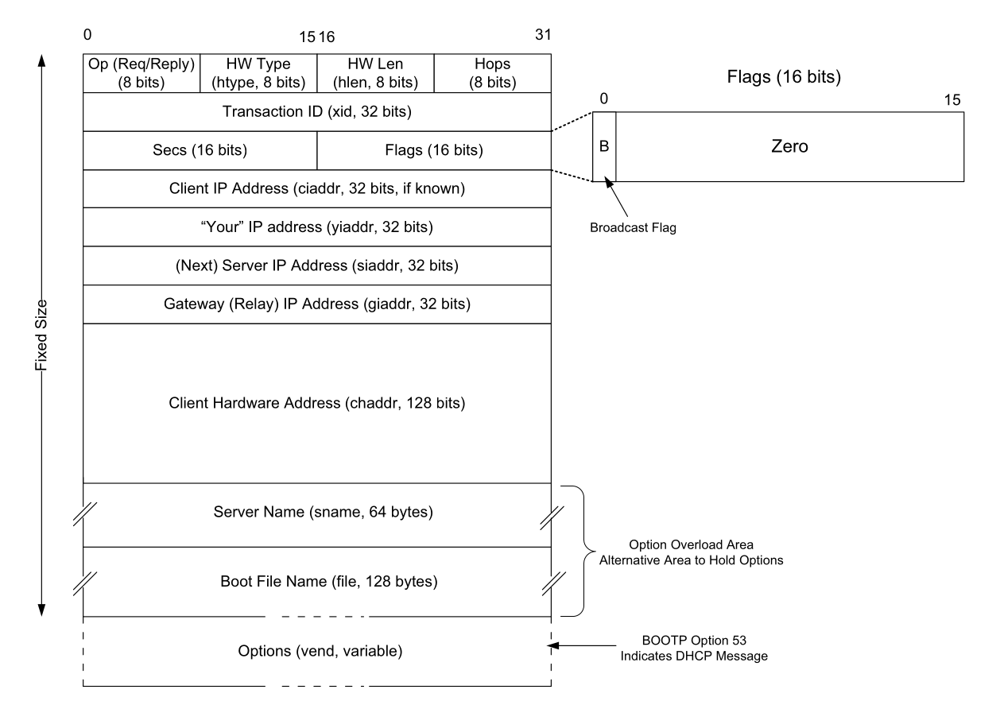

Figure 6-1 · PDF p. 276 · BOOTP/DHCP message format과 주요 address/options field

핵심 field는 다음과 같다.

| Field | 의미 |
|---|---|
| Op | request(1) 또는 reply(2) |
| HW Type(htype) | hardware type, Ethernet은 보통 1 |
| HW Len(hlen) | hardware address 길이, Ethernet MAC은 보통 6 bytes |
| Hops | relay를 거칠 때마다 증가 |
| Transaction ID(xid) | client가 고른 random 값, response matching에 사용 |
| Secs | 주소 설정/갱신 시도 후 경과 시간 |
| Flags | broadcast flag 포함 |
| ciaddr | client가 이미 알고 있는 current IP address |
| yiaddr | server가 client에게 제공하는 "your" IP address |
| siaddr | bootstrapping에서 사용할 next server IP address |
| giaddr | relay agent가 채우는 gateway/relay IP address |
| chaddr | client hardware address, 전통적으로 MAC address |
| sname/file | server name, boot file name 또는 option overload area |
| options | DHCP message type과 다양한 configuration parameter |

`broadcast flag`는 client가 아직 unicast IP datagram을 받을 수 없거나 처리하기 싫을 때 server/relay에게 broadcast reply를 써 달라고 알리는 bit다. 원문은 Windows Vista/XP/7의 broadcast flag 차이로 compatibility 문제가 있었다는 예를 들지만, 암기할 지점은 flag 자체가 "reply 전달 방식을 broadcast로 요구할 수 있다"는 의미라는 점이다.

`chaddr`는 client 식별에 쓰일 수 있지만, 오늘날은 DHCP option인 `Client Identifier`를 더 선호한다. `sname`과 `file`은 원래 boot server와 boot file 정보를 담지만, option 공간이 부족하면 DHCP options를 담는 alternative area로 사용될 수 있다.

### 6.2.3 DHCP and BOOTP Options

DHCP가 BOOTP에 없던 기능을 확장하는 핵심 수단이 `options`다. option은 보통 `tag`, `length`, `value` 구조를 사용한다. 일부 option은 tag 뒤에 고정 길이 value가 바로 오고, 대부분은 tag 1 byte, length 1 byte, variable value로 구성된다.

자주 등장하는 DHCP options는 다음과 같다.

| Option | 번호 | 의미 |
|---|---:|---|
| Pad | 0 | padding |
| Subnet Mask | 1 | IPv4 subnet mask |
| Router Address | 3 | default router/gateway |
| Domain Name Server | 6 | DNS server |
| Domain Name | 15 | local domain name |
| Requested IP Address | 50 | client가 원하는 IPv4 address |
| Address Lease Time | 51 | lease duration |
| DHCP Message Type | 53 | DHCPDISCOVER 등 message type |
| Server Identifier | 54 | server 식별 |
| Parameter Request List | 55 | client가 원하는 option 목록 |
| DHCP Error Message | 56 | server가 제공하는 error text |
| Lease Renewal Time | 58 | T1 renewal time |
| Lease Rebinding Time | 59 | T2 rebinding time |
| Client Identifier | 61 | MAC보다 선호되는 client identity |
| Domain Search List | 119 | DNS search suffix 목록 |
| End | 255 | options 끝 |

`DHCP Message Type option(53)`은 DHCP message를 legacy BOOTP와 구분하고, message의 의미를 정한다. 대표 값은 `DHCPDISCOVER(1)`, `DHCPOFFER(2)`, `DHCPREQUEST(3)`, `DHCPDECLINE(4)`, `DHCPACK(5)`, `DHCPNAK(6)`, `DHCPRELEASE(7)`, `DHCPINFORM(8)`이다.

options는 `Options` field뿐 아니라 `Server Name(sname)`과 `Boot File Name(file)` field에도 실릴 수 있다. 이를 `option overloading`이라고 하며, 이때 Overload option(52)이 어떤 field가 options 저장 공간으로 사용되었는지 알려준다. 길이가 255 bytes를 넘는 option은 같은 option을 여러 번 반복해 value를 이어 붙이는 long options mechanism을 쓴다.

### 6.2.4 DHCP Protocol Operation

DHCP message는 본질적으로 BOOTP message에 DHCP-specific options를 붙인 것이다. 새 client가 network에 붙으면 먼저 DHCP server와 제공 가능한 address를 찾고, 마음에 드는 offer를 고른 뒤, 선택한 server에게 address binding을 요청한다. server가 아직 그 address를 다른 곳에 주지 않았다면 DHCPACK으로 확정한다.

전형적인 DHCPv4 초기 할당 흐름은 `DORA`로 기억하면 좋다.

| 단계 | Message | 방향 | 핵심 의미 |
|---|---|---|---|
| 1 | DHCPDISCOVER | client -> broadcast | 사용 가능한 DHCP server와 offer 탐색 |
| 2 | DHCPOFFER | server -> client/broadcast | server가 IP address와 설정 후보 제안 |
| 3 | DHCPREQUEST | client -> broadcast | client가 특정 server와 offered address를 선택했음을 알림 |
| 4 | DHCPACK | selected server -> client/broadcast | server가 address binding과 lease를 확정 |

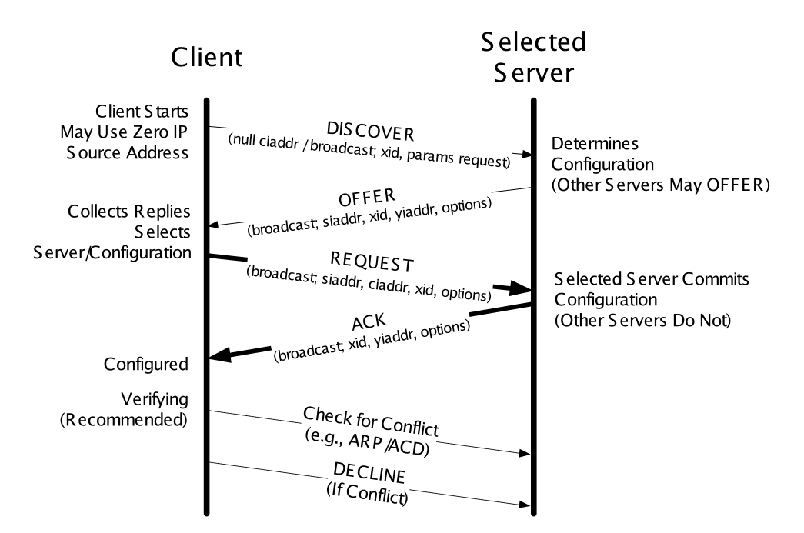

Figure 6-2 · PDF p. 279 · DHCPDISCOVER/OFFER/REQUEST/ACK 기반 DHCP exchange

client가 처음 보낼 때는 아직 자기 IP address를 모르므로 source IP address는 `0.0.0.0`, destination IP address는 limited broadcast `255.255.255.255`를 쓴다. UDP source port는 68, destination port는 67이다. DHCP request message는 BOOTP `BOOTREQUEST` operation과 `DHCP Message Type` option을 포함한다. DHCP/BOOTP message의 처음 Options 4 bytes에는 magic cookie 값 `99, 130, 83, 99`가 들어가 DHCP option 영역임을 표시한다.

server의 DHCPOFFER에는 보통 다음 값들이 들어간다.

- offered IP address: BOOTP `yiaddr` field에 들어감
- lease time `T`
- renewal time `T1`, 기본값은 `T/2`
- rebinding time `T2`, 기본값은 `7T/8`
- subnet mask, router/default gateway, DNS server, domain name 등

client가 여러 DHCPOFFER를 받으면 하나를 선택해 DHCPREQUEST를 broadcast한다. 이때 `Server Identifier` option으로 선택한 server를 명시하고, `Requested IP Address` option으로 선택한 address를 담는다. DHCPREQUEST가 broadcast인 이유는 선택되지 않은 server들도 이 message를 보고 자신들의 임시 offer state를 정리하게 하기 위해서다. 선택된 server만 binding을 persistent storage에 commit하고 DHCPACK을 보낸다.

server가 requested address를 줄 수 없으면 `DHCPNAK`을 보낸다. 예를 들어 client가 이전 network에서 쓰던 address를 새 network에서 계속 요청했지만 prefix가 맞지 않으면 DHCPNAK이 온다. client는 그 address 사용 시도를 중단하고 DHCPDISCOVER부터 다시 시작한다.

client는 DHCPACK을 받은 뒤에도 바로 안심하지 않는다. 권장되는 동작은 ARP request 등을 사용해 Address Conflict Detection(ACD)을 수행하는 것이다. 이미 누군가 그 address를 쓰고 있다면 client는 주소 사용을 중단하고 server에게 `DHCPDECLINE`을 보낸다. lease가 끝나기 전에 자발적으로 주소를 반납할 때는 `DHCPRELEASE`를 보낸다.

특수 흐름도 있다.

| 상황 | 사용하는 message |
|---|---|
| 기존 address lease를 갱신하고 싶음 | DHCPDISCOVER/OFFER 없이 DHCPREQUEST부터 시작 |
| address는 이미 있고 추가 설정만 원함 | DHCPINFORM을 보내고 DHCPACK으로 설정 정보 수신 |
| server가 address를 줄 수 없음 | DHCPNAK |
| client가 conflict를 발견함 | DHCPDECLINE |
| client가 lease를 조기 반납함 | DHCPRELEASE |

### 6.2.4.1 Example

원문 예시는 Microsoft Vista laptop이 이전 wireless network의 주소 `172.16.1.34`를 기억한 상태에서 새 network에 붙는 상황이다. client는 먼저 DHCPREQUEST로 old address를 계속 쓰려 하지만, 새 network의 DHCP server는 이 address가 현재 prefix에 맞지 않아 `DHCPNAK`을 보낸다. 그 뒤 client는 DHCPDISCOVER로 정상 discovery를 다시 시작한다.

이 예시에서 잡아야 할 포인트는 다음이다.

- DHCP client는 아직 새 network prefix와 자기 address를 확신하지 못하므로 link-layer broadcast, IP source `0.0.0.0`, IP destination `255.255.255.255`를 사용한다.
- `xid(Transaction ID)`는 request와 response를 match한다.
- `broadcast flag`가 set되어 있으면 server response도 broadcast로 보내야 한다.
- `Client Identifier`는 client-specific policy나 stable identity에 쓰일 수 있다.
- `Parameter Request List`는 client가 원하는 configuration option 목록이다. subnet mask, DNS server, default router뿐 아니라 vendor-specific option, NetBIOS option, classless static route option 등도 요청할 수 있다.
- `Vendor-Class Identifier`와 vendor-specific information은 표준 option만으로 부족한 vendor별 설정을 전달하는 데 쓰인다.

DHCPOFFER 예시에서는 server `10.0.0.1`이 client에게 `10.0.0.57`을 12시간 lease로 제공한다. 함께 제공되는 값은 subnet mask `255.255.255.128`, broadcast address `10.0.0.127`, default router와 DNS server `10.0.0.1`, domain name `home` 등이다. client는 이 offer를 받아들이기 위해 DHCPREQUEST를 broadcast하고, 선택된 server가 DHCPACK으로 lease를 확정한다.

운영체제 명령 예시는 세부 암기보다 "lease release/renew와 현재 configuration 확인이 가능하다"는 의미가 중요하다. Windows의 `ipconfig /release`, `ipconfig /renew`, `ipconfig /all`, Linux의 `dhclient -r`, `dhclient`가 그런 역할을 한다.

### 6.2.4.2 The DHCP State Machine

DHCP client는 message와 timer에 따라 state machine으로 동작한다. 아래 그림은 lease를 처음 얻고, 유지하고, 실패 시 다시 얻는 흐름을 보여준다.

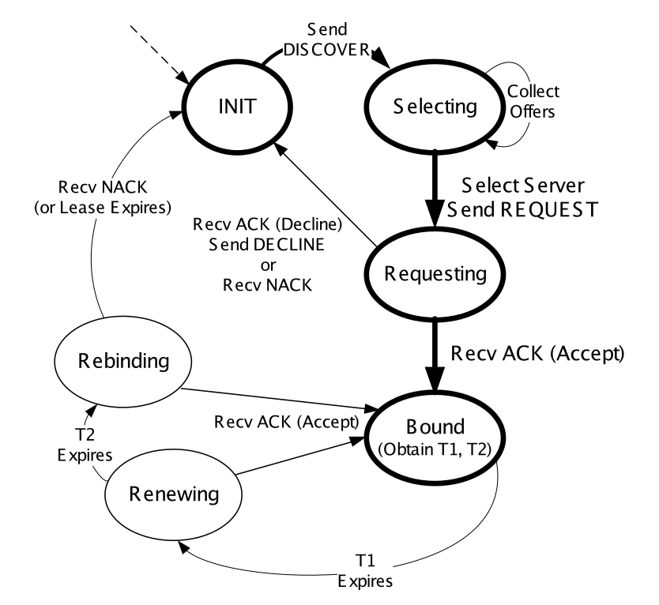

Figure 6-10 · PDF p. 290 · DHCP client state machine과 T1/T2 timer 흐름

주요 state는 다음과 같다.

| State | 의미 |
|---|---|
| INIT | 정보 없음, DHCPDISCOVER 시작 |
| SELECTING | DHCPOFFER를 수집하고 server/address 선택 |
| REQUESTING | DHCPREQUEST를 보낸 뒤 ACK/NAK 대기 |
| BOUND | lease를 얻어 address 사용 가능 |
| RENEWING | T1 만료 후 원래 server에게 lease renewal 시도 |
| REBINDING | T2 만료 후 아무 DHCP server에게나 lease 재확보 시도 |

정상 흐름은 `INIT -> SELECTING -> REQUESTING -> BOUND`다. `T1`이 만료되면 client는 RENEWING으로 가서 기존 server에게 갱신을 시도한다. 실패가 계속되어 `T2`가 만료되면 REBINDING으로 가서 어떤 server든 응답할 수 있게 한다. lease 자체가 완전히 만료되면 client는 그 address를 포기해야 하며, 대체 주소나 다른 연결이 없으면 network connectivity를 잃는다.

### 6.2.5 DHCPv6

`DHCPv6`는 DHCPv4와 목표는 비슷하지만 설계와 배포 방식이 다르다. DHCPv6는 두 방식으로 쓰인다.

| 방식 | 의미 |
|---|---|
| stateful DHCPv6 | DHCPv4처럼 server가 IPv6 address와 lease를 할당 |
| stateless DHCPv6 | address는 SLAAC로 만들고 DNS server 등 추가 정보만 DHCPv6로 받음 |

IPv6에서는 DHCPv6만이 유일한 자동 설정 방법이 아니다. host는 ICMPv6 Router Advertisement(RA)를 받고, 그 안의 flag에 따라 DHCPv6를 쓸지 SLAAC만 쓸지 결정한다. DNS server 위치도 DHCPv6 option으로 받을 수 있고, 일부 환경에서는 Router Advertisement로도 받을 수 있다.

### 6.2.5.1 IPv6 Address Lifecycle

IPv6 interface는 보통 여러 address를 동시에 가진다. 각 address에는 `preferred lifetime`과 `valid lifetime`이 있고, 이 timer들이 address state를 바꾼다.

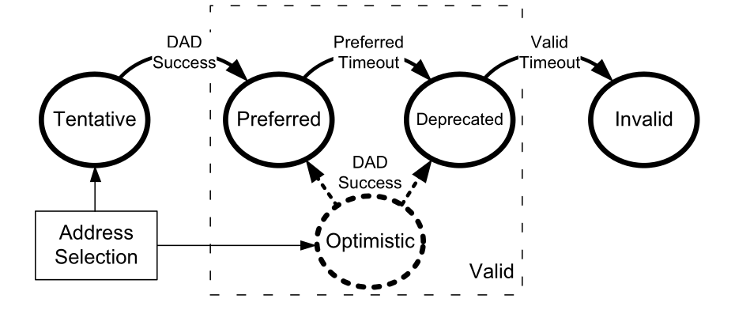

Figure 6-11 · PDF p. 291 · IPv6 address lifecycle: tentative, preferred, deprecated, invalid

IPv6 address lifecycle은 다음처럼 이해하면 된다.

| State | 의미 | 사용 가능성 |
|---|---|---|
| tentative | 주소를 선택했지만 Duplicate Address Detection(DAD) 중 | Neighbor Discovery/DAD 외 사용 금지 |
| optimistic | DAD 완료 전 제한적으로 사용 | 대부분 deprecated처럼 취급 |
| preferred | 일반 source/destination address로 사용 가능 | 새 connection에 사용 가능 |
| deprecated | preferred timeout 지남 | 기존 connection 유지에는 사용 가능, 새 connection 시작에는 부적절 |
| invalid | valid timeout 지남 | 더 이상 사용 불가 |

`Duplicate Address Detection(DAD)`는 같은 link에 이미 그 IPv6 address를 쓰는 node가 있는지 확인하는 절차다. DHCPv6로 받은 주소도 실제 사용 전에는 DAD와 address lifecycle의 영향을 받는다.

### 6.2.5.2 DHCPv6 Message Format

DHCPv6 message는 UDP/IPv6 datagram으로 encapsulation된다. client는 UDP port 546, server는 UDP port 547을 사용한다. DHCPv4와 달리 legacy BOOTP format이 없고, message 구조가 더 단순하며 대부분의 정보가 options에 담긴다.

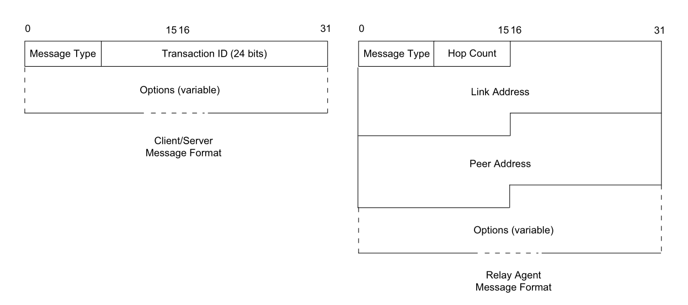

Figure 6-12 · PDF p. 292 · DHCPv6 client/server message와 relay agent message format

DHCPv6에는 두 message format이 있다.

| Format | 주요 field | 쓰임 |
|---|---|---|
| client/server format | Message Type, 24-bit Transaction ID, Options | client와 server 사이 일반 DHCPv6 message |
| relay agent format | Message Type, Hop Count, Link Address, Peer Address, Options | relay와 server 사이 RELAY-FORW/RELAY-REPL |

DHCPv6 client는 request를 `All DHCP Relay Agents and Servers` multicast address `ff02::1:2`로 보낸다. source address는 link-local scope address다. relay message에는 `Relay Message option`이 들어가며, relay가 전달하는 원래 DHCPv6 message 전체를 포함한다.

대표 DHCPv6 message와 DHCPv4 대응 관계는 다음 정도가 중요하다.

| DHCPv6 | 대략 대응되는 DHCPv4 | 의미 |
|---|---|---|
| SOLICIT | DISCOVER | server 탐색 |
| ADVERTISE | OFFER | server의 offer |
| REQUEST | REQUEST | address/configuration 요청 |
| REPLY | ACK/NAK | server 응답 |
| RENEW | REQUEST | 기존 binding 갱신 |
| REBIND | DISCOVER 성격 | 기존 server 응답 실패 후 다른 server에게 갱신 |
| RELEASE | RELEASE | lease 반납 |
| DECLINE | DECLINE | address conflict 알림 |
| INFORMATION-REQUEST | INFORM | address 외 정보 요청 |
| RELAY-FORW / RELAY-REPL | 없음 | relay forwarding 전용 |

### 6.2.5.3 Identity Association (IA)

`Identity Association(IA)`는 DHCPv6 client와 server가 "주소들의 묶음"을 가리키는 식별자다. 각 IA는 `IAID`와 관련 configuration information으로 구성된다. DHCPv6로 주소를 요청하는 각 client interface에는 적어도 하나의 IA가 필요하고, 하나의 IA는 하나의 interface에만 연결된다.

IA에 들어가는 configuration information은 다음을 포함한다.

- 하나 이상의 IPv6 addresses
- 각 address의 preferred lifetime과 valid lifetime
- lease 관련 `T1`, `T2`, total lease duration
- nontemporary address 또는 temporary address 여부

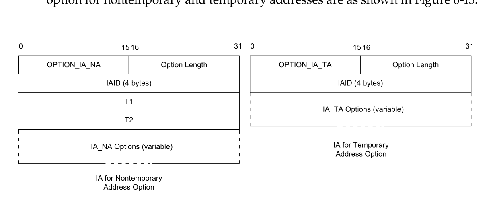

Figure 6-13 · PDF p. 295 · IA_NA와 IA_TA option format

`IA_NA`는 nontemporary address용 IA이고 `T1`, `T2` 값을 직접 포함한다. `IA_TA`는 temporary address용 IA이며 T1/T2를 직접 넣지 않는다. temporary address는 IPv6 privacy를 위해 random 요소를 사용해 더 자주 바뀌도록 설계된 address다.

### 6.2.5.4 DHCP Unique Identifier (DUID)

`DHCP Unique Identifier(DUID)`는 DHCPv6 client 또는 server 하나를 식별하는 persistent identifier다. server는 DUID를 보고 client에게 어떤 address와 configuration을 줄지 판단하고, client는 DUID를 보고 자신이 관심 있는 server를 식별한다. DUID는 variable length이고 대부분 opaque value로 취급된다.

대표 DUID type은 다음과 같다.

| DUID type | 기반 | 특징 |
|---|---|---|
| DUID-LLT | link-layer address + time | 권장 형식, stable storage 필요 |
| DUID-EN | enterprise number + vendor assignment | vendor/enterprise 기반 |
| DUID-LL | link-layer address only | stable storage가 부족한 장비에 적합할 수 있음 |

DUID-LLT는 hardware type, timestamp, link-layer address를 포함한다. 한 host는 여러 interface가 있어도 일단 DUID를 정하면 모든 interface의 DHCPv6 traffic에서 같은 DUID를 써야 한다. 그래서 interface card가 바뀌어도 DUID를 유지하려면 host가 stable storage에 DUID를 저장해야 한다.

### 6.2.5.5 Protocol Operation

DHCPv6 사용 여부는 ICMPv6 Router Advertisement 안의 flag가 결정한다.

| RA flag | 이름 | 의미 |
|---|---|---|
| M | Managed Address Configuration | IPv6 address를 DHCPv6로 받을 수 있음 |
| O | Other Configuration | address 외 DNS 등 추가 정보를 DHCPv6로 받을 수 있음 |

M/O 조합은 다음처럼 해석할 수 있다.

| M | O | 동작 |
|---:|---:|---|
| 0 | 0 | DHCPv6 사용 안 함, SLAAC 중심 |
| 0 | 1 | address는 SLAAC, 기타 정보는 stateless DHCPv6 |
| 1 | 1 | stateful DHCPv6로 address와 기타 정보 획득 |
| 1 | 0 | 가능은 하지만 실용성이 낮은 조합 |

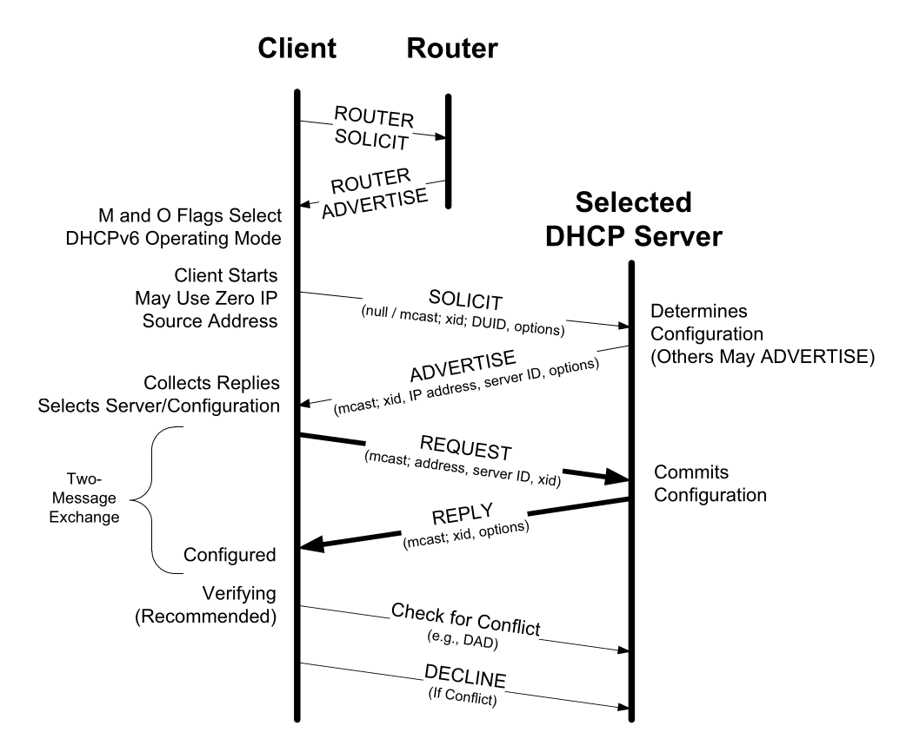

Figure 6-14 · PDF p. 297 · Router Advertisement의 M/O flag와 DHCPv6 operation 흐름

일반적인 DHCPv6 흐름은 DHCPv4와 비슷하게 네 message exchange를 가진다.

| 단계 | Message | 의미 |
|---|---|---|
| 1 | SOLICIT | client가 DHCPv6 server 탐색 |
| 2 | ADVERTISE | server가 address/configuration 후보 제시 |
| 3 | REQUEST | client가 server와 configuration 선택 |
| 4 | REPLY | server가 binding 확정 |

server 위치를 이미 알거나, address allocation이 필요 없거나, Rapid Commit을 쓰는 경우에는 REQUEST/REPLY 중심의 two-message exchange로 줄어들 수 있다. DHCPv6 server가 commit하는 binding은 `DUID + IA type + IAID` 조합으로 형성된다. 하나의 binding은 하나 이상의 lease를 가질 수 있고, 하나의 DHCPv6 transaction에서 여러 binding을 조작할 수 있다.

### 6.2.5.6 Extended Example

원문 예시는 IPv4 stack을 끈 Windows Vista host가 wireless network에 붙는 흐름을 보여준다. 전체 그림은 Wireshark 캡처 중심이라 세부 화면보다는 protocol 순서를 잡는 것이 중요하다.

1. host가 link-local address를 선택하고 DAD를 수행한다.
2. Router Solicitation(RS)을 `ff02::2` All Routers multicast address로 보낸다.
3. Router Advertisement(RA)를 받아 M/O flag를 확인한다.
4. M=1, O=1이면 stateful DHCPv6로 진행한다.
5. SOLICIT message에 DUID, IA_NA, IAID, FQDN option, vendor class, requested option list 등을 넣어 보낸다.
6. ADVERTISE message에서 server는 global address, preferred/valid lifetime, DNS Recursive Name Server option, Domain Search List option 등을 제공한다.
7. client는 REQUEST로 selected address와 T1/T2 값을 포함해 commit을 요청하고, server의 REPLY로 완료된다.

이 예시에서 특히 눈에 띄는 점은 DUID가 반드시 현재 송신 interface의 MAC address에 기반하지 않는다는 점이다. 원문에서는 wireless로 전송 중인데 DUID 안의 MAC은 wired Ethernet interface의 주소다. DUID는 "interface별 MAC"이라기보다 "node 전체를 persistent하게 식별하는 DHCPv6 identifier"에 가깝다.

### 6.2.5.7 DHCPv6 Prefix Delegation (DHCPv6-PD and 6rd)

DHCPv6는 host뿐 아니라 router configuration에도 사용된다. `DHCPv6 Prefix Delegation(DHCPv6-PD)`은 한 router가 다른 router에게 IPv6 prefix 범위를 위임하는 기능이다. ISP가 customer premises equipment(CPE)에 prefix를 주고, CPE가 내부 subnet에 그 prefix를 재분배하는 상황이 대표적이다.

prefix delegation에는 주소용 IA와 비슷한 `IA_PD`가 사용된다. IA_PD는 IAID와 delegated prefix 관련 configuration information을 담는다. 이 방식은 고정 router뿐 아니라 mobile router와 그 attached subnet에도 활용될 수 있다.

`6rd(IPv6 rapid deployment)`는 service provider가 기존 IPv4 infrastructure 위에서 IPv6 prefix를 빠르게 배포하기 위한 특수한 prefix delegation 형태다. 6rd prefix와 customer의 IPv4 address 일부를 조합해 customer site의 IPv6 delegated prefix를 algorithmically 만든다. 핵심은 "DHCPv6-PD가 host address 하나가 아니라 router가 내부에서 쓸 prefix 자체를 위임할 수 있다"는 점이다.

### 6.2.6 Using DHCP with Relays

작은 LAN에서는 DHCP server가 client와 같은 segment에 있으면 충분하다. 하지만 enterprise나 ISP 환경에서는 중앙 DHCP server가 여러 network segment의 client를 처리해야 할 수 있다. 이때 `DHCP relay agent`가 client의 broadcast/multicast DHCP traffic을 server 쪽으로 전달한다.

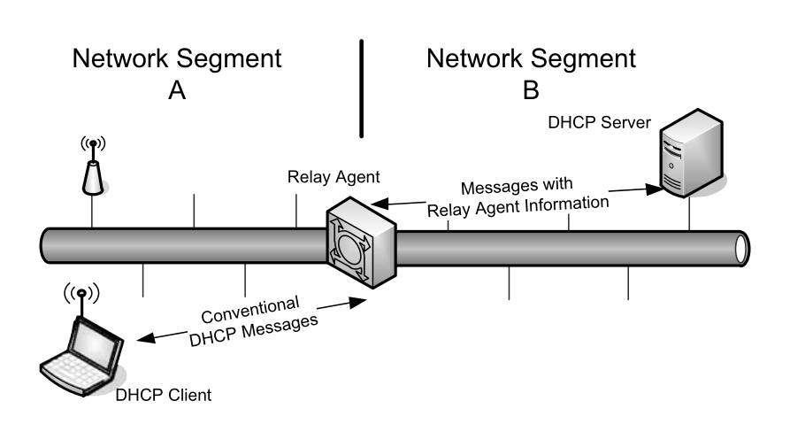

Figure 6-21 · PDF p. 306 · DHCP relay agent가 다른 network segment의 server로 DHCP traffic을 전달

relay agent는 보통 모든 DHCP traffic에 끼어들지는 않는다. client가 처음 주소를 얻을 때처럼 broadcast 또는 IPv6 multicast를 쓰는 message를 relay한다. client가 주소와 server identity를 알게 되면 이후 renewal 같은 일부 대화는 server와 unicast로 직접 할 수 있어 relay를 거치지 않을 수 있다.

전통적인 relay agent는 layer 3 device이고 routing 기능을 갖는 경우가 많다. relay는 message를 단순 전달할 뿐 아니라, server가 client 위치와 access context를 알 수 있도록 field를 채우거나 option을 덧붙일 수 있다.

### 6.2.6.1 Relay Agent Information Option

초기 BOOTP/DHCP relay의 목적은 router가 넘기지 않는 broadcast request를 다른 subnet의 centralized server로 전달하는 것이었다. ISP나 access network 환경에서는 여기에 더해 "이 요청이 어느 subscriber, circuit, modem, access line에서 왔는가" 같은 정보가 필요해졌다.

DHCPv4의 `Relay Agent Information Option(RAIO)`은 이런 정보를 담는 meta-option이다. RAIO 안에는 여러 suboption이 들어갈 수 있고, client가 제공하지 않은 access-side 정보를 relay가 server에게 알려준다. 예를 들어 circuit ID, remote ID, subscriber 관련 식별자 등이 들어갈 수 있다.

relay-server 사이 정보가 중요하면 RAIO용 DHCP Authentication suboption으로 integrity를 보호할 수 있다. 원문은 이 방식이 deferred authentication과 비슷하지만 MD5 대신 SHA-1을 사용한다고 설명한다. 핵심은 relay가 넣는 정보도 server의 address allocation/logging/billing 결정에 영향을 줄 수 있으므로 보호 대상이라는 점이다.

### 6.2.6.2 Relay Agent Remote-ID Suboption and IPv6 Remote-ID Option

`Remote-ID`는 client가 보낸 정보만으로는 부족할 때 relay가 "이 request가 어느 remote entity에서 왔는지"를 local naming scheme으로 식별하는 기능이다. caller ID, user name, modem ID, point-to-point link의 remote IP address 같은 값이 쓰일 수 있다.

DHCPv6의 `Relay Agent Remote-ID option`은 같은 기능을 제공하면서 enterprise number field도 포함한다. 이 field는 remote ID의 vendor-specific 해석 기준을 알려준다. 흔한 방법 중 하나는 remote ID로 DUID를 사용하는 것이다.

### 6.2.6.3 Server Identifier Override

일반적으로 relay는 SOLICIT/DISCOVER 같은 초기 message에만 끼어들고, client가 server identifier를 알게 되면 이후 traffic에서는 빠질 수 있다. 하지만 network operator는 REQUEST 같은 이후 message에도 circuit ID나 access 정보가 계속 붙기를 원할 수 있다.

`Server Identifier Override`는 relay가 server identifier를 자신 쪽 주소로 바꾸어 client-server 후속 traffic도 relay를 통과하게 만드는 기능이다. 이렇게 하면 relay가 RAIO 같은 정보를 계속 덧붙일 수 있다. server는 Relay Agents Flag suboption 같은 정보를 보고 initial message가 broadcast였는지 unicast였는지 등 allocation decision에 필요한 context를 얻을 수 있다.

### 6.2.6.4 Lease Query and Bulk Lease Query

`DHCP leasequery`는 relay, access concentrator 같은 third-party system이 특정 DHCP client의 binding 정보를 server에게 질의하는 기능이다. relay가 지나가는 DHCP packet에서 binding 정보를 glean할 수 있지만, relay reboot/failure 후에는 그 local state를 잃을 수 있다. leasequery는 그런 state를 server에서 다시 얻는 수단이다.

DHCPv4 leasequery는 IPv4 address, MAC address, Client Identifier, Remote ID 기준 질의를 지원한다. DHCPv6 leasequery는 IPv6 address와 Client Identifier(DUID)를 기준으로 질의할 수 있고, delegated prefix 정보도 얻을 수 있다.

server 응답의 의미는 다음처럼 나뉜다.

| 응답 | 의미 |
|---|---|
| DHCPLEASEUNASSIGNED | server가 authoritative하지만 현재 lease 없음 |
| DHCPLEASEACTIVE | active lease가 있고 T1/T2 등 lease parameter 제공 |
| DHCPLEASEUNKNOWN | server가 해당 binding을 모름 |
| LEASEQUERY-REPLY | DHCPv6 lease query 응답, Client Data option 포함 가능 |

`Bulk Leasequery(BL)`는 여러 binding을 한꺼번에 얻는 확장이다. 일반 DHCP client가 설정 정보를 얻기 위해 쓰는 기능이 아니라, relay/access system이 대량 binding 정보를 복구하거나 동기화하기 위한 특수 서비스다. BL은 UDP가 아니라 TCP/IP를 사용해 큰 응답을 안정적으로 전달하고, relay identifier, link address, remote ID 같은 query type을 지원한다. 성공 응답은 `LEASEQUERY-REPLY`, 여러 `LEASEQUERY-DATA`, 마지막 `LEASEQUERY-DONE`으로 이어질 수 있다.

### 6.2.6.5 Layer 2 Relay Agents

일부 switch/bridge 같은 layer 2 device는 DHCP request 가까이에 있지만 full IP stack이 없고 IP로 addressable하지 않다. 그래서 conventional layer 3 relay처럼 동작할 수 없다. 이를 위해 `Layer 2 lightweight DHCP relay agent(LDRA)` 개념이 있다.

IPv4 LDRA의 핵심 문제는 IP layer 정보가 없는데도 RAIO를 넣어야 한다는 점이다. 권장 방식은 DHCP request에 RAIO는 넣되 `giaddr` field는 채우지 않는 것이다. response가 broadcast로 오면 LDRA가 RAIO를 제거하고 원래 client-facing interface로 전달한다.

IPv6 LDRA는 DHCPv6 traffic을 `RELAY-FORW`와 `RELAY-REPL` message로 처리한다. client-facing interface에서 들어온 ADVERTISE, REPLY, RECONFIGURE, RELAY-REPL 같은 message는 버리고, untrusted client-facing interface에서 온 RELAY-FORW도 보안상 버린다. Link-Address를 0으로 두고 Peer-Address와 Interface-ID option을 사용해 어느 client-facing interface로 되돌릴지 표시한다.

### 6.2.7 DHCP Authentication

DHCP가 잘못 동작하면 host가 틀린 IP address, router, DNS server를 받아 network 전체가 쉽게 흔들릴 수 있다. 기본 DHCP에는 강한 security가 없기 때문에 rogue DHCP server나 unauthorized client가 의도적으로 또는 실수로 문제를 만들 수 있다.

DHCP Authentication option은 DHCP message가 authorized sender에게서 왔는지 확인하려는 기능이다.

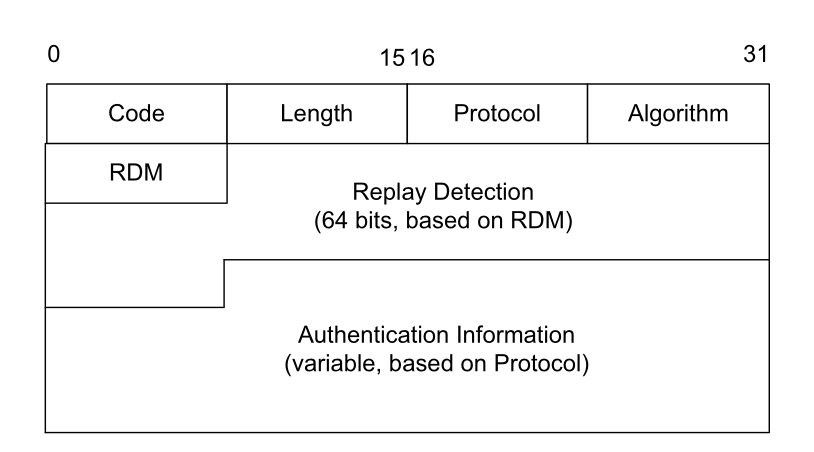

Figure 6-22 · PDF p. 311 · DHCP Authentication option의 replay detection과 authentication information

Authentication option의 주요 field는 다음과 같다.

| Field | 의미 |
|---|---|
| Code | option code, 90 |
| Length | option 길이 |
| Protocol/Algorithm | 인증 방식 지정 |
| RDM | Replay Detection Method |
| Replay Detection | timestamp처럼 단조 증가하는 값 |
| Authentication Information | token 또는 message authentication code(MAC) |

Protocol/Algorithm 값이 0이면 shared configuration token을 담는 단순 방식이다. password 비슷한 문자열을 넣을 수 있지만 traffic이 노출되면 안전하지 않다. accidental misconfiguration을 줄이는 정도의 의미가 더 크다.

더 나은 방식은 `deferred authentication`이다. client와 server가 shared secret을 갖고, message authentication code(MAC)를 사용해 sender authentication과 message integrity를 확인한다. Replay Detection field는 단조 증가 값으로 이전 DHCP message를 capture했다가 나중에 재생하는 replay attack을 막는 데 쓴다.

그럼에도 DHCP authentication은 널리 쓰이지 않았다. 이유는 client마다 shared key를 배포해야 하는 운영 부담이 크고, DHCP가 이미 널리 배포된 뒤에 specification이 추가되었기 때문이다.

### 6.2.8 Reconfigure Extension

일반적으로 DHCP renewal은 client가 시작한다. `Reconfigure Extension`은 server가 client에게 "지금 Renewing state로 가서 lease를 다시 갱신하라"고 유도하는 기능이다. DHCPv4에서는 `DHCPFORCERENEW` message가 관련된다.

이 기능은 network renumbering이나 administrative shutdown처럼 server 측에서 client 설정을 빨리 바꾸고 싶을 때 필요하다. 하지만 공격자가 이 message를 보내면 client를 강제로 lease renewal 또는 address loss 상태로 몰아넣는 DoS가 가능하다. 그래서 reconfigure message는 DHCP authentication이 필수인데, authentication 자체가 널리 쓰이지 않아 reconfigure extension도 널리 쓰이지 않는다.

### 6.2.9 Rapid Commit

`Rapid Commit`은 DHCPDISCOVER에 대해 server가 곧바로 DHCPACK을 보내, 네 message exchange를 두 message exchange로 줄이는 option이다. 이동 host처럼 attachment point가 자주 바뀌는 경우 빠른 설정을 위해 등장했다.

Rapid Commit 사용 조건은 보수적이어야 한다. client는 DHCPDISCOVER에만 Rapid Commit option을 넣을 수 있고, server는 DHCPACK에서만 이 option을 사용한다. server가 ACK와 함께 이 option을 보내면 client는 받은 address를 즉시 사용할 수 있다. 이후 ARP 등으로 conflict를 발견하면 DHCPDECLINE을 보내고 address를 포기한다. single DHCP server이고 address가 충분한 환경에서는 큰 문제가 없지만, 여러 server가 경쟁하는 환경에서는 조심해야 한다.

### 6.2.10 Location Information (LCI and LoST)

DHCP는 IP address만 주는 protocol이 아니라 위치 관련 configuration도 전달할 수 있다. `Location Configuration Information(LCI)`는 latitude, longitude, altitude 같은 geospatial location이나 country, city, street 같은 civic location을 표현할 수 있다. emergency service에서 IP phone 사용자의 위치를 알아내는 경우가 대표적이다.

위치 정보에는 privacy 문제가 따라온다. 그래서 IETF의 Geopriv 같은 framework가 논의된다. DHCP가 위치 자체를 직접 주는 대신, HELD server 또는 LoST server의 FQDN을 알려 주는 option도 있다. `LoST(Location-to-Service Translation)`는 특정 location에 대응되는 service, 예를 들어 가까운 emergency service endpoint를 찾는 application-layer framework다.

### 6.2.11 Mobility and Handoff Information (MoS and ANDSF)

mobile computer와 smartphone이 cellular/Wi-Fi 사이를 오가는 환경에서는 handoff와 access network selection 정보가 필요하다. DHCP option은 이런 server 위치도 전달할 수 있다.

| 기능 | 의미 |
|---|---|
| IEEE 802.21 Mobility Services(MoS) Discovery | information service, command service, event service server의 address/FQDN 제공 |
| ANDSF(Access Network Discovery and Selection Function) | cellular operator가 제공하는 access network availability/policy server discovery |

MoS는 여러 network type 사이의 media-independent handoff를 돕고, ANDSF는 3G/Wi-Fi 같은 여러 transport network의 사용 가능성 및 정책 정보를 mobile device에게 제공하는 쪽에 가깝다. 이 세부 option 번호보다 중요한 것은 DHCP가 "주소 할당"뿐 아니라 network access policy와 mobility support service discovery에도 확장되어 쓰인다는 점이다.

### 6.2.12 DHCP Snooping

`DHCP snooping`은 switch가 DHCP message를 들여다보고, 허용된 port/MAC/server만 DHCP traffic을 교환하게 제한하는 기능이다. 목적은 두 가지다.

- rogue DHCP server가 잘못된 offer를 뿌려 client를 오염시키는 것을 막는다.
- 특정 MAC address 집합에만 address allocation을 허용해 주소 사용을 어느 정도 통제한다.

다만 보호 수준은 제한적이다. MAC address는 OS command로 비교적 쉽게 바꿀 수 있으므로, DHCP snooping은 강한 identity authentication이라기보다 access switch 수준의 방어막에 가깝다. 그래도 enterprise LAN에서 rogue DHCP server를 줄이는 데 매우 실용적인 기능이다.

### 6.3 Stateless Address Autoconfiguration (SLAAC)

`Stateless Address Autoconfiguration(SLAAC)`은 host가 DHCP server의 per-client state 없이 자기 address를 자동으로 구성하는 방식이다. link-local address는 같은 link 안에서만 unique하면 되므로 host가 스스로 만들 수 있다. global address는 전역 routing 가능한 prefix가 필요하므로 router가 Router Advertisement로 prefix를 제공하고, host가 그 prefix와 interface identifier를 결합한다.

IPv4와 IPv6 모두 link-local autoconfiguration이 있지만 의미와 실용성이 다르다.

| 구분 | IPv4 | IPv6 |
|---|---|---|
| link-local prefix | `169.254.0.0/16` 일부 범위 | `fe80::/10`, 일반적으로 `/64` 형태 |
| duplicate check | ARP 기반 ACD | ICMPv6 Neighbor Solicitation/Advertisement 기반 DAD |
| global address 구성 | APIPA만으로는 불가 | RA prefix + interface identifier로 가능 |
| 실용성 | local-only 통신에 제한, Internet/DNS 실패 가능 | IPv6 기본 동작의 핵심 구성 요소 |

### 6.3.1 Dynamic Configuration of IPv4 Link-Local Addresses

IPv4에서 DHCP server가 없고 manual address도 없으면, host는 `169.254.1.1`부터 `169.254.254.254` 범위에서 random address를 골라 사용할 수 있다. subnet mask는 `255.255.0.0`이다. 이 방식은 `dynamic link-local address configuration` 또는 Windows 용어로 `Automatic Private IP Addressing(APIPA)`라고도 불린다.

host는 random address를 고른 뒤 IPv4 Address Conflict Detection(ACD), 즉 ARP 기반 probe로 같은 subnet에서 이미 그 address를 쓰는 node가 있는지 확인한다. 성공하면 local subnet 내부 통신은 가능하지만, default router가 일반적으로 `169.254/16`을 routing하지 않으므로 Internet access는 대개 실패한다.

### 6.3.2 IPv6 SLAAC for Link-Local Addresses

IPv6 SLAAC는 node가 link-local IPv6 address를 자동으로 self-assign하도록 한다. router가 없어도 link-local address는 만들 수 있고, router가 있으면 RA prefix를 받아 global address도 만들 수 있다. SLAAC는 DHCPv6 또는 manual assignment와 함께 쓸 수도 있다. 예를 들어 address는 SLAAC로 만들고, DNS server 같은 추가 정보는 stateless DHCPv6로 받을 수 있다.

IPv6 link-local address는 well-known prefix `fe80::/10`에 locally generated identifier를 붙여 만든다. 일반적으로 64-bit interface identifier를 사용해 `fe80::/64` 형태로 이해하면 된다. 만들어진 address는 먼저 tentative 또는 optimistic 상태에 놓이고, DAD를 통과해야 preferred address로 사용할 수 있다.

### 6.3.2.1 IPv6 Duplicate Address Detection (DAD)

`Duplicate Address Detection(DAD)`는 tentative IPv6 address가 attached link에서 이미 사용 중인지 확인하는 절차다. manual assignment, SLAAC, DHCPv6로 얻은 주소 모두에 DAD 사용이 권장된다.

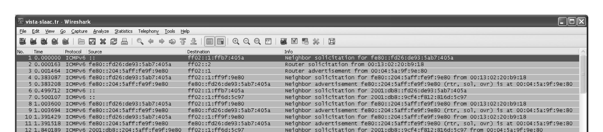

Figure 6-23 · PDF p. 318 · tentative link-local address에 대한 DAD Neighbor Solicitation

DAD 절차는 다음과 같다.

1. node가 All Nodes multicast address와 tentative address에 대응되는 Solicited-Node multicast address에 join한다.
2. source IPv6 address를 unspecified address `::`로 두고, destination은 tentative address의 Solicited-Node multicast address로 둔 Neighbor Solicitation(NS)을 보낸다.
3. NS의 Target Address field에는 검사 중인 tentative address를 넣는다.
4. 해당 address를 이미 쓰는 node가 있으면 Neighbor Advertisement(NA)가 돌아온다.
5. NA가 돌아오거나, 같은 tentative address를 쓰려는 다른 node의 NS가 보이면 DAD는 실패하고 address를 버린다.
6. 응답이 없으면 DAD 성공으로 보고 address를 preferred state로 전환한다.

MAC address 기반 interface identifier로 link-local address를 만들었는데 DAD가 실패하면 같은 방식으로 다른 non-conflicting address를 만들기 어려울 수 있어 administrator input이 필요할 수 있다. random/privacy 기반 identifier라면 다른 tentative address로 재시도할 수 있다.

### 6.3.2.2 IPv6 SLAAC for Global Addresses

global IPv6 address는 link-local SLAAC와 비슷하지만 prefix를 router가 제공한다. Router Advertisement의 Prefix option에 global prefix와 flag가 들어 있고, `autonomous address-configuration flag`가 set되어 있으면 host는 그 prefix와 interface identifier를 결합해 global address를 만든다.

preferred lifetime과 valid lifetime도 Prefix option에서 제공된다. 따라서 SLAAC로 만든 global address도 preferred, deprecated, invalid lifecycle을 따른다.

### 6.3.2.3 Example

원문 예시는 Windows Vista/SP1 host가 SLAAC로 주소를 구성하는 흐름을 보여준다.

1. host가 `fe80::/64` link-local prefix와 random number로 tentative link-local address를 만든다.
2. DAD를 수행한다.
3. Router Solicitation(RS)을 All Routers multicast address `ff02::2`로 보낸다.
4. router가 Router Advertisement(RA)를 All Systems multicast address `ff02::1`로 보낸다.
5. RA의 Prefix option에서 `2001:db8::/64` 같은 global prefix와 auto flag를 확인한다.
6. prefix와 interface identifier를 결합해 global address를 만든다.
7. global address에 대해서도 DAD를 수행한다.
8. privacy extension이 켜져 있으면 다른 random identifier를 사용한 temporary global address도 만들고 DAD를 수행한다.

RA가 SLAAC의 전체 방향을 정한다. 아래 figure는 default router, global prefix, DNS server, Mobile IPv6 home agent 가능성 등 host가 configuration에 쓸 정보를 RA가 제공하는 장면이다.

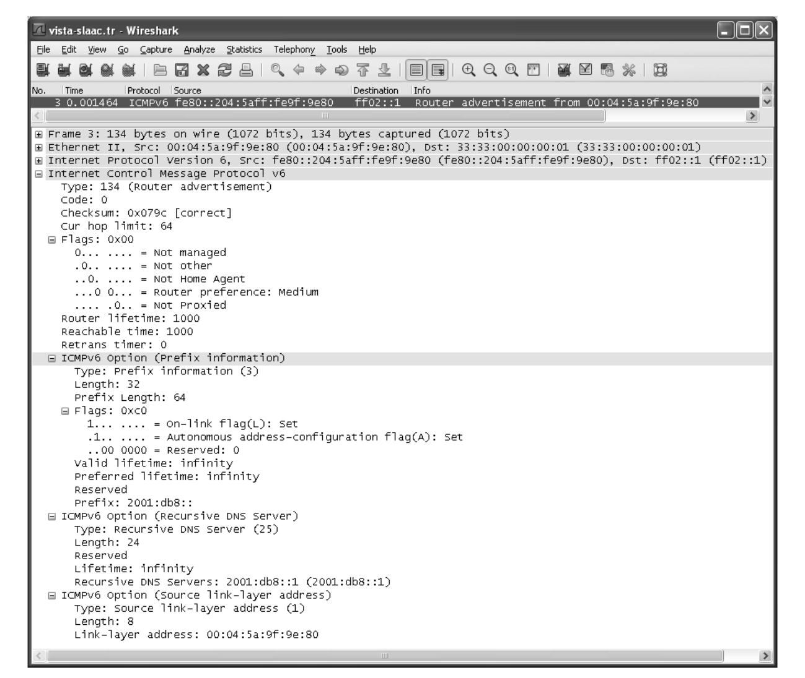

Figure 6-25 · PDF p. 320 · ICMPv6 Router Advertisement가 prefix, router, DNS 정보를 제공하는 예

temporary IPv6 address는 privacy를 위해 낮은 bits를 다른 random number로 만들어 주기적으로 바뀌게 할 수 있다. 원문 예시에서는 stable global address와 temporary global address가 모두 만들어진다. temporary address는 더 짧은 lifetime을 가지며, local default와 RA의 Prefix Information option lifetime 중 더 작은 값을 따른다.

### 6.3.2.4 Stateless DHCP

`stateless DHCPv6`는 DHCPv6 server가 address를 할당하거나 per-client address state를 유지하지 않고, DNS server, DNS search list, SIP server 같은 추가 configuration information만 제공하는 방식이다. address는 SLAAC나 다른 방법으로 이미 얻었다고 가정한다.

stateless DHCPv6 client는 `INFORMATION-REQUEST` message를 보내고 server는 `REPLY`로 필요한 option을 제공한다. address binding을 만들지 않으므로 IA_NA/IA_TA 같은 address management option이 필요 없고 server 구현과 설정이 단순해진다. relay agent 동작은 stateful DHCPv6와 동일하게 유지된다.

유용한 stateless DHCPv6 server는 보통 다음 option을 제공한다.

- DNS Server
- DNS Search List
- SIP Servers
- Vendor Class / Vendor-Specific Information
- User Class
- Client Identifier
- Authentication

### 6.3.2.5 The Utility of Address Autoconfiguration

autoconfiguration은 편하지만 항상 충분하지는 않다. IPv4 APIPA로 `169.254/16` 주소를 얻으면 local subnet 통신은 가능할 수 있지만, router와 DNS server가 제대로 설정되지 않아 Internet access와 name resolution이 실패하기 쉽다. 오히려 "주소를 아예 못 얻었다"는 실패가 사용자와 관리자에게 더 명확할 때도 있다.

IPv6 SLAAC는 global address를 얻기 훨씬 쉽지만, name-to-address 관계가 자동으로 안전하게 구성되는 것은 아니다. DNS update, local naming, security 문제가 남는다. 필요하면 router의 RA Prefix option에서 auto flag를 끄거나 client의 autoconfiguration 설정을 비활성화해 global SLAAC를 제한할 수 있다.

### 6.4 DHCP and DNS Interaction

DHCP client가 받는 중요한 정보 중 하나가 DNS server address다. DNS가 없으면 사용자는 domain name을 IP address로 변환할 수 없어 Web/e-mail 같은 일반 Internet 사용이 거의 불가능해진다. local private network에서도 `.home` 같은 local name을 쓰려면 local DNS가 해당 name-to-address mapping을 알아야 한다.

DHCP와 DNS는 두 방식으로 결합될 수 있다.

| 방식 | 의미 |
|---|---|
| combined DHCP/DNS server | DHCP server가 lease를 주면서 내부 DNS database도 갱신 |
| dynamic DNS | DHCP client 또는 server가 DNS update protocol로 name-address mapping 갱신 |

combined server의 예로 원문은 `dnsmasq`를 든다. 이런 server는 DHCPREQUEST 안의 Client Identifier나 Domain Name을 읽고, DHCPACK을 보내기 전에 internal DNS database에 name-to-address binding을 갱신한다. 이후 client 자신이나 같은 DNS server를 쓰는 다른 host는 새로 할당된 IP address를 name으로 찾을 수 있다.

### 6.5 PPP over Ethernet (PPPoE)

`PPP over Ethernet (PPPoE)`는 Ethernet 위에서 `PPP (Point-to-Point Protocol)` session을 만들기 위한 encapsulation이다. 주로 DSL 같은 broadband access에서 쓰였고, 집 안의 DSL modem이 router가 아니라 bridge/switch처럼 동작할 때 customer PC나 home router가 직접 ISP의 `access concentrator (AC)`와 PPP session을 맺는다.

PPPoE가 등장하는 배경은 DHCP만으로는 access provider가 원하는 subscriber 단위 제어를 충분히 표현하기 어려운 경우가 있었기 때문이다. ISP 입장에서는 PPP authentication, account logging, per-subscriber configuration, session accounting이 중요할 수 있다. 이때 사용자의 PC나 home router는 PPPoE client가 되어 사용자 인증을 수행하고, 성공 뒤에는 자신이 home LAN의 router, DHCP server, DNS server, NAT device 역할까지 맡을 수 있다.

DSL 환경에서는 전화 음성인 `POTS (Plain Old Telephone Service)`와 DSL data가 같은 copper pair를 공유하지만 서로 다른 frequency band를 사용한다. 전화기에는 filter가 필요하고, DSL modem은 subscriber side Ethernet과 provider side DSL/access network 사이를 이어 준다.

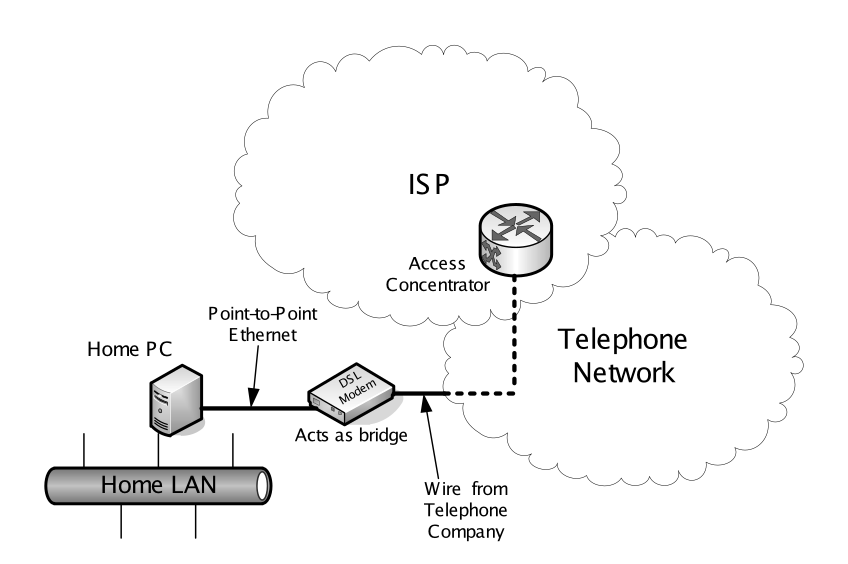

Figure 6-28 · PDF p. 325 · DSL access에서 home system, DSL modem, ISP access concentrator가 PPPoE로 연결되는 구조

PPPoE는 크게 두 단계로 나뉜다. 먼저 `Discovery phase`에서 client가 사용할 access concentrator와 service를 찾고 session identifier를 얻는다. 그 다음 `PPP Session phase`에서 일반 PPP frame이 Ethernet frame 안에 실려 흐르며, PPP LCP, authentication, IPCP 같은 PPP 절차가 진행된다.

| PPPoE 단계 | 메시지 | 방향 | 의미 |
|---|---|---|---|
| Discovery | `PADI (PPPoE Active Discovery Initiation)` | client -> broadcast | 주변 PPPoE server/access concentrator를 찾는 시작 메시지 |
| Discovery | `PADO (PPPoE Active Discovery Offer)` | server -> client | server가 제공 가능한 service와 자신을 알림 |
| Discovery | `PADR (PPPoE Active Discovery Request)` | client -> selected server | 여러 offer 중 하나를 선택해 session 생성을 요청 |
| Discovery | `PADS (PPPoE Active Discovery Session-confirmation)` | server -> client | session을 승인하고 `Session ID`를 부여 |
| Termination | `PADT (PPPoE Active Discovery Terminate)` | either side | PPPoE session 종료 |
| Session | PPP data | both directions | PPP LCP, authentication, IPCP, network-layer data 전송 |

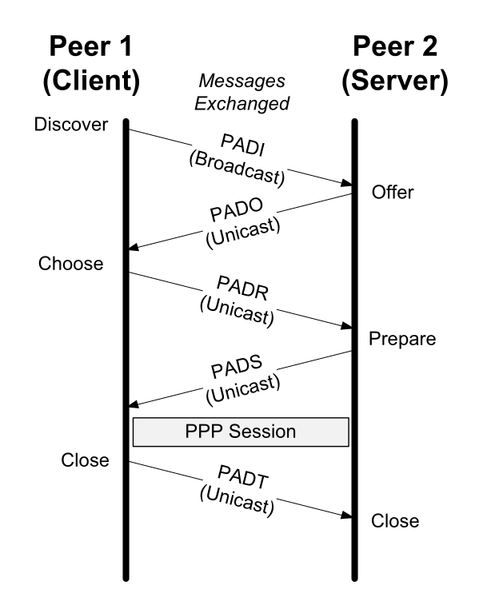

Figure 6-29 · PDF p. 326 · PADI/PADO/PADR/PADS 이후 PPP Session으로 넘어가는 PPPoE 절차

PPPoE message는 Ethernet frame의 payload로 들어간다. Discovery 단계의 Ethernet Type은 `0x8863`, PPP Session 단계의 Ethernet Type은 `0x8864`이다. PPPoE header에는 version/type, message code, session identifier, payload length가 들어간다. 현재 PPPoE에서 `Ver`와 `Type`은 모두 `0x1`이다.

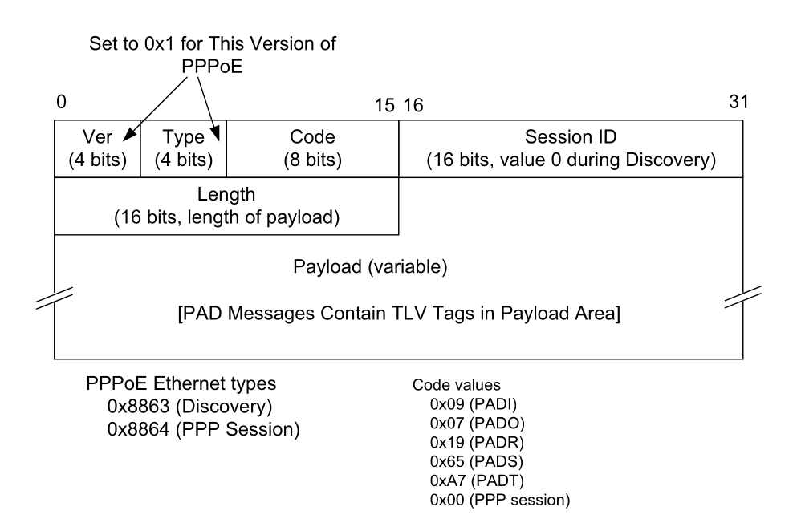

Figure 6-30 · PDF p. 327 · PPPoE message format과 Discovery tag의 TLV 구조

PPPoE Discovery에서 `Session ID`는 아직 session이 확정되지 않은 PADI/PADO/PADR 동안 `0x0000`이다. PADS가 오면 server가 16-bit `Session ID`를 정하고, 이후 같은 Ethernet endpoints 사이의 PPP Session traffic은 이 identifier로 구분된다. 여러 subscriber나 여러 service가 같은 access concentrator를 지나갈 수 있으므로, MAC address만으로는 부족하고 session identifier가 필요하다.

Discovery payload는 `tag`의 나열이며, 각 tag는 `TAG_TYPE`, `TAG_LENGTH`, value로 구성되는 `TLV (Type-Length-Value)` 구조다. 중요한 tag는 다음과 같다.

| PPPoE tag | 역할 |
|---|---|
| `Service-Name` | client가 원하는 service 이름, 또는 server가 제공하는 service를 표현 |
| `AC-Name` | access concentrator의 이름 |
| `Host-Uniq` | client가 자신의 discovery exchange를 식별하기 위해 넣는 값 |
| `AC-Cookie` | server가 client에게 되돌려 보내게 해 DoS성 request를 줄이는 데 도움 |
| `Relay-Session-ID` | 중간 relay가 subscriber/session 식별 정보를 싣는 데 사용 |
| `Service-Name-Error`, `AC-System-Error`, `Generic-Error` | discovery 실패 원인 전달 |

원문의 packet trace에서는 client가 PADI를 broadcast로 보내고, 이후 PADO/PADR/PADS는 unicast로 오간다. PADI에는 `Host-Uniq` tag가 들어가고, PADO에는 `AC-Name`이 들어간다. PADS에서 session identifier가 예컨대 `0xecbd`처럼 결정되면, 그 다음부터는 PPP session traffic이 시작된다.

PPP Session phase에서는 먼저 `LCP (Link Control Protocol)`가 link parameter를 협상한다. 이어서 authentication이 올 수 있는데, 예시에서는 `PAP (Password Authentication Protocol)`가 사용된다. PAP는 username/password를 상대적으로 단순하게 전달하므로 안전한 인증 방식으로 보기 어렵다. 인증 후에는 `IPCP (IP Control Protocol)` 같은 NCP가 IPv4 address 등 network-layer parameter를 협상한다. 여기서 받은 IPv4 address로 host가 provider network에 붙을 수 있지만, DNS server address 같은 정보는 PPP 협상에서 충분히 제공되지 않으면 별도 configuration이나 다른 메커니즘이 필요할 수 있다.

DHCP와 비교하면 PPPoE는 "주소만 받는" 절차가 아니라 subscriber session 자체를 만든다. DHCP는 LAN에서 host configuration을 자동화하는 protocol이고, PPPoE는 Ethernet access network에서 point-to-point subscriber session을 만들고 그 위에 PPP configuration/authentication을 얹는다. 그래서 PPPoE를 사용하는 home router는 WAN 쪽에서는 PPPoE client, LAN 쪽에서는 DHCP server와 NAT gateway가 되는 경우가 자연스럽다.

### 6.6 Attacks Involving System Configuration

system configuration protocol은 host가 network에 붙는 첫 관문이므로 공격 표면이 넓다. 특히 오래된 IPv4 address configuration protocol은 "같은 link에 붙은 장비는 어느 정도 trusted"라는 가정에서 설계된 부분이 많고, 새로 추가된 security mechanism은 실제 deployment가 제한적이다. 따라서 일반적인 DHCP deployment만으로는 많은 공격이 직접 방어되지 않는다.

| 공격/위험 | 핵심 원리 | 결과 | 완화 방향 |
|---|---|---|---|
| unauthorized client | 허가되지 않은 장비가 link에 접속해 DHCP/SLAAC로 configuration을 받음 | 내부 network 접근, 주소 자원 사용 | link-layer authentication, WPA2/802.1X, port security |
| rogue DHCP server | 공격자가 DHCP server처럼 응답 | 잘못된 IP, default router, DNS server를 배포해 MITM/DoS 유발 | DHCP snooping, trusted port, server authentication |
| address exhaustion / DHCP starvation | 가능한 많은 lease를 요청해 address pool 고갈 | 정상 client가 address를 받지 못함 | DHCP snooping, rate limiting, client validation |
| bogus router/DNS configuration | 잘못된 router 또는 DNS 정보를 배포 | traffic hijacking, name resolution 조작 | RA guard, SEND, authenticated configuration |
| SLAAC/Neighbor Discovery abuse | IPv6 ND/RA/DAD 신뢰 모델을 악용 | 잘못된 prefix/router 학습, DAD 방해 | Secure Neighbor Discovery(SEND), RA filtering |

link-layer authentication은 무단 client가 network에 들어오는 수를 줄여 주지만, 이미 접속한 장비가 configuration protocol을 악용하는 문제를 완전히 없애지는 않는다. DHCP authentication과 SEND 같은 protocol-level 보안 장치가 있지만, 원문 기준으로도 일반 운영망에서 흔히 켜져 있다고 보기 어렵다.

IPv6 SLAAC의 보안과 직접 연결되는 작업으로 `Secure Neighbor Discovery (SEND)`가 있다. SEND는 Neighbor Discovery packet에 보안성을 부여하기 위해 IPsec 관련 메커니즘과 `Cryptographically Generated Addresses (CGA)`를 결합한다. CGA는 key material을 가진 host만 생성할 수 있는 hash 기반 address라서, address와 소유 주체의 관계를 암호학적으로 묶는 데 목적이 있다. 이 내용은 later chapter의 IPsec, IPv6 Neighbor Discovery 보안과 연결된다.

### 6.7 Summary

Internet protocol 기반 network에서 host/router가 동작하려면 address, next-hop router, DNS server 같은 기본 configuration이 필요하다. router는 보통 address와 routing 관련 정보가 핵심이고, host는 자기 address, default router, DNS server가 특히 중요하다.

DHCP는 IPv4와 IPv6 모두에 존재하지만 DHCPv4와 DHCPv6는 직접 상호운용되는 하나의 protocol이 아니다. DHCP server는 address를 lease 형태로 client에게 주고, client는 계속 필요하면 renewal을 수행한다. DHCP는 address 외에도 subnet mask, default router, vendor-specific information, DNS server, home agent, default domain name 같은 정보를 option으로 전달할 수 있다.

client와 server가 같은 network에 없으면 `DHCP relay agent`가 broadcast/local-scope 제약을 넘어 message를 전달한다. relay 환경에서는 `Relay Agent Information Option (RAIO)`, Remote-ID, Server Identifier Override, leasequery, bulk leasequery, LDRA 같은 extension이 access network 운영과 subscriber 식별에 중요해진다.

DHCPv6는 stateful mode와 stateless mode를 모두 가진다. stateful DHCPv6는 address lease를 관리하고, stateless DHCPv6는 address는 SLAAC 등으로 얻었다고 보고 DNS server 같은 부가 configuration만 제공한다. DHCPv6는 router에게 prefix를 빌려주는 `DHCPv6 Prefix Delegation (DHCPv6-PD)`도 지원하며, `6rd`처럼 IPv4 infrastructure 위에서 IPv6 deployment를 빠르게 하는 방식과도 연결된다.

IPv6 host는 보통 여러 address를 가진다. link-local address는 `fe80::/10` prefix와 interface identifier를 결합해 만들고, global address는 Router Advertisement의 prefix 또는 DHCPv6 server에서 얻는다. SLAAC로 만든 address도 `tentative -> preferred -> deprecated -> invalid` lifecycle을 가지며, 사용 전 `Duplicate Address Detection (DAD)`로 충돌 여부를 검사한다.

PPPoE는 Ethernet 위에 PPP를 실어 ISP와 subscriber 사이의 session을 만든다. 특히 DSL access에서 modem이 bridge/switch처럼 동작할 때 사용되며, Discovery message(PADI/PADO/PADR/PADS)로 access concentrator와 session을 정한 뒤 PPP Session phase에서 LCP, authentication, IPCP 등이 이어진다.

configuration protocol은 편의성을 위해 신뢰를 많이 전제한 부분이 있어 rogue DHCP server, unauthorized client, resource exhaustion, bogus RA/DNS 같은 공격에 취약할 수 있다. DHCP authentication, DHCP snooping, SEND 같은 완화책이 있지만, 운영 환경에서는 link-layer access control과 switch/router policy를 함께 고려해야 한다.

### 6.8 References

이 장의 표준 축은 다음처럼 묶어 기억하면 된다.

| 주제 | 대표 reference | 연결되는 내용 |
|---|---|---|
| BOOTP/DHCPv4 | RFC 0951, RFC 1542, RFC 2131, RFC 2132 | BOOTP, DHCPv4 message format, options |
| DHCP relay/security | RFC 3046, RFC 3118, RFC 4030, RFC 4388, RFC 5107, RFC 6148 | RAIO, DHCP authentication, leasequery, server identifier override |
| DHCPv6 | RFC 3315, RFC 3633, RFC 3646, RFC 3736, RFC 5007, RFC 5460 | DHCPv6, prefix delegation, DNS option, stateless DHCPv6, leasequery |
| SLAAC/IPv6 addressing | RFC 4291, RFC 4862, RFC 4941, RFC 6106 | IPv6 addressing architecture, SLAAC, privacy extension, RA DNS option |
| Link-local/autoconf | RFC 3927, RFC 4436, RFC 6059 | IPv4 link-local, detecting network attachment |
| PPPoE | RFC 2516 | PPP over Ethernet encapsulation and discovery |
| SEND/CGA | RFC 3756, RFC 3971, RFC 3972 | Neighbor Discovery threat model, Secure Neighbor Discovery, Cryptographically Generated Addresses |
| location/mobility options | RFC 5222, RFC 5223, RFC 5678, RFC 6153, RFC 6225 | LoST, LCI, MoS, ANDSF discovery |

## 연결 관계

이 장은 Chapter 3 Link Layer, Chapter 4 ARP, Chapter 5 Internet Protocol을 실제 host bootstrapping 관점에서 이어 준다. link가 올라오면 host는 주소와 router, DNS를 알아야 IP packet을 만들 수 있고, 그 정보가 DHCP, DHCPv6, SLAAC, PPPoE를 통해 채워진다.

DHCPv4는 IPv4 address와 local routing/DNS 정보를 구성하고, ARP는 이후 같은 link의 next-hop MAC address를 찾는다. DHCPv6/SLAAC는 IPv6 address 구성과 ICMPv6 Router Advertisement/Neighbor Discovery에 기대며, 이후 IPv6 Neighbor Discovery가 ARP 역할까지 일부 대체한다.

DHCP relay와 PPPoE는 access network 운영과 연결된다. relay는 broadcast domain 밖의 중앙 DHCP server를 쓰게 해 주고, PPPoE는 access concentrator와 subscriber session을 만들어 인증과 accounting을 가능하게 한다. 둘 다 "집/host 쪽 edge"와 "provider/control plane" 사이의 경계를 드러낸다.

보안 관점에서는 Chapter 18의 IPsec, link-layer authentication, switch feature인 DHCP snooping, IPv6 SEND/RA guard 같은 기능과 이어진다. configuration 단계가 공격당하면 이후 transport/application layer가 정상이어도 잘못된 router/DNS를 따라가므로, bootstrapping trust가 전체 보안의 밑바닥이 된다.

## 오해하기 쉬운 내용

| 헷갈리는 지점 | 정확한 이해 |
|---|---|
| DHCP는 단순히 IP address만 주는 protocol이다 | address뿐 아니라 subnet mask, router, DNS, domain name, vendor option 등 host configuration을 option으로 제공한다 |
| DHCPv4와 DHCPv6는 같은 protocol의 주소 길이만 다른 버전이다 | message format, port, option 구조, multicast 사용, IA/DUID 개념이 다르며 직접 상호운용되지 않는다 |
| lease가 끝날 때까지 client는 아무것도 하지 않는다 | client는 T1/T2 시점에 renewal/rebinding을 시도해 address 사용을 계속 유지한다 |
| SLAAC는 DHCPv6가 필요 없다는 뜻이다 | address는 SLAAC로 만들고 DNS 등은 stateless DHCPv6나 RA option으로 받을 수 있다 |
| link-local address가 있으면 Internet access가 된다 | link-local은 local link 범위 통신용이며, global routing에는 global address와 default router가 필요하다 |
| DAD는 모든 주소 충돌을 완벽히 막는다 | 같은 link에서 tentative address 충돌을 탐지하는 절차이며, 공격자나 filtering 문제까지 완전히 해결하지는 않는다 |
| PPPoE는 DHCP의 다른 이름이다 | PPPoE는 PPP session을 Ethernet 위에 만들고, DHCP는 host configuration lease/options를 제공한다 |
| DHCP snooping은 DHCP 자체의 표준 인증이다 | switch가 untrusted port의 DHCP server 응답을 막고 binding table을 만드는 enforcement 기능이다 |

## 면접 질문

1. DHCPv4에서 `DHCPDISCOVER -> DHCPOFFER -> DHCPREQUEST -> DHCPACK` 흐름이 필요한 이유를 client/server 관점에서 설명하라.
2. DHCP lease의 `T1`, `T2`, expiration이 각각 무엇이며, RENEWING과 REBINDING state가 왜 구분되는가?
3. BOOTP와 DHCP의 관계를 message format, option, lease 개념 중심으로 비교하라.
4. DHCP relay agent가 필요한 이유와 `giaddr`, RAIO, Remote-ID가 운영망에서 어떤 의미를 가지는지 설명하라.
5. DHCPv6에서 `Identity Association (IA)`, `IA_NA`, `IA_TA`, `DUID`가 필요한 이유를 설명하라.
6. stateful DHCPv6와 stateless DHCPv6, SLAAC의 차이를 주소 할당 주체와 server state 관점에서 비교하라.
7. IPv6 address lifecycle에서 tentative, preferred, deprecated, invalid 상태가 의미하는 바를 설명하라.
8. IPv6 `Duplicate Address Detection (DAD)`가 Neighbor Solicitation/Advertisement를 어떻게 사용하는지 설명하라.
9. IPv4 link-local/APIPA `169.254/16`과 IPv6 link-local `fe80::/10`의 공통점과 차이를 설명하라.
10. DHCP와 DNS가 함께 동작할 때 combined DHCP/DNS server와 dynamic DNS update 방식은 어떻게 다른가?
11. PPPoE Discovery phase의 `PADI`, `PADO`, `PADR`, `PADS`, `PADT`를 순서와 목적 중심으로 설명하라.
12. rogue DHCP server와 DHCP starvation 공격이 어떤 피해를 만들며, DHCP snooping이 어떻게 완화하는가?
13. SEND와 CGA가 IPv6 Neighbor Discovery/SLAAC 보안에 어떤 아이디어를 제공하는지 설명하라.
