# Chapter 11. Name Resolution and DNS

- 과목: Computer Network
- 기준 교재: TCP/IP Illustrated, Volume 1
- 관련 페이지: PDF pp. 550-617
- 우선순위: 필수

## 개요

TCP/IP protocol은 실제 통신에서 IP address를 사용하지만, 사람과 application은 보통 host name이나 service name을 사용한다. `name resolution`은 사람이 쓰는 이름을 IPv4/IPv6 address 등 protocol이 사용할 수 있는 정보로 바꾸는 과정이다. Internet에서 가장 중요한 name resolution system이 `DNS (Domain Name System)`이다.

DNS는 단순한 "이름→주소 표"가 아니라, 계층형 이름 공간과 분산 client/server database, caching, delegation, zone transfer, dynamic update, service discovery, 보안 이슈가 얽힌 Internet 핵심 infrastructure다. Application은 보통 resolver library를 통해 DNS에 접근하고, TCP/IP stack 자체는 DNS를 알지 못한 채 IP address만 사용한다.

## 핵심 개념

- DNS(Domain Name System): host name과 IP address, mail routing, service naming 등을 제공하는 분산 계층형 database와 protocol이다.
- resolver: application이 DNS lookup을 요청할 때 사용하는 local library/component다.
- DNS name space: root에서 시작해 TLD, subdomain, host label로 내려가는 계층형 이름 공간이다.
- FQDN(Fully Qualified Domain Name): root까지 완전히 지정된 domain name이며 formal하게는 trailing dot을 붙일 수 있다.
- label: domain name을 구성하는 period-separated component다.
- zone: DNS 관리와 delegation의 기본 단위인 name-space subtree다.
- authoritative server: 특정 zone의 원본 또는 권위 있는 data를 제공하는 DNS server다.
- TTL(Time To Live): DNS record가 cache에 머물 수 있는 최대 시간이다.
- negative caching: 존재하지 않는 이름에 대한 실패 결과도 TTL 동안 caching하는 동작이다.

## 세부 정리

### 11.1 Introduction

지금까지의 TCP/IP protocol들은 host를 IP address로 식별했다. 하지만 IPv4 address도 사람이 기억하기 어렵고, IPv6 address는 더 어렵다. DNS는 application이 `www.example.com` 같은 이름을 사용하게 해 주고, 실제 TCP connection이나 UDP datagram 전송 전에 resolver가 이를 IPv4/IPv6 address로 변환하게 한다.

DNS는 다음 역할을 함께 수행한다.

| 역할 | 설명 |
| --- | --- |
| name-to-address mapping | host name을 A/AAAA record 같은 IP address로 변환 |
| reverse mapping | IP address에서 name을 찾는 PTR lookup |
| mail routing | MX record로 mail exchanger 위치 제공 |
| service naming | SRV, NAPTR, URI 등으로 service endpoint discovery 지원 |
| server-to-server data exchange | zone transfer, DNS NOTIFY, dynamic update 등 |

DNS는 distributed database다. Internet 전체의 모든 name information을 한 곳이 알지 않는다. 각 조직, campus, department, service provider가 자기 영역의 DNS database를 유지하고 server를 운영하며, 다른 client/server가 query할 수 있게 한다. 이 구조가 DNS scalability의 핵심이다.

Application은 resolver를 통해 DNS를 사용한다. Resolver는 보통 OS library 또는 local service 형태이고, application이 host name을 주면 DNS query를 만들고 server와 통신한다. TCP와 IP implementation은 DNS를 직접 알지 못한다. TCP는 IP address와 port를 받아 connection을 열고, UDP도 IP address와 port로 datagram을 보낼 뿐이다.

### 11.2 The DNS Name Space

`DNS name space`는 DNS에서 쓰는 모든 이름의 집합이다. 이 공간은 case-insensitive이고, file system directory처럼 tree hierarchy를 이룬다. 최상단에는 이름 없는 root가 있고, 그 아래에 `TLD (Top-Level Domain)`가 있다. TLD에는 `gTLD`, `ccTLD`, `IDN ccTLD`, infrastructure TLD인 `ARPA` 등이 포함된다.

<p align="center">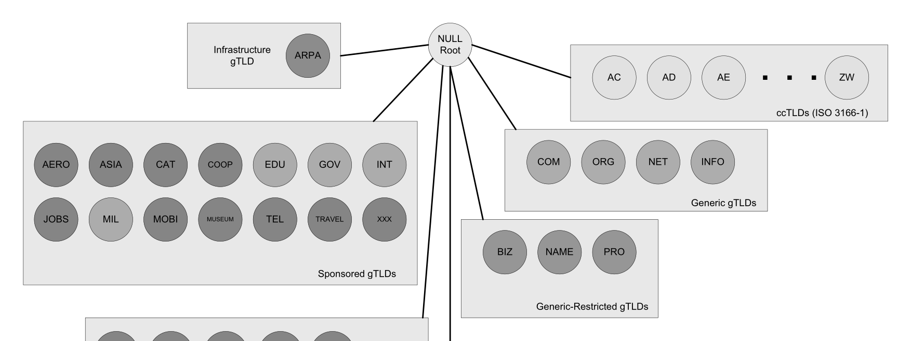</p>
<p align="center"><sub>Figure 11-1 · PDF p. 552 · DNS name space는 unnamed root 아래 TLD, ccTLD, IDN ccTLD, ARPA가 놓이는 계층형 tree다</sub></p>

Figure 11-1은 DNS가 flat namespace가 아니라 root에서 아래로 내려가는 tree임을 보여 준다. 이 구조 덕분에 `.edu`, `.com`, `.kr`, `.arpa` 같은 상위 domain과 그 아래 subdomain을 서로 다른 관리 주체가 나누어 운영할 수 있다.

`gTLD (generic TLD)`에는 `.com`, `.org`, `.net`, `.info` 같은 generic domain과 `.edu`, `.gov`, `.mil`, `.int`처럼 용도/자격이 제한된 domain이 있다. `ccTLD (country-code TLD)`는 ISO 3166의 두 글자 country code 기반이며, 일부 ccTLD는 원래 국가 코드지만 commercial name으로 활용되기도 한다. 이런 관습적/상업적 활용을 `domain hack`이라고 부르기도 한다.

IDN(Internationalized Domain Name)은 non-ASCII script를 domain name에 사용하려는 요구에서 나온다. Unicode, 시각적으로 비슷한 문자, right-to-left/left-to-right text direction, 국제 정책 문제가 얽혀 있어 단순히 "한글/중국어/아랍어도 쓰자"보다 훨씬 복잡하다. 최종 정리에서는 IDN 세부 표준보다 DNS name space가 국제화 요구를 수용하려 했다는 정도를 기억하면 충분하다.

### 11.2.1 DNS Naming Syntax

TLD 아래의 이름은 다시 `subdomain`으로 나뉜다. 예를 들어 영국 교육기관은 `.ac.uk`, 회사는 `.co.uk` 같은 suffix를 많이 쓰고, 미국 지방정부 web site는 `ci.city.state.us` 같은 구조를 사용할 수 있다.

`FQDN (Fully Qualified Domain Name)`은 root까지 완전히 지정된 이름이다. Formal하게는 `mit.edu.`처럼 trailing period를 붙여 "이 이름은 complete name이며 resolver가 search suffix를 붙이면 안 된다"는 뜻을 표시한다. 반대로 unqualified name은 system configuration의 default domain 또는 search list와 결합된다. 예를 들어 default domain이 `cs.berkeley.edu`인 host에서 사용자가 `vangogh`를 입력하면 resolver는 `vangogh.cs.berkeley.edu.` 같은 FQDN으로 바꿔 lookup할 수 있다.

Domain name은 period로 구분된 label sequence다. 계층은 오른쪽에서 왼쪽으로 내려간다. 예를 들어 `www.net.in.tum.de.`는 root 아래 `de`, 그 아래 `tum`, 그 아래 `in`, 그 아래 `net`, 마지막 host label `www`를 나타낸다.

DNS name syntax의 핵심 제한은 다음과 같다.

| 항목 | 규칙 |
| --- | --- |
| case sensitivity | matching은 case-insensitive. `ACME.COM`과 `acme.com`은 같음 |
| label length | 각 label은 최대 63 characters |
| FQDN length | 전체 FQDN은 최대 255 one-byte characters |
| hierarchy delimiter | period `.` |
| formal root indication | trailing period |

DNS의 계층 구조는 administrative scalability를 만든다. `elevator.cs.berkeley.edu`라는 이름을 추가하려면 보통 `cs.berkeley.edu` zone 관리자만 관여하면 된다. `berkeley.edu`나 `.edu` 전체를 관리하는 주체가 모든 host 이름 변경에 관여할 필요가 없다. 초기 Internet의 flat naming scheme은 단일 주체가 이름 충돌 없이 목록을 관리하고 배포해야 했기 때문에 scale이 커지면서 현실적으로 어려워졌다.

### 11.3 Name Servers and Zones

DNS name space의 일부를 관리하는 책임은 개인 또는 조직에 delegation된다. DNS server 관점에서 administrative delegation의 단위는 `zone`이다. Zone은 DNS name space의 subtree이며, 다른 zone과 독립적으로 관리될 수 있다. 모든 domain name은 어떤 zone 안에 존재하고, root의 TLD도 root zone 안에 있다.

Zone administrator는 zone 안에 record를 추가하고, subordinate zone을 delegate하며, 해당 zone의 name server를 관리한다. 하나의 DNS server는 여러 zone의 정보를 가질 수 있고, hierarchy의 period 위치마다 다른 zone/server로 delegation될 수 있다. 예를 들어 `berkeley.edu` zone 안에는 `www.berkeley.edu` 같은 host도 있고, `cs.berkeley.edu` 같은 delegated subdomain도 있을 수 있다.

Zone data는 redundancy를 위해 적어도 두 server에 있어야 한다. 전형적으로 primary server가 disk file에 zone database를 가지고, secondary server가 `zone transfer`를 통해 그 database copy를 얻는다. DNS에는 zone transfer protocol이 있지만, 운영상 다른 파일 동기화 수단을 쓰는 경우도 있다. 중요한 개념은 authoritative data가 single point of failure가 되지 않도록 여러 server에 복제된다는 점이다.

### 11.4 Caching

Name server가 가진 information은 세 출처에서 온다.

| 출처 | 의미 |
| --- | --- |
| zone database | 해당 zone에 대한 authoritative data |
| zone transfer | secondary/slave server가 primary로부터 받은 authoritative copy |
| resolution 과정 | 다른 server에 query하면서 배운 cached data |

`authoritative server`는 특정 zone의 원본 또는 권위 있는 data를 가진 server다. 반면 대부분의 name server는 query를 처리하면서 알게 된 record를 `TTL (Time To Live)` 동안 cache한다. Cache는 Internet 전체의 DNS traffic을 크게 줄이고, 반복 lookup latency도 줄인다.

각 DNS record에는 자기 TTL이 있다. TTL은 zone administrator가 설정하며, 그 record가 다른 DNS cache에 얼마나 오래 남을 수 있는지 결정한다. Zone data를 바꿔야 할 때 administrator가 먼저 TTL을 낮춘 뒤 변경을 적용하는 이유가 여기에 있다. TTL이 낮으면 stale cached data가 남아 있는 window가 짧아진다.

DNS는 성공한 lookup뿐 아니라 실패한 lookup도 cache한다. 이를 `negative caching`이라고 한다. 존재하지 않는 이름을 반복 요청하는 잘못된 application이 있으면, 매번 authoritative server까지 query하지 않고 failure result를 일정 시간 cache해 traffic을 줄인다. RFC2308은 negative caching을 optional에서 mandatory로 바꾸었다.

Cache 위치는 system마다 다르다. 전통적 UNIX 환경에서는 nearby name server가 LAN host들을 위해 cache를 유지하는 경우가 많았다. Windows와 최근 Linux에서는 client local cache도 사용할 수 있다. Linux의 `Name Service Caching Daemon (NSCD)`는 `/etc/nscd.conf` 설정에 따라 DNS 등 resolution 결과를 cache할 수 있고, `/etc/nsswitch.conf`는 local files, DNS protocol, NSCD 중 어떤 mechanism을 어떤 순서로 사용할지 제어한다.

### 11.5 The DNS Protocol

DNS protocol은 크게 두 계열이다. 첫째는 일반적인 name lookup에 쓰이는 `query/response protocol`이고, 둘째는 name server끼리 zone database record를 교환하는 protocol이다. 여기에 secondary server에게 zone이 바뀌었음을 알리는 `DNS Notify`, zone data를 직접 고치는 `dynamic updates`가 붙는다. 가장 흔한 사용은 domain name에 대응하는 IPv4 address를 찾는 것이며, IPv6 address mapping도 같은 구조로 동작한다.

완전한 resolution은 local site/ISP의 DNS server, root server, gTLD server, authoritative name server를 차례로 거칠 수 있다. root server와 gTLD server는 이름 공간의 상위 갈림길을 제공하고, 실제 domain의 address 정보는 해당 domain의 authoritative server에서 얻는다. root나 TLD server 중 일부는 여러 물리 server가 같은 IP address를 공유하는 `IP anycast addressing`으로 운영되어, 논리적으로는 하나의 server처럼 보이지만 실제 요청은 가까운 instance로 갈 수 있다.

<p align="center">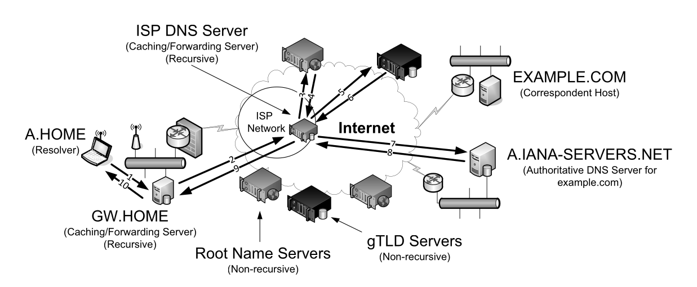</p>
<p align="center"><sub>Figure 11-2 · PDF p. 558 · A.HOME에서 EXAMPLE.COM 주소를 얻기 위한 recursive DNS query 흐름</sub></p>

Figure 11-2의 흐름은 cache가 없을 때의 전형적인 `recursive DNS query`다.

| 단계 | 의미 |
|---|---|
| 1 | `A.HOME`의 resolver가 local recursive server `GW.HOME`에 `EXAMPLE.COM` address를 질의한다. |
| 2 | `GW.HOME`도 모르면 ISP-provided DNS server로 recursion을 넘긴다. |
| 3-4 | ISP server가 root name server에 묻고, root는 직접 최종 답을 주지 않고 COM TLD server 정보를 반환한다. |
| 5-6 | ISP server가 gTLD server에 묻고, `EXAMPLE.COM` domain의 authoritative server 이름과 address를 얻는다. |
| 7-8 | authoritative server가 requested IP address를 반환한다. |
| 9-10 | ISP server와 GW.HOME이 각각 자신에게 질의한 쪽으로 답을 되돌려준다. |

사용자 입장에서 `A.HOME`은 local name server가 답을 준 것처럼 보지만, 실제로는 `GW.HOME`과 ISP server가 추가 DNS request를 수행해 query를 완성한다. 이때 recursive server들은 중간에서 얻은 name server 정보와 final answer를 cache하여 이후 query를 줄인다. 반대로 root server와 TLD server는 보통 recursive query를 수행하지 않는다. 이들이 모든 client의 recursion을 대신하면 전 세계 Internet performance에 큰 부담이 되므로, root/TLD는 referral 중심의 `iterative query`를 강제하는 쪽에 가깝다.

주의할 점은 default domain search list다. 예를 들어 host가 `.HOME` search domain을 갖고 있으면 사용자가 `EXAMPLE.COM`을 입력했더라도 처음에는 `EXAMPLE.COM.HOME`을 질의할 수 있고, 이 질의가 local authoritative server에서 실패한 뒤 `EXAMPLE.COM` 질의가 이어질 수 있다.

### 11.5.1 DNS Message Format

DNS는 query, response, zone transfer, notification, dynamic update에 하나의 기본 message format을 사용한다. 메시지는 고정 길이 `12-byte header`와 네 개의 variable-length section으로 구성된다. 일반 DNS에서는 section 이름이 `Question`, `Answer`, `Authority`, `Additional Information`이고, `DNS UPDATE`에서는 같은 count field가 `Zone`, `Prerequisite`, `Update`, `Additional Information`의 count로 해석된다.

<p align="center">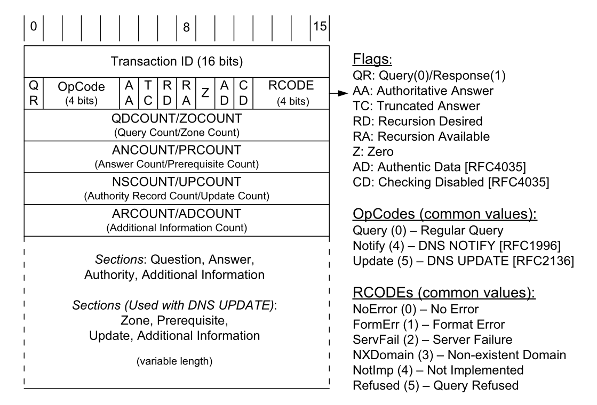</p>
<p align="center"><sub>Figure 11-3 · PDF p. 560 · DNS fixed 12-byte header와 flags/count fields</sub></p>

Header의 핵심 field는 다음과 같다.

| Field | 크기 | 역할 |
|---|---:|---|
| `Transaction ID` | 16 bits | client가 설정하고 server가 그대로 돌려준다. client는 이를 보고 response를 request와 match한다. |
| `QR` | 1 bit | `0`은 query, `1`은 response. |
| `OpCode` | 4 bits | 일반 query는 `0`; `Notify`는 `4`; `Update`는 `5`. |
| `AA` | 1 bit | `Authoritative Answer`. cache에서 나온 답이 아니라 authoritative data임을 나타낸다. |
| `TC` | 1 bit | `Truncated`. UDP response가 512 bytes 제한 등으로 잘렸음을 의미한다. |
| `RD` | 1 bit | `Recursion Desired`. client가 server에게 recursive query 수행을 요청한다. |
| `RA` | 1 bit | `Recursion Available`. server가 recursion을 지원한다는 response 표시. |
| `Z` | 1 bit | reserved이며 현재 0이어야 한다. |
| `AD` | 1 bit | `Authenticated Data`. DNSSEC 검증 관련 bit이다. |
| `CD` | 1 bit | `Checking Disabled`. DNSSEC checking 비활성화 관련 bit이다. |
| `RCODE` | 4 bits | response code. `NoError`, `NXDOMAIN`, `ServFail` 같은 결과를 담는다. |
| `QDCOUNT` | 16 bits | Question count. DNS UPDATE에서는 `ZOCOUNT`. |
| `ANCOUNT` | 16 bits | Answer count. DNS UPDATE에서는 `PRCOUNT`. |
| `NSCOUNT` | 16 bits | Authority record count. DNS UPDATE에서는 `UPCOUNT`. |
| `ARCOUNT` | 16 bits | Additional information count. DNS UPDATE에서는 `ADCOUNT`. |

`RD`가 설정된 query를 받은 recursive server는 필요한 경우 다른 DNS server들을 대신 방문해 최종 답을 얻는다. `RD`가 없거나 server가 authoritative answer를 갖고 있지 않으면, server는 answer 대신 다음에 물어볼 name server list를 반환할 수 있다. client가 이 referral을 따라 계속 묻는 방식이 `iterative query`다. root server는 대체로 `RA`를 제공하지 않으므로, recursion을 전역 상위 server에 떠넘기지 못하게 한다.

`RCODE`의 흔한 값은 다음과 같다.

| Value | Name | 의미 |
|---:|---|---|
| 0 | `NoError` | error 없음 |
| 1 | `FormErr` | format error, query 해석 불가 |
| 2 | `ServFail` | server-side processing failure |
| 3 | `NXDomain` | nonexistent domain, authoritative server가 name이 없음을 확인 |
| 4 | `NotImp` | server가 request를 지원하지 않음 |
| 5 | `Refused` | server가 answer 제공을 거부 |
| 6 | `YXDomain` | update에서 name이 없어야 하는데 존재 |
| 7 | `YXRRSet` | update에서 RRSet이 없어야 하는데 존재 |
| 8 | `NXRRSet` | update에서 RRSet이 있어야 하는데 없음 |
| 9 | `NotAuth` | server가 zone에 대해 authorized되지 않음 |
| 10 | `NotZone` | name이 해당 zone 안에 없음 |

Question section은 name, type, class를 담지만 cache 대상이 아니므로 `TTL`이 없다. Answer, Authority, Additional Information section은 `Resource Record (RR)`를 담고, RR에는 cache 시간을 제어하는 `TTL`이 포함된다. `Resource Record Set (RRSet)`은 같은 name, class, type을 공유하지만 data는 다른 RR들의 집합이다. 예를 들어 한 host name에 여러 IP address가 있으면 같은 RRSet에 여러 address RR이 들어갈 수 있고, 같은 RRSet 안의 TTL은 같아야 한다.

#### 11.5.1.1 Names and Labels

DNS message의 variable-length section에서 각 question과 RR은 자신이 가리키는 domain name, 즉 `owning name` 또는 `record owner's name`으로 시작한다. DNS name은 label들의 sequence이며, label type은 크게 `data labels`와 `compression labels`가 있다. data label은 실제 label 문자를 담고, compression label은 message 안의 다른 label 위치를 가리키는 pointer 역할을 한다.

#### 11.5.1.2 Data Labels

Data label은 먼저 1-byte length를 두고, 그 뒤에 length만큼 label byte를 둔다. 전체 name은 length가 0인 label로 끝나며, 이 0-length label은 nameless root를 뜻한다.

<p align="center">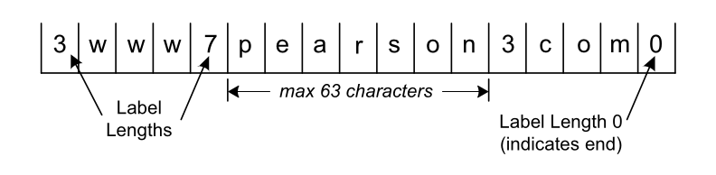</p>
<p align="center"><sub>Figure 11-4 · PDF p. 562 · `www.pearson.com`을 label sequence로 encoding하는 방식</sub></p>

`www.pearson.com`은 wire format에서 `3 www 7 pearson 3 com 0`처럼 표현된다. 각 label length는 0-63 byte 범위여야 하므로 label 자체도 최대 63 bytes다. padding은 없기 때문에 name 전체 길이가 odd byte가 될 수도 있다. label은 binary byte를 담을 수 있지만, interoperable하게 쓰려면 RFC 1035식 제한, 즉 letter로 시작하고 letter 또는 digit으로 끝나며 내부에는 letters, digits, hyphen만 쓰는 규칙을 따르는 편이 안전하다. `Internationalized Domain Names (IDN)`도 실제 DNS wire format에서는 Unicode를 그대로 넣기보다 ASCII 기반 `punycode`를 사용한다.

#### 11.5.1.3 Compression Labels

DNS response는 answer, authority, additional section에서 같은 domain suffix를 반복하는 일이 많다. 이를 매번 data label로 쓰면 512-byte UDP 제한 안에서 낭비가 크므로, DNS는 `compression label`을 제공한다.

<p align="center">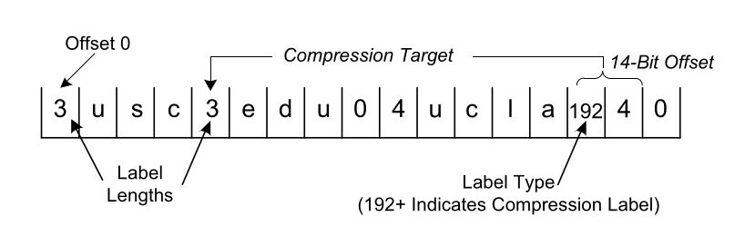</p>
<p align="center"><sub>Figure 11-5 · PDF p. 563 · compression label이 공통 suffix `edu`를 pointer로 재사용하는 예</sub></p>

Compression label은 label length byte 위치에서 상위 2 bits를 `11`로 세운다. 나머지 6 bits와 다음 byte의 8 bits를 합쳐 14-bit offset을 만들고, DNS message 시작점으로부터 그 offset에 있는 data label sequence를 참조한다. 따라서 compression pointer는 message 시작 기준 최대 16,383 bytes 위치까지 가리킬 수 있다. Figure 11-5에서는 `usc.edu`를 먼저 data label로 encoding한 뒤 `ucla.edu`의 `edu` 부분을 offset pointer로 재사용한다. 작은 예에서는 4 bytes 정도만 아끼지만, 긴 suffix가 여러 번 반복되는 real response에서는 message size와 UDP truncation 가능성을 줄이는 데 중요하다.

### 11.5.2 The DNS Extension Format (EDNS0)

기본 DNS format은 UDP 사용 시 DNS payload가 512 bytes로 제한되고, `RCODE`가 4 bits라 error type 표현도 제한적이다. `EDNS0`는 이런 한계를 보완하기 위한 extension mechanism이다. 향후 다른 extension index가 나올 수 있으므로 이름에 0이 붙었고, DNSSEC 지원에 사실상 필요하다.

EDNS0는 request 또는 response의 Additional Data section에 `OPT pseudo-RR` 또는 `OPT meta-RR`을 넣어 사용을 표시한다. 한 DNS message에는 OPT RR이 최대 하나만 들어갈 수 있다. UDP DNS message에 OPT RR이 있으면 512-byte 제한을 넘는 larger UDP payload와 expanded error code를 사용할 수 있다. EDNS0는 data label, compression label 외에 `extended label type`도 정의한다. 이 type은 label Type/Length byte의 상위 2 bits가 `01`인 값, 즉 64-127 범위로 표현된다. 과거 experimental binary label type 65가 있었지만 현재는 권장되지 않는다.

### 11.5.3 UDP or TCP

DNS의 well-known port는 UDP와 TCP 모두 `53`이다. 일반 query/response는 보통 UDP를 사용한다. UDP는 connection setup이 없고 짧은 query에 적합하지만, 기본 DNS response size가 512 bytes로 제한된다.

<p align="center">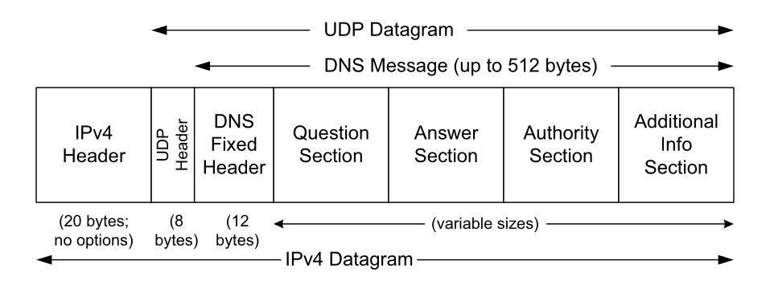</p>
<p align="center"><sub>Figure 11-6 · PDF p. 564 · UDP/IPv4 datagram 안에 들어가는 DNS message 구조</sub></p>

Resolver가 UDP로 query를 보냈는데 response의 `TC` bit가 set되어 있으면, 실제 response가 너무 커서 잘린 것이다. 이때 resolver는 같은 request를 TCP로 다시 보낼 수 있고, 현재 DNS implementation은 TCP 지원이 필수인 방향으로 정리되어 있다. TCP는 큰 DNS message를 여러 segment로 나눌 수 있으므로 zone transfer나 큰 response에 적합하다.

Transport 선택 기준은 다음처럼 이해하면 된다.

| 상황 | 주 사용 transport | 이유 |
|---|---|---|
| 일반 address lookup | UDP/53 | query와 response가 작고 빠르다. |
| UDP response에 `TC` flag set | TCP/53 retry | 512 bytes 초과 또는 EDNS0 한계 초과 response를 온전히 받는다. |
| full zone transfer (`AXFR`) | TCP/53 | zone data가 클 수 있다. |
| incremental zone transfer (`IXFR`) | UDP로 시작 가능, 필요 시 TCP | 변경분이 작으면 UDP로 충분하지만, 크면 TCP로 전환한다. |
| DNSSEC 또는 큰 additional data | EDNS0 UDP 또는 TCP | OPT pseudo-RR로 larger UDP payload를 협상하거나 TCP를 사용한다. |

UDP를 쓸 때는 transport layer가 reliability를 보장하지 않으므로 resolver와 server application이 timeout과 retransmission을 직접 처리해야 한다. 권장 방식은 최소 4초 수준 timeout에서 시작하고, 실패할수록 timeout을 exponential increase하는 것이다. Linux/UNIX 계열에서는 `/etc/resolv.conf`의 `timeout`, `attempts` option으로 resolver retransmission parameter를 조정할 수 있다.

### 11.5.4 Question (Query) and Zone Section Format

Question section은 DNS message가 묻고 있는 question들을 담는다. 보통 question은 하나지만 protocol상 여러 개도 가능하다. Dynamic update에서는 같은 구조가 `Zone section`으로 사용되며 field 이름만 달리 해석된다.

<p align="center">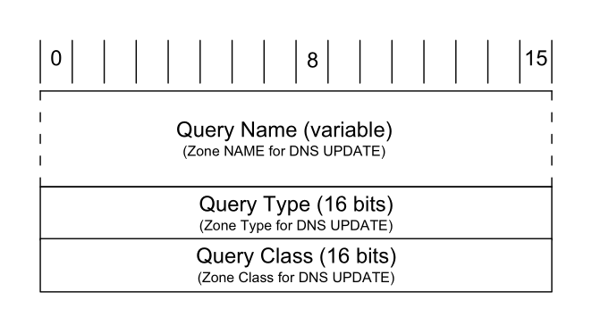</p>
<p align="center"><sub>Figure 11-7 · PDF p. 565 · DNS Question section format: QNAME, QTYPE, QCLASS</sub></p>

Question entry는 `Query Name (QNAME)`, `Query Type (QTYPE)`, `Query Class (QCLASS)`로 구성된다. `QNAME`은 앞에서 설명한 label encoding을 사용한다. `QCLASS`는 TCP/IP 환경에서 보통 Internet class인 `1`이고, 일부 경우 no class `254`, all classes `255`가 쓰인다. `QTYPE`은 원하는 RR type을 지정한다. 가장 흔한 값은 IPv4 address를 요구하는 `A`, IPv6 address를 요구하는 `AAAA`이며, `ANY` query는 같은 class와 name에 match되는 모든 RR type을 요구한다. Question은 cache되는 data가 아니므로 `TTL` field가 없다.

### 11.5.5 Answer, Authority, and Additional Information Section Formats

Answer, Authority, Additional Information section은 `Resource Record (RR)`들의 집합이다. RR owner name은 wildcard domain name을 가질 수 있으며, wildcard는 leftmost label이 `*`인 형태다.

<p align="center">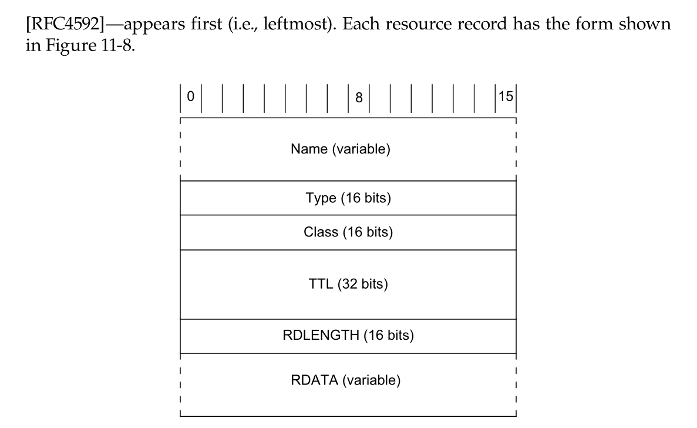</p>
<p align="center"><sub>Figure 11-8 · PDF p. 566 · DNS Resource Record format: NAME, TYPE, CLASS, TTL, RDLENGTH, RDATA</sub></p>

RR format은 `NAME`, `TYPE`, `CLASS`, `TTL`, `RDLENGTH`, `RDATA`로 구성된다.

| Field | 역할 |
|---|---|
| `NAME` | RR이 적용되는 domain name. `owning name`, `owner`, `record owner's name`이라고도 한다. |
| `TYPE` | RR type code. query type과 같은 값 체계를 사용한다. |
| `CLASS` | Internet DNS에서는 보통 `1`. |
| `TTL` | RR을 cache할 수 있는 최대 시간, seconds 단위. |
| `RDLENGTH` | 뒤따르는 `RDATA` byte 수. |
| `RDATA` | type-specific data. 예를 들어 `A` record의 RDATA는 32-bit IPv4 address다. |

이 format 때문에 DNS는 generic container 안에 다양한 RR type을 넣을 수 있다. parser는 header와 section count로 RR들을 순서대로 읽고, 각 RR의 `TYPE`과 `RDLENGTH`를 보고 `RDATA` 해석 방식을 결정한다. 따라서 DNS에서 새 기능을 추가할 때도 전체 message framing을 바꾸기보다 새로운 RR type 또는 OPT pseudo-RR 같은 확장을 추가하는 방식이 자연스럽다.

### 11.5.6 Resource Record Types

DNS가 단순한 name-to-address table이 아니라 distributed database처럼 쓰일 수 있는 이유는 다양한 `Resource Record (RR) type` 때문이다. 한 domain name에는 여러 RR이 동시에 match될 수 있고, RR type에 따라 address lookup, reverse lookup, mail routing, service discovery, zone transfer, protocol extension 같은 기능을 수행한다.

| Value | RR Type | 분류 | 핵심 의미 |
|---:|---|---|---|
| 1 | `A` | data type | 32-bit IPv4 address |
| 2 | `NS` | data type | zone의 authoritative name server 이름 |
| 5 | `CNAME` | data type | alias를 canonical name으로 mapping |
| 6 | `SOA` | data type | zone authority, contact, serial, transfer timer |
| 12 | `PTR` | data type | address-to-name reverse mapping |
| 15 | `MX` | data type | domain의 mail exchanger |
| 16 | `TXT` | data type | arbitrary text, SPF 같은 policy에도 사용 |
| 28 | `AAAA` | data type | 128-bit IPv6 address |
| 33 | `SRV` | data type | generic service의 transport endpoint |
| 35 | `NAPTR` | data type | alternative namespace, rewrite/service discovery |
| 41 | `OPT` | meta type | EDNS0 pseudo-RR |
| 251 | `IXFR` | query type | incremental zone transfer |
| 252 | `AXFR` | query type | full zone transfer, TCP 사용 |
| 255 | `ANY` | query type | matching되는 모든 RR 요청 |

RR type은 크게 `data types`, `query types`, `meta types`로 나눌 수 있다. Data type은 DNS database에 저장되는 정보이고, query type은 question section에서 원하는 data를 지정하는 값이며, meta type은 특정 DNS message 하나에만 붙는 transient information이다. 이 장에서 중요한 meta type은 EDNS0의 `OPT`다.

#### 11.5.6.1 Address (A, AAAA) and Name Server (NS) Records

`A` record는 name에 대응하는 32-bit IPv4 address를 담고, `AAAA` record는 name에 대응하는 128-bit IPv6 address를 담는다. `NS` record는 특정 zone에 대해 authoritative information을 가진 DNS server의 이름을 담는다. Address record는 host/service에 도달하기 위한 최종 data이고, NS record는 name space를 다음 authoritative server로 이어 주는 delegation data다.

NS record만으로는 query를 바로 보낼 수 없다. NS record의 RDATA는 "name server의 이름"이지 "name server의 IP address"가 아니기 때문이다. 그래서 DNS response의 Additional Information section에는 그 name server의 A/AAAA record가 함께 실리는 경우가 많고, 이를 `glue record`라고 한다. 특히 `ns1.example.com`이 `example.com` zone의 authoritative server인 경우처럼 name server 이름 자체가 같은 zone 안에 있으면, glue가 없으면 `ns1.example.com`의 address를 얻기 위해 다시 `example.com` server를 알아야 하는 loop가 생긴다.

`dig +nostats -t ANY rfc-editor.org` 예시는 한 name이 `A`, `AAAA`, `NS` record를 동시에 가질 수 있음을 보여 준다. `rfc-editor.org`는 host로서 IPv4/IPv6 address를 가지면서, 동시에 subdomain으로서 authoritative name server도 가진다. 같은 answer section의 A/AAAA/NS record에는 TTL이 붙고, cache에서 가져온 record라면 TTL은 authoritative source에서 받은 original TTL보다 작거나 같으며 시간이 지나면서 감소한다. 이 TTL decay 때문에 같은 caching server에 반복 질의하면 cached record의 TTL이 줄어드는 모습을 볼 수 있다.

#### 11.5.6.2 Example

본문의 packet example은 `berkeley.edu.`의 A record를 조회하는 단순한 case로 DNS query/response가 실제 UDP/IPv4 packet 안에서 어떻게 움직이는지 보여 준다.

<p align="center">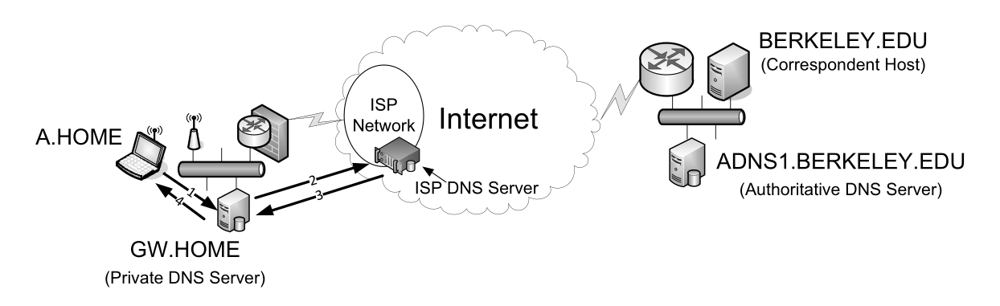</p>
<p align="center"><sub>Figure 11-9 · PDF p. 570 · local DNS server GW.HOME과 ISP DNS server를 거치는 simple query/response topology</sub></p>

Windows client `A.HOME`은 먼저 resolver cache를 flush한 뒤 `nslookup`으로 `berkeley.edu.`의 A record를 질의한다. Local server는 `gw`이고 address는 `10.0.0.1`이다. 결과가 `Non-authoritative answer`로 표시되는 것은 authoritative server가 직접 준 답이 아니라 caching server가 제공한 답이라는 뜻이다.

<p align="center">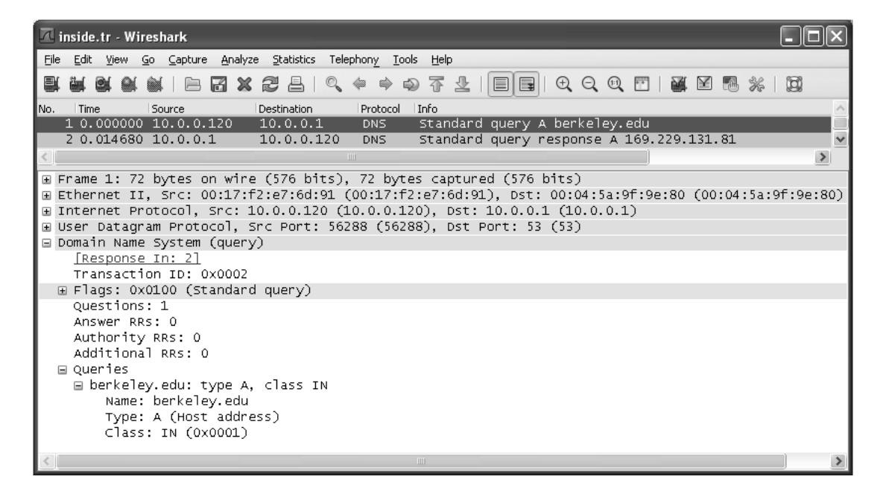</p>
<p align="center"><sub>Figure 11-10 · PDF p. 571 · `berkeley.edu.` IPv4 address를 묻는 UDP/IPv4 DNS standard query</sub></p>

첫 query packet은 client `10.0.0.120`에서 local DNS server `10.0.0.1`로 간다. UDP source port는 ephemeral port `56288`, destination port는 well-known DNS port `53`이다. Ethernet frame 전체는 72 bytes이며, Ethernet header 14 bytes, IPv4 header 20 bytes, UDP header 8 bytes, DNS fixed header 12 bytes, query type 2 bytes, query class 2 bytes, `berkeley`와 `edu` data labels, trailing 0 byte로 구성된다. DNS header의 Transaction ID는 `0x0002`, flag는 기본적으로 `recursion requested`만 설정되고, question 하나만 가진 standard query다.

<p align="center">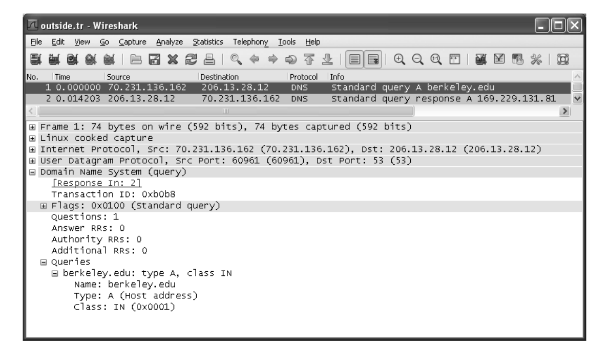</p>
<p align="center"><sub>Figure 11-11 · PDF p. 572 · GW.HOME이 recursion 과정에서 ISP name server로 보낸 DNS request</sub></p>

Local DNS server가 답을 모르기 때문에 upstream ISP DNS server `206.13.28.12`에 새 query를 보낸다. 이때 source IPv4 address는 GW.HOME의 ISP-side address `70.231.136.162`이고, source port와 Transaction ID는 새로 생성된다. 즉 client가 만든 DNS Transaction ID가 end-to-end로 authoritative server까지 보존되는 것이 아니라, recursive server가 자신의 upstream query를 별도 transaction으로 만든다.

<p align="center">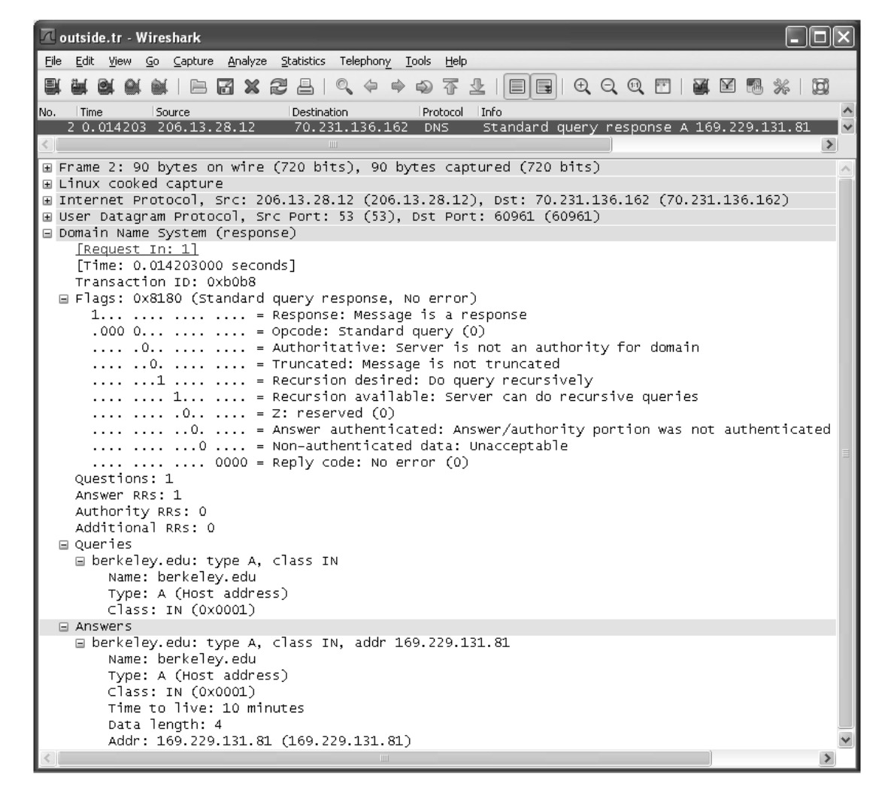</p>
<p align="center"><sub>Figure 11-12 · PDF p. 573 · ISP DNS server가 GW.HOME으로 돌려준 standard DNS response</sub></p>

ISP server의 response는 UDP source port `53`, destination은 GW.HOME의 ephemeral port다. Transaction ID는 GW.HOME이 보낸 query와 일치한다. Flags 값에는 response, recursion requested, recursion available이 반영된다. Answer section에는 `A` record 하나가 들어 있고, TTL은 10 minutes, RDLENGTH는 IPv4 address 크기인 4 bytes, RDATA는 `169.229.131.81`이다. Authority flag가 set되어 있지 않고 authority section도 비어 있으므로 이 response도 authoritative answer가 아니라 cached data에 기반한 답이다.

<p align="center">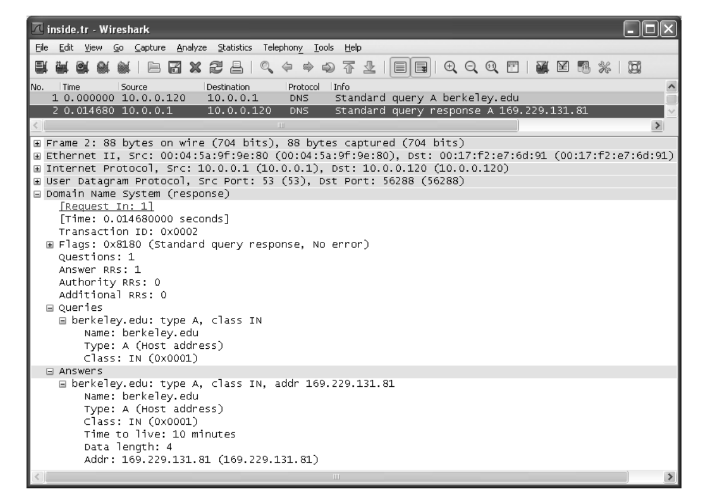</p>
<p align="center"><sub>Figure 11-13 · PDF p. 574 · GW.HOME이 원래 client A.HOME으로 돌려주는 recursive DNS transaction의 최종 response</sub></p>

마지막 response는 GW.HOME `10.0.0.1`에서 client `10.0.0.120`으로 돌아간다. 이 response의 Transaction ID는 original client query의 `0x0002`와 맞아야 한다. Client 입장에서는 local DNS server와의 round trip만 보이지만, 실제 지연의 대부분은 local server와 ISP server 사이의 upstream transaction에서 발생할 수 있다.

#### 11.5.6.3 Canonical Name (CNAME) Records

`CNAME (Canonical Name)` record는 DNS name alias를 canonical name으로 mapping한다. 예를 들어 `www.berkeley.edu`를 실제 web server name인 `www.w3.berkeley.edu`로 가리키게 하면, web server가 다른 machine으로 옮겨져도 public service name은 유지하고 DNS database만 바꾸면 된다. 그래서 `www`, `ftp`, `mail` 같은 service-oriented name이 CNAME으로 구현되는 일이 흔하다.

CNAME RR의 `RDATA`에는 canonical name이 들어가며, 이 name도 data label과 compression label encoding을 사용한다. 중요한 제약은 어떤 name에 CNAME RR이 있으면 DNSSEC 관련 예외를 제외하고 그 name에 다른 data가 함께 있으면 안 된다는 점이다. 또한 CNAME target은 일반 domain name을 쓸 수 있는 모든 자리에 들어갈 수 있는 것은 아니며, 예를 들어 `NS` RR의 target으로 CNAME을 쓰는 것은 적절하지 않다.

`CNAME chaining`도 가능하다. 예를 들어 `www.whitehouse.gov`가 `www.whitehouse.gov.edgesuite.net`을 가리키고, 그것이 다시 `a1128.h.akamai.net`을 가리키며, 마지막 name이 여러 A record를 가질 수 있다. CDN(Content Delivery Network)은 이런 구조를 활용해 service name을 CDN 내부 name으로 연결할 수 있다. 다만 chain이 길수록 resolver가 더 많은 query를 해야 하므로 performance impact가 있고, resolver가 chain length를 몇 단계로 제한하는 경우도 있다.

관련 record로 `DNAME`이 있다. `DNAME`은 CNAME이 한 name alias를 만드는 것과 달리, zone 전체의 suffix를 다른 suffix로 map한다. 예를 들어 `NAME.example.com` 전체를 `NAME.newexample.com`으로 옮기는 식이다. 단, DNAME은 top-level record 자체인 `example.com`에는 적용되지 않는다.

#### 11.5.6.4 Reverse DNS Queries: PTR (Pointer) Records

`PTR (Pointer)` record는 IP address에서 name을 찾는 `reverse DNS query`에 사용된다. TCP/IP connection을 받은 server는 incoming packet에서 source IP address는 알 수 있지만, 그 address의 host name은 packet에 들어 있지 않다. 그래서 address-to-name mapping이 필요할 때 DNS의 별도 subtree를 사용한다.

IPv4 reverse lookup은 address octet을 뒤집고 `.in-addr.arpa.`를 붙인다. 예를 들어 `128.32.112.208`의 PTR query name은 다음과 같다.

```text
208.112.32.128.in-addr.arpa.
```

IPv6 reverse lookup은 `.ip6.arpa.`를 사용한다. IPv6는 `::`로 생략된 0을 모두 복원한 뒤 각 hexadecimal digit을 하나의 label로 만들고 순서를 뒤집는다. 예를 들어 `2001:503:a83e::2:30`은 매우 긴 nibble-reversed name으로 바뀐다. 사용자가 직접 입력할 일은 드물고, 보통 `getnameinfo()` 같은 library function이 처리한다.

Forward DNS name space와 reverse DNS name space는 자동으로 연결되지 않는다. `www.example.com -> 192.0.2.10` forward mapping이 있다고 해서 `10.2.0.192.in-addr.arpa.` PTR이 자동으로 생기는 것은 아니다. 따라서 forward mapping은 있는데 reverse mapping이 없거나, 두 방향 결과가 서로 다른 경우도 가능하다. 일부 service는 forward/reverse mapping이 일관되는지 검사하고, 불일치 시 service를 거부할 수 있다.

Private address space에서도 PTR query가 문제가 될 수 있다. 예를 들어 `10.0.0.0/8` 또는 IPv6 `fc00::/7` 같은 private/local address에 대해 local DNS server가 PTR을 답하지 않으면, 쓸모없는 reverse query가 global DNS로 새어 나갈 수 있다. 그래서 Internet에 붙은 private-addressed network의 local name server는 RFC1918 IPv4, RFC4193 IPv6 private space에 대한 PTR mapping 또는 적절한 local answer를 제공하는 것이 권장된다.

#### 11.5.6.5 Classless in-addr.arpa Delegation

전통적 class A/B/C prefix처럼 prefix length가 8의 배수이면 reverse DNS delegation이 자연스럽다. 예를 들어 `169.229/16`은 `229.169.in-addr.arpa.` subtree를 UC Berkeley가 관리하는 식으로 나눌 수 있다. 하지만 CIDR 환경에서는 `/25`, `/27`처럼 byte boundary가 아닌 prefix가 흔하다. 이 경우 단순히 octet을 뒤집는 방식만으로는 정확한 delegated range를 표현하기 어렵다.

RFC2317 방식은 reversed octet 뒤에 prefix length를 포함한 label을 넣는다. 예를 들어 `12.17.136.128/25` range라면 ISP가 `128.136.17.12.in-addr.arpa.`부터 `255.136.17.12.in-addr.arpa.`까지 각 address name에 CNAME을 만들고, canonical name을 `128/25.136.17.12.in-addr.arpa.` 아래로 넘긴다. 그러면 customer는 `128/25.136.17.12.in-addr.arpa.` zone을 관리하며 각 address의 PTR을 제공할 수 있다.

이 방식의 핵심 trade-off는 DNS name이 다소 낯설어지는 대신, classless prefix의 reverse DNS authority를 ISP에서 customer로 위임할 수 있다는 점이다. Resolver는 CNAME을 따라가고, 최종적으로 customer authoritative server의 PTR answer를 얻는다.

#### 11.5.6.6 Authority (SOA) Records

각 zone에는 하나의 `SOA (Start of Authority)` record가 있다. SOA RR은 zone의 official database를 가진 host, responsible party e-mail address, zone update parameters, default TTL을 담는다. Responsible e-mail address에서는 `@` 대신 `.`을 사용한다.

SOA의 zone update parameter는 secondary server 운영과 직접 연결된다.

| Parameter | 의미 |
|---|---|
| `serial` | zone contents가 바뀔 때 증가한다. secondary는 serial을 보고 zone transfer 필요 여부를 판단한다. |
| `refresh` | secondary가 primary의 SOA/serial을 다시 확인하기까지 기다리는 시간. |
| `retry` | zone transfer 실패 후 secondary가 다시 시도하기까지 기다리는 시간. |
| `expire` | secondary가 transfer 실패를 계속 겪을 때 zone data를 더 이상 유효하다고 보지 않는 상한 시간. |
| `default TTL` | 명시적 per-RR TTL이 없는 record에 적용되는 기본 TTL. |

`expire`가 지나도록 secondary가 primary와 동기화하지 못하면, 그 secondary는 해당 zone에 대한 query에 더 이상 응답하지 않아야 한다. 낡은 authoritative data를 계속 제공하는 것보다 zone service를 중단하는 편이 일관성 면에서 낫기 때문이다.

<p align="center">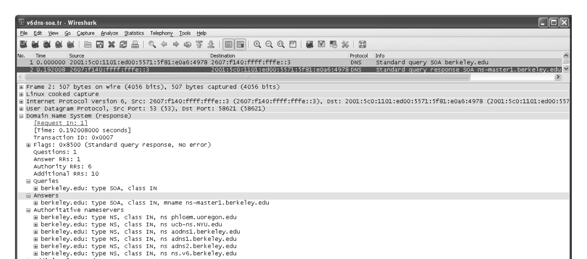</p>
<p align="center"><sub>Figure 11-14 · PDF p. 582 · IPv6로 SOA RR을 질의했을 때 answer, authority, additional RR이 함께 오는 response</sub></p>

Figure 11-14의 SOA response는 DNS가 IPv6 transport 위에서도 IPv4/IPv6 data를 함께 제공할 수 있음을 보여 준다. Query는 IPv6 address를 가진 authoritative server로 UDP/IPv6를 통해 전송되지만, Additional section에는 name server들의 A record와 AAAA record가 모두 들어갈 수 있다. Packet 안의 AAAA RDATA는 textual `::` 축약형이 아니라 full 128-bit address로 encoded된다. Question section의 `berkeley.edu` label은 answer section에서 compression target으로 재사용되어 message size를 줄인다.

#### 11.5.6.7 Mail Exchanger (MX) Records

`MX (Mail Exchanger)` record는 특정 domain의 incoming e-mail을 받을 SMTP host name을 제공한다. E-mail address가 `person@cs.ucla.edu`라면 sending mail agent는 `cs.ucla.edu`의 MX record를 찾아 mail을 어디로 전달할지 결정한다. MX는 원래 destination site가 항상 online이 아닐 수 있던 시대에 relay server가 mail을 대신 받아 보관하도록 하기 위한 동기에서 중요했고, 현재도 mail routing의 기본 mechanism이다.

MX record에는 `preference` value가 들어간다. 같은 domain에 MX record가 여러 개 있으면 preference가 작은 host가 더 선호된다. 예를 들어 preference 3인 `Moa.cs.ucla.edu`와 preference 13인 `Pelican.cs.ucla.edu`, `Mailman.cs.ucla.edu`가 있으면 sender는 먼저 Moa를 시도하고, 실패하면 preference 13 group 중 하나를 선택할 수 있다.

MX 처리에서 기억할 주의점은 다음과 같다.

| 상황 | 동작 |
|---|---|
| MX target host들이 reachable | preference가 낮은 순서로 SMTP delivery 시도 |
| 모든 MX target이 unreachable | mail delivery error condition |
| MX가 없고 CNAME이 있음 | CNAME target을 원래 domain 대신 사용 |
| MX가 없고 A/AAAA가 있음 | 해당 address를 implicit MX로 간주, preference 0처럼 취급 가능 |
| MX target이 CNAME임 | RFC5321 관점에서 부적절. MX target은 A/AAAA로 resolve되는 domain name이어야 함 |

MX record의 target host는 e-mail domain과 같은 domain에 있을 필요가 없다. `example.com`의 mail을 외부 mail service provider host가 처리하는 것도 DNS 구조상 자연스럽다.

#### 11.5.6.8 Fighting Spam: The Sender Policy Framework (SPF) and Text (TXT) Records

`MX` record가 "이 domain의 mail을 받을 server"를 알려 준다면, `SPF (Sender Policy Framework)`는 receiving mail server가 "이 domain 이름으로 mail을 보내도 되는 sending server인가"를 판단하도록 돕는다. Spam sender는 authorized sender인 척 domain을 위조할 수 있으므로, domain owner가 DNS에 authorized sending host policy를 publish하고 receiver가 이를 조회하는 방식이다.

SPF version 1은 DNS `TXT` RR 또는 `SPF` type 99 RR을 사용할 수 있다. 이론적으로 SPF 전용 RR type이 더 깔끔하지만, 일부 DNS client implementation이 SPF type을 제대로 처리하지 못해 실제 배포에서는 TXT record가 널리 쓰인다. TXT RR은 원래 사람이나 debugging 용도의 simple string을 담는 record였지만, 현재는 SPF 같은 application이 programmatically 처리하는 policy carrier로도 사용된다.

예시는 다음 형태다.

```text
v=spf1 ip4:169.229.218.128/25 ip6:2607:F140:0:1000::/64 include:outboundmail.convio.net ~all
```

SPF 처리의 핵심 요소는 다음과 같다.

| 요소 | 의미 |
|---|---|
| `v=spf1` | SPF version 1 policy임을 표시하는 modifier |
| `ip4`, `ip6` | authorized SMTP sender address prefix를 지정하는 mechanism |
| `include` | 다른 domain의 SPF/TXT policy를 참조해 포함 |
| `all` | 앞 mechanism에 match되지 않은 모든 경우를 잡는 final mechanism |
| qualifier 없음 또는 `+` | match 시 `Pass` |
| `-` | match 시 `Fail` |
| `~` | match 시 `SoftFail` |
| `?` | match 시 `Neutral` |

Receiving mail agent는 purported sending domain에 대해 TXT query를 수행하고, SPF의 `check_host()` logic으로 mechanism을 왼쪽에서 오른쪽으로 평가한다. 첫 번째 matching mechanism에서 평가가 끝나며, 결과는 `None`, `Neutral`, `Pass`, `Fail`, `SoftFail`, `TempError`, `PermError` 중 하나다. `Fail`은 sending host가 domain을 대표해 mail을 보낼 권한이 없다는 뜻이고, `SoftFail`은 운영 정책에 따라 더 완화적으로 다룰 수 있는 애매한 실패다. `TempError`는 DNS communication failure 같은 transient problem, `PermError`는 malformed TXT/SPF record 같은 configuration problem을 나타낸다.

SPF의 한계도 중요하다. SPF는 sending domain과 sending system의 authorization을 검증할 뿐, mail을 보낸 사용자 개인을 cryptographic하게 인증하지 않는다. 사용자/내용 수준 인증은 DKIM 같은 mechanism과 연결된다.

#### 11.5.6.9 Option (OPT) Pseudo-Records

`OPT pseudo-RR`은 EDNS0를 위해 정의된 special RR이다. "pseudo"라는 말 그대로 DNS zone database에 저장되는 conventional DNS data가 아니라, 특정 DNS message 하나의 capability와 option을 전달한다. 그래서 OPT RR은 cache, forward, persistent storage 대상이 아니며, 한 DNS message에 최대 하나만 들어가고 위치는 Additional Information section이다.

OPT RR은 conventional RR field 위치를 재사용하지만 의미가 다르다.

| Conventional RR 위치 | OPT RR에서의 의미 |
|---|---|
| `NAME` | null domain name, 0 bytes |
| `TYPE` | 41, 즉 `OPT` |
| `CLASS` | UDP payload size |
| `TTL` | extended RCODE와 flags area |
| `RDLEN` | variable option data 길이 |
| `RDATA` | attribute-value option list |

OPT RR의 32-bit extended RCODE/flags area는 8-bit extended RCODE high bits, 8-bit Version, 16-bit reserved flags로 나뉜다. EDNS0의 Version은 0이고, reserved 16 bits는 0이어야 한다. Extended RCODE를 통해 기본 header의 4-bit `RCODE`보다 더 많은 error type을 표현할 수 있다. 대표 값에는 `BADVERS`, `BADSIG`, `BADKEY`, `BADTIME`, `BADMODE`, `BADNAME`, `BADALG` 등이 있으며, 다수는 DNSSEC/TSIG/TKEY 같은 security extension과 관련된다.

OPT RDATA는 extensible attribute-value pair list다. 예를 들어 `NSID (Name Server Identifier)` option은 anycast address 뒤에 숨어 있는 실제 responding DNS server instance를 식별하는 데 도움이 된다. Anycast에서는 여러 server가 같은 IP address를 공유하므로, source IP만 보면 어느 instance가 응답했는지 알기 어렵다.

#### 11.5.6.10 Service (SRV) Records

`SRV` record는 MX record의 아이디어를 일반 service discovery로 확장한다. MX가 mail delivery target과 preference를 알려 준다면, SRV는 service name, transport protocol, priority, weight, port, target host를 함께 제공한다.

SRV RR의 일반 형태는 다음과 같다.

```text
_Service._Proto.Name TTL IN SRV Prio Weight Port Target
```

| Field | 의미 |
|---|---|
| `_Service` | service의 official name. 예: `_ldap`, `_submission`, `_imaps` |
| `_Proto` | transport protocol. 보통 `_tcp` 또는 `_udp` |
| `Name` | service를 찾는 containing domain |
| `Prio` | MX preference처럼 낮을수록 우선 |
| `Weight` | 같은 priority 안에서 weighted load balancing에 사용 |
| `Port` | service가 listening하는 TCP/UDP port number |
| `Target` | service를 제공하는 host의 domain name |

예를 들어 `_ldap._tcp.openldap.org`의 SRV query는 `openldap.org` domain에서 TCP 기반 LDAP service endpoint를 찾는다. 결과가 `0 0 389 www.openldap.org.`라면 priority와 weight는 0, port는 LDAP 기본 port인 389, target host는 `www.openldap.org`다. Mail User Agent가 user에게 domain만 받았을 때 `_submission._tcp.example.com`, `_imaps._tcp.example.com` 같은 SRV query로 outgoing mail submission과 secure IMAP endpoint를 자동 발견할 수도 있다.

#### 11.5.6.11 Name Authority Pointer (NAPTR) Records

`NAPTR (Name Authority Pointer)` RR은 `DDDS (Dynamic Delegation Discovery System)`를 DNS 위에서 구현할 때 transformation rule을 담는 record다. DDDS는 application이 제공한 string을 database에서 동적으로 얻은 rewrite rule로 변환하고, 최종적으로 URI, domain name, SRV lookup key 같은 resource locator를 얻는 general algorithm이다.

<p align="center">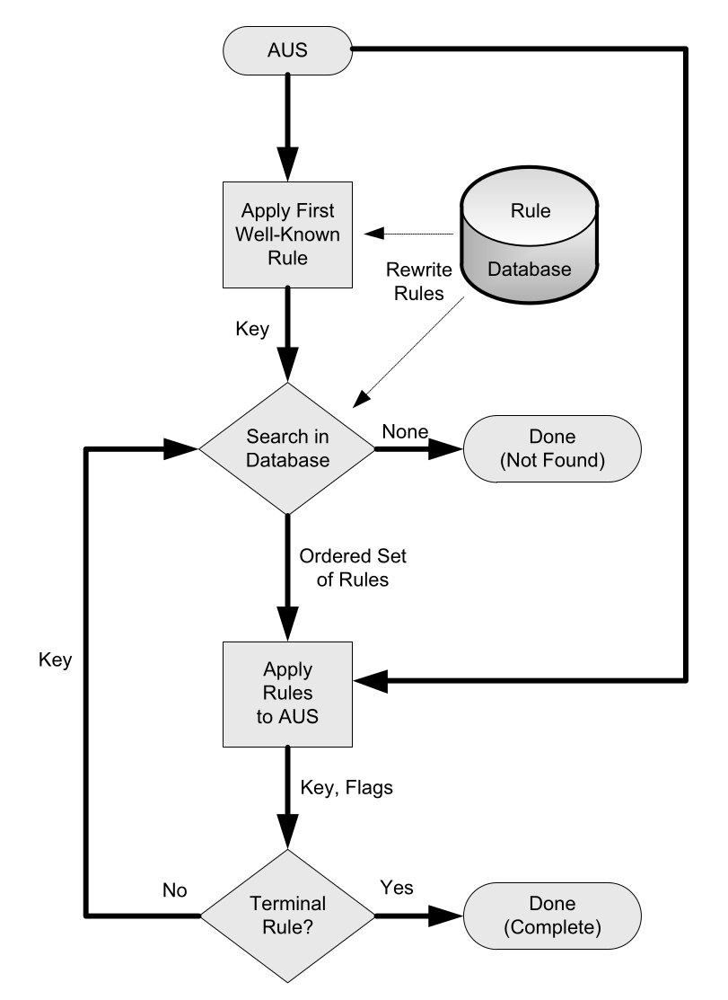</p>
<p align="center"><sub>Figure 11-15 · PDF p. 589 · DDDS algorithm에서 AUS에 rewrite rule을 반복 적용해 terminal result를 얻는 흐름</sub></p>

DDDS의 입력은 application마다 정의되는 `AUS (Application-Unique String)`다. 첫 `Well-Known Rule`을 AUS에 적용해 database lookup key를 만들고, database에서 ordered set of rules를 가져온다. DNS가 database로 쓰이는 경우 key는 domain name이고, rule은 NAPTR RR에 저장된다. Rule은 AUS에 적용되는 string rewrite pattern이며, 이전 rewrite 결과가 아니라 원래 AUS에 적용된다는 점이 중요하다. Non-terminal rule이면 새 key를 얻어 다시 database lookup을 하고, terminal rule이면 최종 output을 얻는다. Non-terminal record들은 loop를 만들 수도 있으므로 implementation은 반복 제한과 error handling을 고려해야 한다.

NAPTR RR의 field는 다음과 같다.

| Field | 의미 |
|---|---|
| `Order` | 낮을수록 먼저 적용해야 하는 mandatory ordering |
| `Preference` | 같은 Order 안에서 선택 순서에 영향을 주는 advisory ordering |
| `Flags` | application이 정의하는 single-character flags |
| `Services` | 어떤 service/application rule인지 나타내는 service parameter |
| `Regular Expression` / `Regexp` | AUS를 다른 key 또는 terminal output으로 rewrite하는 substitution expression |
| `Replacement` | Regexp를 쓰지 않을 때 다음 lookup target FQDN |

`Regexp`와 `Replacement`는 역사적 이유로 비슷한 목적을 갖지만, 하나의 NAPTR RR에서 서로 배타적으로 사용된다. Replacement는 separate FQDN으로 encoded되며 DNS message 안에서 name compression을 쓰지 않는다.

#### 11.5.6.12 ENUM and SIP

`ENUM`은 telephone number를 URI information으로 바꾸는 DDDS application이다. AUS는 `+`로 시작하는 E.164 telephone number다. First Well-Known Rule은 dash 등 non-digit character를 제거하고, 각 digit 사이에 dot을 넣고, 순서를 뒤집은 뒤 `.e164.arpa` suffix를 붙여 DNS key를 만든다.

예를 들어 다음 E.164 number는

```text
+1-415-555-1212
```

conceptually 다음 DNS key로 바뀐다.

```text
2.1.2.1.5.5.5.5.1.4.1.e164.arpa.
```

ENUM NAPTR의 terminal output은 absolute URI다. `U` flag는 terminal rule이 URI를 만든다는 뜻이고, flag가 없으면 non-terminal NAPTR이다. `Services` field는 `E2U+Service` 형식을 사용한다. `E2U`는 E.164-to-URI를 나타내고, service subfield는 SIP, H.323, fax, instant messaging, presence 같은 enumservice를 나타낸다.

SIP 예시에서는 NAPTR rule이 `+420738511111` 같은 AUS를 regular expression으로 match하고 `sip:420738511111@cesnet.cz` 같은 URI로 rewrite한다. 그 다음 SIP 자체도 transport protocol 선택이 필요하므로, SIP DDDS가 다시 NAPTR를 사용해 `_sip._udp.cesnet.cz.` 또는 `_sip._tcp.cesnet.cz.` 같은 SRV lookup target을 얻을 수 있다. 여기서 `s` flag는 결과가 SRV record lookup임을 뜻한다. `SIP+D2U`는 SIP over UDP, `SIP+D2T`는 SIP over TCP, `SIPS+D2T`처럼 security/TLS가 붙은 variant도 가능하다.

#### 11.5.6.13 URI/URN Resolution

NAPTR은 `URI`와 `URN (Uniform Resource Name)` resolution에도 쓰일 수 있다. URI/URN DDDS에서 AUS는 authoritative resolution server를 찾고 싶은 URI 또는 URN이다. URI의 first Well-Known Rule은 scheme name이고, URN의 first key는 `urn:` 뒤 첫 colon 앞의 namespace identifier다. 예를 들어 `http://www.pearson.com`의 key는 `http`, `urn:foo:foospace`의 key는 `foo`다.

URI/URN DDDS의 flags는 다음 의미를 갖는다.

| Flag | 의미 |
|---|---|
| `S` | terminal result가 SRV record를 fetch할 domain name |
| `A` | terminal result가 IP address |
| `U` | terminal result가 URI |
| `P` | DDDS processing을 중단하고 application-specific processing으로 전환 |
| flag 없음 | non-terminal NAPTR |

`uri.arpa` 아래에는 scheme별 NAPTR rule이 들어갈 수 있다. 예를 들어 `mailto:person@example.com`은 rewrite rule에 의해 domain part인 `example.com`으로 바뀌고, 이후 DDDS가 계속 진행될 수 있다. Matching 뒤의 `i` flag는 case-insensitive matching을 뜻한다. URN 쪽에서는 `urn.arpa` 아래 namespace별 NAPTR가 사용될 수 있지만, 본문 시점에서는 global active NAPTR가 많지 않고 실제 사용도 아직 제한적이라고 설명한다.

#### 11.5.6.14 S-NAPTR and U-NAPTR

일반 NAPTR은 강력하지만 regular expression과 rewrite rule이 복잡하다. Service endpoint를 찾는 흔한 문제, 즉 "이 domain에서 특정 application service의 host/protocol/port는 무엇인가"를 해결하기에는 full NAPTR가 과한 경우가 있다. `SRV`는 protocol과 port를 제공하지만 target이 결국 A/AAAA lookup 가능한 domain name으로 제한된다. NAPTR은 그 앞에 indirection layer를 하나 더 제공한다.

`S-NAPTR (Straightforward NAPTR)`은 NAPTR를 단순화한 DDDS application이다. AUS는 service를 찾으려는 domain label이고, first Well-Known Rule은 identity function이다. `Regexp` field를 쓰지 않고 `Replacement`만 사용하며, terminal flag는 `S`와 `A`만 허용된다. `S`는 SRV RR lookup으로 이어지고, `A`는 A/AAAA lookup에 사용할 domain name을 뜻한다. S-NAPTR은 IRIS 같은 registration information service discovery에 사용된다.

`U-NAPTR (URI-enabled NAPTR)`은 S-NAPTR의 단순함을 유지하면서 `U` flag를 추가해 target이 URI가 될 수 있게 한다. Regular expression도 허용하지만 full NAPTR보다 제한되어, 전체 AUS를 URI로 대체하는 형식에 가깝다. 예시 application으로 `LoST (Location-to-Service Translation)`가 있으며, 이는 network attachment point와 geographical location을 바탕으로 적절한 service를 찾는 데 쓰일 수 있어 emergency service 같은 public safety scenario와 연결된다.

### 11.5.7 Dynamic Updates (DNS UPDATE)

`DNS UPDATE`는 authoritative DNS server에 dynamic update DNS message를 보내 zone contents를 바꾸는 protocol이다. 기본 DNS message format은 그대로 사용하지만, header count field와 section 이름이 다르게 해석된다. `Opcode`는 `Update (5)`이고, section은 `Zone`, `Prerequisite`, `Update`, `Additional Information`으로 읽는다.

| Field | DNS UPDATE에서의 의미 |
|---|---|
| `ZOCOUNT` | update 대상 zone count. 보통 1 |
| `PRCOUNT` | prerequisite count |
| `UPCOUNT` | update operation count |
| `ADCOUNT` | additional information count |

Zone section은 update할 zone을 지정한다. Zone name, type, class를 담으며, type은 zone을 식별하는 `SOA` type value 6, class는 Internet class `1`이다. 하나의 update message에 들어가는 record들은 모두 같은 zone 안에 있어야 한다.

Prerequisite section은 update를 실행하기 전에 server가 확인해야 할 조건을 RR format으로 표현한다. 조건이 true가 아니면 update는 수행되지 않고 error response가 돌아온다. Update section은 zone에 추가하거나 삭제할 RR들을 담는다. "수정"은 별도 operation이라기보다 delete 후 add로 표현할 수 있다.

Prerequisite semantics는 `CLASS`, `TYPE`, `RDATA` 조합으로 encoding된다.

| Prerequisite | Encoding 요지 |
|---|---|
| `RRSet exists`, value-independent | class `ANY`, zone type과 같은 type, empty RDATA |
| `RRSet exists`, value-dependent | zone class, check할 type, check할 RRSet RDATA |
| `RRSet does not exist` | class `NONE`, check할 type, empty RDATA |
| `Name is in use` | class `ANY`, type `ANY`, empty RDATA |
| `Name is not in use` | class `NONE`, type `ANY`, empty RDATA |

Update operation도 RR format으로 encoding된다.

| Operation | Encoding 요지 |
|---|---|
| Add RR to RRSet | zone class, 추가할 RR type, 추가할 RDATA |
| Delete RRSet | class `ANY`, 삭제할 RRSet type, empty RDATA, TTL/RDLENGTH 0 |
| Delete all RRSets from a name | class `ANY`, type `ANY`, empty RDATA, TTL/RDLENGTH 0 |
| Delete RR from RRSet | class `NONE`, 삭제할 RR type, matching RDATA |

<p align="center">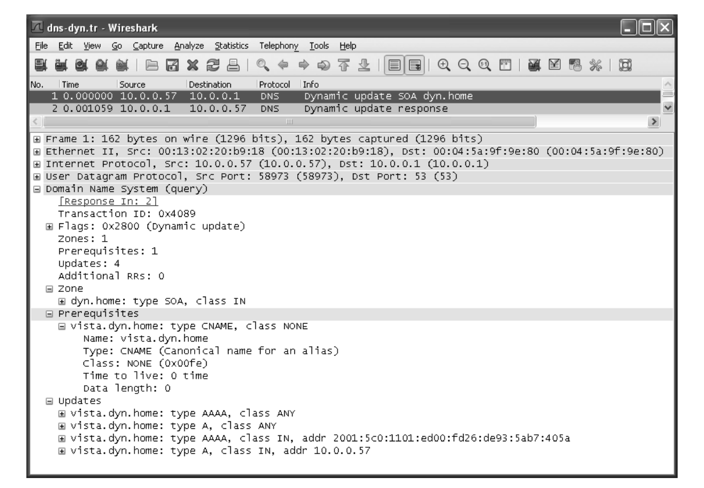</p>
<p align="center"><sub>Figure 11-16 · PDF p. 596 · `vista.dyn.home`의 A/AAAA address를 dynamic update로 등록하는 DNS UPDATE message</sub></p>

Figure 11-16은 Windows host가 `ipconfig /registerdns` 등을 통해 자신의 name/address를 local dynamic DNS zone에 등록하는 예다. DNS server `10.0.0.1`은 dynamic update를 허용하도록 설정되어 있고, zone section에는 update 대상 zone을 식별하는 SOA-related entry가 들어간다. Prerequisite section의 CNAME/type과 class `NONE (254)`, zero-length RDATA는 "해당 RRSet이 없어야 한다"는 조건을 표현한다. Update section은 기존 AAAA/A RRSet을 삭제한 뒤, `vista.dyn.home`에 새 IPv4 address `10.0.0.57`과 IPv6 address를 추가한다.

<p align="center">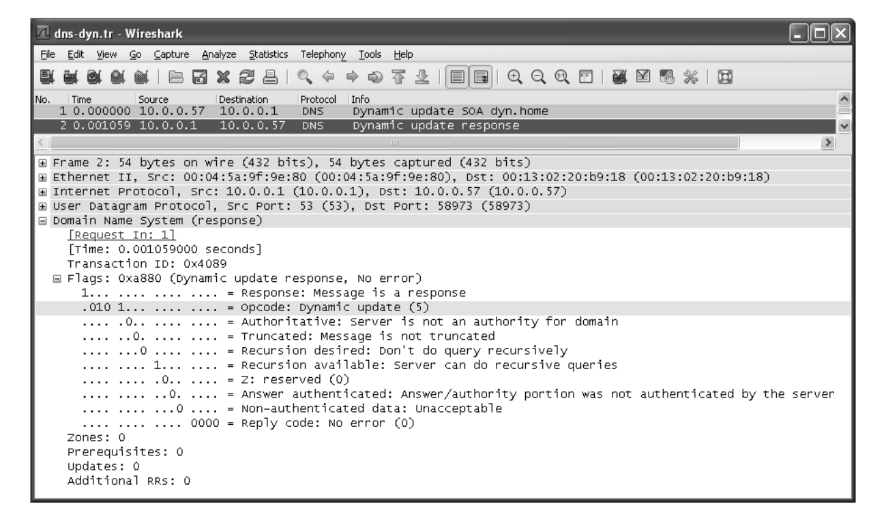</p>
<p align="center"><sub>Figure 11-17 · PDF p. 597 · dynamic update request에 대한 compact response</sub></p>

DNS UPDATE response는 transaction ID와 status flag 중심으로 작다. Figure 11-17에서는 Transaction ID `0x4089`가 request와 response를 match하고, Flags field가 no error를 나타낸다. Update는 zone contents를 직접 바꾸므로 access control이 중요하다. Server가 아무 client의 update를 받아 주면 공격자가 DNS data를 마음대로 바꿀 수 있다. 운영에서는 client IP allowlist 같은 약한 방식부터 TSIG, SIG(0) 같은 transaction authentication까지 여러 수준의 통제가 사용된다.

### 11.5.8 Zone Transfers and DNS NOTIFY

`zone transfer`는 한 server에서 다른 server로 zone의 RR set을 복사하는 mechanism이다. 일반적으로 master/primary server가 authoritative database를 갖고, slave/secondary server가 이를 받아 redundancy, load sharing, latency 개선을 제공한다. 같은 zone에 여러 authoritative server가 있으면 하나가 down되어도 DNS service를 계속 제공할 수 있고, client와 가까운 server가 응답해 query latency를 줄일 수도 있다.

전통적으로 slave는 `SOA serial number`를 주기적으로 poll해 zone transfer 필요 여부를 판단했다. 이후 `DNS NOTIFY`가 추가되어, master가 zone 변경을 감지하면 slave에게 update 사실을 알려 transfer를 시작하게 할 수 있다. 실제 transfer는 전체 zone을 보내는 `AXFR` 또는 변경분만 보내는 `IXFR`로 수행된다.

<p align="center">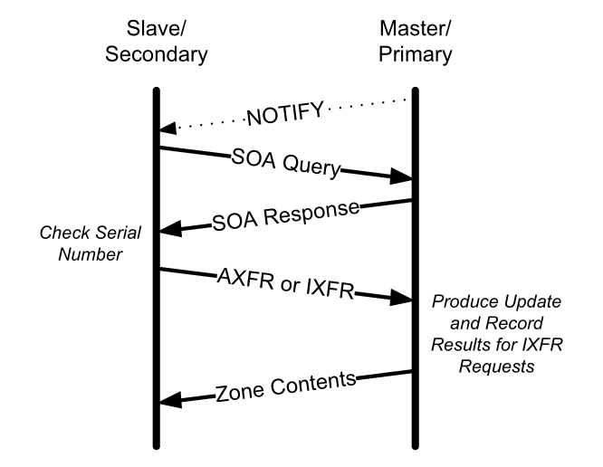</p>
<p align="center"><sub>Figure 11-18 · PDF p. 598 · DNS NOTIFY, SOA serial check, AXFR/IXFR zone transfer의 기본 관계</sub></p>

흐름은 다음처럼 연결된다.

| 단계 | 의미 |
|---|---|
| NOTIFY | master/primary가 zone change를 slave/secondary에게 알림 |
| SOA query/response | slave가 serial number를 확인해 자신이 가진 copy가 낡았는지 판단 |
| AXFR/IXFR | 필요하면 full 또는 incremental zone transfer 수행 |
| IXFR state | master는 incremental transfer 요청에 답할 수 있도록 update 결과를 기록해야 함 |

#### 11.5.8.1 Full Zone Transfers (AXFR Messages)

`AXFR (All Zone Transfer)`는 complete zone contents를 요청하는 DNS query type이다. Full transfer는 zone이 클 수 있고 reliable copy가 필요하므로 TCP를 사용한다. Slave server는 SOA의 `refresh` interval마다 primary를 확인하고, 실패하면 `retry` interval에 따라 다시 시도하며, `expire` interval 안에 refresh하지 못하면 해당 zone data를 버려 사실상 그 zone에 대해 응답하지 못하게 된다.

<p align="center">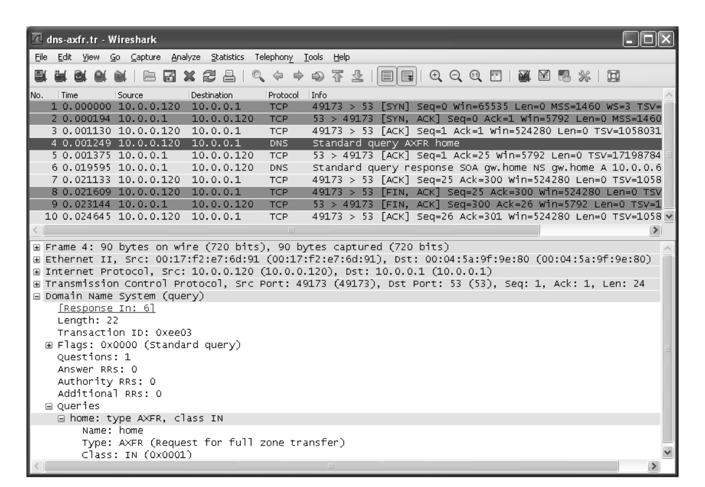</p>
<p align="center"><sub>Figure 11-19 · PDF p. 599 · TCP 위에서 type AXFR question으로 full zone transfer를 요청하는 DNS message</sub></p>

Figure 11-19의 AXFR request는 먼저 TCP three-way handshake를 수행한 뒤, DNS standard query 형식으로 `home.` zone에 대한 type `AXFR`, class `IN` question을 보낸다. DNS message 자체는 일반 query와 같은 framing을 쓰지만, transport가 TCP이고 query type이 AXFR라는 점이 다르다.

<p align="center">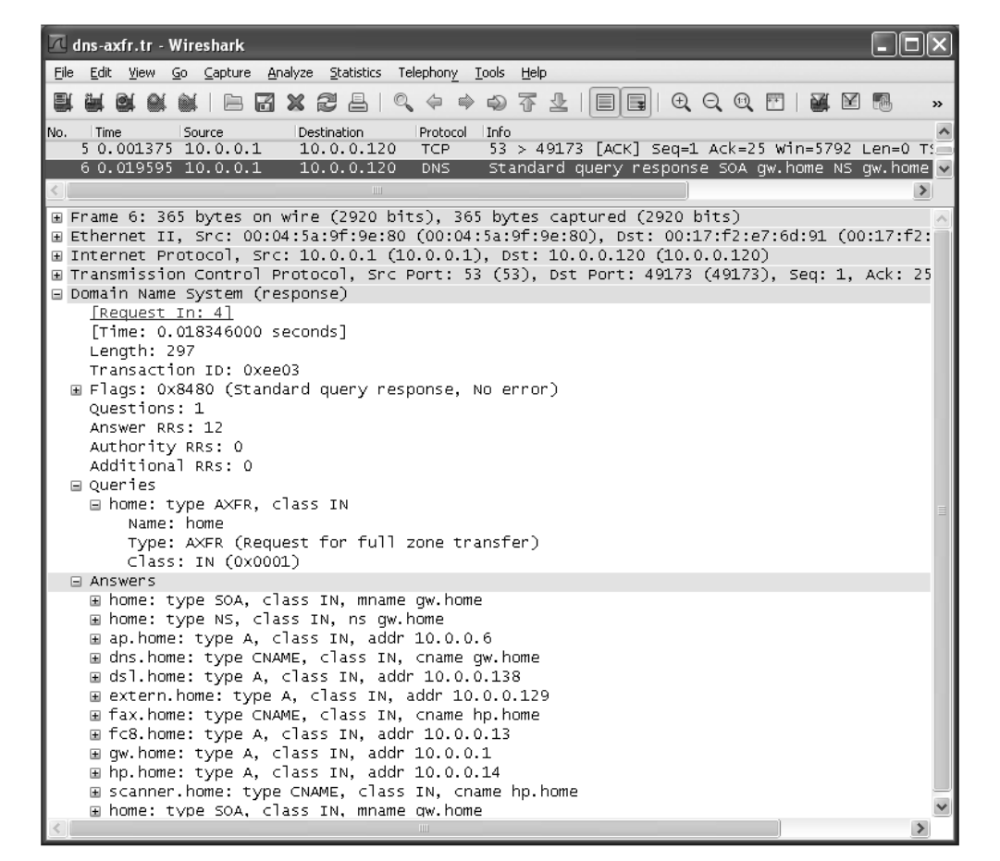</p>
<p align="center"><sub>Figure 11-20 · PDF p. 600 · AXFR response가 zone의 모든 record를 TCP connection으로 전달하는 모습</sub></p>

Response에는 zone contents 전체가 들어간다. Client는 data를 ACK한 뒤 TCP FIN/ACK handshake로 connection을 정상 종료한다. 과거에는 많은 DNS server에서 zone transfer가 넓게 열려 있었지만, 현재는 보통 해당 zone의 authorized secondary server로 제한한다. Zone 전체 host 목록은 attacker에게 service/host target map을 제공할 수 있기 때문에 privacy와 security 면에서 민감하다.

#### 11.5.8.2 Incremental Zone Transfers (IXFR Messages)

`IXFR (Incremental Zone Transfer)`는 zone 전체가 아니라 변경분만 전달해 transfer cost를 줄인다. Requester는 자신이 가진 현재 zone serial number를 제공하고, server는 그 serial 이후 변경분을 보낼 수 있으면 incremental response를 보낸다. 변경분을 제공할 수 없거나 차이가 너무 크면 AXFR로 fallback할 수 있다.

<p align="center">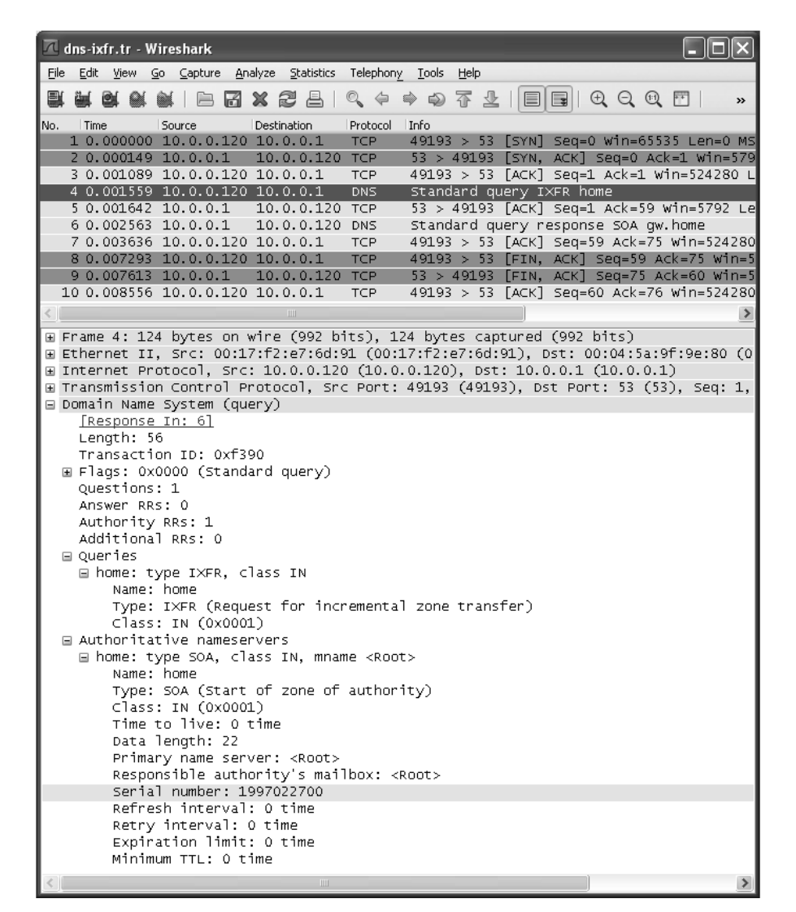</p>
<p align="center"><sub>Figure 11-21 · PDF p. 601 · TCP로 운반되는 IXFR request와 serial number 기반 변경 확인</sub></p>

IXFR request는 type `IXFR`를 사용하고, Authority section에 requester가 가진 SOA serial number를 포함한다. 본문 예시에서는 `dig +short @10.0.0.1 -t ixfr=1997022700 home.`처럼 server와 starting serial을 지정한다.

<p align="center">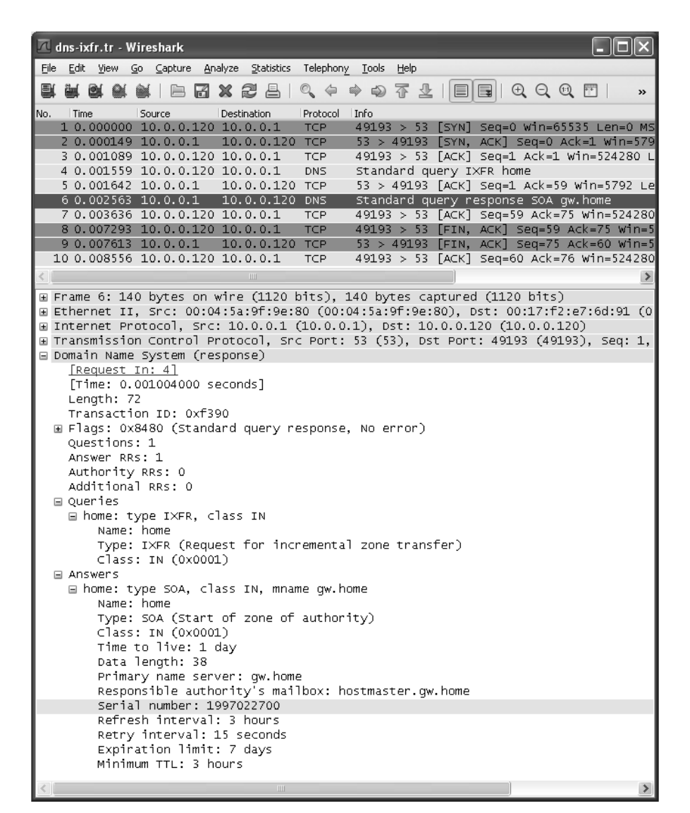</p>
<p align="center"><sub>Figure 11-22 · PDF p. 602 · requester의 serial이 current일 때 IXFR response가 SOA만 돌려주는 경우</sub></p>

Figure 11-22에서는 request serial이 server의 current serial과 같기 때문에 실제 변경분이 없다. Response의 answer section에는 complete SOA field를 가진 SOA RR만 있고, additional answer는 없다. 이 경우 requester는 최신 상태라고 간주되며 추가 transfer가 필요 없다.

#### 11.5.8.3 DNS NOTIFY

Polling만 사용하면 slave가 refresh interval마다 master를 확인해야 하고, zone이 바뀌지 않은 동안에도 useless poll이 발생한다. `DNS NOTIFY`는 master가 SOA serial 증가 같은 zone change를 감지했을 때 interested slave set에 notification을 보내, 필요한 시점에 transfer를 시작하게 한다.

<p align="center">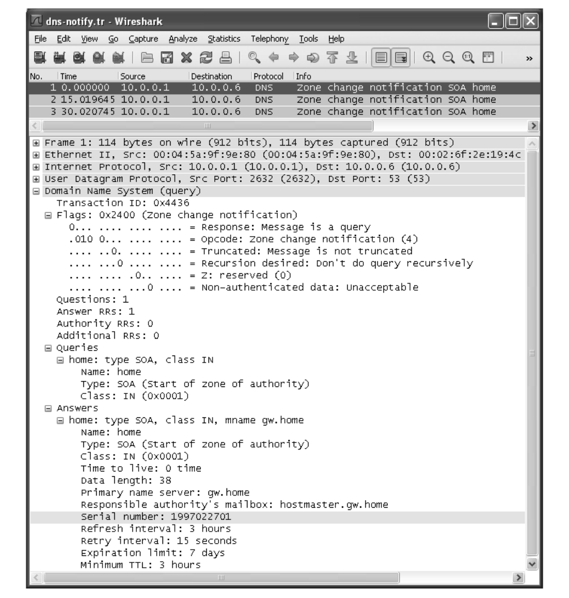</p>
<p align="center"><sub>Figure 11-23 · PDF p. 603 · zone file update를 알리는 DNS NOTIFY와 UDP retransmission 예</sub></p>

NOTIFY message는 기본적으로 UDP/IPv4 DNS query message이며, Flags field가 zone change notification을 나타낸다. Query section에는 SOA type/class가 들어가고, Answer section에는 TTL 0의 current SOA RR, 특히 serial number가 들어간다. Notified server는 이 정보를 보고 zone transfer가 필요할 수 있음을 판단한다.

UDP는 unreliable하므로 response가 없으면 retransmission이 필요하다. 본문 예시에서는 notify target `10.0.0.11`에 DNS server가 없어 response가 오지 않고, BIND9이 15초 간격으로 두 번 retransmission한다. RFC1996은 60초 간격과 총 5회 retransmission, 그리고 additive/exponential timer backoff를 제안하지만, 구현이 항상 권고를 그대로 따르지는 않는다. NOTIFY response는 transaction ID로 protocol을 완료하고 sender의 retransmission을 멈추게 하는 정도의 의미를 가진다.

### 11.6 Sort Lists, Round-Robin, and Split DNS

DNS server는 query에 match되는 모든 RR을 아무 순서로 돌려줄 수도 있지만, 실제 운영에서는 성능, privacy, traffic distribution을 위해 어떤 data를 어떤 순서로 반환할지 조정한다. 같은 name에 여러 A/AAAA record가 있을 때 client application은 흔히 response의 첫 address부터 시도하므로, record order 자체가 routing-like behavior를 유도할 수 있다.

<p align="center">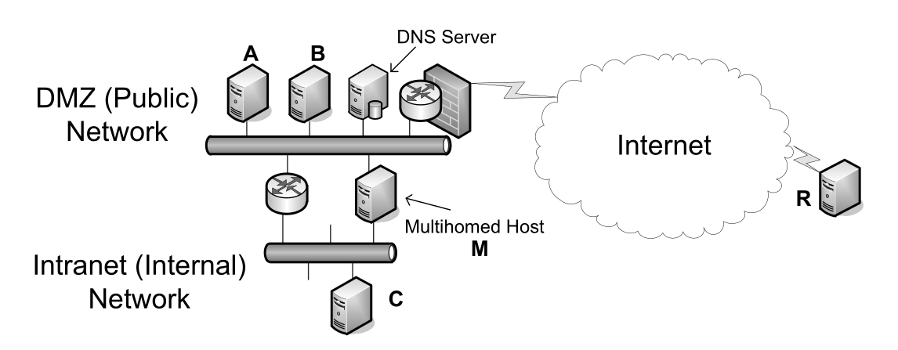</p>
<p align="center"><sub>Figure 11-24 · PDF p. 605 · 요청 source에 따라 multihomed host M의 적절한 address를 먼저 돌려줄 수 있는 enterprise topology</sub></p>

Figure 11-24에서 multihomed host `M`은 DMZ/public network와 intranet/internal network에 각각 address를 가진다. DMZ의 A/B나 Internet의 R은 M의 DMZ address로 가는 편이 자연스럽고, internal host C는 M의 internal address로 가는 편이 더 효율적이다. DNS server가 query source IP prefix를 보고 같은 prefix에 가까운 returned address record를 앞쪽에 배치하면, 단순 client도 "가까운" address를 먼저 시도하게 된다. BIND류 설정에서는 `sortlist` 또는 `rrset-order` 같은 directive로 이런 behavior를 제어할 수 있다.

`DNS round-robin`은 같은 service를 여러 server가 제공할 때 returned address record 순서를 매 query마다 바꿔 load balancing 효과를 노리는 기법이다. 예를 들어 `www.example.com`에 A와 B server address가 모두 있으면, DNS server가 응답 순서를 번갈아 바꿔 client들이 서로 다른 server를 먼저 시도하게 만든다. 다만 cache가 있으면 같은 ordered RRSet이 재사용되어 기대한 분산 효과가 약해질 수 있고, connection 수는 분산해도 실제 processing load는 균등하지 않을 수 있다. 어떤 connection은 가볍고 어떤 connection은 매우 비쌀 수 있기 때문이다.

`split DNS`는 client identity에 따라 보이는 DNS database를 다르게 만드는 방식이다. 보통 client IP address 또는 prefix로 내부/외부를 구분한다. Enterprise 내부 host에게는 모든 internal host record를 보여 주고, 외부 host R에게는 public service를 제공하는 A/B 정도만 보이게 할 수 있다. Split DNS는 privacy와 attack surface 축소에 유용하지만, 같은 name이 위치에 따라 다른 answer를 갖기 때문에 troubleshooting이 어려워질 수 있다.

| 기법 | 목적 | 한계/주의점 |
|---|---|---|
| sort list / address sorting | client와 가까운 address를 먼저 반환 | client가 첫 address를 실제로 먼저 시도한다는 가정 필요 |
| DNS round-robin | 여러 server로 connection 분산 | cache와 workload skew 때문에 정교한 load balancing은 아님 |
| split DNS | 내부/외부 visibility 분리 | answer가 client 위치에 의존해 debugging이 복잡 |

### 11.7 Open DNS Servers and DynDNS

Home user는 ISP로부터 하나의 global IPv4 address를 받고, 그 address가 reconnect 때 바뀌는 경우가 많다. 이런 환경에서 Internet에서 접근 가능한 service를 운영하려면 고정 DNS entry를 유지하기 어렵다. `Dynamic DNS (DDNS)` service는 user가 provider account를 만들고, client program이 현재 global IP address를 provider DNS에 update하게 해 이 문제를 완화한다.

여기서 말하는 open DDNS provider의 update protocol은 앞에서 본 RFC2136 `DNS UPDATE`와 다르다. 본문은 `DNS Update API`라는 separate application-layer protocol을 설명한다. `inadyn`, `ddclient`, Windows용 DynDNS Updater 같은 client가 home router나 host에서 실행되고, login information으로 remote DDNS service에 접속해 현재 public/NAT-mapped address를 등록한다. 이후 주기적으로 renewal을 보내며, provider는 일정 시간 update가 없으면 stale mapping을 제거할 수 있다.

핵심 차이는 다음과 같다.

| 항목 | RFC2136 DNS UPDATE | Open DDNS provider update |
|---|---|---|
| 대상 | authoritative DNS server의 zone contents | provider service의 user-owned hostname entry |
| protocol | DNS message format, Opcode Update | 별도 application-layer update API |
| 인증 | TSIG/SIG(0), ACL 등 DNS server 정책 | provider account/login credential |
| 사용처 | managed zone 내부 dynamic host registration | changing home/edge public address 추적 |

### 11.8 Transparency and Extensibility

DNS는 Internet의 ubiquitous service이므로 새로운 기능을 얹고 싶은 유혹이 크다. TXT, SRV, A 같은 기존 RR을 편법적으로 활용할 수도 있지만, RFC5507은 장기적으로는 새 RR type을 만들고 구현하는 접근이 더 바람직하다고 본다. RFC3597은 unknown RR type을 opaque data로 다루는 표준 방법을 제공한다. 즉 server나 resolver가 type을 이해하지 못해도 record를 해석하려 들지 않고 transparent하게 운반할 수 있다.

Transparency에서 중요한 예외가 embedded domain name과 compression이다. Known RR type에서는 embedded domain name에 대해 case 변경이나 compression label 사용이 가능할 수 있다. 하지만 unknown RR type에서는 embedded domain name이 compression label을 사용하면 안 된다. 또한 unknown type의 embedded domain name은 bitwise comparison 대상이 되므로 일반 DNS name matching과 달리 case-sensitive하게 비교될 수 있다. TXT record에 domain-looking string이 들어갈 때도 DNS가 그 안쪽을 domain name으로 이해해 주지 않는다는 점을 기억해야 한다.

Home gateway나 firewall에 colocated된 `DNS proxy`도 transparency 문제를 만든다. Proper DNS proxy는 incoming DNS request를 ISP name server로 relay하고 response를 돌려주는 역할에 머물러야 한다. RR을 임의로 해석하거나 수정하면 interoperability 문제가 생긴다. Packet truncation을 피할 수 없으면 `TC` bit를 set해야 하고, UDP truncation 이후 TCP fallback이 필요하므로 TCP DNS request도 처리할 준비가 되어 있어야 한다.

### 11.9 Translating DNS from IPv4 to IPv6 (DNS64)

`DNS64`는 IPv6-only client가 IPv4-only service에 접근할 수 있게 돕는 DNS translation mechanism이다. Chapter 7의 IPv4/IPv6 translator와 함께 배치되며, DNS A record를 synthetic AAAA record로 바꿔 IPv6-only client에게 제공한다.

<p align="center">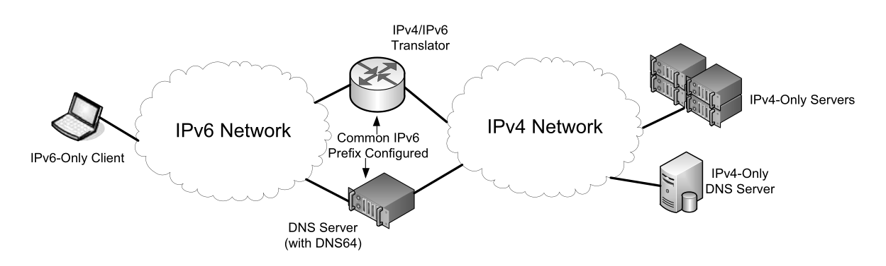</p>
<p align="center"><sub>Figure 11-25 · PDF p. 608 · DNS64가 A record를 synthetic AAAA record로 변환하고 IPv4/IPv6 translator와 함께 동작하는 구조</sub></p>

DNS64 recursive-resolver mode의 흐름은 다음과 같다.

1. IPv6-only client는 DNS64 server를 primary DNS server처럼 사용하고, target name의 `AAAA` record를 질의한다.
2. DNS64는 IPv4 side에서 해당 name의 `A`와 `AAAA` record를 모두 조회한다.
3. Native AAAA record가 없고 A record만 있으면, configured IPv6 prefix와 IPv4 address를 결합해 `IPv4-embedded IPv6 address`를 만든다.
4. Client는 synthetic AAAA address로 IPv6 packet을 보내고, IPv4/IPv6 translator가 이를 IPv4 network/service로 전달한다.

Configured prefix는 operator가 소유한 `Network-Specific Prefix`일 수도 있고, well-known prefix `64:ff9b::/96`일 수도 있다. DNS64는 자신이 synthetic AAAA를 만들 때 쓰는 prefix에 대한 PTR query에도 응답할 수 있다. Synthesis는 실질적으로 answer section만 바꾸며, CNAME/DNAME chain이 있으면 A 또는 AAAA record를 찾을 때까지 chain을 따라가고 chain element도 response에 포함한다. Special-use IPv4 address로부터 이상한 IPv4-embedded address가 만들어지는 것을 막기 위해 excluded IPv4/IPv6 ranges를 설정할 수 있다. DNS64는 DNSSEC와 subtle interaction이 있으며, 보안 세부는 Chapter 18로 이어진다.

### 11.10 LLMNR and mDNS

Ordinary DNS는 authoritative/caching DNS server 구성이 필요하다. 하지만 ad hoc network나 작은 LAN처럼 local host 몇 개가 서로를 찾기만 하면 되는 상황에서는 full DNS infrastructure가 부담이다. 이때 DNS-like local name resolution protocol이 사용된다.

`LLMNR (Link-Local Multicast Name Resolution)`은 Microsoft가 개발한 DNS 기반 local protocol이다. 본문에는 LLMRR로 표기된 곳이 있지만, 표준적으로는 LLMNR로 검색하는 것이 맞다. LLMNR은 UDP port `5355`, IPv4 multicast address `224.0.0.252`, IPv6 multicast address `ff02::1:3`을 사용한다. 응답 server는 자신이 응답하는 unicast IP address에서 TCP port 5355도 사용할 수 있다. Windows Vista, Server 2008, Windows 7 계열에서 local printer/file server discovery 등에 쓰인다.

`mDNS (Multicast DNS)`는 Apple이 개발한 local DNS-like capability이며, DNS Service Discovery와 결합한 framework를 Apple은 `Bonjour`라고 부른다. mDNS는 UDP port `5353`과 local multicast address를 사용한다. IPv4는 `224.0.0.251`, IPv6는 `ff02::fb`다. Special TLD `.local`은 link-local scope로 특별 취급되며, `printer.local`, `fileserver.local`, `camera1.local` 같은 이름을 작은 network에서 autonomous하게 사용할 수 있다. 이름 충돌을 detect/resolve하는 mechanism도 포함한다.

주의할 점은 `.local` 밖의 global-looking name을 link-local multicast로 물어보고 local responder가 답하게 하면 보안 문제가 생길 수 있다는 것이다. Local attacker가 global service name에 대한 bogus answer를 줄 수 있기 때문이다. DNSSEC는 이런 문제의 방어책 중 하나로 연결된다.

### 11.11 LDAP

`LDAP (Lightweight Directory Access Protocol)`는 DNS보다 richer query와 data manipulation을 제공하는 general directory service protocol이다. LDAPv3는 X.500 data/service model에 맞춰 directory entry를 search, modify, add, compare, remove할 수 있게 한다. LDAP directory는 tree of directory entries이고, 각 entry는 attribute set으로 구성된다.

LDAP는 DNS와 함께 쓰이도록 발전했다. LDAP query base에 `dc (domain component)` attribute를 사용하면 DNS domain name을 directory tree에 mapping할 수 있다. 예를 들어 `dc=mit,dc=edu`는 DNS name `mit.edu`의 label들을 LDAP base로 표현한 것이다.

```text
ldapsearch -x -h ldap.mit.edu -b "dc=mit,dc=edu" "(ou=*Chancellor*)"
```

이 command는 special authentication 없이 `ldap.mit.edu`에 접속하고, base `dc=mit,dc=edu` 아래에서 organizational unit `ou` attribute에 `Chancellor`가 포함된 entry를 찾는다. LDAP에서는 wildcard pattern도 사용할 수 있다. Enterprise에서는 LDAP server가 location, telephone number, organizational unit, user account, service, access rights 같은 directory information을 보관하는 데 자주 쓰인다. Microsoft Active Directory도 LDAP capability를 포함하며, 대학 등 일부 기관의 LDAP server는 public Internet에서 조회 가능하다.

### 11.12 Attacks on the DNS

DNS는 Internet critical infrastructure이기 때문에 공격 대상이 되기 쉽다. 이 장에서는 세부 cryptography를 다루지 않고, DNSSEC 같은 strong authentication은 Chapter 18로 넘긴다. 여기서는 DNS 공격을 크게 두 범주로 본다.

| 공격 범주 | 핵심 효과 |
|---|---|
| `DoS attack` | root server, TLD server, authoritative/caching server를 overload해 DNS를 느리거나 불능 상태로 만든다. |
| bogus RR / masquerading | DNS resource record 내용을 바꾸거나 official DNS server인 것처럼 답해 client를 잘못된 IP address로 유도한다. |

Early 2001 DNS DoS 사례는 `AOL.COM`의 MX record에 대한 대량 request를 forged source IP address로 생성한 attack이다. Request packet은 작고 response는 훨씬 크므로, 공격자가 쓴 bandwidth보다 피해자 쪽으로 가는 response bandwidth가 커지는 `amplification attack`이 된다. Forged source IP 때문에 response traffic은 attacker가 지정한 victim address로 향한다.

`Kaminsky Attack`은 DNS data modification 계열의 대표 사례로, `cache poisoning`을 이용한다. Attacker는 caching server가 어떤 A record를 질의하는 순간 forged response를 보내고, 그 안에 domain에 대한 bogus NS record와 attacker-controlled host IP address를 Additional Information section에 포함시킬 수 있다. Caching server가 이를 받아들이면 이후 client들은 정상 domain name을 조회해도 malicious/fake server로 유도될 수 있다. Bank web site처럼 사용자가 신뢰하는 service를 흉내 내면 credential disclosure 같은 피해로 이어진다.

Mitigation은 DNS server가 unsolicited response를 더 엄격히 거부하고, transaction ID, source port, query name matching 등 entropy를 늘리는 방향으로 발전했다. `DNS-0x20`은 domain name matching이 case-insensitive라는 점을 이용해, Query Name의 letter case에 nonce를 숨기는 방식이다. 정상 server는 question의 Query Name case를 response에 그대로 echo하는 경향이 있으므로, attacker가 unsolicited response를 만들 때 이 mixed-case nonce를 맞히기 어렵다. 다만 근본적인 authenticated data origin 보장은 DNSSEC가 담당하는 영역이다.

### 11.13 Summary

DNS는 Internet과 private network 모두에서 필수적인 naming infrastructure다. `DNS name space`는 TLD에서 시작하는 hierarchy이고, IDN을 통해 여러 언어/script를 수용할 수 있다. Application은 resolver를 통해 DNS server에 query하고, local name server는 cache와 recursive resolution을 이용해 root, TLD, authoritative server를 따라가며 answer를 얻는다. `TTL`은 cache lifetime을 제어하고, stale data와 query load 사이의 trade-off를 만든다.

DNS message는 `Question`, `Answer`, `Authority`, `Additional Information` section을 가진 공통 format을 사용한다. 대부분의 Internet DNS message는 UDP/IPv4로 운반되고 기본적으로 512 bytes 제한을 받지만, `EDNS0`와 TCP fallback이 큰 response, DNSSEC, zone transfer를 가능하게 한다. 정보 자체는 `Resource Record (RR)`에 담기며, A/AAAA, NS, CNAME, SOA, PTR, MX, TXT, SRV, NAPTR, OPT, AXFR, IXFR 같은 RR/query/meta type이 DNS의 기능을 확장한다.

DNS는 zone transfer와 dynamic update도 지원한다. `AXFR`와 `IXFR`는 primary/master와 secondary/slave server 사이 zone synchronization을 수행하고, `DNS NOTIFY`는 SOA serial change를 slave에게 알려 polling 낭비를 줄인다. `DNS UPDATE`는 RFC2136 방식으로 authoritative zone contents를 online protocol로 바꾸며, open DDNS provider의 update API는 changing home IP address를 DNS name에 연결하는 별도 application-layer mechanism이다.

DNS의 강점은 extensibility와 ubiquity지만, 그만큼 attack surface도 크다. DoS amplification, cache poisoning, bogus RR injection 같은 공격은 DNS가 naming과 trust의 앞단에 있기 때문에 영향이 크다. DNSSEC, TSIG/SIG(0), source port/randomization, stricter response validation, DNS-0x20 같은 countermeasure는 모두 "올바른 answer를 올바른 source에서 받았는가"라는 문제를 줄이기 위해 발전했다.
