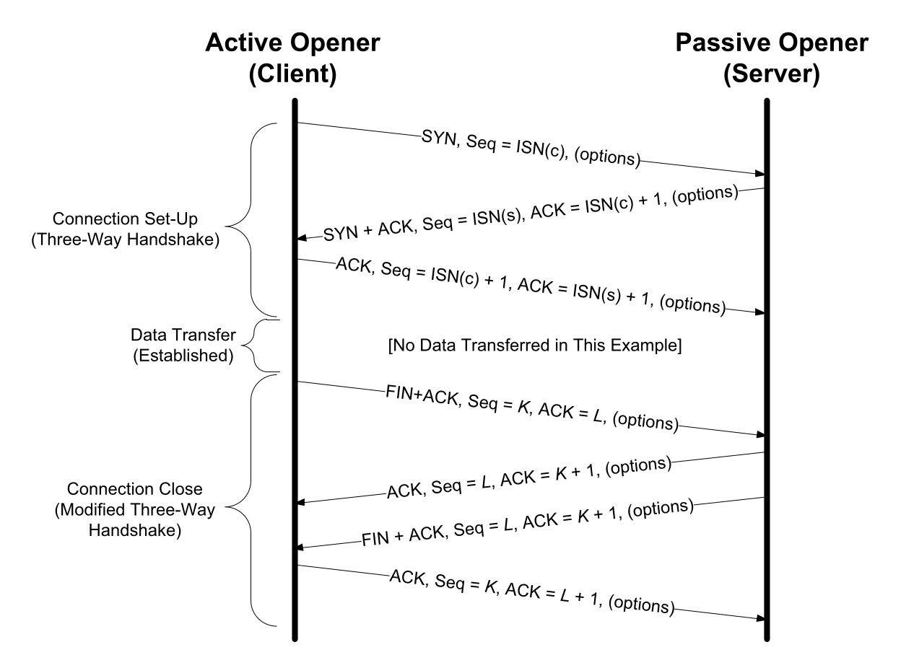
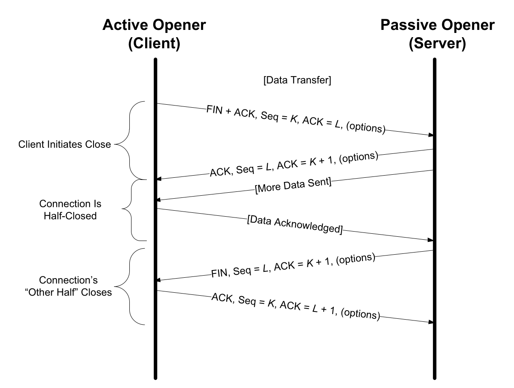
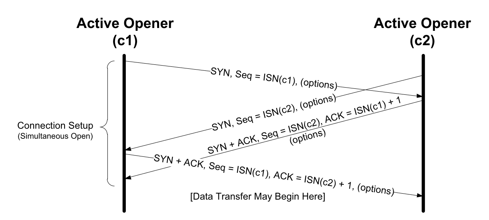
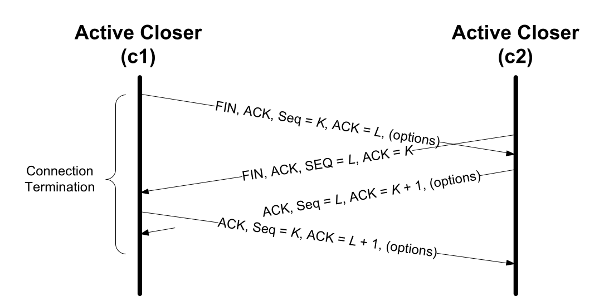
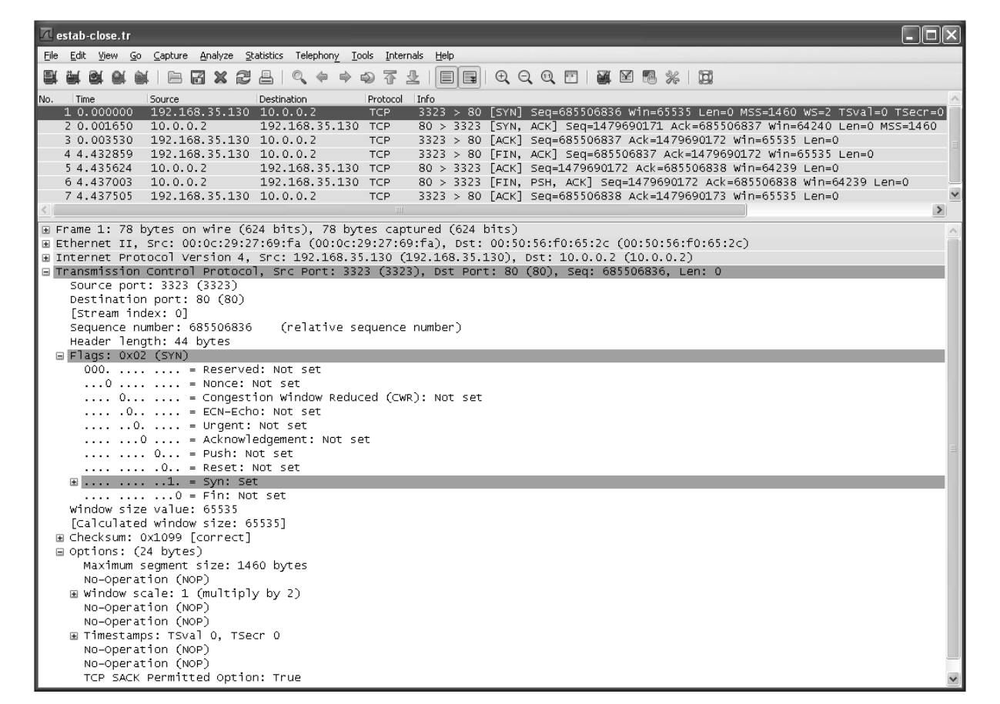
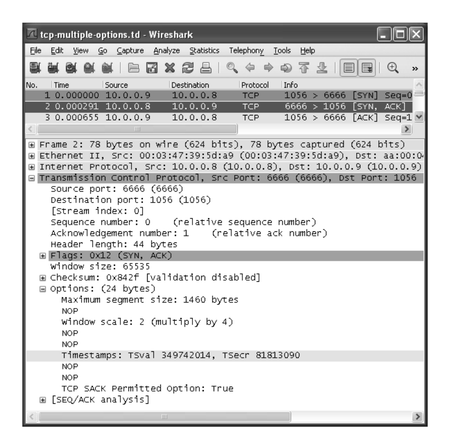
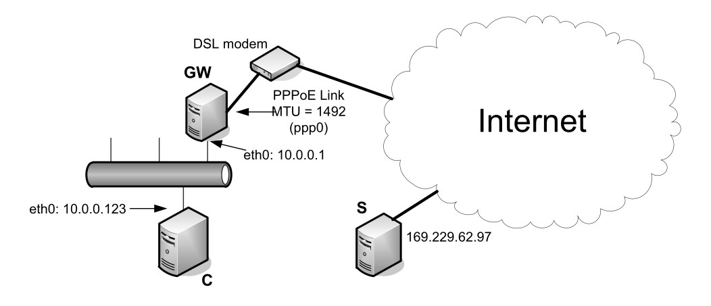
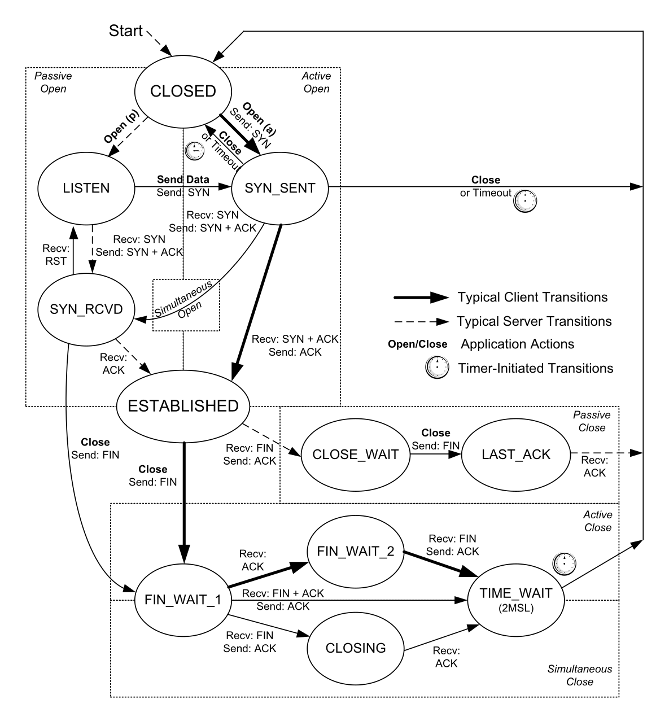
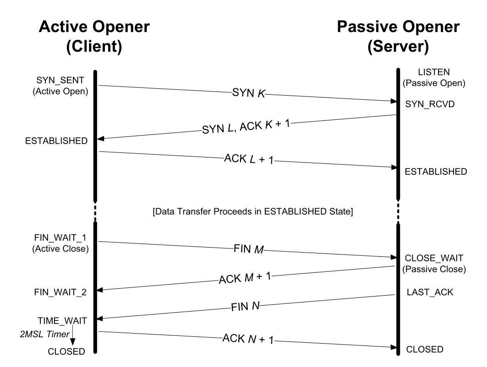
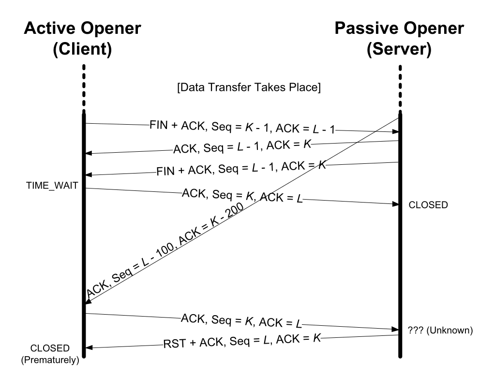

# Chapter 13. TCP Connection Management

- 과목: Computer Network
- 기준 교재: TCP/IP Illustrated, Volume 1
- 관련 페이지: PDF pp. 634-685
- 우선순위: 필수

## 개요

TCP는 connection-oriented unicast transport protocol이다. UDP처럼 datagram을 그냥 던지는 방식이 아니라, 양 끝점이 connection state를 만들고 유지하며, 연결 설정(connection establishment), 데이터 전송(data transfer), 연결 종료(connection termination)를 별도 절차로 다룬다. 이 connection state 때문에 TCP는 reliability, flow control, congestion control, sequencing을 제공할 수 있지만, 동시에 UDP보다 구현과 운용이 훨씬 복잡해진다.

이 장의 핵심은 TCP connection이 어떻게 만들어지고 닫히는지, 상태(state)가 어떤 식으로 전이되는지, connection setup 때 TCP options가 어떻게 협상되는지, 그리고 reset/half-open/TIME_WAIT/server queue/attack처럼 실제 네트워크에서 문제가 되는 경계 사례를 이해하는 것이다. 특히 SYN, FIN, ACK, RST, ISN, TIME_WAIT, MSS, SACK, Window Scale, Timestamp, PAWS 같은 용어는 이후 TCP 장 전체에서 반복되므로 영어 약어 그대로 검색 가능하게 유지한다.

## 핵심 개념

- TCP connection은 두 socket endpoint의 쌍, 즉 `(source IP address, source port, destination IP address, destination port)` 4-tuple로 식별된다.
- 연결 설정은 보통 3-way handshake로 진행된다. active opener가 SYN을 보내고, passive opener가 SYN+ACK로 응답하며, active opener가 ACK로 마무리한다.
- SYN과 FIN은 payload가 없더라도 sequence number space에서 각각 1바이트를 소비한다. 그래서 ACK 번호는 SYN/FIN의 sequence number에 1을 더한 값이 된다.
- 연결 종료는 양방향 byte stream을 각각 닫아야 하므로 보통 FIN 두 개와 ACK 두 개가 필요하다. 한쪽 방향만 닫는 half-close도 가능하다.
- ISN(Initial Sequence Number)은 오래 지연된 이전 connection incarnation의 segment가 새 connection에 섞이는 문제를 줄이기 위해 필요하다.
- TCP option은 SYN 교환 때 주로 협상되며, TCP header option 공간은 최대 40 bytes라서 모든 기능을 무한히 붙일 수 없다.

## 세부 정리

### 13.1 Introduction

TCP는 application 간에 reliable byte stream을 제공하지만, 그 출발점은 단순히 "데이터를 신뢰성 있게 보낸다"가 아니라 "양 끝이 같은 connection을 공유한다고 합의한다"이다. 이 합의 없이는 sequence number, ACK, retransmission, receive window, congestion window 같은 TCP 내부 장치들이 의미를 갖기 어렵다.

UDP와의 큰 차이는 connection state의 유무다. UDP는 각 datagram이 독립적이지만 TCP는 connection마다 상태를 둔다. 따라서 TCP endpoint는 현재 연결이 어떤 단계인지, 다음에 기대하는 sequence number가 무엇인지, 어떤 option이 협상되었는지, 어느 쪽 stream이 닫혔는지를 계속 기억해야 한다. 이 장은 이 state를 만드는 절차와 없애는 절차를 다룬다.

TCP options는 connection establishment 때 교환되는 경우가 많다. 예를 들어 MSS, Window Scale, SACK Permitted, Timestamp 같은 option은 SYN segment에 실려 상대에게 능력을 알린다. 단, TCP header에서 options가 차지할 수 있는 공간은 40 bytes로 제한되므로, option 설계는 항상 기능성과 공간 제약 사이의 trade-off를 가진다.

### 13.2 TCP Connection Establishment and Termination

TCP connection은 두 endpoint의 쌍이다. 여기서 endpoint는 IP address와 port number의 조합이며 흔히 socket이라고 부른다. 하나의 TCP connection은 다음 4-tuple로 유일하게 구분된다.

```text
(source IP address, source port, destination IP address, destination port)
```

TCP connection의 생애는 크게 세 단계다.

| 단계 | 의미 | 대표 제어 비트 |
|---|---|---|
| connection establishment | 양 끝이 connection state, sequence number, options를 합의 | SYN, ACK |
| data transfer | byte stream을 순서와 신뢰성을 유지하며 전송 | ACK, PSH 등 |
| connection termination | 양방향 stream을 각각 닫고 state를 정리 | FIN, ACK |

일반적인 연결 설정은 3-way handshake다. 먼저 active opener, 보통 client가 SYN segment를 보낸다. 이 segment에는 destination port, client의 ISN(c), 그리고 client가 사용하려는 TCP options가 들어간다. server는 passive open 상태에서 이 SYN을 받으면 자신의 ISN(s)을 고르고, SYN+ACK segment로 응답한다. 이때 ACK number는 `ISN(c) + 1`이다. 마지막으로 client가 `ISN(s) + 1`을 ACK하면 연결이 established 상태가 된다.

<p align="center"></p>
<p align="center"><sub>Figure 13-1 · PDF p. 635 · TCP three-way handshake와 normal close 흐름</sub></p>

SYN이 sequence number space에서 1을 소비한다는 점이 중요하다. SYN segment가 실제 application payload를 싣지 않더라도, 상대는 다음에 올 데이터의 sequence number를 `ISN + 1`부터 기대한다. SYN이 손실되면 다른 TCP segment처럼 재전송된다.

3-way handshake는 단순한 인사 절차가 아니다. 양쪽이 연결 시작을 알고, 서로의 initial sequence number를 확인하며, connection-level option을 교환하는 최소 절차다. TCP는 이론적으로 SYN에 application data를 실을 수 있지만, 전통적인 Berkeley sockets API가 이를 일반적으로 지원하지 않아 실제 사용은 드물다.

연결 종료는 설정보다 더 비대칭적이다. TCP byte stream은 full-duplex라서 각 방향을 따로 닫을 수 있다. 한쪽 application이 `close()`를 호출하면 그 TCP는 더 보낼 데이터가 없다는 뜻으로 FIN을 보낸다. 상대는 FIN을 ACK하고, 자기 application에게 end-of-file 성격의 알림을 준다. 상대 application도 더 보낼 데이터가 없을 때 자신의 FIN을 보내고, 첫 번째 쪽이 이를 ACK하면 양방향 종료가 끝난다.

정상적인 종료에서 active closer는 먼저 FIN을 보내는 쪽이고, passive closer는 그 FIN을 먼저 받는 쪽이다. FIN 역시 sequence number space에서 1을 소비하므로 FIN에 대한 ACK는 `FIN sequence number + 1`이다. FIN도 ACK될 때까지 재전송된다.

데이터가 전혀 없는 가장 단순한 TCP 대화라도 보통 connection establishment 3 segments와 connection termination 4 segments, 총 7 segments가 필요하다. 그래서 매우 작은 요청/응답에는 UDP가 더 가벼워 보일 수 있다. 다만 UDP를 쓰면 reliability, retransmission, congestion control, flow control 같은 책임이 application 또는 별도 protocol 설계로 올라간다.

### 13.2.1 TCP Half-Close

TCP half-close는 한쪽 방향의 byte stream만 닫고 반대 방향은 계속 열어 두는 기능이다. `close()`는 보통 양방향 사용을 끝내겠다는 뜻에 가깝지만, `shutdown()` API를 쓰면 "나는 더 이상 보내지 않지만, 상대가 보내는 데이터는 계속 받겠다"는 상태를 만들 수 있다.

<p align="center"></p>
<p align="center"><sub>Figure 13-2 · PDF p. 638 · TCP half-close에서 한 방향 FIN 이후 반대 방향 data가 계속 흐르는 모습</sub></p>

half-close에서는 먼저 한쪽이 FIN+ACK를 보내 자신의 송신 방향을 닫는다. 상대는 이를 ACK하지만 connection 전체는 아직 끝나지 않는다. 상대는 필요한 데이터를 계속 보낼 수 있고, 마지막에 자신의 FIN을 보낸다. 그 FIN이 ACK되면 connection이 완전히 닫힌다.

이 기능은 protocol 표현력 측면에서는 유용하다. 예를 들어 client가 요청 데이터 전송 완료를 FIN으로 알리고, server는 그 뒤에도 결과를 stream으로 계속 보낼 수 있다. 하지만 실제 application에서는 half-close를 명시적으로 활용하는 경우가 많지 않다. 많은 프로그램이 full-duplex 종료의 세밀한 의미보다 단순한 `close()` 모델에 맞춰 작성되기 때문이다.

### 13.2.2 Simultaneous Open and Close

일반적인 TCP 설명은 client가 active open, server가 passive open을 한다고 가정한다. 하지만 TCP 자체는 양쪽이 동시에 active open을 시도하는 simultaneous open도 허용한다. 이 경우 두 application이 서로의 IP address와 port number를 이미 알고 있어야 하며, 양쪽이 상대의 SYN을 받기 전에 자기 SYN을 먼저 보낸다.

<p align="center"></p>
<p align="center"><sub>Figure 13-3 · PDF p. 639 · simultaneous open에서 양쪽이 모두 active opener가 되는 흐름</sub></p>

simultaneous open은 두 개의 독립적인 TCP connection이 만들어지는 상황이 아니다. 같은 4-tuple을 양방향에서 바라본 하나의 connection이 만들어진다. 보통의 3-way handshake보다 segment 수가 하나 더 필요하며, 양쪽 모두 SYN을 보내고, 받은 SYN을 ACK하는 구조가 된다. 전통적인 client/server 모델에서는 드물지만 NAT traversal이나 hole punching 같은 상황을 이해할 때 배경 개념이 된다.

simultaneous close는 양쪽 application이 거의 동시에 active close를 하는 경우다. 두 쪽 모두 FIN을 보내고, 각자 상대 FIN을 ACK한다.

<p align="center"></p>
<p align="center"><sub>Figure 13-4 · PDF p. 639 · simultaneous close에서 양쪽 FIN이 교차하는 흐름</sub></p>

simultaneous close는 normal close와 segment 수는 같을 수 있지만 state transition은 다르다. 한쪽이 FIN을 보낸 뒤 상대 FIN도 받는 중간 상태들이 등장하기 때문에, TCP 구현의 finite state machine을 볼 때 이 예외 경로를 빠뜨리면 안 된다.

### 13.2.3 Initial Sequence Number (ISN)

TCP segment가 유효하려면 단순히 IP address와 port number만 맞아서는 부족하다. TCP는 도착 segment가 현재 connection의 4-tuple과 맞고, checksum이 올바르며, sequence number가 현재 receive window 안에 들어올 때 그 segment를 받아들인다. 이 때문에 sequence number는 reliability뿐 아니라 오래된 segment나 위조 segment를 걸러내는 데도 관여한다.

ISN(Initial Sequence Number)은 새 connection의 시작 sequence number다. TCP가 ISN을 신중하게 고르는 이유는 이전 connection incarnation에서 오래 지연된 segment가 네트워크 어딘가에 남아 있다가, 같은 4-tuple을 가진 새 connection에 뒤늦게 도착할 수 있기 때문이다. 만약 새 connection의 sequence number 범위가 이전 connection의 남은 segment와 겹치면, 새 connection은 과거 데이터를 현재 데이터로 오인할 수 있다.

RFC 0793의 고전적 설명에서는 32-bit ISN counter가 약 4 microseconds마다 증가한다고 본다. 핵심 의도는 connection incarnation 사이에서 sequence number space가 쉽게 겹치지 않도록 시간 기반으로 출발점을 이동시키는 것이다. 다만 현대 TCP는 단순한 clock 기반 ISN만으로는 보안상 부족하다.

공격자가 connection의 4-tuple과 현재 유효한 sequence number window를 맞출 수 있으면 TCP segment를 위조할 수 있다. 그래서 현대 구현은 ISN과 ephemeral port를 예측하기 어렵게 만든다. 예를 들어 Linux는 clock 성분에 더해 4-tuple과 secret을 hash한 random offset을 사용하고, secret을 주기적으로 갱신한다. Windows 계열도 randomization을 사용한다. 이런 방식은 old duplicate segment 문제와 off-path spoofing 위험을 동시에 줄이려는 설계다.

TCP checksum은 오류 검출용이지 강한 무결성 보장 장치가 아니다. 큰 파일이나 high integrity가 필요한 application은 TCP가 제공하는 checksum만 믿기보다 application-level CRC/checksum 또는 cryptographic integrity check를 따로 두는 편이 안전하다.

### 13.2.4 Example

본문의 예제는 Windows Telnet client가 `10.0.0.2`의 HTTP port 80으로 TCP connection을 열었다가, application data를 보내지 않고 약 4.4초 뒤 종료하는 흐름이다. Telnet이 23번이 아닌 다른 port에 연결되면 Telnet application protocol을 수행하지 않고, 표준 입력과 TCP connection 사이에서 byte를 복사하는 단순 client처럼 동작한다. Web server는 HTTP request를 기다리지만 client가 아무 요청도 보내지 않으므로 data segment 없이 connection management segment만 관찰하기 좋다.

<p align="center"></p>
<p align="center"><sub>Figure 13-5 · PDF p. 642 · data 없이 TCP connection을 설정하고 종료한 Wireshark trace</sub></p>

trace의 앞 세 segment는 3-way handshake다. client SYN에는 `ISN = 685506836`, advertised window `65535`, 그리고 여러 TCP options가 들어 있다. server의 SYN+ACK는 `ISN = 1479690171`을 사용하고, client SYN을 받았다는 뜻으로 `ACK = 685506837`을 보낸다. 마지막 client ACK는 `ACK = 1479690172`로 server SYN을 확인한다.

ACK number는 "마지막으로 받은 번호"가 아니라 "다음에 기대하는 sequence number"라는 점을 계속 유지해야 한다. SYN이 sequence number space에서 1을 소비하므로 client ISN `685506836`을 받았다는 ACK는 `685506837`이고, server ISN `1479690171`을 받았다는 ACK는 `1479690172`다.

종료에서는 client가 FIN을 보낸다. FIN sequence number가 `685506837`이면 server는 `ACK = 685506838`로 확인한다. 이후 server가 자신의 FIN을 보내고, client가 `ACK = 1479690173`으로 이를 확인한다. server의 마지막 FIN segment에 PSH(Push) bit가 켜져 있지만, 이 예제에서는 보낼 data가 없으므로 종료 의미 자체를 바꾸지는 않는다. PSH는 보통 송신 버퍼의 데이터를 밀어내라는 힌트로 이해하면 된다.

이 예제에서 SYN segment의 TCP header가 최소 20 bytes보다 훨씬 큰 44 bytes라는 점도 중요하다. 추가 24 bytes는 TCP options가 차지한다. 즉 connection setup은 단순히 sequence number만 교환하는 절차가 아니라, 이후 connection의 성능과 기능을 좌우하는 option negotiation 지점이다.

### 13.2.5 Timeout of Connection Establishment

connection establishment가 실패하는 대표 상황은 server host가 응답하지 않는 경우다. 같은 subnet에 존재하지 않는 host로 TCP connection을 시도하면, 보통은 ARP reply가 없어 "No route to host"처럼 link-layer resolution 단계에서 실패할 수 있다. 본문 예제는 ARP table에 가짜 entry를 먼저 넣어 ARP 실패를 우회하고, TCP가 실제로 SYN을 보내며 timeout되는 흐름을 관찰한다.

응답이 없는 host를 향해 client는 SYN을 반복 전송한다. 예제 trace의 전송 간격은 대략 다음과 같다.

| SYN 시도 | 이전 시도 후 간격 |
|---|---:|
| 1 | 0s |
| 2 | 3s |
| 3 | 6s |
| 4 | 12s |
| 5 | 24s |
| 6 | 48s |

이 패턴은 exponential backoff다. 매번 같은 간격으로 SYN을 보내면 장애나 congestion 상황에서 네트워크에 부담을 줄 수 있으므로, TCP는 재시도 간격을 점점 늘린다. Chapter 3의 Ethernet CSMA/CD backoff와 비슷한 이름을 공유하지만, 여기서는 간격이 deterministic하게 두 배씩 늘고, Ethernet처럼 무작위 backoff 값을 고르는 구조는 아니다.

초기 SYN 재전송 횟수는 운영체제 설정에 따라 달라질 수 있다. Linux에서는 `net.ipv4.tcp_syn_retries`가 active open 중 SYN 재전송 최대 횟수를 정하고, `net.ipv4.tcp_synack_retries`는 passive open 응답으로 보낸 SYN+ACK 재전송 횟수에 대응한다. 개별 connection에는 Linux-specific `TCP_SYNCNT` socket option을 쓸 수 있다. 이 backoff timing은 TCP congestion management의 일부이며, 이후 Chapter 16의 Karn's algorithm과도 연결된다.

### 13.2.6 Connections and Translators

NAT, NAT64 같은 translator는 TCP를 단순히 IP address와 port number만 바꿔서 통과시키는 장치로 보기 어렵다. TCP checksum은 pseudo-header를 포함하므로, IP address나 protocol 관련 값이 바뀌면 checksum도 조정되어야 한다. checksum-neutral address modifier 같은 예외가 없다면, TCP/UDP처럼 pseudo-header checksum을 쓰는 transport protocol은 translation 시 checksum 보정이 필요하다.

TCP connection이 시작될 때 translator는 SYN bit를 보고 새 connection을 추적할 수 있다. 이어지는 SYN+ACK와 ACK의 sequence/ACK number까지 보면 connection이 fully established 되었는지도 판단할 수 있다. 종료도 FIN/ACK 흐름을 따라가며 추적한다. 그래서 실용적인 NAT 구현은 TCP state machine의 일부를 내부에 갖고, 각 방향의 current state, sequence number, ACK number를 관리한다.

translator가 payload까지 수정하는 editor 역할을 하면 훨씬 위험해진다. TCP byte stream 중간에 byte를 삽입하거나 삭제하면 이후 sequence number와 segment length가 모두 달라진다. NAT가 양방향 sequence number를 적절히 보정하면 동작할 수 있지만, translator state가 end host의 TCP state와 어긋나는 순간 connection은 쉽게 깨진다. 즉 TCP stream을 "중간에서 편집"하는 기능은 가능하더라도 fragile하며, state synchronization이 설계의 핵심 부담이다.

### 13.3 TCP Options

TCP header에는 options가 들어갈 수 있다. 원래 TCP specification에 있던 option은 EOL(End of Option List), NOP(No Operation), MSS(Maximum Segment Size) 정도였지만, 이후 성능과 보안을 위해 여러 option이 추가되었다. 중요한 제약은 option 공간이 최대 40 bytes라는 점이다. TCP header length가 32-bit word 단위로 표현되므로 header 전체 길이는 4 bytes의 배수여야 하고, NOP는 이 정렬을 맞추는 padding 용도로 자주 쓰인다.

option은 기본적으로 1-byte kind로 시작한다. EOL(kind 0)과 NOP(kind 1)는 1 byte짜리 option이고, 나머지 대부분은 kind 뒤에 length byte를 둔다. 이해하지 못하는 option은 RFC 1122 원칙에 따라 무시된다. 이 특성 덕분에 새 TCP option을 추가해도 오래된 구현과 어느 정도 상호 운용할 수 있다.

주요 TCP option은 다음처럼 기억하면 된다.

| Option | Kind | 핵심 목적 | 주로 등장하는 위치 |
|---|---:|---|---|
| EOL | 0 | option list 종료 | option list 끝 |
| NOP | 1 | 4-byte alignment padding | option 사이 |
| MSS | 2 | 수신 가능한 최대 TCP data bytes 알림 | SYN |
| WSOPT / Window Scale | 3 | 16-bit window field를 scale해서 큰 window 사용 | SYN |
| SACK-Permitted | 4 | SACK block을 받을 수 있음을 알림 | SYN |
| SACK | 5 | out-of-order로 받은 byte range 알림 | 연결 성립 후 |
| TSOPT / Timestamp | 8 | RTT 측정, PAWS 지원 | SYN 및 일반 segment |
| UTO | 28 | USER_TIMEOUT 힌트 전달 | SYN, 초기 non-SYN, 변경 시 |
| TCP-AO | 29 | cryptographic authentication | segment별 |

### 13.3.1 Maximum Segment Size (MSS) Option

MSS(Maximum Segment Size)는 한 TCP가 peer로부터 받기를 원하는 최대 TCP data 크기다. 여기서 MSS는 TCP payload bytes만 세며, IP header나 TCP header 길이는 포함하지 않는다. connection establishment 때 각 endpoint는 보통 SYN segment의 MSS option으로 자신의 MSS를 알린다.

MSS option이 없으면 default MSS는 536 bytes다. 이는 IPv4 host가 최소 576-byte datagram을 처리해야 한다는 규칙과 연결된다. 최소 IPv4 header 20 bytes, TCP header 20 bytes, TCP data 536 bytes를 더하면 `20 + 20 + 536 = 576`이 된다.

Ethernet MTU가 1500 bytes인 일반 IPv4 환경에서는 MSS 1460이 흔하다. IPv4 header 20 bytes와 TCP header 20 bytes를 빼면 `1500 - 40 = 1460`이다. IPv6에서는 기본 header가 40 bytes라서 같은 MTU에서 MSS는 보통 1440이 된다. IPv6 jumbogram에서는 특수 MSS 값 65535가 실질적으로 "infinity"를 뜻할 수 있고, 이 경우 SMSS는 PMTU에서 IPv6 header 40 bytes와 TCP header 20 bytes를 뺀 값으로 결정된다.

MSS는 양쪽이 중간값을 고르는 negotiation이 아니라 각 방향의 limit이다. 내가 SYN에 MSS를 넣는다는 것은 "너는 나에게 이 크기보다 큰 TCP segment를 보내지 말라"는 뜻이다. 따라서 connection 양방향의 effective MSS가 서로 다를 수 있다.

### 13.3.2 Selective Acknowledgment (SACK) Options

TCP의 기본 ACK는 cumulative ACK다. receiver가 앞부분에서 빠진 byte range, 즉 hole을 만나면 그 뒤의 out-of-sequence data를 이미 받았더라도 application에 넘기지 못하고, ACK 역시 연속으로 받은 지점까지만 표현한다. 그러면 sender는 receiver가 뒤쪽 data를 실제로 받았는지 모른다.

SACK(Selective Acknowledgment)은 이 빈틈을 메운다. receiver가 SACK-Permitted option을 SYN 또는 SYN+ACK에서 받으면, 이후 out-of-sequence로 받은 data block을 SACK option으로 알려 줄 수 있다. 각 SACK block은 성공적으로 받은 sequence number range이며, 두 개의 32-bit sequence number로 표현된다. 따라서 `n`개의 SACK block은 kind/length 2 bytes에 block당 8 bytes가 붙어 `(8n + 2)` bytes가 된다.

option 공간 제한 때문에 한 segment에 담을 수 있는 SACK block 수는 제한된다. 현대 TCP에서 Timestamp option도 함께 쓰는 경우가 많으므로, 한 TCP header에 실을 수 있는 SACK block은 보통 최대 3개 정도다. SACK-Permitted는 SYN에서만 보내지만, 실제 SACK block은 연결 성립 후 어느 segment에도 실릴 수 있다. SACK의 진짜 가치는 어떤 segment를 재전송할지 더 정밀하게 고르는 데 있으므로, 자세한 효과는 error control과 congestion control을 다루는 Chapter 14, Chapter 16과 연결된다.

### 13.3.3 Window Scale (WSCALE or WSOPT) Option

기본 TCP Window Advertisement field는 16 bits라서 최대 65,535 bytes까지만 직접 표현할 수 있다. 고속 장거리 네트워크처럼 bandwidth-delay product가 큰 환경에서는 이 값이 너무 작다. Window Scale option, 즉 WSCALE/WSOPT는 field 자체를 키우지 않고 scale factor를 둬서 16-bit window 값을 왼쪽으로 shift한다.

수식으로는 실제 window가 다음처럼 계산된다.

```text
real advertised window = 16-bit window field << scale factor
```

scale factor는 0부터 14까지 가능하다. 0은 scaling 없음이고, 14이면 최대 `65,535 * 2^14 = 1,073,725,440 bytes` 정도, 즉 약 1GB에 가까운 window를 표현할 수 있다. TCP는 내부적으로 real window를 32-bit 값으로 유지한다.

WSOPT는 SYN segment에만 등장할 수 있으므로 scale factor는 connection establishment 때 방향별로 고정된다. window scaling을 쓰려면 양쪽이 SYN에서 이 option을 보내야 한다. active opener가 SYN에 WSOPT를 넣더라도, passive opener가 SYN+ACK에 WSOPT를 보내지 않으면 scale은 0으로 간주된다. 또한 양방향 scale factor는 서로 다를 수 있다. 이 구조는 option을 모르는 오래된 TCP와의 interoperation을 보장한다.

### 13.3.4 Timestamps Option and Protection against Wrapped Sequence Numbers (PAWS)

Timestamps option(TSOPT/TSopt)은 각 segment에 두 개의 4-byte timestamp 값을 넣는다. sender는 Timestamp Value(TSV 또는 TSval)를 채우고, receiver는 이를 Timestamp Echo Reply(TSER 또는 TSecr)에 그대로 반사한다. kind/length 2 bytes까지 합치면 TSOPT는 TCP header를 10 bytes 늘린다.

<p align="center"></p>
<p align="center"><sub>Figure 13-6 · PDF p. 648 · Timestamp, Window Scaling, MSS options가 SYN에 포함된 TCP header</sub></p>

timestamp 값은 monotonically increasing이면 충분하다. receiver는 상대 timestamp의 단위나 실제 시각을 알 필요가 없고, 두 host 간 clock synchronization도 필요 없다. 처음 client SYN에서는 server timestamp를 아직 모르므로 TSER가 0이고, server의 SYN+ACK가 client의 TSV를 echo하면서 자신의 TSV를 함께 보낸다.

Timestamp의 첫 번째 용도는 RTT 측정이다. sender는 자신이 보낸 TSval이 ACK에서 TSecr로 돌아오는 시간을 보고 더 자주 RTT sample을 얻을 수 있다. 기존 TCP가 window당 하나 정도의 RTT sample만 얻던 것과 달리, TSOPT를 쓰면 retransmission timeout(RTO)을 더 잘 추정할 수 있다. 이 내용은 Chapter 14의 retransmission timer와 직접 연결된다.

두 번째 용도는 PAWS(Protection Against Wrapped Sequence Numbers)다. TCP sequence number는 32 bits라서 고속 연결에서는 오래 걸리지 않아 wrap될 수 있다. 큰 window, 높은 전송률, 오래 지연된 segment가 겹치면, 예전 segment와 새 segment가 같은 sequence number range를 가질 위험이 생긴다.

PAWS는 timestamp를 sequence number의 추가 구분자처럼 사용한다. receiver는 최근에 본 유효 timestamp보다 오래된 timestamp를 가진 segment를 old duplicate로 보고 버릴 수 있다. 예를 들어 sequence number가 0G:1G 범위로 다시 돌아왔더라도 timestamp가 더 최신이면 현재 data로 보고, 예전 timestamp가 뒤늦게 도착하면 폐기한다. PAWS 역시 양 host의 시각 동기화는 필요 없고, timestamp가 window당 적어도 1씩 증가할 정도로 단조 증가하면 된다.

### 13.3.5 User Timeout (UTO) Option

UTO(User Timeout) option은 한 TCP sender가 outstanding data에 대한 ACK를 얼마나 기다릴지, 즉 remote end가 실패했다고 판단하기 전의 USER_TIMEOUT 값을 peer에게 알리는 기능이다. 전통적으로 USER_TIMEOUT은 local TCP parameter였지만, UTO option은 이 값을 상대에게 advisory hint로 전달한다.

UTO는 강제 negotiation이 아니다. 상대가 큰 UTO나 작은 UTO를 광고해도 로컬 TCP가 반드시 그 값을 따라야 하는 것은 아니다. 긴 UTO는 resource exhaustion 위험을 키울 수 있고, 너무 짧은 UTO는 정상 connection을 너무 빨리 끊어 DoS와 비슷한 효과를 낼 수 있다. 그래서 upper/lower limit를 두고 최종 USER_TIMEOUT을 제한한다.

본문의 계산식은 다음 의미다.

```text
USER_TIMEOUT = min(U_LIMIT, max(ADV_UTO, REMOTE_UTO, L_LIMIT))
```

`ADV_UTO`는 내가 peer에게 광고한 값, `REMOTE_UTO`는 peer가 광고한 값, `U_LIMIT`와 `L_LIMIT`는 local system의 상한/하한이다. 이 식은 양 endpoint가 반드시 같은 USER_TIMEOUT을 갖는다는 뜻이 아니다. 또한 `L_LIMIT`는 connection의 RTO보다 커야 하며, RFC 1122 호환성을 위해 100s가 권장된다. UTO option은 SYN, 첫 non-SYN segment, USER_TIMEOUT 변경 시 포함될 수 있지만 아직 널리 배치된 기능은 아니다.

### 13.3.6 Authentication Option (TCP-AO)

TCP-AO(TCP Authentication Option)는 TCP spoofing attack에 대응하기 위한 TCP segment authentication 기능이다. 이전의 TCP-MD5를 개선하고 대체하기 위해 설계되었으며, shared secret과 cryptographic hash algorithm을 이용해 각 TCP segment를 인증한다.

송신 TCP는 shared secret key에서 traffic key를 파생하고, 정해진 cryptographic algorithm으로 hash value를 계산해 segment에 붙인다. 수신 TCP는 같은 secret으로 traffic key를 만들고 hash를 검증해 segment가 transit 중 수정되지 않았는지 높은 확률로 확인한다. TCP-AO는 다양한 cryptographic algorithm과 in-band key change signaling을 지원한다는 점에서 TCP-MD5보다 유연하다.

다만 TCP-AO는 key management solution 자체는 아니다. 양 endpoint가 사전에 shared key set을 안전하게 만들고 배포하는 문제는 별도로 해결해야 한다. 이 배치 부담 때문에 TCP-AO 역시 모든 일반 TCP connection에서 널리 쓰이는 옵션은 아니며, 보안이 중요한 특정 routing/control connection 같은 맥락에서 의미가 크다.

### 13.4 Path MTU Discovery with TCP

path MTU(PMTU)는 두 host 사이 현재 경로에 있는 link MTU 중 최솟값이다. TCP가 PMTU를 알면 IP fragmentation을 피하면서도 가능한 큰 segment를 사용할 수 있다. UDP는 application이 datagram size를 정하는 경우가 많아 transport layer가 적응하기 어렵지만, TCP는 byte stream abstraction을 제공하고 segment 크기를 TCP가 결정하므로 PMTUD를 성능 조정에 더 적극적으로 활용할 수 있다.

TCP에서 일반 PMTUD는 ICMPv4 Destination Unreachable(Fragmentation Required) 또는 ICMPv6 Packet Too Big(PTB) message를 이용한다. 본문은 두 경우를 통칭해 PTB라고 부른다. ICMP에 의존하지 않는 대안으로 PLPMTUD(Packetization Layer Path MTU Discovery)도 있으며, 이 경우 transport/protocol layer가 packet loss를 빠르게 감지하고 datagram size를 직접 조정해야 한다.

connection이 established될 때 TCP는 보통 다음 값들 중 작은 쪽을 바탕으로 SMSS(Send Maximum Segment Size)를 고른다.

```text
initial SMSS = min(outgoing interface MTU에서 header를 뺀 값, peer가 알린 MSS)
```

중요한 제한은 PMTUD가 peer가 광고한 MSS를 초과하게 해 주지는 않는다는 점이다. 상대가 "나는 이 크기보다 큰 TCP data segment를 받지 않겠다"고 MSS를 알렸다면, path가 더 큰 packet을 허용해도 sender는 그 MSS를 넘어서는 안 된다. 반대로 peer가 MSS를 알리지 않으면 default 536 bytes를 가정하지만, 현대 TCP에서는 드문 경우다.

초기 SMSS가 정해지면 TCP/IPv4는 해당 connection의 IP datagram에 DF(Don't Fragment) bit를 설정한다. IPv6에는 DF bit가 없고, router fragmentation이 허용되지 않는 모델이므로 사실상 항상 DF가 설정된 것처럼 동작한다. 경로 중간 router가 packet을 보낼 수 없으면 PTB를 돌려보내고, TCP는 segment size를 줄인 뒤 재전송한다.

PTB에 next-hop MTU가 포함되어 있으면 sender는 대략 다음처럼 새 segment size를 잡을 수 있다.

```text
new TCP segment size = next-hop MTU - IP header size - TCP header size
```

옛 ICMP error처럼 next-hop MTU 정보가 없으면 sender는 binary search 같은 방식으로 사용할 수 있는 값을 탐색할 수 있다. segment size 변화는 congestion control에도 영향을 주므로 Chapter 16의 성능 제어와 연결된다.

route는 동적으로 바뀔 수 있기 때문에, TCP는 segment size를 줄인 뒤 충분한 시간이 지나면 초기 SMSS까지 더 큰 값을 다시 시도할 수 있다. RFC 1191/RFC 1981 계열의 guidance는 이 재시도 간격을 약 10분 정도로 본다.

PMTUD의 대표 운용 문제는 PMTUD black hole이다. firewall이나 NAT가 PTB/ICMP error를 막으면, TCP sender는 큰 packet이 경로 중간에서 버려진다는 사실을 알지 못한다. 작은 SYN, SYN+ACK는 통과하므로 connection setup은 성공하지만, 큰 data packet을 보내기 시작하면 connection이 멈춘 것처럼 보인다. 일부 TCP는 segment가 여러 번 재전송될 때 더 작은 segment size를 시험하는 black hole detection을 둔다.

### 13.4.1 Example

본문 예제는 PPPoE link가 있는 topology에서 PMTUD가 segment size를 줄이는 과정을 보여 준다. PPPoE는 Ethernet 1500-byte MTU에서 PPPoE overhead 6 bytes와 PPP overhead 2 bytes를 빼 MTU를 1492 bytes로 낮춘다. 예제에서는 효과를 분명히 보기 위해 PPPoE interface MTU를 288 bytes로 더 낮춘다.

<p align="center"></p>
<p align="center"><sub>Figure 13-7 · PDF p. 653 · PPPoE link에서 PMTU가 줄어드는 TCP PMTUD 예제 topology</sub></p>

client C는 `10.0.0.123`, gateway는 `10.0.0.1`, Internet server S는 `169.229.62.97`이다. gateway의 PPPoE MTU를 288로 낮추고, client의 `net.ipv4.route.min_pmtu`도 68로 낮춰 Linux가 너무 작은 PMTU를 clamp하지 않게 한다. 기본 clamp가 있으면 작은 MTU 공격을 줄이는 데는 도움이 되지만, 여기서는 288-byte PMTU 관찰을 방해한다.

trace에서 connection은 이미 established 되었고 MSS option도 교환된 상태다. 모든 packet에는 DF bit가 설정되어 있어 양쪽 모두 PMTUD를 수행한다. 흥미로운 점은 path가 방향별로 비대칭일 수 있다는 것이다. remote side에서 오는 588-byte packet은 통과하지만, local side가 같은 크기의 588-byte packet을 DF로 보내면 gateway가 `need to frag (mtu 288)` PTB를 돌려준다. 즉 outbound PMTU와 inbound PMTU가 다를 수 있다.

PTB를 받은 TCP는 다음 packet을 288 bytes로 줄여 보낸다. 원래 588-byte packet에 담으려던 sequence range는 288-byte packet, 또 다른 288-byte packet, 그리고 남은 작은 packet으로 나뉘어 전송된다. 이후 큰 1452-byte packet을 시도했을 때도 다시 PTB를 받고, 288-byte 단위로 쪼개는 패턴이 반복된다.

PMTUD는 connection이 시작된 뒤 TCP가 segment size를 명시적으로 조정하는 드문 메커니즘 중 하나다. segment size는 throughput에 영향을 주고, window size와 함께 Chapter 15의 TCP performance 논의로 이어진다.

### 13.5 TCP State Transitions

TCP가 어떤 segment를 보내고 어떤 segment를 받아들이는지는 현재 state에 의해 결정된다. state는 segment 송수신, timer expiration, application의 read/write/close, 다른 layer에서 온 정보에 따라 바뀐다. 이 규칙을 한 장으로 요약한 것이 TCP state transition diagram, 즉 TCP finite state machine이다.

### 13.5.1 TCP State Transition Diagram

TCP는 초기화되면 CLOSED에서 시작한다. application이 passive open을 요청하면 LISTEN으로 가고, active open을 요청하면 SYN_SENT로 간다. 이후 SYN, ACK, FIN, RST 같은 control bit가 있는 segment를 주고받으며 state가 전이된다.

<p align="center"></p>
<p align="center"><sub>Figure 13-8 · PDF p. 656 · TCP finite state machine과 active/passive close 경로</sub></p>

주요 state는 다음처럼 묶어 이해하면 좋다.

| State | 의미 |
|---|---|
| CLOSED | connection이 없거나 완전히 닫힌 상태 |
| LISTEN | passive open 후 SYN을 기다리는 server 쪽 상태 |
| SYN_SENT | active open 후 SYN+ACK 또는 SYN을 기다리는 상태 |
| SYN_RCVD | SYN을 받고 SYN+ACK를 보낸 뒤 최종 ACK를 기다리는 상태 |
| ESTABLISHED | 양방향 data transfer가 가능한 정상 연결 상태 |
| FIN_WAIT_1 | active close 후 FIN을 보냈고 ACK/FIN을 기다리는 상태 |
| FIN_WAIT_2 | 내가 보낸 FIN은 ACK되었고, peer의 FIN을 기다리는 상태 |
| CLOSE_WAIT | peer의 FIN을 받았고 local application의 close를 기다리는 상태 |
| CLOSING | simultaneous close에서 양쪽 FIN이 교차한 상태 |
| LAST_ACK | passive close 쪽이 FIN을 보냈고 그 ACK를 기다리는 상태 |
| TIME_WAIT | final ACK 후 old duplicate를 막기 위해 2MSL 동안 기다리는 상태 |

ESTABLISHED는 Chapter 14-17의 대부분 TCP data transfer 논의가 벌어지는 상태다. FIN_WAIT_1, FIN_WAIT_2, TIME_WAIT은 local application이 먼저 close한 active close 경로에 속한다. CLOSE_WAIT과 LAST_ACK는 peer가 먼저 FIN을 보낸 passive close 경로다. CLOSING은 simultaneous close에서 등장한다.

<p align="center"></p>
<p align="center"><sub>Figure 13-9 · PDF p. 658 · normal TCP establishment/termination에서 client와 server가 지나는 state</sub></p>

일반 client/server 흐름에서 client는 active open으로 SYN_SENT에 들어가고, server는 LISTEN에서 SYN을 받아 SYN_RCVD로 간다. 3-way handshake가 끝나면 둘 다 ESTABLISHED가 된다. 종료 예시에서는 client가 active close를 하므로 FIN_WAIT_1, FIN_WAIT_2, TIME_WAIT을 지나고, server는 CLOSE_WAIT, LAST_ACK를 지난다. 물론 active close는 client만 하는 것이 아니며 어느 쪽도 먼저 close할 수 있다.

몇 가지 덜 흔한 transition도 중요하다. LISTEN에서 SYN_SENT로 가는 transition은 TCP protocol상 합법이지만 Berkeley sockets API에서는 지원되지 않아 거의 보이지 않는다. SYN_RCVD에서 LISTEN으로 돌아가는 transition은 LISTEN에서 SYN을 받아 SYN_RCVD에 들어간 정상 server 쪽에서, 최종 ACK 대신 RST를 받았을 때 가능하다. simultaneous open으로 SYN_SENT에서 SYN_RCVD에 들어간 경우와는 구분해야 한다.

### 13.5.2 TIME_WAIT (2MSL Wait) State

TIME_WAIT은 2MSL wait state라고도 한다. MSL(Maximum Segment Lifetime)은 어떤 segment가 네트워크 안에 살아 있을 수 있는 최대 시간이다. TCP segment는 IP datagram으로 운반되고, IP에는 TTL 또는 Hop Limit가 있으므로 segment lifetime은 유한하다고 본다. RFC 0793은 MSL을 2분으로 제시하지만, 실제 구현은 30초, 1분, 2분 등을 쓴다. Linux의 `net.ipv4.tcp_fin_timeout`, Windows의 `TcpTimedWaitDelay` 같은 설정이 관련된다.

규칙은 명확하다. TCP가 active close를 수행하고 final ACK를 보낸 connection은 MSL의 두 배 동안 TIME_WAIT에 머물러야 한다. 이유는 final ACK가 손실될 수 있기 때문이다. TCP가 ACK 자체를 재전송하는 것은 아니지만, peer는 FIN이 ACK되지 않았다고 판단하면 FIN을 재전송한다. TIME_WAIT에 있는 쪽은 그 재전송 FIN을 보고 final ACK를 다시 보낼 수 있다.

TIME_WAIT의 또 다른 목적은 delayed segment가 새 connection으로 오인되는 것을 막는 것이다. TIME_WAIT 동안에는 그 connection을 정의한 4-tuple, 즉 client IP, client port, server IP, server port를 재사용하지 않는다. 이렇게 하면 이전 connection incarnation의 segment가 뒤늦게 도착해도 새 connection의 data로 잘못 해석되지 않는다.

일부 조건에서는 TIME_WAIT connection과 같은 4-tuple을 더 빨리 재사용할 수 있다. 예를 들어 새 connection의 ISN이 이전 incarnation에서 쓴 highest sequence number보다 충분히 크거나, Timestamps option으로 이전 incarnation의 segment를 구분할 수 있는 경우가 있다. 하지만 구현에 따라 더 엄격하게 local port 자체를 재사용하지 못하게 막기도 한다.

Berkeley sockets API의 `SO_REUSEADDR`는 이 제한을 우회하는 대표 옵션이다. 서버 프로세스를 죽였다가 곧바로 같은 well-known port로 재시작할 때 "Address already in use"가 나는 상황을 완화할 수 있다. 다만 `SO_REUSEADDR`가 있다고 해서 같은 4-tuple의 이전 connection incarnation과 새 connection을 무조건 안전하게 겹쳐도 된다는 뜻은 아니다. TCP 규칙의 본래 목적은 old duplicate segment 혼동을 막는 것이다.

client는 보통 ephemeral port를 쓰므로 TIME_WAIT이 큰 문제가 아닐 때가 많다. 하지만 짧은 시간에 같은 server로 매우 많은 connection을 만드는 client는 ephemeral port가 부족해질 수 있다. server는 well-known port를 반복 사용하므로, active close 후 TIME_WAIT에 걸리면 즉시 재시작할 때 binding error를 만나기 쉽다.

본문의 Listing 13-3과 Listing 13-4는 이 차이를 보여 준다. server가 port 6666을 쓰다가 active close로 TIME_WAIT에 들어가면, 바로 같은 port로 bind할 때 "Address already in use"가 난다. client도 자신의 local port를 강제로 지정하면 같은 문제를 재현할 수 있다. 일정 시간이 지나 TIME_WAIT이 끝나면 bind는 가능하지만, server가 이미 종료되어 있으면 다음 실패는 "Connection refused"가 된다. 이 "Connection refused"는 뒤의 reset segment 논의와 연결된다.

### 13.5.3 Quiet Time Concept

2MSL wait는 host가 정상적으로 살아 있고 TIME_WAIT state를 유지한다는 전제에서 old duplicate segment를 막는다. 하지만 host가 TIME_WAIT connection을 가진 채 crash/reboot하고, MSL 안에 같은 local/foreign IP address와 port number로 새 connection을 만들면 문제가 생긴다. reboot 전 connection의 delayed segment가 reboot 후 새 connection에 섞일 수 있다.

이 문제를 막기 위해 RFC 0793은 crash/reboot 후 새 connection을 만들기 전에 MSL만큼 기다리는 quiet time을 제안한다. 실제 구현에서 이를 엄격히 지키는 경우는 많지 않다. 대부분의 host는 crash 후 reboot 자체가 MSL보다 오래 걸릴 수 있고, application-level checksum이나 encryption을 쓰면 이런 혼동을 추가로 감지할 수 있기 때문이다.

### 13.5.4 FIN_WAIT_2 State

FIN_WAIT_2는 내가 FIN을 보냈고 상대가 ACK했지만, 아직 상대의 FIN은 받지 못한 상태다. half-close가 아니라 일반 close라면, 상대 application이 EOF 알림을 인식하고 자신의 close를 수행해야 peer FIN이 온다. 그 FIN을 받아야 active closer는 FIN_WAIT_2에서 TIME_WAIT으로 이동한다.

문제는 상대 application이 close를 하지 않으면 FIN_WAIT_2가 무한히 지속될 수 있다는 점이다. 상대는 CLOSE_WAIT에 머물고, local 쪽은 FIN_WAIT_2에 머문다. 많은 구현은 active close를 한 application이 half-close가 아닌 완전 close를 했고 connection이 idle이면 timer를 둔다. timer가 만료되면 TCP는 FIN_WAIT_2 connection을 CLOSED로 옮긴다. Linux에서는 `net.ipv4.tcp_fin_timeout`이 이 timer의 기본값, 흔히 60초를 제어한다.

### 13.5.5 Simultaneous Open and Close Transitions

simultaneous open에서는 양쪽이 거의 동시에 SYN을 보내 SYN_SENT로 들어간다. 각 endpoint는 peer의 SYN을 받으면 SYN_RCVD로 전이하고, SYN+ACK를 보낸다. 각 endpoint가 자신의 SYN에 대한 ACK를 받으면 ESTABLISHED가 된다. 결과는 하나의 TCP connection이지 두 개의 connection이 아니다.

simultaneous close에서는 양쪽 application이 동시에 close를 호출해 둘 다 FIN_WAIT_1로 들어가고 FIN을 보낸다. FIN들이 네트워크에서 교차한 뒤 각 endpoint는 peer FIN을 받으며 CLOSING으로 전이하고 final ACK를 보낸다. final ACK를 받으면 각각 TIME_WAIT으로 들어가 2MSL wait를 시작한다.

### 13.6 Reset Segments

TCP header의 RST bit가 켜진 segment를 reset segment 또는 reset이라고 한다. 일반적으로 reset은 "이 segment가 가리키는 referenced connection이 현재 TCP 상태와 맞지 않는다"는 뜻으로 보내진다. 여기서 referenced connection은 IP/TCP header의 4-tuple로 지정되는 connection이다. reset은 보통 TCP connection을 빠르게 해체한다.

### 13.6.1 Connection Request to Nonexistent Port

TCP에서 destination port에 listening process가 없는데 SYN이 도착하면, UDP처럼 ICMP Port Unreachable을 보내는 대신 TCP reset을 보낸다. 그래서 `telnet localhost 9999`처럼 사용 중이 아닌 port에 연결을 시도하면 client는 즉시 "Connection refused"를 받는다.

reset 응답의 sequence/ACK number 규칙도 중요하다. 들어온 SYN segment에는 ACK bit가 없으므로, reset의 sequence number는 0으로 설정되고 ACK number는 incoming ISN에 SYN이 소비하는 1을 더한 값이 된다.

```text
RST ACK number = incoming ISN + data length + 1(for SYN)
```

RST를 받아들이는 쪽도 아무 reset이나 믿으면 안 된다. reset segment가 TCP에 accepted 되려면 ACK bit가 설정되어 있고, ACK Number가 valid window 안에 있어야 한다. 그렇지 않으면 공격자가 4-tuple만 맞춘 reset을 보내 connection을 끊는 단순 spoofing attack이 너무 쉬워진다. RFC 5961 계열의 개선은 이런 reset 공격을 더 어렵게 만든다.

### 13.6.2 Aborting a Connection

정상 종료는 FIN을 보내는 orderly release다. FIN은 이미 queue된 data가 전송된 뒤 stream의 끝을 알리므로 일반적으로 data loss 없이 종료된다. 반면 abortive release는 FIN 대신 RST를 보내 connection을 즉시 중단한다.

abort는 application에 두 가지 의미를 준다. 첫째, 아직 queue에 남은 data를 버리고 reset을 즉시 보낸다. 둘째, reset을 받은 상대 application은 정상 close가 아니라 abort가 일어났음을 알 수 있다. sockets API에서는 `SO_LINGER`를 켜고 linger value를 0으로 설정하는 방식이 이런 abortive close를 만들 수 있다.

본문의 ssh 예제에서는 사용자가 대량 출력 중인 remote command를 `SIGINT`로 중단한다. 그 결과 정상 FIN이 아니라 RST가 전송된다. 이 reset에는 sequence number와 ACK number가 들어 있지만, reset 자체는 ACK되지 않는다. reset을 받은 TCP는 connection을 abort하고 application에 "Connection reset by peer" 류의 오류를 전달한다.

### 13.6.3 Half-Open Connections

half-open connection은 한쪽 endpoint가 connection을 닫거나 abort했지만, 다른 쪽은 그 사실을 모르는 상태다. peer crash, 전원 차단, network cable disconnect 같은 상황에서 생길 수 있다. data transfer 시도가 없으면 살아 있는 쪽은 상대가 사라졌다는 사실을 감지하지 못하고 계속 ESTABLISHED라고 생각할 수 있다.

대표 예시는 remote login client가 켜진 PC를 정상 shutdown 없이 꺼 버리는 경우다. server는 FIN이나 RST를 받지 못하므로 connection을 계속 유지한다. 다음 날 사용자가 PC를 켜 새 session을 만들면 server에는 이전 half-open connection들이 쌓일 수 있다. Chapter 17의 TCP keepalive는 이런 사라진 peer를 감지하는 한 방법이다.

본문의 실험은 server를 Ethernet에서 분리하고 reboot한 뒤, client가 기존 connection으로 data를 다시 보내는 상황을 만든다. reboot 후 server TCP는 이전 connection state를 잃었으므로, client가 보낸 segment의 4-tuple과 sequence number를 알지 못한다. TCP 규칙상 이런 data segment를 받으면 server는 reset으로 응답한다. client는 그 reset을 받고 connection이 remote host에 의해 닫혔다고 판단한다.

이 흐름에서 ARP traffic이 중간에 보이는 것도 자연스럽다. reboot한 host는 gratuitous ARP로 자신의 IPv4 address가 이미 사용 중인지 확인하고, default router나 상대 host의 MAC address를 다시 알아낸다. 하지만 TCP 관점의 핵심은 reboot가 old connection state를 없애고, 그 뒤 도착한 old connection data가 RST를 유발한다는 점이다.

### 13.6.4 TIME-WAIT Assassination (TWA)

TIME_WAIT state는 closed connection의 delayed datagram을 폐기하기 위해 존재한다. 하지만 TIME_WAIT 중 특정 segment, 특히 RST를 처리하는 방식이 잘못되면 TIME_WAIT이 조기에 사라질 수 있다. 이를 TIME-WAIT Assassination(TWA)이라고 한다.

<p align="center"></p>
<p align="center"><sub>Figure 13-10 · PDF p. 670 · RST가 TIME_WAIT state를 조기 종료시키는 TIME-WAIT Assassination 흐름</sub></p>

Figure 13-10의 흐름은 다음과 같다. server는 connection state를 이미 CLOSED로 정리했고, client는 final ACK 후 TIME_WAIT에 남아 있다. 이때 server에서 client 방향의 오래된 segment가 뒤늦게 도착한다. client는 old sequence/ACK 값을 보고 현재 값 `K`, `L`을 담은 ACK를 보낸다. 그러나 server는 이미 connection 정보를 모르는 CLOSED 상태이므로 이 ACK에 대해 RST를 보낸다.

문제는 TIME_WAIT 중인 client가 이 RST를 그대로 받아들이면 TIME_WAIT에서 CLOSED로 너무 일찍 전이한다는 점이다. 그렇게 되면 TIME_WAIT의 본래 목적, 즉 old duplicate segment 격리가 깨진다. 많은 시스템은 이 문제를 피하기 위해 TIME_WAIT state에서는 RST segment에 반응하지 않거나, 더 엄격한 validation을 적용한다.

### 13.7 TCP Server Operation

대부분의 TCP server는 concurrent server다. 새 connection request가 오면 server는 이를 받아들이고, 새 process나 thread 또는 event handler를 통해 client별 처리를 맡긴다. 여기서 중요한 것은 application server가 여러 client를 동시에 처리하더라도, TCP demultiplexing은 destination port 하나만으로 하지 않는다는 점이다.

### 13.7.1 TCP Port Numbers

TCP server는 보통 well-known port에서 LISTEN endpoint를 만든다. 예를 들어 `sshd`는 port 22에서 listening한다. `netstat -a -n -t` 출력에서 local address가 `:::22`처럼 보이면 IPv6 wildcard address와 port 22를 뜻한다. wildcard address는 어떤 local interface로 SYN이 들어오든 해당 port라면 받아들일 수 있음을 의미한다.

LISTEN 상태의 endpoint는 아직 foreign endpoint를 모른다. 그래서 foreign address가 `:::*` 또는 `*.*`처럼 wildcard로 보인다. client가 접속해 3-way handshake가 끝나면 TCP module은 같은 server port 22를 쓰는 별도의 ESTABLISHED endpoint를 만든다. 이때 local IP address는 실제 SYN이 들어온 interface의 address로 채워지고, foreign IP address와 foreign port도 채워진다.

동시에 여러 client가 같은 server port에 접속해도 충돌하지 않는다. 예를 들어 같은 client host `10.0.0.3`에서 두 개의 ssh client가 server port 22로 접속하면 server 쪽 local port는 둘 다 22지만, client 쪽 ephemeral port가 다르다. TCP는 다음 4개 값을 모두 사용해 segment를 demultiplex한다.

```text
destination IP address
destination port number
source IP address
source port number
```

따라서 destination port만 보고 process를 결정한다고 이해하면 틀린다. LISTEN endpoint는 incoming SYN을 받기 위한 endpoint이고, ESTABLISHED endpoint는 특정 connection의 data segment를 받기 위한 endpoint다. ESTABLISHED endpoint가 새 SYN을 받거나 LISTEN endpoint가 data segment를 받으면 TCP state machine이 혼란스러워지므로 OS TCP module이 이를 구분한다.

multihomed host에서는 local IP address도 의미가 크다. 같은 server port 22라도 Ethernet interface로 들어온 connection의 local IP와 PPPoE interface로 들어온 connection의 local IP가 다를 수 있다. `Send-Q`가 0이 아니면 server가 보냈지만 아직 ACK를 받지 못한 bytes가 있음을 뜻한다.

### 13.7.2 Restricting Local IP Addresses

server가 wildcard local address 대신 특정 local IP address에 bind하면, 해당 destination address로 들어온 SYN만 받아들인다. 예를 들어 server가 `10.0.0.1:8888`에만 bind하면 `10.0.0.1`로 들어온 connection은 허용되지만, 같은 machine의 `127.0.0.1:8888`로 들어온 SYN은 받아들이지 않는다.

이 rejection은 server application이 직접 보는 것이 아니라 OS의 TCP module이 수행한다. 도착 SYN의 destination address가 listening endpoint의 local address와 맞지 않으면 TCP는 RST를 보낸다. 즉 local IP restriction은 application-level access control 이전에 TCP endpoint matching 단계에서 엄격하게 적용된다.

### 13.7.3 Restricting Foreign Endpoints

RFC 0793의 abstract TCP interface는 passive open을 할 때 foreign endpoint를 완전히 지정해 특정 client만 기다리는 형태도 허용한다. 하지만 일반 Berkeley sockets API는 server가 passive open 단계에서 foreign IP address와 foreign port를 지정해 "이 client만 accept"하는 방식을 보통 제공하지 않는다. server는 client endpoint를 unspecified로 둔 채 connection이 온 뒤, application이 client IP/port를 검사해야 한다.

TCP server의 binding 유형은 구체성 순서로 보면 다음과 같다.

| Local binding | Foreign binding | 제한 범위 | 비고 |
|---|---|---|---|
| `local_IP.local_port` | `foreign_addr.foreign_port` | 특정 client 하나 | 일반적으로 지원되지 않음 |
| `local_IP.local_port` | `*.*` | 특정 local endpoint | DNS server 등에서 볼 수 있음 |
| `*.local_port` | `*.*` | 특정 local port 전체 | 가장 흔함, IPv4/IPv6 dual-stack 가능 |

TCP module은 incoming connection request를 어떤 endpoint에 줄지 결정할 때 더 specific한 binding을 먼저 검사하고, 더 general한 wildcard binding을 나중에 검사한다. dual-stack IPv4/IPv6 시스템에서는 port space가 결합될 수 있어서 IPv6 wildcard bind가 IPv4 port까지 함께 점유하는 효과를 낼 수 있다.

### 13.7.4 Incoming Connection Queue

concurrent server는 client별 처리자를 만들기 때문에 listening server는 다음 connection request를 계속 받을 준비가 되어 있어야 한다. 하지만 process/thread 생성 중이거나 OS가 바쁘거나, 공격자가 bogus connection request를 대량으로 보내면 incoming queue가 문제가 된다.

application에 전달되기 전 새 connection은 크게 두 종류의 queue 상태를 거친다.

| Queue 성격 | TCP state | 의미 |
|---|---|---|
| incomplete connection queue | SYN_RCVD | SYN을 받았지만 3-way handshake가 끝나지 않음 |
| completed connection queue | ESTABLISHED | handshake는 끝났지만 application이 아직 `accept()`하지 않음 |

Berkeley sockets API의 `listen(backlog)`는 전통적으로 이 두 queue 전체에 간접 영향을 주는 값처럼 설명되었지만, 현대 Linux에서는 보통 completed connection queue, 즉 TCP가 이미 받아들였지만 application이 아직 accept하지 않은 ESTABLISHED connection 수를 제한하는 의미에 가깝다. 이는 system-wide maximum `net.core.somaxconn`의 제한을 받는다.

Linux 기준 핵심 규칙은 다음과 같다.

| 항목 | 관련 설정 | 동작 |
|---|---|---|
| SYN_RCVD queue | `net.ipv4.tcp_max_syn_backlog` | incomplete connection 수가 threshold를 넘으면 incoming SYN이 거부될 수 있음 |
| completed queue | `backlog`, `net.core.somaxconn` | TCP가 handshake를 끝냈지만 application이 아직 accept하지 않은 connection 수 제한 |
| overflow 처리 | `net.ipv4.tcp_abort_on_overflow` | 설정 시 queue overflow에서 RST를 보낼 수 있음 |

server application은 3-way handshake의 세 번째 segment가 도착해 TCP가 connection을 완성한 뒤에야 새 connection을 알게 된다. 따라서 client는 active open이 성공했다고 생각하고 data를 보냈지만, server application은 아직 `accept()`하지 않은 상태일 수 있다. 이 경우 server TCP가 incoming data를 queue한다.

completed queue에 공간이 없을 때 Linux는 곧바로 SYN을 버리거나 RST를 보내기보다 응답을 지연시켜 application이 따라잡을 시간을 주려는 경향이 있다. `net.ipv4.tcp_abort_on_overflow`를 켜면 overflow에서 reset을 보낼 수 있지만, 일반적으로 권장되지 않는다. client가 RST를 받으면 "server가 없다"는 hard error로 해석할 수 있지만, 실제 상황은 server가 바쁜 soft error일 수 있기 때문이다.

FreeBSD/Solaris 예시에서는 queue가 차면 이후 SYN에 응답하지 않고, client는 SYN을 binary exponential backoff로 재전송하다가 timeout된다. Linux는 구현 차이 때문에 일정 시간마다 일부 connection을 더 받아들이는 식으로 다르게 보일 수 있다. 공통 핵심은 queue가 꽉 찼을 때 connection failure의 관찰 방식이 OS 구현에 따라 다르다는 점이다.

Berkeley sockets에서는 application이 client IP/port를 보고 수락 여부를 결정하기 전에 TCP 3-way handshake가 이미 완료된다. 따라서 server application이 나중에 이 client를 서비스하지 않겠다고 판단해도 client의 active open 자체를 실패시킬 수는 없다. server가 할 수 있는 일은 이미 established된 connection을 FIN으로 정상 close하거나 RST로 reset하는 것뿐이다.

### 13.8 Attacks Involving TCP Connection Management

TCP connection management는 state를 유지한다는 점 때문에 여러 공격 표면을 가진다. 대표적인 DoS 공격은 SYN flood다. 공격자가 많은 SYN을 server에 보내고, 종종 spoofed source IP address를 사용하면 server는 각 partial connection에 자원을 할당한다. connection이 끝까지 established되지 않으면 server는 half-open connection state를 많이 들고 있다가 정상 client 요청을 처리하지 못할 수 있다.

SYN flood를 어렵게 만드는 점은 정상 connection attempt와 공격 SYN을 초기에 구분하기 어렵다는 것이다. SYN cookies는 이 문제를 줄이기 위한 방법이다. 핵심 아이디어는 SYN이 도착했을 때 server가 connection state를 메모리에 저장하지 않고, 필요한 정보를 server의 SYN+ACK sequence number, 즉 server ISN 안에 encoding하는 것이다. client가 정상 ACK를 돌려보내면 ACK Number field에 server ISN이 되돌아오므로, server는 그 값을 검증하고 connection state를 복원해 ESTABLISHED로 올릴 수 있다.

Linux SYN cookies의 개념적 구성은 다음과 같다.

| ISN bit 범위 | 담는 정보 |
|---|---|
| top 5 bits | `t mod 32`, 여기서 `t`는 64초마다 증가하는 counter |
| next 3 bits | server MSS encoding, 8가지 가능 |
| remaining 24 bits | connection 4-tuple과 `t`에 대한 cryptographic hash |

SYN cookies는 resource exhaustion을 줄이지만 trade-off가 있다. MSS를 제한된 bit로 encoding해야 하므로 arbitrary-size segment 선택이 제한되고, connection establishment가 너무 오래 걸리면 counter wrap 때문에 검증이 어려워질 수 있다. 그래서 모든 시스템에서 항상 기본 활성화되는 기능은 아니다.

PMTUD도 공격 대상이 될 수 있다. 공격자가 매우 작은 MTU, 예를 들어 68 bytes를 담은 forged ICMP PTB message를 보내면 victim TCP가 data를 극도로 작은 packet으로 쪼개 성능이 크게 떨어질 수 있다. 대응 방법으로는 PMTUD 비활성화, next-hop MTU가 576 bytes 미만인 PTB 무시, TCP large packet에 대한 minimum packet size 고정 등이 있다. Linux의 minimum PMTU clamp는 이런 작은 MTU 공격을 완화하는 맥락에서 이해할 수 있다.

기존 TCP connection을 desynchronization시키고 hijacking하는 공격도 있다. 공격자는 connection establishment 중 잘못된 state transition을 유도하거나, ESTABLISHED 상태에서 extra data를 주입해 양 endpoint가 서로 invalid sequence number를 쓰게 만들 수 있다. 양쪽이 connection이 열린 줄 알지만 서로 통신할 수 없게 되면, 공격자가 TCP 관점에서 유효해 보이는 traffic을 주입할 여지가 생긴다.

spoofing attack은 공격자가 4-tuple, checksum, sequence/ACK number 같은 TCP validation 조건을 맞춘 segment를 만들어 기존 connection 동작을 방해하거나 바꾸는 공격군이다. 특히 spoofed reset segment는 sequence number가 receive window 안에 들어오면 connection abort를 유발할 수 있다. 고속 네트워크에서는 성능을 위해 window가 커질 수 있고, 그만큼 "in window" sequence number 범위도 넓어져 이런 위험이 커진다.

완화책은 여러 층에서 가능하다. TCP-AO처럼 segment를 인증하거나, reset segment가 range 안의 아무 sequence number가 아니라 특정 sequence number를 요구하도록 하거나, Timestamp option 값을 더 엄격하게 검사하거나, connection의 secret-dependent value를 활용하는 cookie류 기법을 쓸 수 있다. forged ICMP도 TCP에 영향을 줄 수 있으므로, ICMP message 자체뿐 아니라 ICMP payload 안에 포함된 original TCP segment의 4-tuple과 sequence number를 가능한 많이 검증해야 한다.

### 13.9 Summary

TCP에서 두 process가 data를 교환하려면 먼저 connection을 established 해야 하고, 끝나면 connection을 terminated 해야 한다. 보통 establishment는 3-way handshake로, termination은 FIN 두 개와 ACK 두 개의 4 segments로 진행된다. TCP는 simultaneous open, simultaneous close, half-close도 protocol 수준에서 지원한다.

connection setup은 options negotiation 지점이기도 하다. MSS는 peer가 받을 수 있는 최대 TCP data size를 제한하고, SACK은 out-of-order로 받은 byte range를 알려 재전송 효율을 높이며, Timestamp는 RTT 측정과 PAWS에 쓰인다. Window Scale은 큰 bandwidth-delay product 환경에서 큰 receive window를 가능하게 하고, UTO는 USER_TIMEOUT 힌트를 전달하며, TCP-AO는 segment authentication을 제공한다.

TCP state transition diagram은 이 장의 중심 도구다. CLOSED, LISTEN, SYN_SENT, SYN_RCVD, ESTABLISHED, FIN_WAIT_1, FIN_WAIT_2, CLOSE_WAIT, CLOSING, LAST_ACK, TIME_WAIT 같은 state 이름은 단순 암기용이 아니라, 어떤 segment가 합법이고 어떤 transition이 일어나는지 결정하는 규칙이다.

TCP connection은 local IP address, local port number, foreign IP address, foreign port number의 4-tuple로 유일하게 정의된다. connection이 종료된 뒤 active closer는 TIME_WAIT에 들어가 2MSL 동안 이전 incarnation의 delayed segment가 새 connection에 섞이지 않게 한다. Timestamp option은 같은 4-tuple 재사용 시 segment 구분을 도울 수 있고, wrapped sequence number와 RTT measurement에도 유용하다.

server operation 관점에서는 LISTEN endpoint와 ESTABLISHED endpoint의 구분, wildcard binding, local address restriction, foreign endpoint restriction의 API 한계, incoming connection queue가 중요하다. Berkeley sockets에서는 server application이 새 client를 알게 되는 시점에 이미 3-way handshake가 끝나 있으므로, application-level 거부는 active open 실패가 아니라 FIN 또는 RST로 표현된다.

마지막으로 TCP는 resource exhaustion, spoofing, forged ICMP 같은 공격에 취약할 수 있다. SYN cookies, TCP-AO, stricter RST validation, Timestamp validation, ICMP payload validation, 그리고 IPsec/TLS/SSL 같은 다른 layer의 보안 protocol이 이런 문제를 완화하는 데 사용된다.
