# Chapter 5. CPU Scheduling

- 과목: Operating System
- 기준 교재: Operating System Concepts 10th
- 관련 페이지: PDF pp. 267-317
- 우선순위: 필수

## 개요

CPU scheduling은 ready queue에 있는 process/thread 중 어떤 실행 단위에 CPU core를 줄지 결정하는 운영체제의 핵심 기능이다. Single CPU core에서는 한 순간에 하나의 process만 실행될 수 있고, multicore system에서는 같은 원리를 모든 processing cores에 확장한다. Multiprogramming의 목표는 어떤 process가 I/O completion을 기다리는 동안 CPU를 idle 상태로 두지 않고 다른 process가 CPU를 사용하게 해서 `CPU utilization`을 높이는 것이다.

이 장은 CPU scheduling의 기본 개념, 평가 기준, 대표 scheduling algorithms, thread scheduling, multiprocessor scheduling, real-time scheduling, 실제 OS scheduler 예시, algorithm evaluation을 다룬다. Chapter 3의 process state/ready queue, Chapter 4의 thread model, Chapter 6의 synchronization, Chapter 10의 memory/cache/NUMA 이슈와 강하게 연결된다.

## 핵심 개념

| 개념 | 핵심 의미 |
|---|---|
| `CPU scheduling` | ready queue에서 다음에 CPU core를 받을 process/thread를 선택하는 정책 |
| `CPU burst` | process가 CPU에서 instruction을 실행하는 구간 |
| `I/O burst` | process가 I/O completion을 기다리는 구간 |
| `CPU scheduler` | CPU가 idle할 때 ready queue에서 실행 대상을 고르는 운영체제 구성요소 |
| `dispatcher` | scheduler가 고른 process/thread에 실제 CPU control을 넘기는 module |
| `dispatch latency` | old process를 멈추고 new process를 시작하는 데 걸리는 시간 |
| `preemptive scheduling` | running process가 자발적으로 CPU를 놓기 전에도 OS가 CPU를 빼앗을 수 있는 scheduling |
| `nonpreemptive scheduling` | process가 terminate하거나 waiting state로 갈 때까지 CPU를 유지하는 scheduling |
| `throughput` | 단위 시간당 완료되는 processes 수 |
| `turnaround time` | process submission부터 completion까지 전체 시간 |
| `waiting time` | ready queue에서 기다린 시간의 합 |
| `response time` | request submission부터 first response까지 걸린 시간 |
| `FCFS` | First-Come, First-Served scheduling |
| `SJF` | Shortest-Job-First scheduling. 실제로는 shortest-next-CPU-burst 중심 |
| `RR` | Round-Robin scheduling. time quantum 기반 preemptive FCFS |

## 세부 정리

## 5.1 Basic Concepts

### Multiprogramming과 CPU scheduling의 목적

Single CPU core system에서는 한 순간에 하나의 process만 run할 수 있다. 나머지는 CPU core가 free해지고 reschedule될 때까지 기다린다. 단순 system에서는 어떤 process가 I/O request completion을 기다리는 동안 CPU가 idle 상태가 되어 waste가 발생한다. Multiprogramming은 여러 processes를 memory에 동시에 유지하고, 한 process가 wait해야 할 때 OS가 CPU를 다른 process에 넘겨 idle time을 줄인다.

CPU scheduling은 모든 scheduling 중에서도 특히 중요하다. 거의 모든 computer resource는 사용 전에 schedule되지만, CPU는 primary resource이며 system responsiveness와 throughput에 직접 영향을 준다.

### CPU-I/O Burst Cycle

CPU scheduling이 가능한 이유는 process execution이 보통 CPU execution과 I/O wait 사이를 번갈아 움직인다는 관찰 때문이다.

<p align="center">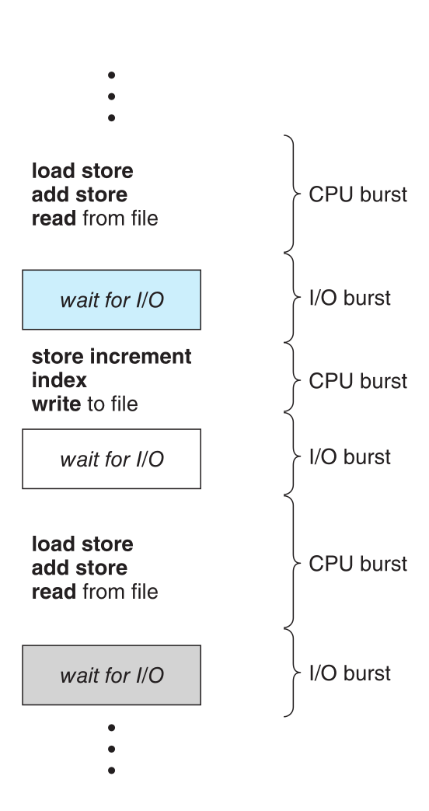</p>
<p align="center"><sub>Figure 5.1 · PDF p. 267 · process execution이 CPU burst와 I/O burst를 번갈아 반복하는 구조</sub></p>

Process execution은 CPU burst로 시작하고, I/O burst가 뒤따르며, 다시 CPU burst와 I/O burst가 반복된다. 마지막 CPU burst는 보통 process termination system request로 끝난다.

CPU burst duration은 process마다 크게 다르다. 하지만 측정하면 보통 많은 짧은 CPU bursts와 소수의 긴 CPU bursts를 갖는 exponential 또는 hyperexponential 형태를 보인다.

<p align="center">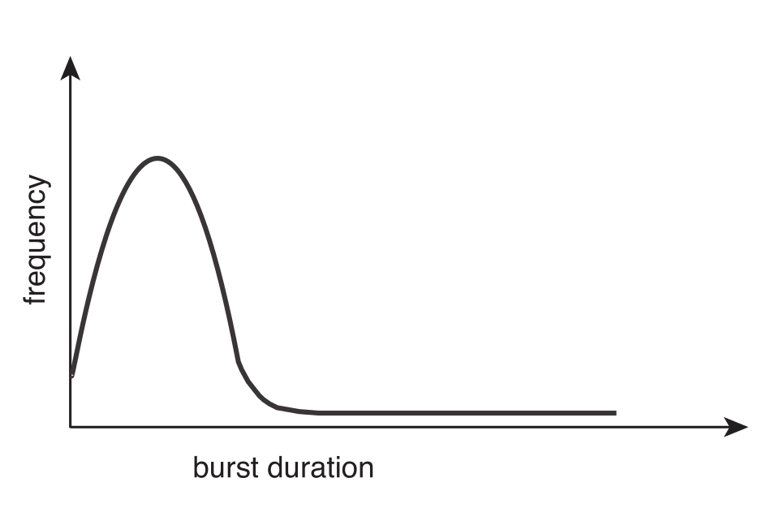</p>
<p align="center"><sub>Figure 5.2 · PDF p. 268 · 짧은 CPU burst가 많고 긴 CPU burst가 적은 분포</sub></p>

| Process 성격 | CPU burst 특성 | Scheduling 관점 |
|---|---|---|
| `I/O-bound program` | 짧은 CPU bursts가 많음 | CPU를 짧게 쓰고 자주 I/O wait으로 이동 |
| `CPU-bound program` | 긴 CPU bursts가 적게 나타남 | CPU를 오래 점유하려 하므로 preemption과 fairness가 중요 |

이 분포는 scheduling algorithm을 설계할 때 중요하다. 짧은 bursts를 빠르게 처리하면 I/O-bound interactive workload의 response time을 개선할 수 있고, 긴 CPU-bound process가 queue를 막는 현상을 줄일 수 있다.

### CPU Scheduler

CPU가 idle해지면 운영체제는 ready queue의 processes 중 하나를 선택해야 한다. 이 일을 하는 module이 `CPU scheduler`다. CPU scheduler는 memory 안에 있으면서 execute할 준비가 된 process 중 하나를 선택하고 CPU를 할당한다.

Ready queue는 반드시 FIFO queue일 필요가 없다. Scheduling algorithm에 따라 ready queue는 다음처럼 구현될 수 있다.

- `FIFO queue`
- `priority queue`
- `tree`
- unordered linked list

개념적으로는 ready queue의 모든 processes가 CPU를 얻을 기회를 기다리고 있으며, queue records는 보통 각 process의 `process control block (PCB)`이다.

### Preemptive and Nonpreemptive Scheduling

CPU scheduling decision은 네 상황에서 발생할 수 있다.

| 상황 | 상태 전이 | Scheduling 선택 여부 |
|---|---|---|
| 1 | `running -> waiting`, 예: I/O request, child `wait()` | 새 process를 골라야 함 |
| 2 | `running -> ready`, 예: interrupt | preemption 여부 선택 가능 |
| 3 | `waiting -> ready`, 예: I/O completion | 새 ready process를 바로 실행할지 선택 가능 |
| 4 | process termination | 새 process를 골라야 함 |

Scheduling이 1과 4에서만 일어나면 `nonpreemptive scheduling` 또는 `cooperative scheduling`이다. 한번 CPU를 받은 process는 terminate하거나 waiting state로 갈 때까지 CPU를 유지한다. 반대로 2와 3에서도 OS가 scheduling decision을 하면 `preemptive scheduling`이다. 현대 Windows, macOS, Linux, UNIX는 virtually all preemptive scheduling algorithms를 사용한다.

Preemption은 responsiveness와 fairness를 높이지만 두 가지 부담을 만든다.

1. Shared data에 대한 race condition 위험이 생긴다. 한 process가 shared data update 중 preempt되고 다른 process가 inconsistent data를 읽을 수 있다.
2. Kernel design이 복잡해진다. System call 처리 중 kernel data structure, 예를 들어 I/O queue를 수정하다 preempt되면 kernel 내부 consistency가 깨질 수 있다.

Nonpreemptive kernel은 system call이 끝나거나 process가 I/O wait으로 block될 때까지 context switch를 미뤄 kernel structure를 단순하게 유지한다. 그러나 real-time computing처럼 정해진 시간 안에 task completion이 필요한 system에는 좋지 않다. Preemptive kernel은 shared kernel data structure 접근 시 `mutex locks` 같은 synchronization mechanism이 필요하다. 현대 OS는 대부분 kernel mode에서도 fully preemptive하다.

Interrupt는 언제든 발생할 수 있고 항상 무시할 수도 없기 때문에, interrupt에 영향을 받는 짧은 critical code sections는 entry에서 interrupts를 disable하고 exit에서 reenable하는 방식으로 보호할 수 있다. 단, interrupts를 disable하는 code section은 드물고 instruction 수가 적어야 한다.

### Dispatcher

`dispatcher`는 CPU scheduler가 선택한 process에 실제 CPU core control을 넘기는 module이다.

<p align="center">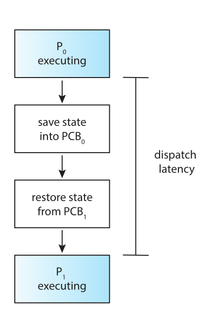</p>
<p align="center"><sub>Figure 5.3 · PDF p. 270 · process P0에서 P1로 control을 넘길 때 발생하는 dispatch latency</sub></p>

Dispatcher가 하는 일은 다음과 같다.

- Context switch from one process to another
- Switch to user mode
- User program의 적절한 resume location으로 jump

Dispatcher는 every context switch마다 호출되므로 빠를수록 좋다. Old process를 stop하고 new process를 running하게 만드는 데 걸리는 시간이 `dispatch latency`다.

Linux에서는 `vmstat`으로 system-wide context switches를 볼 수 있고, `/proc/<pid>/status`에서 process별 context switch count를 확인할 수 있다. 이때 `voluntary ctxt switches`는 process가 I/O처럼 unavailable resource를 기다리기 위해 스스로 CPU를 포기한 경우이고, `nonvoluntary ctxt switches`는 time slice expiration 또는 higher-priority process에 의해 CPU를 빼앗긴 경우다.

## 5.2 Scheduling Criteria

Scheduling algorithm 선택은 workload class에 따라 결과가 크게 달라진다. 어떤 algorithm은 I/O-bound process에 유리하고, 어떤 algorithm은 CPU-bound process에 유리할 수 있다. 따라서 algorithm을 비교할 기준이 필요하다.

| Criterion | 의미 | 목표 |
|---|---|---|
| `CPU utilization` | CPU를 얼마나 바쁘게 유지하는가 | maximize |
| `throughput` | 단위 시간당 완료되는 processes 수 | maximize |
| `turnaround time` | process submission부터 completion까지 걸린 전체 시간 | minimize |
| `waiting time` | ready queue에서 기다린 시간의 합 | minimize |
| `response time` | request submission부터 first response까지 걸린 시간 | minimize |

CPU utilization은 개념적으로 0-100% 범위이고, real system에서는 lightly loaded system에서 약 40%, heavily loaded system에서 약 90% 정도가 될 수 있다. Throughput은 long process workload에서는 몇 초에 하나, short transaction workload에서는 초당 수십 개가 될 수 있다.

`turnaround time`은 waiting in ready queue, executing on CPU, doing I/O를 모두 포함한다. 반면 `waiting time`은 CPU scheduling algorithm이 직접 영향을 주는 ready queue waiting만 본다. `response time`은 interactive system에서 특히 중요하다. 사용자는 total completion보다 first response가 얼마나 빨리 나오는지를 더 민감하게 느낄 수 있다.

대부분은 average measure를 최적화하지만 항상 평균만 중요한 것은 아니다. 모든 사용자의 service quality를 보장하려면 maximum response time을 줄이는 것이 더 중요할 수 있다. Interactive system에서는 average response time보다 response time variance를 줄이는 것이 더 desirable할 수도 있다. 예측 가능한 reasonable response time이 평균은 빠르지만 변동성이 큰 system보다 나을 수 있기 때문이다.

## 5.3 Scheduling Algorithms

CPU scheduling은 ready queue에서 어떤 process에 CPU core를 할당할지 결정하는 문제다. 이 절의 algorithms는 설명을 단순화하기 위해 single processing core system을 가정한다. Multiprocessor scheduling은 Section 5.5에서 별도로 다룬다.

### First-Come, First-Served Scheduling (FCFS)

`first-come, first-served (FCFS)` scheduling은 가장 단순한 algorithm이다. CPU를 먼저 요청한 process가 먼저 CPU를 받는다. Implementation은 FIFO queue로 쉽게 가능하다.

| 동작 | 설명 |
|---|---|
| process enters ready queue | PCB를 queue tail에 link |
| CPU becomes free | queue head의 process에 CPU 할당 |
| running process | queue에서 제거 |

FCFS의 장점은 code가 간단하고 이해하기 쉽다는 점이다. 그러나 average waiting time이 길어질 수 있고 arrival order에 따라 결과가 크게 달라진다.

예를 들어 CPU burst가 `P1=24`, `P2=3`, `P3=3`이고 모두 time 0에 도착했다고 하자. Arrival order가 `P1, P2, P3`이면 waiting time은 `P1=0`, `P2=24`, `P3=27`, average waiting time은 17ms다. 반대로 `P2, P3, P1` 순서라면 average waiting time은 3ms가 된다.

FCFS의 대표 문제는 `convoy effect`다. CPU-bound process 하나와 많은 I/O-bound processes가 있다고 하자. CPU-bound process가 오래 CPU를 잡고 있는 동안 I/O-bound processes는 ready queue에 쌓이고, I/O devices는 idle이 된다. CPU-bound process가 I/O로 빠지면 짧은 I/O-bound processes가 빠르게 실행되어 다시 I/O queue로 가고, 이번에는 CPU가 idle이 된다. 즉 하나의 긴 process 때문에 다른 processes가 줄줄이 기다리며 CPU와 devices utilization이 모두 낮아진다.

FCFS는 nonpreemptive다. 한번 CPU를 받은 process는 terminate하거나 I/O request로 CPU를 놓을 때까지 계속 실행된다. 그래서 interactive system에는 특히 부적합하다. 한 process가 CPU를 오래 독점하면 다른 process가 정기적으로 CPU share를 받을 수 없기 때문이다.

### Shortest-Job-First Scheduling (SJF)

`shortest-job-first (SJF)` scheduling은 각 process의 next CPU burst length를 기준으로 가장 짧은 process에 CPU를 할당한다. 더 정확한 이름은 `shortest-next-CPU-burst` algorithm이지만, 관례적으로 SJF라고 부른다. Burst length가 같으면 FCFS로 tie break한다.

SJF는 주어진 set of processes에 대해 minimum average waiting time을 주는 optimal algorithm이다. Short process를 long process 앞에 두면 short process의 waiting time 감소가 long process의 waiting time 증가보다 커서 average waiting time이 줄어든다.

하지만 실제 CPU scheduling level에서 SJF를 완벽히 구현하기는 어렵다. Next CPU burst length를 미리 알 방법이 없기 때문이다. 그래서 과거 CPU bursts를 바탕으로 다음 burst를 predict한다.

예측에는 exponential average가 사용된다.

```text
tau(n+1) = alpha * t(n) + (1 - alpha) * tau(n)
```

| Symbol | 의미 |
|---|---|
| `t(n)` | nth CPU burst의 실제 길이 |
| `tau(n)` | nth CPU burst에 대한 이전 prediction/history |
| `tau(n+1)` | 다음 CPU burst prediction |
| `alpha` | recent history와 past history의 상대 weight, `0 <= alpha <= 1` |

<p align="center">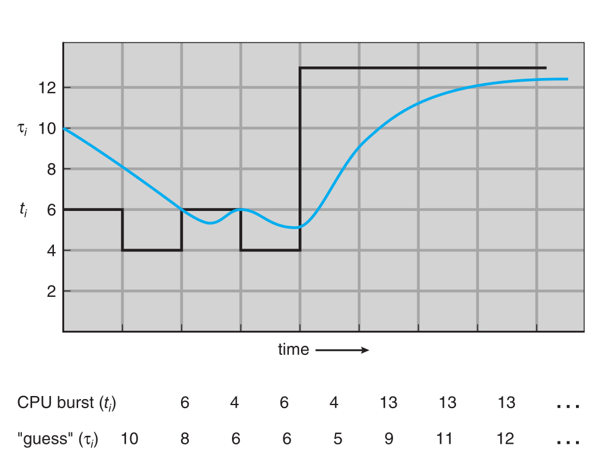</p>
<p align="center"><sub>Figure 5.4 · PDF p. 275 · `alpha = 1/2`, `tau0 = 10`일 때 CPU burst prediction이 실제 burst를 따라가는 모습</sub></p>

`alpha = 0`이면 recent burst는 prediction에 영향을 주지 않고, `alpha = 1`이면 가장 최근 burst만 반영된다. 보통 `alpha = 1/2`를 사용하면 recent history와 past history가 같은 weight를 가진다. Formula를 펼치면 오래된 burst일수록 `(1 - alpha)`의 거듭제곱 때문에 weight가 작아진다.

SJF는 preemptive 또는 nonpreemptive일 수 있다. 새 process가 ready queue에 도착했을 때 그 process의 next CPU burst가 현재 running process의 remaining time보다 짧으면, preemptive SJF는 현재 process를 preempt한다. 이 preemptive version은 `shortest-remaining-time-first` scheduling이라고도 한다. Nonpreemptive SJF는 현재 CPU burst가 끝날 때까지 기다린다.

### Round-Robin Scheduling (RR)

`round-robin (RR)` scheduling은 FCFS와 비슷하지만 preemption을 추가해 time-sharing system에 적합하게 만든 algorithm이다. 핵심은 작은 시간 단위인 `time quantum` 또는 `time slice`를 정하고, ready queue를 circular queue처럼 순환시키는 것이다.

RR 동작 흐름은 다음과 같다.

1. Scheduler가 ready queue의 첫 process를 선택한다.
2. Timer를 1 time quantum 뒤 interrupt하도록 설정한다.
3. Process를 dispatch한다.
4. Process의 CPU burst가 1 quantum보다 짧으면 process가 자발적으로 CPU를 release한다.
5. CPU burst가 1 quantum보다 길면 timer interrupt가 발생하고, OS가 context switch를 수행한다.
6. Preempted process는 ready queue tail로 들어가고 다음 process가 선택된다.

RR에서는 process가 유일한 runnable process가 아닌 한, 한 번에 1 time quantum보다 오래 CPU를 받을 수 없다. Ready queue에 `n` processes가 있고 time quantum이 `q`이면 각 process는 최대 `q` 단위 chunk로 CPU time의 약 `1/n`을 받는다. 각 process는 다음 turn까지 최대 `(n - 1) * q` time units 정도 기다린다.

RR의 성능은 `time quantum` 크기에 매우 민감하다.

<p align="center">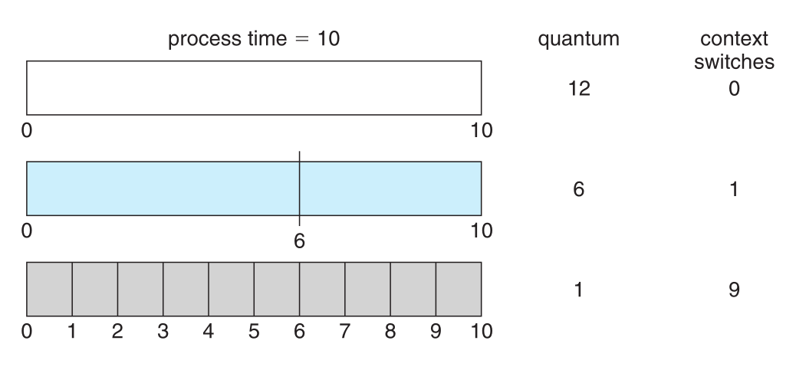</p>
<p align="center"><sub>Figure 5.5 · PDF p. 278 · time quantum이 작을수록 context switches가 증가하는 구조</sub></p>

| Time quantum | 결과 |
|---|---|
| 너무 큼 | RR이 FCFS처럼 변한다. Responsiveness가 떨어질 수 있음 |
| 너무 작음 | context switches가 폭증해 overhead가 커짐 |
| 적절함 | context-switch time보다 충분히 크고, 대부분의 CPU bursts가 quantum 안에 끝남 |

Context-switch time이 time quantum의 10% 정도라면 CPU time의 약 10%가 switching overhead로 쓰인다. 실제 현대 system의 time quantum은 대체로 10-100ms 범위이고, context switch는 보통 10 microseconds보다 작아 time quantum에 비해 작은 편이다.

<p align="center">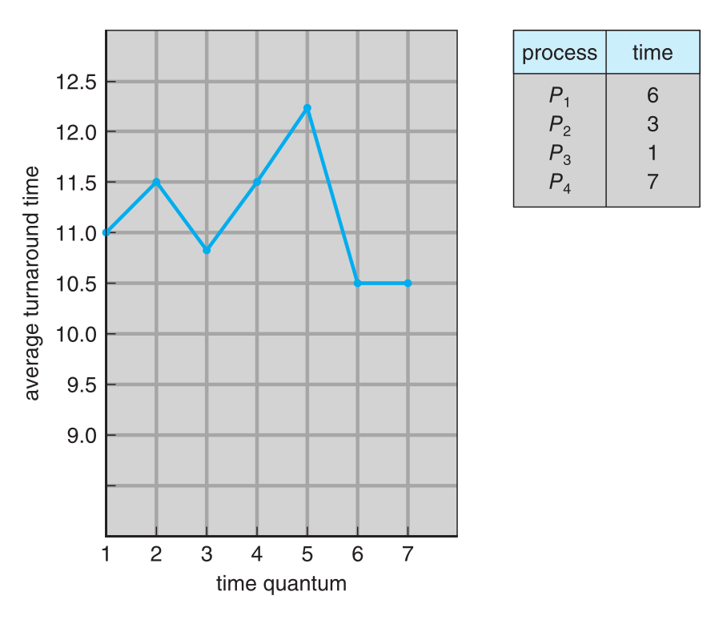</p>
<p align="center"><sub>Figure 5.6 · PDF p. 279 · time quantum 크기에 따라 average turnaround time이 비단조적으로 변하는 예</sub></p>

Average turnaround time은 time quantum을 키운다고 항상 좋아지지 않는다. 일반적으로 most processes가 next CPU burst를 single time quantum 안에 끝낼 수 있으면 turnaround time이 개선된다. 경험적 rule of thumb은 CPU bursts의 80% 정도가 time quantum보다 짧도록 잡는 것이다.

### Priority Scheduling

`priority scheduling`은 각 process에 priority를 부여하고 highest priority process에 CPU를 할당한다. Equal priority processes는 FCFS order로 scheduling한다. SJF는 priority scheduling의 특수한 경우로 볼 수 있다. 이때 priority는 predicted next CPU burst의 inverse다. CPU burst가 짧을수록 높은 priority를 갖는다.

Priority number의 의미는 system마다 다르다. 어떤 system은 작은 숫자가 낮은 priority이고, 어떤 system은 작은 숫자가 높은 priority다. 이 책은 low number가 high priority라고 가정한다.

Priority는 두 방식으로 정의될 수 있다.

| Priority source | 설명 | 예시 |
|---|---|---|
| internal priority | OS가 측정 가능한 quantity로 계산 | time limits, memory requirements, open file count, average I/O burst / average CPU burst ratio |
| external priority | OS 외부 기준으로 설정 | process importance, user/payment/departments, policy/political factors |

Priority scheduling도 preemptive 또는 nonpreemptive일 수 있다. 새 process가 ready queue에 들어왔을 때 currently running process보다 priority가 높으면, preemptive priority scheduling은 CPU를 빼앗는다. Nonpreemptive version은 새 process를 ready queue head에 넣지만 현재 process의 CPU burst는 끝까지 실행하게 둔다.

Priority scheduling의 가장 큰 문제는 `indefinite blocking` 또는 `starvation`이다. Low-priority process가 ready to run 상태인데도 higher-priority processes가 계속 들어오면 영원히 CPU를 얻지 못할 수 있다.

해결책은 `aging`이다. Aging은 system에서 오래 기다린 process의 priority를 점진적으로 올린다. 예를 들어 priority range가 127(low)에서 0(high)이고 매초 priority를 1씩 높이면, 처음 priority 127이던 process도 약 2분 뒤 priority 0이 되어 실행될 수 있다.

Priority scheduling은 RR과 결합할 수 있다. System은 highest-priority process를 먼저 실행하되, 같은 priority를 가진 processes 사이에서는 RR을 적용한다. 이 방식은 high priority class를 먼저 보장하면서 equal priority group 안에서는 fairness를 제공한다.

### Multilevel Queue Scheduling

Priority scheduling과 RR을 단일 queue에서 구현하면 highest-priority process를 찾기 위해 queue scan이 필요할 수 있다. 실제로는 distinct priority마다 separate queue를 두는 방식이 더 쉬울 수 있다. 이 방식이 `multilevel queue scheduling`이다.

<p align="center">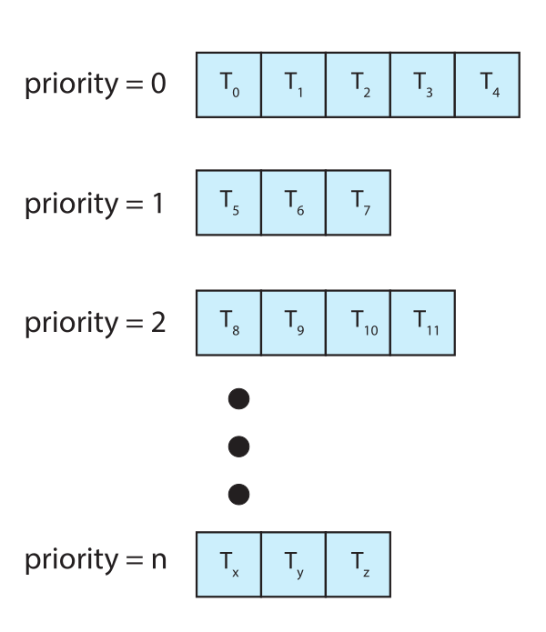</p>
<p align="center"><sub>Figure 5.7 · PDF p. 281 · priority별로 별도 queue를 두고 highest-priority queue를 먼저 실행하는 구조</sub></p>

각 priority queue 안에 multiple processes가 있으면 RR로 실행할 수 있다. 가장 일반적인 형태에서는 process가 system에 들어올 때 static priority를 받고, runtime 동안 같은 queue에 머문다.

Multilevel queue는 process type별 partition에도 쓰인다.

<p align="center">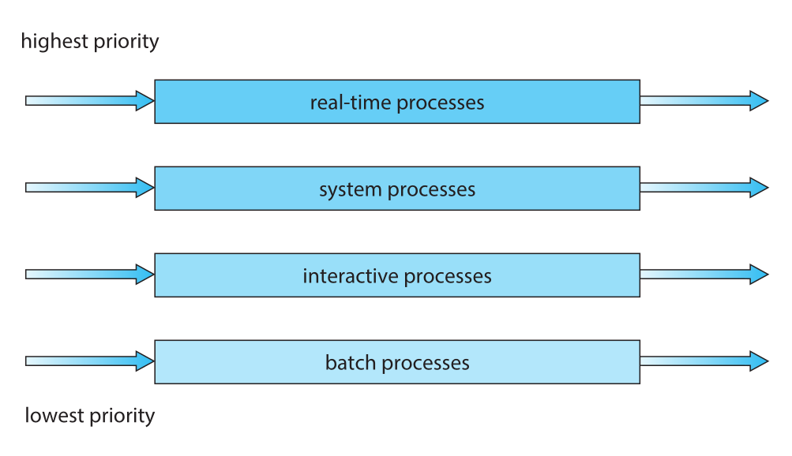</p>
<p align="center"><sub>Figure 5.8 · PDF p. 282 · real-time, system, interactive, batch process queue를 분리한 multilevel queue</sub></p>

예를 들어 네 queue를 priority 순으로 둘 수 있다.

1. `real-time processes`
2. `system processes`
3. `interactive processes`
4. `batch processes`

Queue 사이 scheduling은 보통 fixed-priority preemptive scheduling으로 구현된다. Batch process가 running 중이어도 interactive process가 ready queue에 들어오면 batch process가 preempt될 수 있다. Real-time queue는 interactive queue보다 absolute priority를 가질 수 있다.

다른 방법은 queues 사이에 time slicing을 적용하는 것이다. 예를 들어 foreground queue에 CPU time의 80%를 주고 RR로 scheduling하며, background queue에는 20%를 주고 FCFS로 scheduling할 수 있다. 이 방식은 lower-priority class가 완전히 굶는 것을 줄인다.

### Multilevel Feedback Queue Scheduling

일반 multilevel queue에서는 process가 처음 배정된 queue에 계속 남는다. 이 방식은 scheduling overhead가 낮지만 inflexible하다. `multilevel feedback queue scheduling`은 process가 queues 사이를 이동할 수 있게 한다.

핵심 아이디어는 CPU burst 특성에 따라 processes를 분류하는 것이다.

- CPU time을 너무 많이 쓰는 process는 lower-priority queue로 demote한다.
- 짧은 CPU bursts를 보이는 I/O-bound 또는 interactive processes는 higher-priority queues에 남긴다.
- Lower-priority queue에서 너무 오래 기다린 process는 higher-priority queue로 promote해 starvation을 막는다.

<p align="center">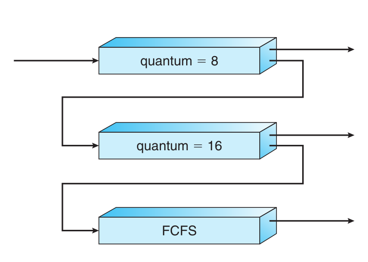</p>
<p align="center"><sub>Figure 5.9 · PDF p. 283 · quantum 8, quantum 16, FCFS queue로 구성된 multilevel feedback queue</sub></p>

Figure 5.9의 예시는 세 queue를 둔다.

| Queue | Scheduling | Rule |
|---|---|---|
| queue 0 | RR, quantum 8ms | new process가 들어오고, 8ms 안에 끝나지 않으면 queue 1로 demote |
| queue 1 | RR, quantum 16ms | queue 0이 비었을 때 실행, 16ms 안에 끝나지 않으면 queue 2로 demote |
| queue 2 | FCFS | queue 0과 1이 모두 empty일 때만 실행 |

이 algorithm은 CPU burst가 8ms 이하인 process에 highest priority를 준다. 이런 process는 빠르게 CPU를 얻고 burst를 끝낸 뒤 I/O burst로 이동한다. 8ms보다 길지만 24ms보다 짧은 process도 비교적 빨리 처리되지만, 더 짧은 processes보다 낮은 priority를 받는다. 긴 process는 queue 2로 내려가 남는 CPU cycles로 FCFS 방식 처리된다.

Multilevel feedback queue scheduler는 다음 parameters로 정의된다.

- Number of queues
- 각 queue의 scheduling algorithm
- Process를 higher-priority queue로 upgrade하는 method
- Process를 lower-priority queue로 demote하는 method
- 새 process가 어느 queue에 들어갈지 결정하는 method

이 구조는 가장 general한 CPU-scheduling algorithm이다. System design에 맞게 매우 유연하게 조정할 수 있지만, 그만큼 parameter selection이 어렵고 algorithm이 복잡하다.

## 5.4 Thread Scheduling

Chapter 4에서 process model에 threads가 추가되었다. 현대 operating systems에서는 대개 process 자체가 아니라 `kernel-level threads`가 OS에 의해 schedule된다. User-level threads는 thread library가 관리하고 kernel은 직접 알지 못한다. User-level thread가 CPU에서 실행되려면 결국 associated kernel-level thread에 mapping되어야 하며, 이 mapping은 LWP(lightweight process)를 거치는 indirect mapping일 수도 있다.

### Contention Scope: PCS와 SCS

User-level threads와 kernel-level threads의 scheduling 차이는 `contention scope`로 설명된다.

| Scope | 의미 | 경쟁 범위 |
|---|---|---|
| `process-contention scope (PCS)` | thread library가 같은 process 안의 user-level threads 중 LWP에 올릴 thread를 고름 | 같은 process에 속한 threads끼리 CPU/LWP를 두고 경쟁 |
| `system-contention scope (SCS)` | kernel이 system 전체의 kernel-level threads 중 physical CPU에 올릴 thread를 고름 | system 전체 threads가 CPU를 두고 경쟁 |

Many-to-one과 many-to-many model에서는 thread library가 user-level threads를 available LWP에 schedule하므로 PCS가 등장한다. 단, PCS가 thread를 LWP에 올린다고 해서 곧바로 physical CPU에서 실행된다는 뜻은 아니다. LWP의 kernel thread가 다시 OS scheduler에 의해 CPU core에 schedule되어야 실제 실행된다.

Windows와 Linux처럼 one-to-one model을 사용하는 systems는 threads를 SCS로 schedule한다. Kernel-level thread가 곧 OS scheduler의 대상이기 때문이다.

PCS는 보통 priority 기반이다. Thread library는 runnable thread 중 highest-priority thread를 고른다. User-level thread priority는 programmer가 설정하고, thread library가 자동으로 조정하지 않는 경우가 많다. PCS는 higher-priority thread를 위해 current thread를 preempt할 수 있지만, equal-priority threads 사이에서 time slicing을 보장하지는 않는다.

### Pthread Scheduling

Pthreads는 thread creation 시 contention scope를 지정할 수 있는 API를 제공한다.

| Pthreads value | 의미 |
|---|---|
| `PTHREAD_SCOPE_PROCESS` | PCS scheduling 사용 |
| `PTHREAD_SCOPE_SYSTEM` | SCS scheduling 사용 |

Many-to-many system에서 `PTHREAD_SCOPE_PROCESS`는 user-level threads를 available LWPs에 schedule한다. LWP 수는 thread library가 유지하며, scheduler activations가 사용될 수 있다. `PTHREAD_SCOPE_SYSTEM`은 각 user-level thread마다 LWP를 create/bind해 사실상 one-to-one mapping처럼 동작하게 할 수 있다.

주요 API는 다음과 같다.

```c
pthread_attr_setscope(pthread_attr_t *attr, int scope)
pthread_attr_getscope(pthread_attr_t *attr, int *scope)
```

첫 parameter는 thread attribute set pointer다. `pthread_attr_setscope()`의 두 번째 parameter에는 `PTHREAD_SCOPE_SYSTEM` 또는 `PTHREAD_SCOPE_PROCESS`가 들어간다. `pthread_attr_getscope()`에서는 두 번째 parameter가 current scope value를 받을 `int *`다. Error가 발생하면 nonzero value를 return한다.

<p align="center">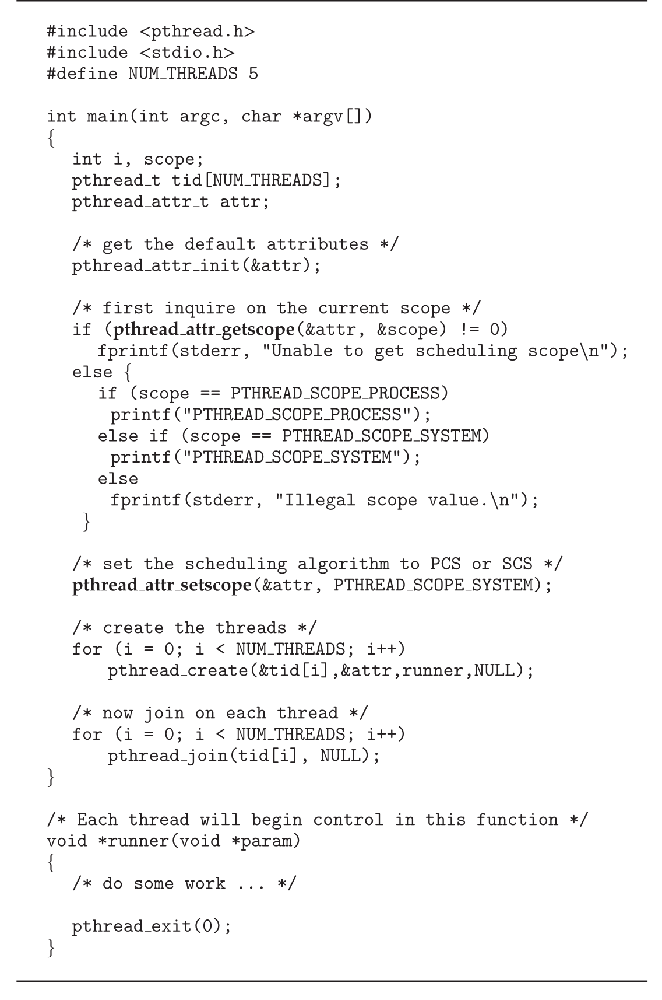</p>
<p align="center"><sub>Figure 5.10 · PDF p. 286 · Pthreads에서 scheduling scope를 조회하고 `PTHREAD_SCOPE_SYSTEM`으로 설정하는 예제</sub></p>

Figure 5.10은 default attributes를 얻고, current scope를 조회한 뒤, `pthread_attr_setscope(&attr, PTHREAD_SCOPE_SYSTEM)`으로 SCS scheduling을 지정하고 five threads를 만드는 흐름을 보여준다. Linux와 macOS는 `PTHREAD_SCOPE_SYSTEM`만 허용한다.

## 5.5 Multi-Processor Scheduling

지금까지는 single processing core를 가정했다. Multiple CPUs가 있으면 multiple threads가 parallel하게 run할 수 있어 load sharing이 가능해지지만, scheduling 문제는 훨씬 복잡해진다. 현대의 `multiprocessor`는 단순히 multiple physical processors만 의미하지 않는다.

- `multicore CPUs`
- `multithreaded cores`
- `NUMA systems`
- `heterogeneous multiprocessing`

처음 세 경우는 processors가 기능적으로 동일한 homogeneous system에 가깝고, 마지막은 cores가 능력/전력 특성 면에서 다르다.

### Approaches to Multiple-Processor Scheduling

Multiprocessor scheduling의 한 방식은 `asymmetric multiprocessing`이다. 하나의 processor, 즉 master server가 scheduling decision, I/O processing, 기타 system activity를 담당하고, 다른 processors는 user code만 실행한다. 이 방식은 system data structures에 접근하는 core가 하나라 data sharing 문제가 단순하지만, master server가 bottleneck이 될 수 있다.

현대 표준 방식은 `symmetric multiprocessing (SMP)`다. SMP에서는 각 processor가 self-scheduling한다. 각 processor의 scheduler가 ready queue를 보고 run할 thread를 고른다.

Ready queue organization에는 두 전략이 있다.

<p align="center">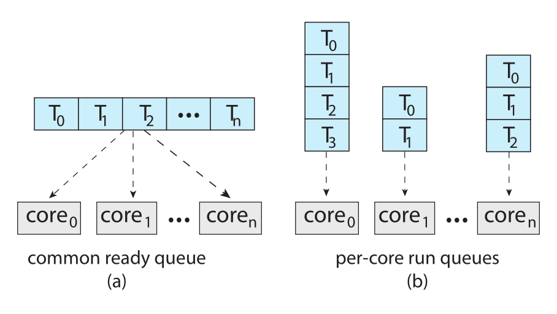</p>
<p align="center"><sub>Figure 5.11 · PDF p. 288 · common ready queue와 per-core run queues의 차이</sub></p>

| Strategy | 장점 | 문제 |
|---|---|---|
| common ready queue | idle processor가 같은 queue에서 runnable thread를 가져오므로 load balancing이 자연스러움 | shared queue race condition, lock contention, bottleneck |
| per-core private run queues | 각 processor가 자기 queue에서 schedule하므로 shared queue lock bottleneck 감소, cache affinity에 유리 | queue별 workload imbalance 가능 |

Common ready queue는 두 processors가 같은 thread를 동시에 선택하거나 thread를 queue에서 잃어버리는 race condition을 막기 위해 locking이 필요하다. 그러나 모든 queue access가 lock ownership을 요구하므로 contention이 커지고 performance bottleneck이 될 수 있다. 그래서 SMP systems에서는 per-processor run queues가 흔하다. 단, per-core queues는 load balancing algorithm이 필요하다.

### Multicore Processors와 Memory Stall

현대 hardware는 여러 computing cores를 같은 physical chip에 둔다. 각 core는 architectural state를 유지하므로 OS에는 separate logical CPU처럼 보인다. Multicore processor는 separate physical CPU chips보다 빠르고 power consumption도 낮은 편이다.

하지만 memory speed가 processor speed를 따라가지 못하면서 `memory stall`이 중요해졌다. Processor가 memory access를 요청한 뒤 data가 available해질 때까지 기다리는 시간이 생긴다. Cache miss도 memory stall을 일으킬 수 있다.

<p align="center">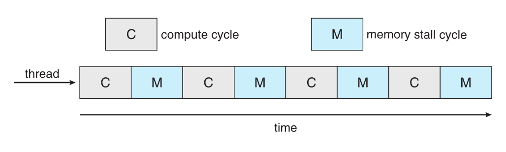</p>
<p align="center"><sub>Figure 5.12 · PDF p. 289 · compute cycle 사이에 memory stall cycle이 끼어 CPU가 data를 기다리는 모습</sub></p>

Memory stall 때문에 processor가 time의 상당 부분, 원문 예시에서는 최대 50%까지 data availability를 기다릴 수 있다. 이를 완화하기 위해 many hardware designs는 core마다 two or more hardware threads를 둔다. 한 hardware thread가 memory를 기다리며 stall되면 core가 다른 thread로 switch한다.

<p align="center">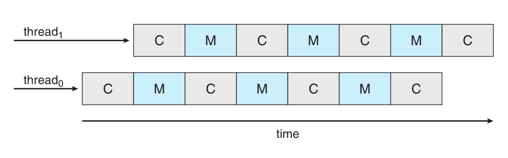</p>
<p align="center"><sub>Figure 5.13 · PDF p. 289 · 한 core의 hardware threads가 memory stall 동안 interleaving되는 모습</sub></p>

이 기술은 `chip multithreading (CMT)`라고 불린다. 각 hardware thread는 instruction pointer와 register set 같은 architectural state를 유지하므로 OS 입장에서는 software thread를 run할 수 있는 logical CPU로 보인다.

<p align="center">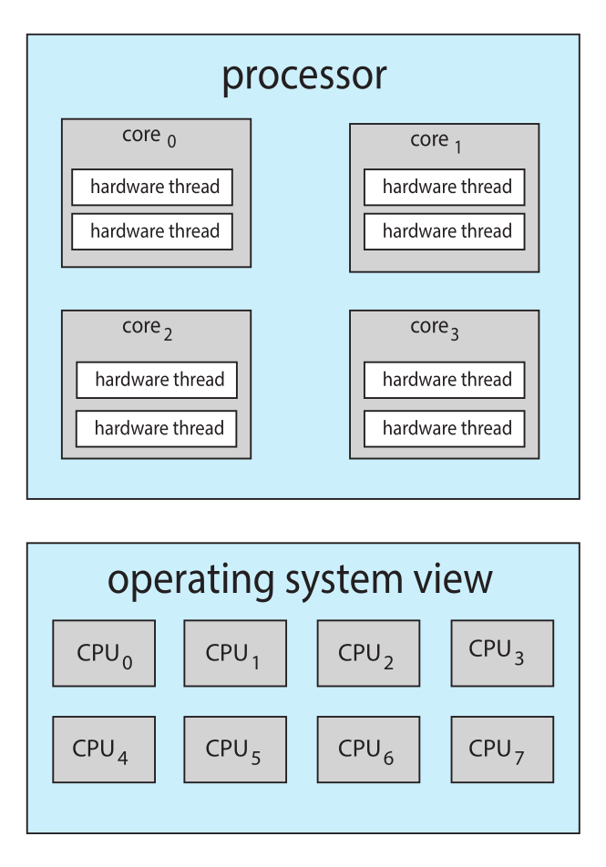</p>
<p align="center"><sub>Figure 5.14 · PDF p. 290 · 4 cores와 core당 2 hardware threads가 OS에 8 logical CPUs로 보이는 CMT 구조</sub></p>

Intel은 single processing core에 multiple hardware threads를 배정하는 방식을 `hyper-threading`, 또는 `simultaneous multithreading (SMT)`라고 부른다. 예를 들어 core당 2 hardware threads를 지원하면 OS는 physical core 수보다 많은 logical CPUs를 본다.

Core multithreading 방식에는 두 가지가 있다.

| 방식 | 동작 | 비용 |
|---|---|---|
| `coarse-grained multithreading` | memory stall 같은 long-latency event가 발생할 때 다른 thread로 switch | pipeline flush가 필요해 switch cost가 큼 |
| `fine-grained multithreading` 또는 `interleaved multithreading` | instruction cycle boundary처럼 더 작은 granularity에서 switch | hardware logic이 switch를 지원해 cost가 작음 |

Physical core의 caches와 pipelines는 hardware threads가 공유한다. 따라서 하나의 processing core는 실제로 한 순간에 하나의 hardware thread만 실행할 수 있다. 이 때문에 multithreaded multicore processor에서는 scheduling level이 두 개로 나뉜다.

<p align="center">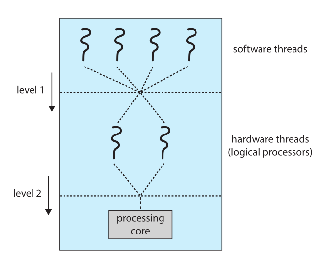</p>
<p align="center"><sub>Figure 5.15 · PDF p. 291 · OS가 software thread를 logical CPU에 배정하고, core가 hardware thread를 선택하는 두 단계 scheduling</sub></p>

1. OS scheduler가 software threads를 hardware threads, 즉 logical CPUs에 배정한다.
2. 각 core 내부 logic이 여러 hardware threads 중 실제 core에서 run할 thread를 선택한다.

두 level은 독립적이지 않다. OS scheduler가 processor resource sharing을 알고 있다면 더 좋은 결정을 할 수 있다. 예를 들어 two software threads를 같은 physical core의 two logical CPUs에 배정하면 caches/pipelines를 공유하므로 느릴 수 있다. 별도 cores에 배정하면 resource sharing이 줄어 더 빠를 수 있다.

### Load Balancing

SMP system에서는 processors 사이 workload를 균등하게 유지해야 한다. 한 processor는 idle인데 다른 processor의 run queue에는 threads가 쌓여 있으면 multiprocessor benefit을 제대로 활용하지 못한다. `load balancing`은 workload를 processors 전체에 고르게 distribute하려는 기능이다.

Load balancing은 per-processor private ready queues가 있을 때 특히 필요하다. Common run queue에서는 idle processor가 공통 queue에서 runnable thread를 가져오면 되므로 별도 load balancing이 덜 필요하다.

두 가지 approach가 있다.

| Approach | 동작 |
|---|---|
| `push migration` | 특정 task가 주기적으로 각 processor load를 검사하고 imbalance가 있으면 overloaded processor에서 idle/less-busy processor로 threads를 밀어냄 |
| `pull migration` | idle processor가 busy processor에서 waiting task를 끌어옴 |

Push와 pull은 mutually exclusive하지 않다. Linux CFS scheduler와 FreeBSD ULE scheduler는 둘 다 구현한다. Balanced load의 의미도 단순하지 않다. 모든 queues의 thread 수를 비슷하게 맞출 수도 있고, thread priorities가 queues에 균등하게 분포하도록 볼 수도 있다. 어떤 기준은 scheduling algorithm의 목표와 충돌할 수 있다.

### Processor Affinity

Thread가 특정 processor에서 실행되면 최근 접근한 data가 그 processor cache에 남아 `warm cache`가 된다. 이후 memory accesses가 cache에서 처리될 가능성이 높다. 그런데 load balancing 때문에 thread가 다른 processor로 migrate하면, 이전 processor cache contents는 유효하지 않게 되고 새 processor cache를 다시 채워야 한다. 이 cost를 줄이기 위해 OS는 thread를 가능한 한 같은 processor에서 계속 실행하려 한다. 이를 `processor affinity`라고 한다.

| Affinity type | 의미 |
|---|---|
| `soft affinity` | OS가 process/thread를 같은 processor에 유지하려 노력하지만 보장하지 않음 |
| `hard affinity` | process/thread가 실행 가능한 CPU subset을 system call 등으로 명시 |

Linux는 soft affinity를 구현하고, `sched_setaffinity()` system call로 hard affinity도 지원한다.

Per-processor ready queues는 processor affinity에 유리하다. Thread가 같은 processor의 run queue에 남아 계속 같은 processor에서 schedule될 가능성이 높아 warm cache를 활용할 수 있기 때문이다. 반면 common ready queue는 어떤 processor든 thread를 가져갈 수 있어 cache repopulation cost가 커질 수 있다.

NUMA architecture는 affinity 문제를 더 복잡하게 만든다. `non-uniform memory access (NUMA)`에서는 각 CPU가 자기 local memory에는 빠르게 접근하지만, 다른 CPU의 local memory에는 더 느리게 접근한다.

<p align="center">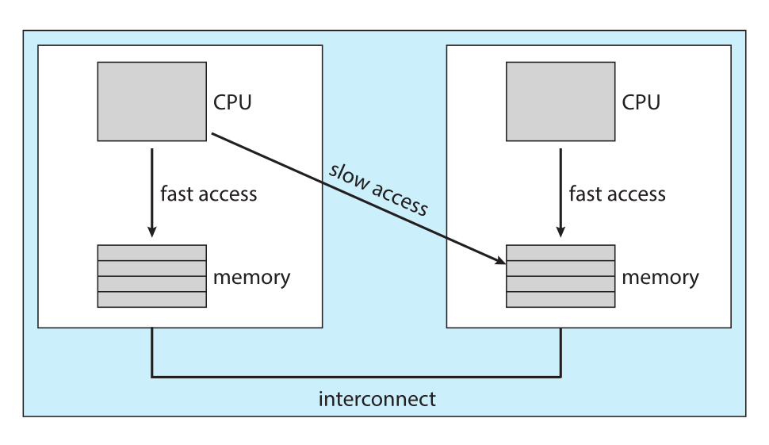</p>
<p align="center"><sub>Figure 5.16 · PDF p. 293 · CPU마다 local memory가 있고 remote memory access가 느린 NUMA 구조</sub></p>

NUMA-aware CPU scheduler와 memory-placement algorithm이 함께 동작하면, 특정 CPU에 schedule된 thread에 그 CPU 가까운 memory를 allocate해 memory access time을 줄일 수 있다.

여기서 중요한 trade-off가 생긴다. Load balancing은 thread를 덜 바쁜 processor로 옮기려 하고, processor affinity/NUMA locality는 thread를 같은 processor와 가까운 memory에 남겨 두려 한다. 현대 multicore NUMA scheduler가 복잡한 이유는 이 두 목표가 자연스럽게 충돌하기 때문이다.

### Heterogeneous Multiprocessing

지금까지는 processors가 같은 capabilities를 가진 homogeneous system을 중심으로 설명했다. 그러나 mobile systems를 중심으로 같은 instruction set을 실행하지만 clock speed와 power management 특성이 다른 cores를 섞는 `heterogeneous multiprocessing (HMP)`이 사용된다. HMP는 asymmetric multiprocessing과 다르다. System tasks와 user tasks가 모두 어떤 core에서도 run할 수 있지만, task demand에 따라 적합한 core를 고르는 것이 목표다.

ARM의 `big.LITTLE` architecture가 대표적이다. High-performance big cores는 energy를 많이 쓰므로 짧고 compute-intensive한 interactive tasks에 적합하다. Energy-efficient LITTLE cores는 느리지만 energy를 적게 쓰므로 background tasks처럼 오래 실행되지만 high performance가 필요 없는 작업에 적합하다. Power-saving mode에서는 big cores를 disable하고 LITTLE cores만 사용할 수도 있다. Windows 10은 thread가 power-management demand에 맞는 scheduling policy를 선택할 수 있게 하여 HMP scheduling을 지원한다.

## 5.6 Real-Time CPU Scheduling

Real-time operating system의 CPU scheduling은 일반-purpose system보다 더 엄격한 시간 요구를 가진다.

| Real-time type | 의미 |
|---|---|
| `soft real-time system` | critical real-time process가 noncritical process보다 preference를 받지만, 언제 schedule될지 guarantee하지는 않음 |
| `hard real-time system` | task가 반드시 deadline까지 service되어야 함. Deadline 이후 service는 no service와 같음 |

### Minimizing Latency

Real-time system은 event-driven 성격이 강하다. Timer expiration 같은 software event, obstruction을 감지한 vehicle sensor 같은 hardware event가 발생하면 system은 매우 빠르게 respond/service해야 한다.

`event latency`는 event가 발생한 시점부터 service가 시작되는 시점까지의 시간이다.

<p align="center">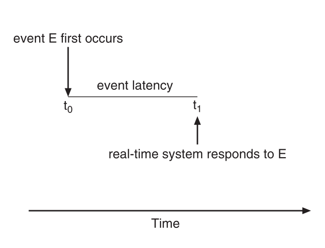</p>
<p align="center"><sub>Figure 5.17 · PDF p. 294 · event 발생부터 real-time system response까지의 event latency</sub></p>

Latency requirement는 event마다 다르다. Antilock brake system은 wheel sliding을 감지한 뒤 3-5ms 안에 respond해야 할 수 있지만, airliner radar control embedded system은 몇 초 latency를 tolerate할 수도 있다.

Real-time system 성능에 영향을 주는 latency는 두 가지다.

| Latency | 의미 | Real-time 요구 |
|---|---|---|
| `interrupt latency` | CPU에 interrupt가 도착한 뒤 ISR(interrupt service routine)이 시작될 때까지의 시간 | minimize, hard real-time에서는 bounded |
| `dispatch latency` | scheduler dispatcher가 one process를 stop하고 another process를 start하는 데 걸리는 시간 | minimize, hard real-time에서는 microseconds 수준 |

<p align="center">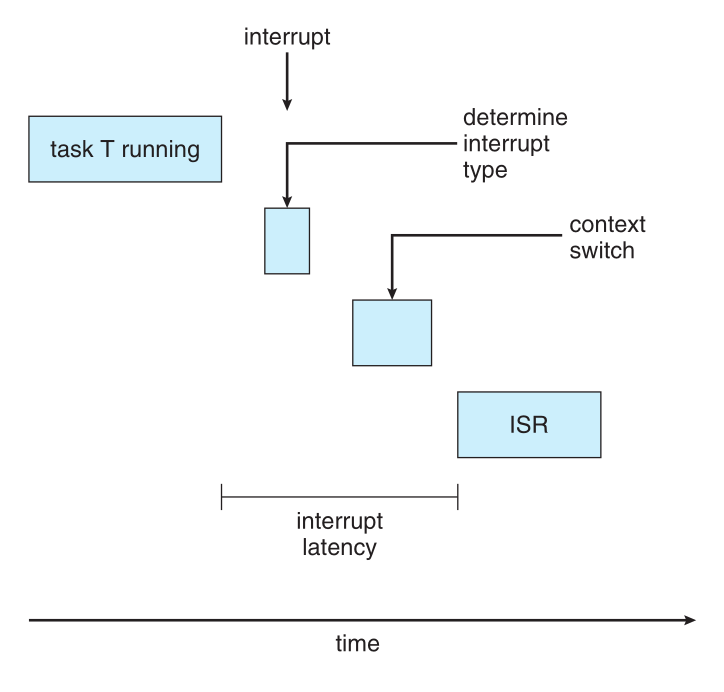</p>
<p align="center"><sub>Figure 5.18 · PDF p. 295 · interrupt arrival 이후 type 결정, context save, ISR 시작까지의 interrupt latency</sub></p>

Interrupt latency에는 현재 instruction completion, interrupt type determination, current process state save, ISR 시작까지의 시간이 포함된다. Real-time OS는 interrupt latency를 줄이기 위해 interrupts가 disabled되는 시간을 매우 짧게 유지해야 한다.

<p align="center">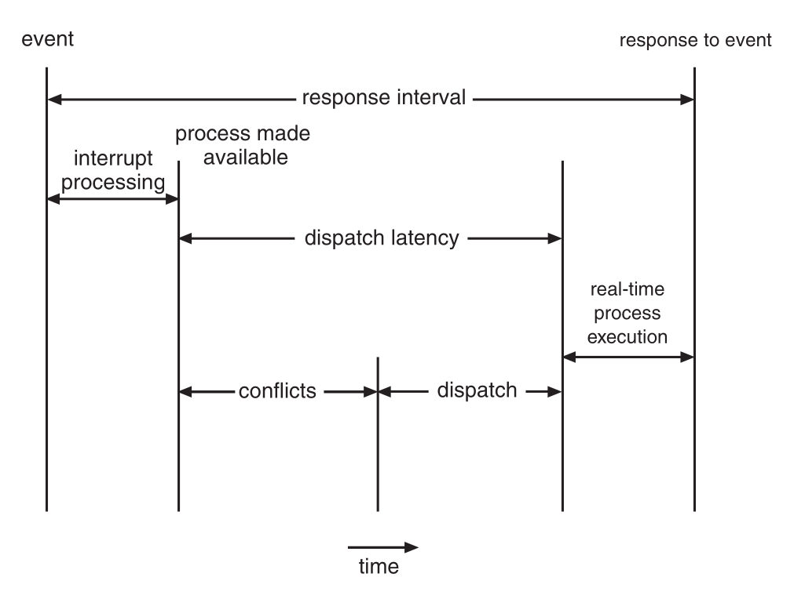</p>
<p align="center"><sub>Figure 5.19 · PDF p. 296 · interrupt processing 후 real-time process 실행까지의 dispatch latency 구성</sub></p>

Dispatch latency의 conflict phase는 두 요소로 구성된다.

1. Kernel에서 running 중인 process를 preempt하는 시간
2. High-priority process가 필요로 하는 resources를 low-priority processes가 release하는 시간

Conflict phase 이후 dispatch phase가 high-priority process를 available CPU에 schedule한다. Dispatch latency를 낮추는 가장 효과적인 technique은 `preemptive kernel`을 제공하는 것이다.

### Priority-Based Scheduling for Real-Time

Real-time OS scheduler는 real-time process가 CPU를 요구하는 즉시 respond해야 하므로 `preemptive priority-based scheduling`을 지원해야 한다. High-priority real-time process가 runnable해지면 current lower-priority process를 preempt한다.

Linux, Windows, Solaris 같은 general-purpose OS도 soft real-time scheduling feature를 제공한다. 예를 들어 Windows는 32 priority levels 중 16-31을 real-time processes에 reserve한다. 그러나 preemptive priority-based scheduling만으로는 hard real-time을 보장할 수 없다. Deadline을 만족한다는 guarantee가 필요하기 때문이다.

Hard real-time scheduling 논의에서는 process를 보통 `periodic task`로 본다.

<p align="center">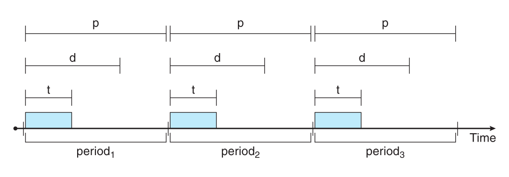</p>
<p align="center"><sub>Figure 5.20 · PDF p. 297 · processing time t, deadline d, period p를 가진 periodic task</sub></p>

Periodic task는 constant intervals, 즉 periods마다 CPU를 요구한다. 각 task는 다음 특성을 가진다.

| Symbol | 의미 |
|---|---|
| `p` | period |
| `t` | fixed processing time |
| `d` | deadline |
| `1/p` | task rate |

관계는 `0 <= t <= d <= p`다. 어떤 task는 deadline requirement를 scheduler에 announce해야 할 수 있다. Scheduler는 `admission-control algorithm`으로 task를 받아들일지 결정한다. 받아들이면 deadline completion을 guarantee하고, guarantee할 수 없으면 request를 reject한다.

### Rate-Monotonic Scheduling

`rate-monotonic scheduling`은 periodic tasks를 위한 static priority, preemptive scheduling algorithm이다. 각 task는 system에 들어올 때 period의 inverse에 따라 priority를 받는다.

- Shorter period -> higher priority
- Longer period -> lower priority

이 정책의 rationale은 CPU를 더 자주 요구하는 task에 더 높은 priority를 주는 것이다. Rate-monotonic scheduling은 각 periodic process의 CPU burst duration이 매 period마다 같다고 가정한다.

<p align="center">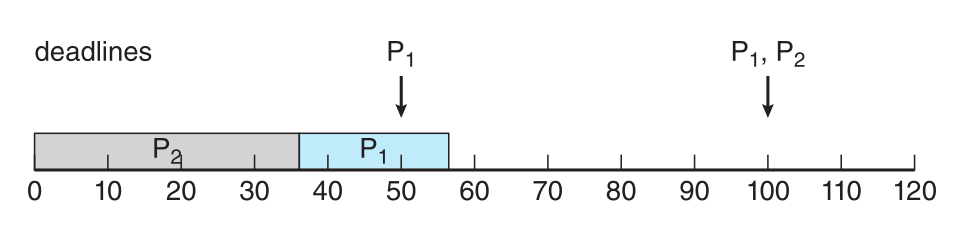</p>
<p align="center"><sub>Figure 5.21 · PDF p. 298 · P2를 P1보다 높은 priority로 두었을 때 P1이 deadline을 miss하는 예</sub></p>

예를 들어 `P1`의 period가 50, processing time이 20이고, `P2`의 period가 100, processing time이 35라고 하자. CPU utilization은 `20/50 + 35/100 = 0.75`이므로 schedule 가능해 보인다. 그러나 period가 더 긴 `P2`에 higher priority를 주면 `P1`이 첫 deadline 50을 miss한다.

<p align="center">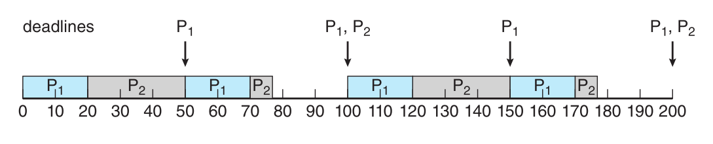</p>
<p align="center"><sub>Figure 5.22 · PDF p. 298 · 짧은 period를 가진 P1에 더 높은 priority를 주어 deadlines를 만족하는 rate-monotonic scheduling</sub></p>

Rate-monotonic에서는 period가 짧은 `P1`이 `P2`보다 higher priority를 받는다. `P1`이 period마다 CPU burst를 deadline 안에 끝내고, `P2`는 필요할 때 preempt되지만 나중에 resume하여 deadline을 만족한다.

Rate-monotonic scheduling은 static priority algorithms 중 optimal이다. 어떤 set of processes를 rate-monotonic으로 schedule할 수 없다면, 다른 static-priority algorithm으로도 schedule할 수 없다. 하지만 CPU utilization bound가 있어 항상 CPU를 100% 활용할 수는 없다.

<p align="center">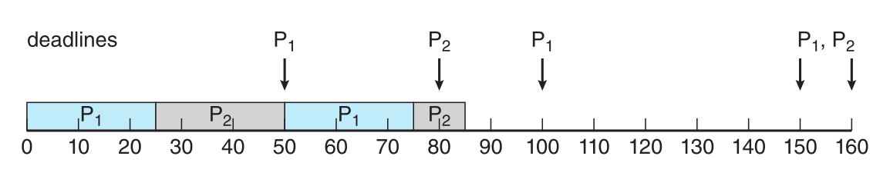</p>
<p align="center"><sub>Figure 5.23 · PDF p. 299 · utilization이 높아 rate-monotonic scheduling에서 deadline miss가 발생하는 예</sub></p>

Worst-case CPU utilization bound for `N` processes는 다음과 같다.

```text
N * (2^(1/N) - 1)
```

`N = 1`이면 100%지만, `N`이 infinity로 갈수록 약 69%로 떨어진다. `N = 2`일 때 bound는 약 83%다. Figure 5.23의 example은 combined utilization이 약 94%라서, rate-monotonic scheduling으로 deadline guarantee가 불가능하다.

### Earliest-Deadline-First Scheduling (EDF)

`earliest-deadline-first (EDF)` scheduling은 deadline에 따라 priority를 dynamically assign한다. Deadline이 빠를수록 priority가 높고, deadline이 늦을수록 priority가 낮다. Process가 runnable해질 때 scheduler에 deadline requirement를 announce해야 하며, 새 runnable process의 deadline에 따라 priorities가 조정될 수 있다.

<p align="center">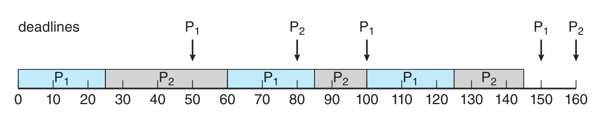</p>
<p align="center"><sub>Figure 5.24 · PDF p. 300 · dynamic deadline priority로 Figure 5.23의 tasks가 deadlines를 만족하는 EDF scheduling</sub></p>

EDF는 rate-monotonic과 달리 priorities가 fixed가 아니다. Figure 5.23에서 rate-monotonic으로 deadline을 놓친 tasks도 EDF에서는 현재 가장 빠른 deadline을 가진 process를 우선해 deadlines를 만족할 수 있다.

EDF는 processes가 periodic일 필요도 없고 CPU burst가 constant일 필요도 없다. 유일한 요구는 runnable해질 때 deadline을 scheduler에 알려야 한다는 점이다. 이론적으로 EDF는 CPU utilization 100%까지 deadline requirements를 만족하도록 schedule할 수 있는 optimal algorithm이다. 현실에서는 context switching과 interrupt handling cost 때문에 실제 100% utilization은 어렵다.

### Proportional Share Scheduling

`proportional share scheduling`은 전체 `T` shares를 applications 사이에 나눠 주고, application이 받은 `N` shares만큼 `N/T` 비율의 processor time을 보장한다.

예를 들어 `T = 100` shares이고, A가 50, B가 15, C가 20 shares를 받으면 A는 processor time의 50%, B는 15%, C는 20%를 보장받는다.

이 방식은 `admission-control policy`와 함께 동작해야 한다. 이미 85 shares가 배정되어 있는데 새 process D가 30 shares를 요청하면 total이 115가 되어 guarantee가 불가능하므로 admission controller는 D의 entry를 deny해야 한다.

### POSIX Real-Time Scheduling

POSIX는 real-time computing extension인 `POSIX.1b`를 제공하며, real-time threads를 위한 scheduling classes를 정의한다.

- `SCHED_FIFO`: first-come, first-served 방식의 FIFO queue를 사용한다. 같은 priority의 threads 사이에는 time slicing이 없다. 따라서 highest-priority real-time thread가 FIFO queue 앞에 있으면 terminate하거나 block될 때까지 CPU를 계속 받는다.
- `SCHED_RR`: `SCHED_FIFO`와 비슷하지만, 같은 priority의 threads 사이에 round-robin time slicing을 제공한다.
- `SCHED_OTHER`: POSIX가 추가로 제공하는 scheduling class지만, 구현은 system-specific이라 OS마다 다르게 동작할 수 있다.

<p align="center">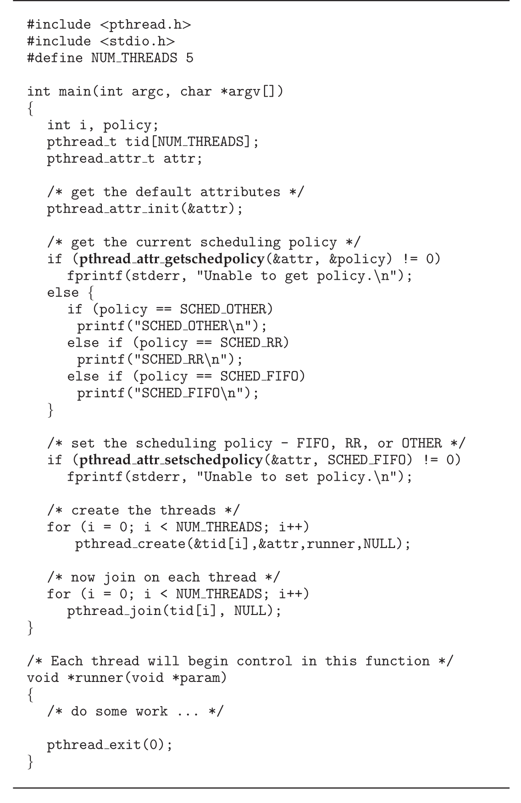</p>
<p align="center"><sub>Figure 5.25 · PDF p. 302 · pthread attributes로 SCHED_FIFO 정책을 확인하고 설정하는 POSIX API 예</sub></p>

POSIX API는 thread attributes에 대해 scheduling policy를 읽고 설정하는 함수를 제공한다.

```c
pthread_attr_getschedpolicy(pthread_attr_t *attr, int *policy)
pthread_attr_setschedpolicy(pthread_attr_t *attr, int policy)
```

첫 번째 인자는 thread attribute set에 대한 pointer이고, 두 번째 인자는 현재 policy를 받을 pointer이거나 설정할 policy 값이다. Figure 5.25의 예는 default attributes를 초기화한 뒤 현재 policy를 확인하고, 새 threads를 만들기 전에 policy를 `SCHED_FIFO`로 설정한다. 여기서 중요한 점은 POSIX가 “정책 이름”을 표준화하지만, 실제 priority 범위와 enforcement 세부는 각 OS kernel의 scheduler 구현에 의존한다는 것이다.

## 5.7 Operating-System Examples

이 절은 앞에서 설명한 abstract scheduling algorithms가 실제 OS에서 어떻게 변형되는지 보여준다. 용어상 process scheduling이라고 말하지만, 실제로는 Solaris와 Windows에서는 kernel threads를, Linux에서는 tasks를 schedule하는 설명이다.

### Example: Linux Scheduling

Linux scheduler는 역사적으로 traditional UNIX scheduling에서 `O(1)` scheduler를 거쳐 `Completely Fair Scheduler (CFS)`로 발전했다. `O(1)` scheduler는 runnable task 수와 관계없이 constant time으로 동작하고 SMP support, processor affinity, load balancing을 개선했지만, desktop에서 흔한 interactive processes의 response time이 나빠지는 문제가 있었다. Linux 2.6.23 이후 기본 scheduler는 CFS다.

Linux scheduling은 `scheduling classes` 기반이다. 각 class에는 priority가 있고, kernel은 highest-priority scheduling class 안에서 highest-priority task를 선택한다. Standard Linux kernels는 크게 두 class를 구현한다.

| Scheduling class | 목적 |
|---|---|
| Default class | `CFS`로 normal tasks를 공정하게 schedule |
| Real-time class | POSIX `SCHED_FIFO`, `SCHED_RR` 기반 real-time tasks를 normal tasks보다 높은 priority로 schedule |

CFS는 고정된 time quantum과 strict priority rule을 직접 쓰지 않는다. 대신 task마다 CPU processing time의 proportion을 배정한다. 이 proportion은 `nice value`에 의해 계산된다.

- `nice` 범위: `-20` to `+19`
- Lower numeric nice value -> higher relative priority
- Higher nice value -> lower relative priority
- Default nice value: `0`

`nice`라는 이름은 process가 자신의 nice value를 높이면 다른 task에게 CPU를 양보하는, 즉 “nice”하게 행동한다는 의미에서 왔다. 핵심은 CFS가 “정해진 quantum을 순서대로 나눠 주는 scheduler”라기보다, 일정 시간 창 안에서 runnable tasks가 각자의 가중치만큼 CPU를 받도록 균형을 맞추는 scheduler라는 점이다.

CFS는 `targeted latency`를 사용한다. Targeted latency는 모든 runnable task가 적어도 한 번은 실행되어야 하는 interval이다. Runnable task 수가 일정 threshold를 넘으면 targeted latency가 증가할 수 있다.

CFS의 핵심 상태값은 각 task의 `virtual runtime (vruntime)`이다. Scheduler는 각 task가 얼마나 실행되었는지를 `vruntime`으로 기록하고, priority에 따른 decay factor를 반영한다.

- Normal priority, nice `0`: `vruntime`은 actual physical runtime과 거의 같다.
- Lower-priority task: 같은 시간 실행되어도 `vruntime`이 더 크게 증가한다.
- Higher-priority task: 같은 시간 실행되어도 `vruntime`이 더 작게 증가한다.
- Next task 선택: 가장 작은 `vruntime`을 가진 task를 선택한다.

이 설계 때문에 I/O-bound task와 CPU-bound task가 같은 nice value를 가져도 서로 다르게 다뤄진다. I/O-bound task는 짧게 실행하고 자주 block되므로 `vruntime`이 상대적으로 작아진다. 이후 I/O가 완료되어 runnable해지면 CPU-bound task보다 먼저 선택되거나 preempt할 수 있어 interactive responsiveness가 좋아진다.

CFS는 runnable tasks를 일반 queue가 아니라 `red-black tree`에 둔다. Key는 `vruntime`이며, 가장 왼쪽 node가 가장 작은 `vruntime`을 가진 task다. Red-black tree는 balanced binary search tree라 leftmost node 탐색은 원칙적으로 `O(log N)`이지만, Linux는 `rb_leftmost`를 cache하여 다음 task 선택을 빠르게 한다.

<p align="center">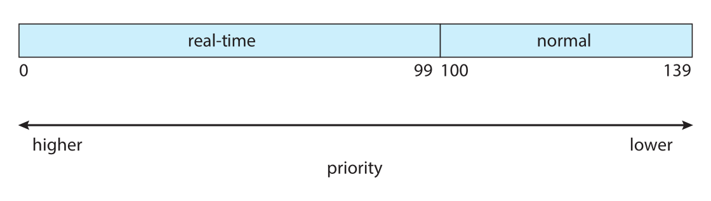</p>
<p align="center"><sub>Figure 5.26 · PDF p. 305 · Linux real-time priorities와 normal priorities의 전역 priority 범위</sub></p>

Linux real-time tasks는 static priority `0` to `99`를 사용하고, normal tasks는 priority `100` to `139`를 사용한다. Global priority에서는 numerically lower value가 higher priority다. Normal task의 nice `-20`은 priority `100`, nice `+19`는 priority `139`에 mapping된다.

CFS의 load balancing은 단순히 queue 길이를 같게 만드는 것이 아니다. 각 thread의 `load`를 priority와 average CPU utilization의 조합으로 정의한다. High-priority지만 대부분 I/O-bound인 thread는 CPU를 많이 쓰는 low-priority thread와 비슷한 load로 평가될 수 있다. Queue load는 queue 안의 thread loads 합이며, balancing은 각 queue load를 비슷하게 맞추는 작업이다.

<p align="center">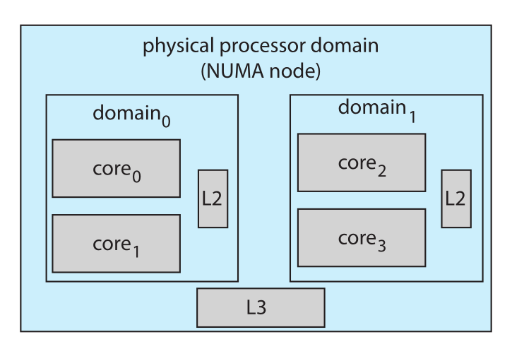</p>
<p align="center"><sub>Figure 5.27 · PDF p. 305 · Linux CFS의 scheduling domain과 NUMA-aware load balancing 구조</sub></p>

Figure 5.27은 CFS가 `scheduling domains`를 계층적으로 둔다는 점을 보여준다. 같은 L2 cache를 공유하는 cores를 작은 domain으로 묶고, 더 위에는 L3 cache나 NUMA node 수준의 domain이 있다. CFS는 가능한 낮은 level domain 안에서 먼저 load balancing을 한다. Thread migration은 cache invalidation이나 NUMA remote memory access penalty를 일으킬 수 있으므로, CFS는 severe load imbalance가 아니면 NUMA nodes 사이 migration을 꺼린다.

### Example: Windows Scheduling

Windows는 priority-based, preemptive scheduling algorithm으로 threads를 schedule한다. Windows scheduler의 scheduling 담당 kernel component를 `dispatcher`라고 부른다. Dispatcher가 선택한 thread는 다음 중 하나가 발생할 때까지 실행된다.

- Higher-priority thread에 의해 preempt됨
- Terminate됨
- Time quantum이 끝남
- I/O 같은 blocking system call을 호출함

Windows dispatcher는 32-level priority scheme을 사용한다.

| Priority range | 의미 |
|---|---|
| `0` | memory management용 special thread |
| `1-15` | variable class |
| `16-31` | real-time class |

Dispatcher는 각 priority마다 queue를 유지하고, highest priority queue부터 내려가며 ready thread를 찾는다. Ready thread가 없으면 `idle thread`를 실행한다.

Windows API에서는 process가 여섯 priority class 중 하나에 속한다.

- `IDLE_PRIORITY_CLASS`
- `BELOW_NORMAL_PRIORITY_CLASS`
- `NORMAL_PRIORITY_CLASS`
- `ABOVE_NORMAL_PRIORITY_CLASS`
- `HIGH_PRIORITY_CLASS`
- `REALTIME_PRIORITY_CLASS`

Thread는 process priority class 안에서 relative priority를 가진다. Relative priority에는 `IDLE`, `LOWEST`, `BELOW_NORMAL`, `NORMAL`, `ABOVE_NORMAL`, `HIGHEST`, `TIME_CRITICAL` 등이 있다. 실제 numeric priority는 process priority class와 thread relative priority의 조합으로 결정된다.

<p align="center">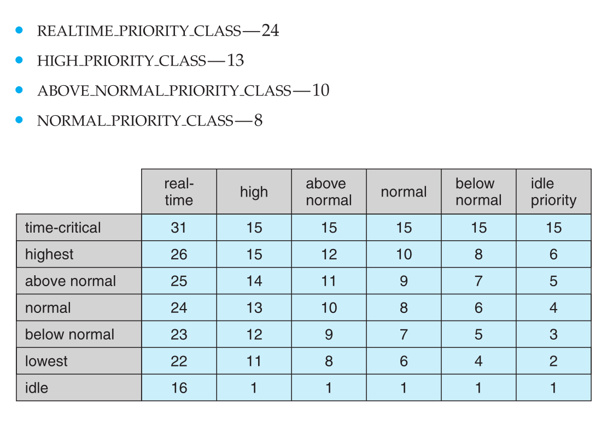</p>
<p align="center"><sub>Figure 5.28 · PDF p. 307 · Windows priority class와 relative priority가 numeric thread priority로 mapping되는 방식</sub></p>

Windows의 variable-priority thread는 time quantum을 다 쓰면 priority가 낮아진다. 단, base priority 아래로는 내려가지 않는다. 반대로 wait operation에서 깨어난 thread는 priority boost를 받는다. Keyboard I/O처럼 interactive response와 관련된 wait에서 깨어난 thread는 큰 boost를 받고, disk I/O는 moderate boost를 받는다. 이 정책은 I/O-bound, interactive threads의 response time을 좋게 만들고, compute-bound threads는 background에서 spare CPU cycles를 쓰게 만든다.

Foreground process에 대해서도 특수 규칙이 있다. `NORMAL_PRIORITY_CLASS`의 process가 foreground로 이동하면 scheduling quantum이 보통 3배 정도 증가한다. 사용자가 보고 조작하는 program이 time-sharing preemption 전에 더 오래 실행되어 perceived responsiveness가 좋아진다.

Windows 7의 `user-mode scheduling (UMS)`는 applications가 kernel scheduler 개입 없이 user mode에서 여러 threads를 만들고 schedule할 수 있게 한다. 이전의 `fiber`는 여러 user-mode threads를 하나의 kernel thread에 mapping했지만, thread environment block (TEB)을 공유하는 한계 때문에 Windows API 호출과 충돌할 수 있었다. UMS는 각 user-mode thread에 독립 thread context를 제공하고, 직접 programmer가 쓰기보다는 `Concurrency Runtime (ConcRT)` 같은 language/runtime scheduler가 그 위에 올라간다.

Multiprocessor scheduling에서 Windows는 thread의 preferred processor와 most recent processor를 유지하려고 한다. SMT system에서는 같은 CPU core의 hardware threads를 `SMT set`으로 묶고, cache locality penalty를 줄이기 위해 thread가 같은 SMT set 안의 logical processors에서 계속 실행되도록 시도한다. 또한 각 thread에 `ideal processor`를 배정해 load를 logical processors 전체에 분산한다.

### Example: Solaris Scheduling

Solaris는 priority-based thread scheduling을 사용하며, thread는 여섯 scheduling classes 중 하나에 속한다.

| Solaris class | 의미 |
|---|---|
| `TS` | Time sharing |
| `IA` | Interactive |
| `RT` | Real time |
| `SYS` | System |
| `FSS` | Fair share |
| `FX` | Fixed priority |

Default scheduling class는 `time sharing (TS)`다. TS class는 multilevel feedback queue를 사용하여 priorities를 dynamically alter하고 time slices를 조정한다. 기본 정책은 priority와 time slice 사이에 inverse relationship을 둔다.

- Higher priority -> shorter time slice
- Lower priority -> longer time slice
- Interactive processes -> higher priority
- CPU-bound processes -> lower priority

이 설계는 interactive processes의 response time과 CPU-bound processes의 throughput을 동시에 고려한다. `interactive (IA)` class도 TS와 같은 policy를 사용하지만, KDE/GNOME 같은 windowing applications에 더 높은 priority를 주어 user-facing responsiveness를 높인다.

<p align="center">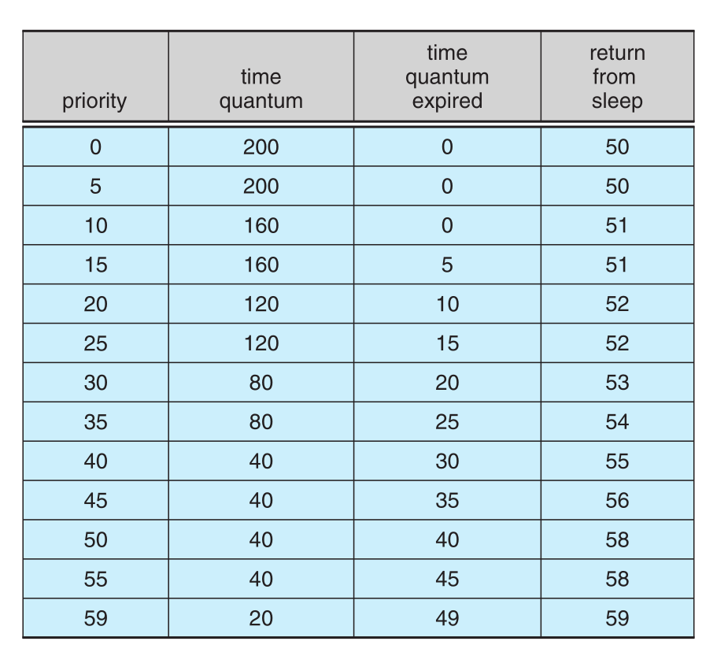</p>
<p align="center"><sub>Figure 5.29 · PDF p. 310 · Solaris time-sharing/interactive threads의 dispatch table 일부</sub></p>

Solaris dispatch table의 핵심 field는 다음과 같다.

| Field | 의미 |
|---|---|
| `Priority` | class-dependent priority. 숫자가 클수록 priority가 높다. |
| `Time quantum` | 해당 priority에서 부여되는 quantum. 낮은 priority는 길고 높은 priority는 짧다. |
| `Time quantum expired` | thread가 block 없이 quantum을 모두 쓴 경우 새 priority. CPU-intensive thread로 보고 priority를 낮춘다. |
| `Return from sleep` | I/O wait 등 sleep에서 돌아온 thread의 priority. 보통 50-59로 boost되어 response time을 높인다. |

`RT` class threads는 가장 높은 priority를 받으며, 다른 class의 process보다 먼저 실행된다. `SYS` class는 scheduler, paging daemon 같은 kernel threads에 사용되며 user processes에는 예약되지 않는다. `FX`는 priority가 dynamically adjusted되지 않는 fixed-priority class이고, `FSS`는 priorities 대신 CPU shares를 사용하여 project 단위 entitlement를 반영한다.

<p align="center">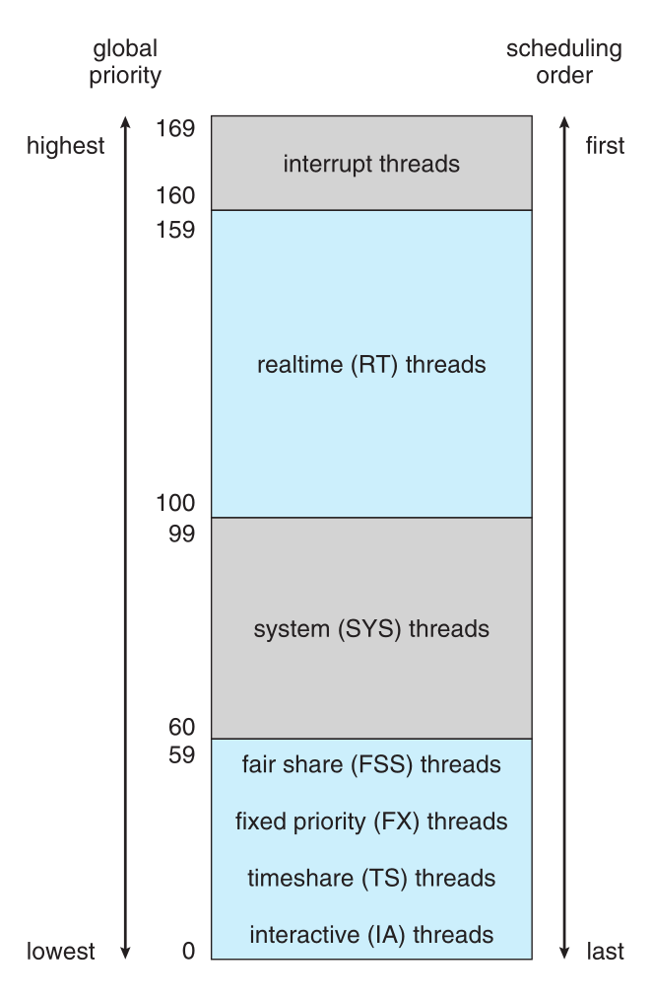</p>
<p align="center"><sub>Figure 5.30 · PDF p. 312 · Solaris scheduling classes가 global priority와 scheduling order로 mapping되는 구조</sub></p>

Solaris scheduler는 class-specific priority를 `global priority`로 변환하고, highest global priority thread를 선택한다. 선택된 thread는 block하거나 time slice를 다 쓰거나 higher-priority thread에 의해 preempt될 때까지 실행된다. 같은 priority의 여러 threads는 round-robin queue를 사용한다. Interrupt threads는 scheduling class에 속하지 않고 global priority `160-169`의 최상위 priority에서 실행된다.

## 5.8 Algorithm Evaluation

CPU-scheduling algorithm 선택은 단순히 “평균 waiting time이 낮은가” 하나로 결정되지 않는다. 먼저 system goal을 criterion으로 명확히 해야 한다. 예를 들어 다음처럼 여러 목표를 함께 걸 수 있다.

- Maximum response time을 300ms 이하로 제한하면서 CPU utilization을 maximize
- Average turnaround time이 total execution time에 linearly proportional하도록 throughput을 maximize

즉 algorithm evaluation은 workload와 목표의 조합이다. 같은 algorithm도 desktop, server, mobile, real-time system에서 다르게 평가된다.

### Deterministic Modeling

`deterministic modeling`은 analytic evaluation의 한 종류다. 특정 predetermined workload를 주고, 각 algorithm이 그 workload에서 어떤 performance number를 내는지 계산한다.

예를 들어 모든 processes가 time 0에 도착하고 CPU burst가 다음과 같다고 하자.

| Process | Burst Time |
|---|---:|
| `P1` | 10 |
| `P2` | 29 |
| `P3` | 3 |
| `P4` | 7 |
| `P5` | 12 |

이 workload에서 평균 waiting time은 다음처럼 비교된다.

| Algorithm | Execution order | Average waiting time |
|---|---|---:|
| `FCFS` | P1 -> P2 -> P3 -> P4 -> P5 | 28 ms |
| `SJF` | P3 -> P4 -> P1 -> P5 -> P2 | 13 ms |
| `RR`, quantum = 10 ms | P1 -> P2 -> P3 -> P4 -> P5 -> P2 -> P5 -> P2 | 23 ms |

Deterministic modeling은 simple and fast하며 exact numbers를 제공한다. 하지만 exact input numbers가 있어야 하고, 결과는 해당 case에만 적용된다. 그래서 scheduling algorithms를 설명하거나 trend를 보여주는 데 좋지만, 일반 시스템 전체의 성능 보장으로 확대하기는 어렵다. 예시처럼 모든 processes와 burst times가 time 0에 알려진 환경에서는 SJF가 minimum waiting time을 준다는 성질을 확인하는 데 유용하다.

### Queueing Models

실제 시스템에서는 매일 실행되는 process set이 바뀌므로 고정 workload만으로는 부족하다. 대신 CPU burst distribution, I/O burst distribution, arrival-time distribution을 측정하거나 추정하여 수학 모델을 만든다. Computer system은 servers의 network로 모델링된다.

- CPU: ready queue를 가진 server
- I/O device: device queue를 가진 server
- Arrival rate, service rate를 이용해 utilization, average queue length, average wait time 등을 계산

이 분야를 `queueing-network analysis`라고 한다.

핵심 공식은 `Little's formula`다.

```text
n = lambda * W
```

여기서 `n`은 queue에서 service 중인 process를 제외한 long-term average queue length, `W`는 average waiting time, `lambda`는 average arrival rate다. 예를 들어 평균적으로 초당 7 processes가 도착하고 queue에 보통 14 processes가 있다면 average waiting time은 2 seconds다.

Little's formula는 scheduling algorithm이나 arrival distribution과 관계없이 steady state에서 성립한다는 점이 강력하다. 다만 queueing analysis는 복잡한 algorithms와 realistic distributions를 다루기 어렵고, 수학적으로 tractable하지만 비현실적인 assumptions를 많이 둘 수 있다. 따라서 계산 결과는 real system에 대한 approximation으로 봐야 한다.

### Simulations

`simulation`은 computer system model을 program으로 만들고, clock variable을 증가시키며 devices, processes, scheduler state를 변화시키는 방식이다. Simulator는 실행 중 algorithm performance statistics를 수집한다.

Simulation input은 두 방식으로 만들 수 있다.

| Input 방식 | 설명 | 한계 |
|---|---|---|
| Distribution-driven | random-number generator가 uniform, exponential, Poisson 또는 empirical distribution에 따라 arrivals, CPU bursts 등을 생성 | event들의 순서와 상관관계를 잃을 수 있음 |
| Trace-driven | real system을 monitoring하여 actual event sequence를 `trace file`로 기록하고 simulation에 사용 | storage가 크고 trace에 포함된 입력에 대해서만 정확함 |

<p align="center">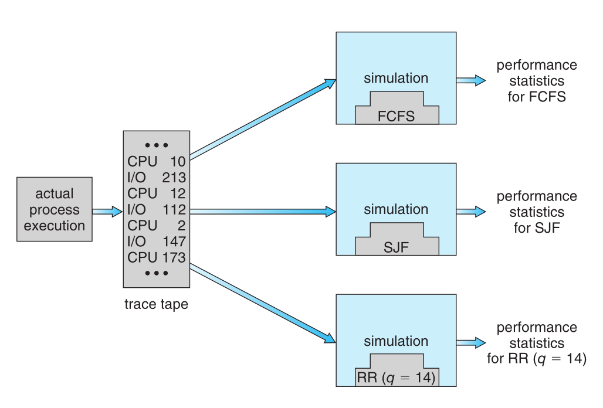</p>
<p align="center"><sub>Figure 5.31 · PDF p. 315 · 같은 trace file로 FCFS, SJF, RR(q=14)을 비교하는 scheduler simulation</sub></p>

Trace file은 서로 다른 algorithms를 exactly same real inputs에서 비교할 수 있게 해 준다. Figure 5.31처럼 actual process execution에서 CPU/I/O event sequence를 기록한 뒤, 같은 trace를 FCFS, SJF, RR simulator에 넣으면 algorithm 차이만 비교하기 쉽다.

Simulation은 deterministic modeling이나 queueing models보다 현실에 가까울 수 있지만, 비용이 크다. 자세한 simulation일수록 accuracy는 올라가지만 computer time, trace storage, simulator 설계/코딩/debugging 비용도 커진다.

### Implementation

가장 정확한 evaluation은 scheduling algorithm을 실제 OS에 구현하고 real operating conditions에서 보는 것이다. 그러나 이 방법은 비용과 위험이 가장 크다.

- OS code와 data structures를 수정해야 한다.
- Virtual machines 등에서 충분히 testing해야 한다.
- Regression testing으로 기존 기능이나 해결된 bugs가 깨지지 않았는지 확인해야 한다.
- Scheduler 성능이 user/program behavior 자체를 바꿀 수 있다.

마지막 점이 특히 중요하다. 예를 들어 system이 short processes를 우대하면 사용자가 큰 작업을 작은 작업 여러 개로 쪼갤 수 있다. Interactive processes를 우대하면 noninteractive 작업도 interactive처럼 보이도록 행동할 수 있다. 원문 예시처럼 terminal I/O 여부로 interactive를 판단하면, program이 의미 없는 character를 1초보다 짧은 간격으로 출력해 high priority를 얻는 식의 우회가 가능하다.

따라서 flexible scheduling algorithms는 system manager나 user가 특정 application set에 맞게 tuning할 수 있어야 한다. Solaris의 `dispadmin`은 scheduling class parameters를 수정하는 예이고, Java/POSIX/Windows API는 process 또는 thread priority를 조정하는 기능을 제공한다. 다만 특정 workload에 맞춘 tuning이 general performance를 항상 높이는 것은 아니다.

## 연결 관계

- Chapter 3의 process/thread 실행 단위가 ready queue에 쌓이면, Chapter 5의 CPU scheduler가 어떤 단위를 언제 실행할지 결정한다.
- Chapter 4의 threads and concurrency는 여기서 `kernel-level thread`, `PCS`, `SCS`, `user-mode scheduling`, `SMT`, `hardware thread` 논의로 이어진다.
- Chapter 5의 preemption, dispatcher, context switch는 이후 synchronization에서 race condition과 critical section이 왜 어려워지는지의 기반이 된다.
- Multiprocessor scheduling의 processor affinity, load balancing, NUMA cost는 memory hierarchy와 cache locality를 이해해야 제대로 설명된다.
- Real-time scheduling의 RMS, EDF, proportional share는 일반-purpose scheduling과 달리 average performance보다 deadline guarantee와 admission control을 중심으로 본다.

## 오해하기 쉬운 내용

- `SJF`가 평균 waiting time에서 optimal이라는 말은 CPU burst를 알 수 있다는 조건 아래의 이론적 성질이다. 실제 OS에서는 next CPU burst를 정확히 모르므로 prediction이 필요하다.
- `preemptive scheduling`은 responsiveness를 높일 수 있지만 context switch overhead와 shared kernel data race 문제를 만든다.
- `Round-Robin (RR)`에서 quantum이 작을수록 무조건 좋은 것은 아니다. 너무 작으면 context switch overhead가 커지고, 너무 크면 FCFS처럼 변한다.
- `priority scheduling`은 starvation을 만들 수 있다. `aging`은 오래 기다린 process의 priority를 점진적으로 올려 이를 완화한다.
- `processor affinity`와 `load balancing`은 서로 긴장 관계다. Affinity는 cache locality를 보존하지만 load imbalance를 남길 수 있고, migration은 load를 맞추지만 cache/NUMA penalty를 만든다.
- `soft real-time`은 우선권을 주는 것이고, `hard real-time`은 deadline guarantee가 필요하다. Priority만 높다고 hard real-time이 되는 것은 아니다.
- `CFS`는 “모든 task에게 동일 quantum을 주는 RR”이 아니다. `vruntime`, nice weight, red-black tree로 CPU proportion을 맞추는 scheduler다.

## 면접 질문

1. CPU-I/O burst cycle이 CPU scheduling 설계에 왜 중요한가?
2. Preemptive scheduling과 nonpreemptive scheduling의 차이와 trade-off는 무엇인가?
3. Dispatcher가 하는 일과 dispatch latency가 중요한 이유는 무엇인가?
4. FCFS에서 convoy effect가 생기는 이유는 무엇인가?
5. SJF가 average waiting time에 대해 optimal임에도 실제 구현이 어려운 이유는 무엇인가?
6. Round-Robin에서 time quantum을 너무 작게 또는 크게 잡으면 각각 어떤 문제가 생기는가?
7. Priority scheduling의 starvation 문제를 aging으로 어떻게 완화하는가?
8. Multilevel queue와 multilevel feedback queue의 차이는 무엇인가?
9. PCS와 SCS의 차이는 무엇이며, Pthreads에서는 어떻게 드러나는가?
10. Processor affinity와 load balancing은 왜 충돌할 수 있는가?
11. NUMA-aware scheduling이 thread migration을 조심하는 이유는 무엇인가?
12. Rate-monotonic scheduling과 EDF의 priority 결정 방식은 어떻게 다른가?
13. Linux CFS에서 `vruntime`과 red-black tree는 어떤 역할을 하는가?
14. Windows scheduler가 interactive thread의 priority를 boost하는 이유는 무엇인가?
15. Deterministic modeling, queueing models, simulation, implementation은 각각 어떤 장단점을 가지는가?
