# Chapter 7. Synchronization Examples

- 과목: Operating System
- 기준 교재: Operating System Concepts 10th
- 관련 페이지: PDF pp. 375-400
- 우선순위: 필수

## 개요

Chapter 7은 Chapter 6에서 배운 `memory barriers`, `compare-and-swap (CAS)`, `mutex locks`, `semaphores`, `monitors`, `condition variables`를 실제 synchronization problems와 OS/API 구현에 적용한다. Chapter 6이 “왜 race condition이 생기고 어떤 도구가 있는가”를 설명했다면, Chapter 7은 “그 도구를 어떤 패턴으로 쓰면 되는가, 실제 kernel과 Java/POSIX API에서는 어떻게 보이는가”를 보여준다.

핵심 흐름은 세 단계다. 먼저 `bounded-buffer problem`, `readers-writers problem`, `dining-philosophers problem` 같은 classic problems로 synchronization 설계를 검증한다. 다음으로 Windows와 Linux kernel이 어떤 primitive를 선택하는지 본다. 마지막으로 POSIX와 Java의 concrete API, 그리고 transactional memory, OpenMP, functional programming 같은 alternative approaches를 정리한다.

## 핵심 개념

| 개념 | 핵심 의미 |
|---|---|
| `bounded-buffer problem` | finite buffer를 producer와 consumer가 공유할 때 empty/full count와 mutual exclusion을 동시에 맞추는 문제 |
| `readers-writers problem` | readers는 동시에 허용하되 writers는 exclusive access가 필요한 shared database 문제 |
| `reader-writer lock` | read mode와 write mode를 구분해 multiple readers 또는 single writer를 허용하는 lock |
| `dining-philosophers problem` | 여러 processes가 여러 resources를 동시에 요구할 때 deadlock/starvation을 피하는 대표 문제 |
| `dispatcher object` | Windows의 thread synchronization object. mutex, semaphore, event, timer 등을 포함 |
| `spinlock` | lock이 풀릴 때까지 CPU를 잡고 반복 확인하는 lock |
| `POSIX mutex` | Pthreads의 `pthread_mutex_t` 기반 mutual exclusion primitive |
| `POSIX semaphore` | named/unnamed semaphore로 process/thread synchronization을 제공하는 POSIX primitive |
| `Java monitor` | 모든 Java object에 연결된 intrinsic lock 기반 monitor |
| `entry set` | Java intrinsic lock을 얻으려고 기다리는 threads 집합 |
| `wait set` | Java object의 `wait()`로 condition을 기다리는 threads 집합 |
| `reentrant lock` | 같은 thread가 이미 가진 lock을 다시 acquire할 수 있는 lock |
| `transactional memory` | memory operations를 transaction처럼 묶어 commit/abort로 race를 다루는 접근 |

## 세부 정리

## 7.1 Classic Problems of Synchronization

Classic synchronization problems는 새로운 synchronization scheme이 제대로 동작하는지 검증하는 testbed 역할을 한다. 이 절에서는 traditional presentation에 맞춰 semaphores를 사용하지만, 실제 implementation에서는 binary semaphores 대신 mutex locks를 사용할 수도 있다.

### The Bounded-Buffer Problem

`bounded-buffer problem`은 producer와 consumer가 finite buffer pool을 공유하는 문제다. Producer는 item을 만들어 buffer에 넣고, consumer는 buffer에서 item을 꺼내 소비한다. 필요한 것은 세 가지다.

- Buffer pool에 동시에 접근할 때 data structure가 깨지지 않아야 한다.
- Producer는 empty buffer가 있을 때만 item을 넣어야 한다.
- Consumer는 full buffer가 있을 때만 item을 꺼내야 한다.

이를 위해 shared data structures는 다음과 같다.

```c
int n;
semaphore mutex = 1;
semaphore empty = n;
semaphore full = 0;
```

| Semaphore | 초기값 | 의미 |
|---|---:|---|
| `mutex` | 1 | buffer pool access에 대한 mutual exclusion |
| `empty` | `n` | empty buffers의 수 |
| `full` | 0 | full buffers의 수 |

Producer는 먼저 empty slot이 있는지 `wait(empty)`로 확인하고, 그 다음 `wait(mutex)`로 buffer pool에 exclusive하게 들어간다. Item을 넣은 뒤 `signal(mutex)`로 critical section을 나가고, `signal(full)`로 full buffer가 하나 늘었음을 알린다.

<p align="center">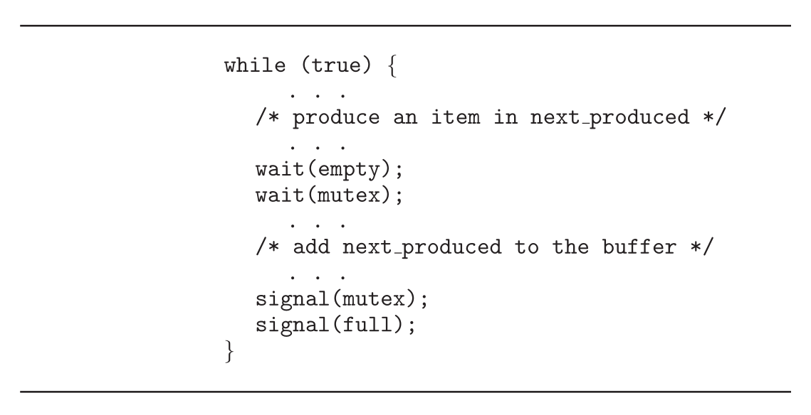</p>
<p align="center"><sub>Figure 7.1 · PDF p. 376 · bounded-buffer producer가 empty slot과 mutex를 얻은 뒤 item을 추가하는 구조</sub></p>

Consumer는 대칭적으로 먼저 full slot이 있는지 `wait(full)`로 확인하고, `wait(mutex)`로 buffer pool에 들어간다. Item을 꺼낸 뒤 `signal(mutex)`로 critical section을 나가고, `signal(empty)`로 empty buffer가 하나 늘었음을 알린다.

<p align="center">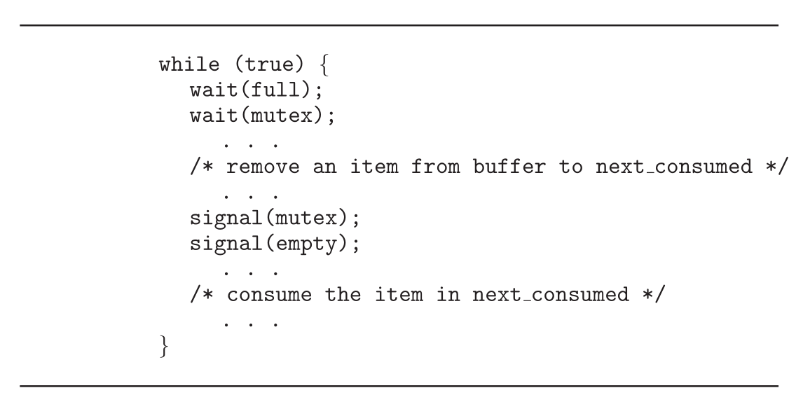</p>
<p align="center"><sub>Figure 7.2 · PDF p. 377 · bounded-buffer consumer가 full slot과 mutex를 얻은 뒤 item을 제거하는 구조</sub></p>

이 구조의 중요한 점은 `empty/full`과 `mutex`의 역할이 다르다는 것이다. `empty`와 `full`은 resource count와 ordering을 다루고, `mutex`는 buffer array/index update 자체의 mutual exclusion을 보장한다.

### The Readers-Writers Problem

`readers-writers problem`은 shared database를 여러 concurrent processes가 접근하는 상황을 모델링한다. `reader`는 database를 읽기만 하고, `writer`는 읽고 쓴다. 두 readers가 동시에 읽는 것은 안전하지만, writer와 다른 reader/writer가 동시에 접근하면 data consistency가 깨질 수 있다. 따라서 writers는 exclusive access가 필요하다.

Readers-writers problem에는 priority policy에 따른 variations가 있다.

| Variation | 요구 | Starvation 위험 |
|---|---|---|
| `first readers-writers problem` | Writer가 이미 permission을 얻은 경우가 아니면 reader를 기다리게 하지 않음 | writers starvation |
| `second readers-writers problem` | Writer가 준비되면 가능한 빨리 write 수행 | readers starvation |

원문은 first readers-writers problem의 semaphore solution을 제시한다.

```c
semaphore rw_mutex = 1;
semaphore mutex = 1;
int read_count = 0;
```

- `rw_mutex`: readers와 writers가 공유한다. Writer에게는 database 전체에 대한 mutual exclusion이고, 첫 reader/마지막 reader가 writer와의 exclusion을 조정할 때도 사용한다.
- `mutex`: `read_count` update를 보호한다.
- `read_count`: 현재 object를 읽고 있는 readers 수다.

Writer는 단순하다. `wait(rw_mutex)`로 database에 대한 exclusive access를 얻고 write를 수행한 뒤 `signal(rw_mutex)`로 놓는다.

<p align="center">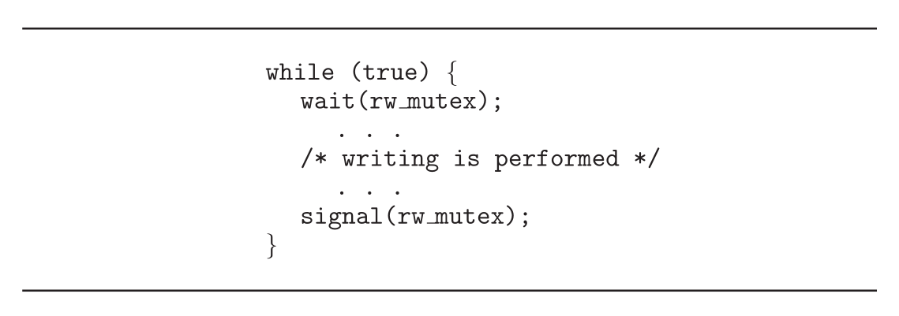</p>
<p align="center"><sub>Figure 7.3 · PDF p. 378 · writer가 rw_mutex를 얻어 exclusive writing을 수행하는 구조</sub></p>

Reader는 첫 reader일 때만 `rw_mutex`를 얻고, 마지막 reader일 때만 `rw_mutex`를 놓는다. 중간 readers는 `read_count`만 늘리고 줄이며 동시에 읽을 수 있다.

<p align="center">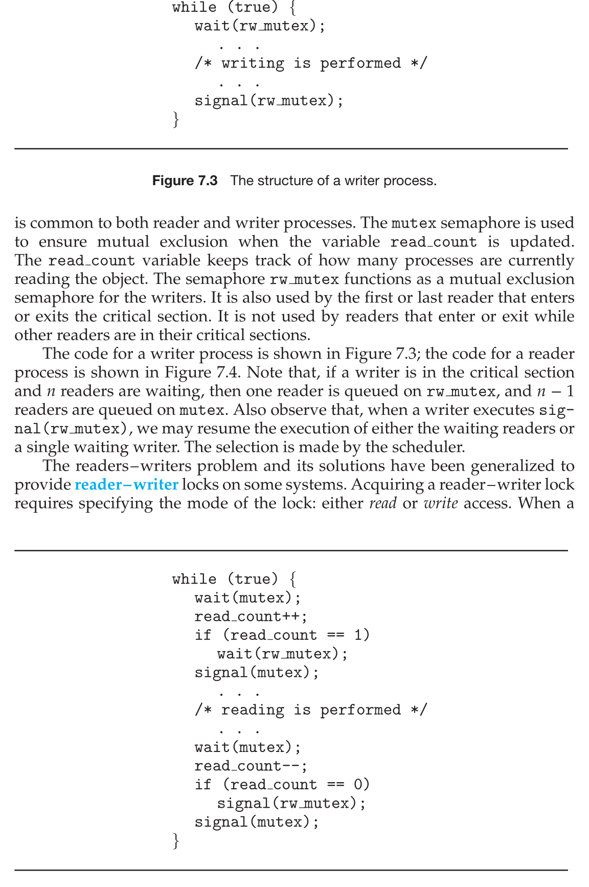</p>
<p align="center"><sub>Figure 7.4 · PDF p. 378 · 첫 reader와 마지막 reader만 rw_mutex를 조정하는 readers-writers solution</sub></p>

Reader process의 핵심은 다음 흐름이다.

```text
enter:
  wait(mutex)
  read_count++
  if read_count == 1: wait(rw_mutex)
  signal(mutex)

read

exit:
  wait(mutex)
  read_count--
  if read_count == 0: signal(rw_mutex)
  signal(mutex)
```

Writer가 critical section에 있고 `n` readers가 waiting이면, reader 하나는 `rw_mutex`에서 기다리고 나머지 `n - 1` readers는 `mutex`에서 기다릴 수 있다. Writer가 `signal(rw_mutex)`를 실행한 뒤 waiting readers를 resume할지 waiting writer 하나를 resume할지는 scheduler가 결정한다.

이 문제는 `reader-writer lock`으로 일반화된다. Lock acquire 시 `read mode` 또는 `write mode`를 지정한다. Read mode는 여러 processes가 동시에 획득할 수 있지만, write mode는 exclusive하다. Reader-writer lock은 readers가 writers보다 훨씬 많고, 어떤 code가 read-only인지 write인지 식별하기 쉬울 때 유용하다. 다만 일반 mutex나 semaphore보다 setup overhead가 크므로 increased concurrency가 그 overhead를 보상할 때 적합하다.

### The Dining-Philosophers Problem

`dining-philosophers problem`은 여러 processes가 여러 resources를 동시에 요구할 때 deadlock과 starvation을 피해야 하는 대표 문제다. 다섯 philosophers가 원형 table에 앉아 있고, 각 philosopher 사이에는 chopstick 하나가 있다. Philosopher는 think하다가 hungry해지면 양쪽 chopsticks를 하나씩 집어야 eat할 수 있다.

<p align="center">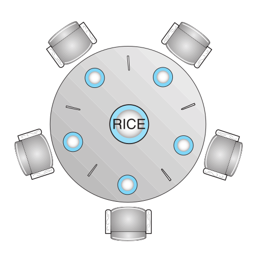</p>
<p align="center"><sub>Figure 7.5 · PDF p. 379 · 다섯 philosophers와 다섯 chopsticks가 원형으로 배치된 dining-philosophers 상황</sub></p>

이 문제의 핵심은 “인접한 두 philosophers는 같은 chopstick을 동시에 사용할 수 없다”는 mutual exclusion뿐 아니라, 전체 system이 deadlock-free와 starvation-free여야 한다는 점이다.

#### Semaphore Solution

가장 단순한 semaphore solution은 각 chopstick을 semaphore로 표현한다.

```c
semaphore chopstick[5]; // all initialized to 1
```

Philosopher `i`는 `wait(chopstick[i])`로 왼쪽 chopstick을, `wait(chopstick[(i + 1) % 5])`로 오른쪽 chopstick을 얻은 뒤 eat하고, 먹은 뒤 두 chopsticks에 `signal()`을 호출한다.

<p align="center">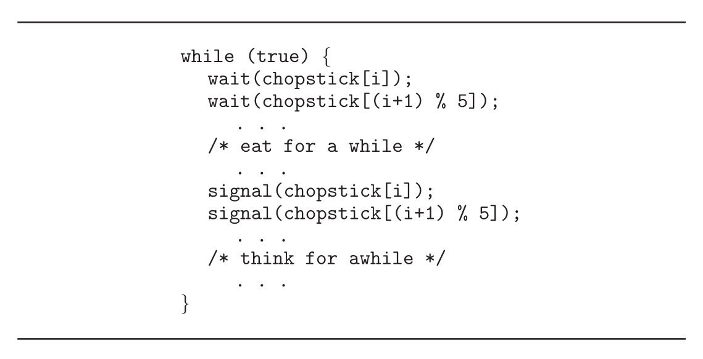</p>
<p align="center"><sub>Figure 7.6 · PDF p. 380 · philosopher i가 양쪽 chopsticks semaphore를 차례로 획득하고 해제하는 구조</sub></p>

이 solution은 인접한 두 philosophers가 동시에 eat하는 것은 막지만 deadlock을 만들 수 있다. 다섯 philosophers가 동시에 hungry해져 각자 left chopstick을 먼저 집으면 모든 `chopstick[i] == 0`이 된다. 이후 모두 right chopstick을 기다리므로 영원히 진행하지 못한다.

Deadlock remedy는 여러 가지다.

| Remedy | 핵심 아이디어 |
|---|---|
| At most four philosophers | 동시에 table에 앉는 philosophers 수를 4명으로 제한 |
| Pick up both only if available | 양쪽 chopsticks가 모두 available할 때만 critical section에서 집게 함 |
| Asymmetric solution | odd philosopher는 left->right, even philosopher는 right->left 순서로 집음 |

그러나 deadlock-free가 곧 starvation-free는 아니다. 어떤 philosopher가 계속 양쪽 chopsticks를 얻지 못하면 starvation이 발생할 수 있다.

#### Monitor Solution

Monitor solution은 philosopher가 양쪽 chopsticks를 모두 사용할 수 있을 때만 eat하도록 강제한다. 각 philosopher는 세 상태 중 하나를 가진다.

```c
enum {THINKING, HUNGRY, EATING} state[5];
condition self[5];
```

Philosopher `i`는 양쪽 neighbors가 eating 중이 아닐 때만 `state[i] = EATING`이 될 수 있다.

```c
state[(i + 4) % 5] != EATING
state[(i + 1) % 5] != EATING
```

`self[i]` condition variable은 philosopher `i`가 hungry하지만 필요한 chopsticks를 얻을 수 없을 때 자기 자신을 delay하는 데 사용된다.

<p align="center">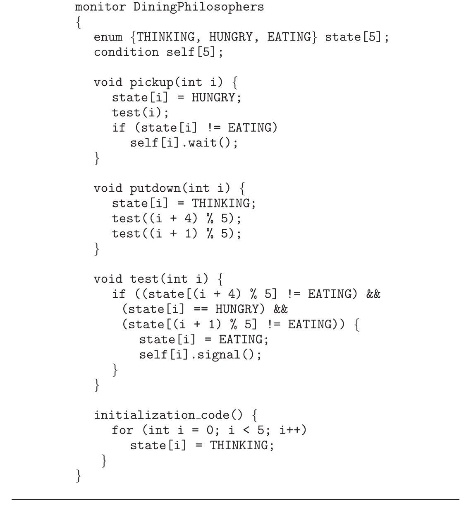</p>
<p align="center"><sub>Figure 7.7 · PDF p. 382 · state 배열과 condition self[]를 사용한 dining-philosophers monitor solution</sub></p>

Monitor `DiningPhilosophers`는 세 operation 중심으로 동작한다.

| Operation | 역할 |
|---|---|
| `pickup(i)` | `state[i] = HUNGRY`로 만들고 `test(i)` 후, eat할 수 없으면 `self[i].wait()` |
| `putdown(i)` | `state[i] = THINKING`으로 바꾸고 양쪽 neighbors를 `test()` |
| `test(i)` | `i`가 hungry이고 양쪽 neighbors가 eating이 아니면 `state[i] = EATING`, `self[i].signal()` |

각 philosopher는 다음 sequence를 지켜야 한다.

```text
DiningPhilosophers.pickup(i);
eat;
DiningPhilosophers.putdown(i);
```

이 monitor solution은 인접한 두 philosophers가 동시에 eat하지 못하게 하고 deadlock도 방지한다. 하지만 starvation 가능성은 여전히 남는다. 어떤 philosopher가 계속 neighbors에게 밀리면 hungry 상태에서 오래 기다릴 수 있다.

## 7.2 Synchronization within the Kernel

Windows와 Linux는 모두 synchronization을 제공하지만, kernel 구조와 execution model이 달라 subtleties가 있다. Kernel synchronization은 일반 application synchronization보다 더 민감하다. Kernel이 global resource를 잡고 있는 동안 preempt되거나 interrupt handler와 충돌하면 system-wide data corruption 또는 latency 문제가 생길 수 있기 때문이다.

### Synchronization in Windows

Windows는 multithreaded kernel이며 real-time applications와 multiple processors를 지원한다. Single-processor system에서 Windows kernel이 global resource에 접근할 때는, 그 resource에 접근할 수 있는 interrupt handlers에 대해 interrupts를 temporary mask한다. Multiprocessor system에서는 global resources를 `spinlocks`로 보호한다. 단, kernel은 spinlock을 short code segments 보호에만 사용하고, efficiency를 위해 thread가 spinlock을 holding하는 동안 preempt되지 않도록 보장한다.

Kernel 밖 thread synchronization을 위해 Windows는 `dispatcher objects`를 제공한다. Dispatcher object에는 mutex locks, semaphores, events, timers 등이 포함된다.

| Dispatcher object | 역할 |
|---|---|
| `mutex` | shared data access 전에 ownership 획득, 끝나면 release |
| `semaphore` | Section 6.6의 counting/binary semaphore 역할 |
| `event` | condition variable처럼 원하는 condition이 발생했음을 waiting thread에 알림 |
| `timer` | 지정된 시간이 지났음을 하나 이상의 thread에 알림 |

Dispatcher object는 `signaled state` 또는 `nonsignaled state`를 가진다. Signaled state는 object가 available하다는 뜻이라 acquire 시 block되지 않는다. Nonsignaled state는 object가 unavailable하다는 뜻이라 thread가 block된다.

<p align="center">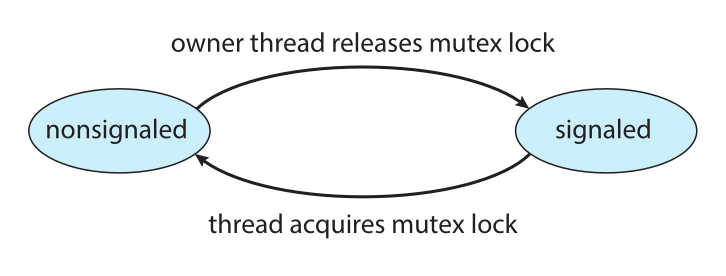</p>
<p align="center"><sub>Figure 7.8 · PDF p. 383 · Windows mutex dispatcher object가 signaled/nonsignaled state 사이를 전이하는 구조</sub></p>

Thread가 nonsignaled dispatcher object에서 block되면 thread state는 ready에서 waiting으로 바뀌고, 해당 object의 waiting queue에 들어간다. Dispatcher object가 signaled로 바뀌면 kernel은 waiting threads가 있는지 확인하고, object type에 따라 하나 또는 여러 threads를 waiting에서 ready로 옮긴다. Mutex object는 single owner만 가질 수 있으므로 waiting queue에서 하나만 선택한다. Event object는 waiting threads 전부를 깨울 수 있다.

Windows의 `critical-section object`는 user-mode mutex다. 보통 kernel intervention 없이 acquire/release할 수 있어 효율적이다. Multiprocessor system에서는 먼저 spinlock처럼 잠깐 spin하며 다른 thread가 object를 release하기를 기다린다. 너무 오래 spin하면 kernel mutex를 allocate하고 CPU를 yield한다. 실제로는 contention이 적은 경우가 많으므로, kernel mutex를 필요할 때만 allocate하는 점이 큰 성능 이득을 준다.

### Synchronization in Linux

Linux는 version 2.6 이전에는 nonpreemptive kernel이었다. Kernel mode에서 실행 중인 process는 higher-priority process가 runnable해져도 preempt되지 않았다. 현재 Linux kernel은 fully preemptive이므로 kernel에서 실행 중인 task도 preempt될 수 있다.

Linux kernel은 여러 synchronization mechanisms를 제공한다. 가장 단순한 것은 `atomic_t`로 표현되는 `atomic integer`다. Atomic integer operations는 interruption 없이 수행되므로 counter처럼 단일 integer update에 효율적이다.

```c
atomic_t counter;
int value;

atomic_set(&counter, 5);      // counter = 5
atomic_add(10, &counter);     // counter = counter + 10
atomic_sub(4, &counter);      // counter = counter - 4
atomic_inc(&counter);         // counter = counter + 1
value = atomic_read(&counter); // value = 12
```

Atomic integers는 locking overhead 없이 counter를 갱신할 수 있어 빠르다. 하지만 race condition에 여러 variables가 관여하면 atomic integer만으로는 충분하지 않고 더 정교한 locking tool이 필요하다.

Linux kernel critical sections 보호에는 `mutex_lock()`과 `mutex_unlock()`이 사용된다. Lock이 unavailable하면 `mutex_lock()`을 호출한 task는 sleep state로 들어가고, owner가 `mutex_unlock()`을 호출하면 깨어난다. Linux는 kernel locking을 위해 spinlocks, semaphores, reader-writer versions도 제공한다.

SMP machines에서 fundamental locking mechanism은 `spinlock`이다. Kernel은 spinlock을 short duration 동안만 hold하도록 설계한다. Single-processor machines에서는 spinlock이 부적절하다. 다른 core가 없으므로 spin해도 lock holder가 동시에 진행할 수 없기 때문이다. 대신 kernel preemption을 disable/enable한다.

| 환경 | Lock acquire에 해당 | Lock release에 해당 |
|---|---|---|
| Single processor | Disable kernel preemption | Enable kernel preemption |
| Multiple processors | Acquire spin lock | Release spin lock |

Linux kernel의 spinlocks와 mutex locks는 모두 `nonrecursive`다. Thread가 이미 획득한 lock을 release 없이 다시 acquire하려 하면 두 번째 acquire에서 block된다.

Linux는 `preempt_disable()`과 `preempt_enable()`로 kernel preemption을 제어한다. 또한 각 task의 `thread-info` structure에는 `preempt_count`가 있어 task가 holding 중인 locks 수를 나타낸다. Lock을 acquire하면 `preempt_count`가 증가하고 release하면 감소한다. 현재 kernel task의 `preempt_count > 0`이면 lock을 holding 중이므로 preempt하면 안전하지 않다. `preempt_count == 0`이고 outstanding `preempt_disable()`도 없다면 kernel을 safely interrupt할 수 있다.

정리하면, Linux kernel에서는 짧은 critical section이면 spinlock 또는 preemption disable이 적합하고, lock을 오래 hold해야 하면 semaphores나 mutex locks가 더 적합하다.

## 7.3 POSIX Synchronization

POSIX synchronization은 kernel developer가 아니라 user-level programmer가 사용하는 API다. Host OS의 kernel primitives 위에 구현되지만, API 자체는 UNIX, Linux, macOS 개발자에게 널리 쓰이는 portable interface 역할을 한다.

### POSIX Mutex Locks

Pthreads에서 기본 mutual exclusion 도구는 `POSIX mutex lock`이다. Data type은 `pthread_mutex_t`이고, `pthread_mutex_init()`으로 초기화한다.

```c
#include <pthread.h>

pthread_mutex_t mutex;
pthread_mutex_init(&mutex, NULL);
```

Critical section 보호는 `pthread_mutex_lock()`과 `pthread_mutex_unlock()`으로 한다.

```c
pthread_mutex_lock(&mutex);

/* critical section */

pthread_mutex_unlock(&mutex);
```

`pthread_mutex_lock()` 호출 시 mutex가 unavailable이면 calling thread는 owner가 `pthread_mutex_unlock()`을 호출할 때까지 block된다. Pthreads mutex functions는 정상 동작 시 0을 반환하고, error 발생 시 nonzero error code를 반환한다.

### POSIX Semaphores

POSIX semaphores는 POSIX standard core가 아니라 `POSIX SEM` extension에 속한다. POSIX는 `named semaphore`와 `unnamed semaphore` 두 종류를 제공한다. 둘은 본질적으로 비슷하지만 생성 방식과 processes 사이 공유 방식이 다르다.

#### POSIX Named Semaphores

Named semaphore는 `sem_open()`으로 생성하거나 연다.

```c
#include <semaphore.h>

sem_t *sem;
sem = sem_open("SEM", O_CREAT, 0666, 1);
```

위 예는 이름이 `"SEM"`인 semaphore를 만들고, 없으면 `O_CREAT`로 생성하며, permission `0666`과 initial value 1을 부여한다. Named semaphore의 장점은 unrelated processes도 같은 name을 참조하여 common semaphore를 쉽게 공유할 수 있다는 것이다. 이미 생성된 semaphore에 대해 다른 process가 같은 name으로 `sem_open()`을 호출하면 existing semaphore descriptor를 받는다.

POSIX에서 semaphore wait/signal은 각각 `sem_wait()`와 `sem_post()`다.

```c
sem_wait(sem);

/* critical section */

sem_post(sem);
```

Linux와 macOS 모두 POSIX named semaphores를 제공한다.

#### POSIX Unnamed Semaphores

Unnamed semaphore는 `sem_init()`으로 생성하고 초기화한다. 인자는 semaphore pointer, sharing flag, initial value다.

```c
#include <semaphore.h>

sem_t sem;
sem_init(&sem, 0, 1);
```

두 번째 인자 `0`은 이 semaphore가 생성 process 안의 threads 사이에서만 공유된다는 뜻이다. Nonzero value를 주면 shared memory region에 semaphore를 두어 separate processes 사이에서도 공유할 수 있다. Unnamed semaphore도 critical section 보호에는 `sem_wait(&sem)`과 `sem_post(&sem)`를 사용한다. Semaphore functions도 성공 시 0, error 시 nonzero를 반환한다.

### POSIX Condition Variables

Pthreads condition variables는 Section 6.7의 monitor condition variables와 비슷하지만, C에는 monitor가 없으므로 condition variable을 mutex lock과 연결해서 사용한다. Data type은 `pthread_cond_t`이고 `pthread_cond_init()`으로 초기화한다.

```c
pthread_mutex_t mutex;
pthread_cond_t cond_var;

pthread_mutex_init(&mutex, NULL);
pthread_cond_init(&cond_var, NULL);
```

Condition variable에서 기다릴 때는 반드시 associated mutex를 먼저 lock해야 한다. Condition predicate 자체가 shared data에 의존하기 때문에, predicate check도 race condition으로부터 보호되어야 한다.

```c
pthread_mutex_lock(&mutex);
while (a != b)
    pthread_cond_wait(&cond_var, &mutex);
pthread_mutex_unlock(&mutex);
```

`pthread_cond_wait()`는 호출 시 mutex와 condition variable을 함께 받는다. 이 함수는 waiting에 들어가면서 mutex를 release한다. 그래야 다른 thread가 shared data를 수정해서 condition을 true로 만들 수 있다. Signal을 받고 깨어난 뒤에도 condition은 loop 안에서 다시 확인해야 한다. Program error, spurious wakeup, 다른 thread의 선점 등으로 signal 이후 condition이 여전히 false일 수 있기 때문이다.

Shared data를 수정해 condition을 true로 만든 thread는 `pthread_cond_signal()`로 condition variable을 기다리는 thread 하나에 signal을 보낼 수 있다.

```c
pthread_mutex_lock(&mutex);
a = b;
pthread_cond_signal(&cond_var);
pthread_mutex_unlock(&mutex);
```

중요한 점은 `pthread_cond_signal()`이 mutex lock을 release하지 않는다는 것이다. Mutex는 이후 `pthread_mutex_unlock()` 호출에서 release된다. Mutex가 release된 뒤 signaled thread가 mutex owner가 되고, `pthread_cond_wait()` 호출에서 return하여 다시 condition을 확인한다.

## 7.4 Synchronization in Java

Java는 초기부터 thread synchronization을 language/API 차원에서 지원했다. 원래 mechanism은 `Java monitor`이며, 이후 Java 1.5에서 `reentrant locks`, `semaphores`, `condition variables` 같은 더 유연한 mechanisms가 추가되었다. Java API에는 atomic variables와 CAS support도 있지만, 이 장에서는 가장 흔한 locking/synchronization mechanisms 중심으로 다룬다.

### Java Monitors

Java는 모든 object에 하나의 lock을 연결한다. Method가 `synchronized`로 선언되면, 그 method를 호출하려면 해당 object instance의 lock을 소유해야 한다. `BoundedBuffer` 예시는 producer가 `insert()`를, consumer가 `remove()`를 호출하는 bounded-buffer solution을 Java monitor 방식으로 표현한다.

<p align="center">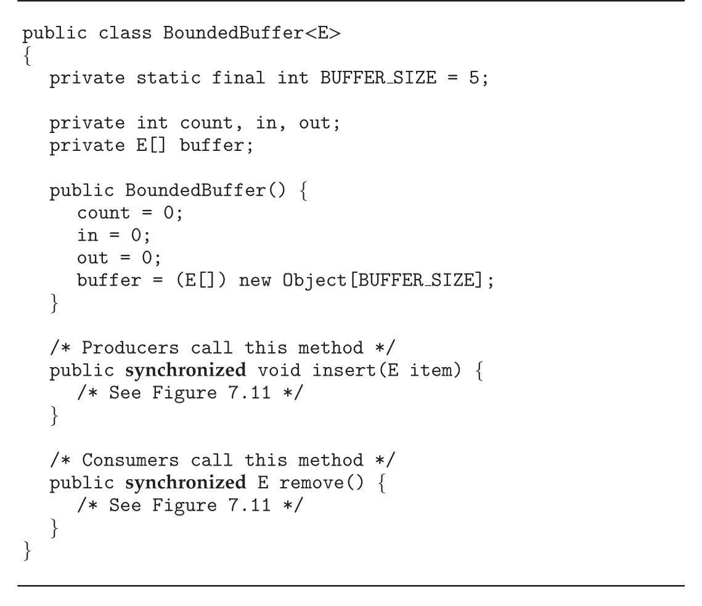</p>
<p align="center"><sub>Figure 7.9 · PDF p. 390 · synchronized insert()와 remove()를 가진 Java BoundedBuffer class 구조</sub></p>

`synchronized` method 호출 시 lock이 이미 다른 thread에게 owned되어 있으면 calling thread는 block되고 object lock의 `entry set`에 들어간다. Entry set은 lock이 available해지기를 기다리는 threads 집합이다. Lock이 available하면 calling thread가 lock owner가 되어 method에 들어간다. Thread가 method를 exit하면 lock을 release한다.

<p align="center">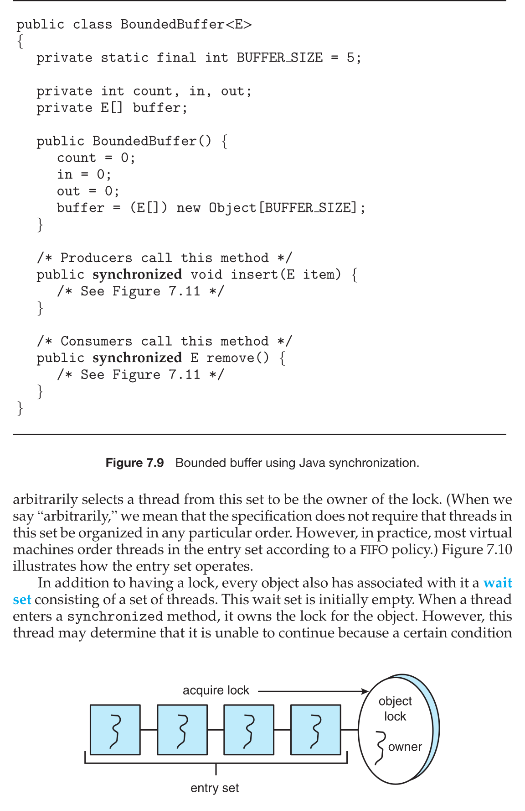</p>
<p align="center"><sub>Figure 7.10 · PDF p. 390 · Java object lock을 얻으려는 threads가 entry set에서 기다리는 구조</sub></p>

Java specification은 entry set의 ordering을 강제하지 않는다. 따라서 lock release 시 JVM은 entry set에서 어떤 thread를 선택할지 임의로 정할 수 있다. 실제 많은 JVM은 FIFO에 가깝게 관리하지만, portable correctness는 특정 ordering에 의존하면 안 된다.

Java는 method 전체가 아니라 block만 synchronize할 수도 있다. Lock을 acquire한 시점부터 release한 시점까지를 `scope of the lock`이라고 한다. Method 중 일부만 shared data를 manipulate한다면 method 전체를 synchronized로 두는 것은 lock scope가 너무 커질 수 있다. 이런 경우 block synchronization이 더 적합하다.

```java
public void someMethod() {
    /* non-critical section */

    synchronized(this) {
        /* critical section */
    }

    /* remainder section */
}
```

Java object에는 lock뿐 아니라 `wait set`도 있다. Wait set은 `wait()`를 호출해 특정 condition을 기다리는 threads 집합이며 초기에는 비어 있다. Thread가 synchronized method에 들어와 object lock을 가진 상태에서도, buffer full/empty처럼 특정 condition이 만족되지 않으면 계속 진행할 수 없다. 이때 `wait()`를 호출한다.

`wait()` 호출 시 세 일이 일어난다.

1. Thread가 object lock을 release한다.
2. Thread state가 blocked로 바뀐다.
3. Thread가 object의 wait set에 들어간다.

`BoundedBuffer.insert()`에서 buffer가 full이면 producer는 `wait()`를 호출한다. Producer가 lock을 release했기 때문에 consumer가 `remove()`에 들어가 buffer 공간을 만들 수 있다.

<p align="center">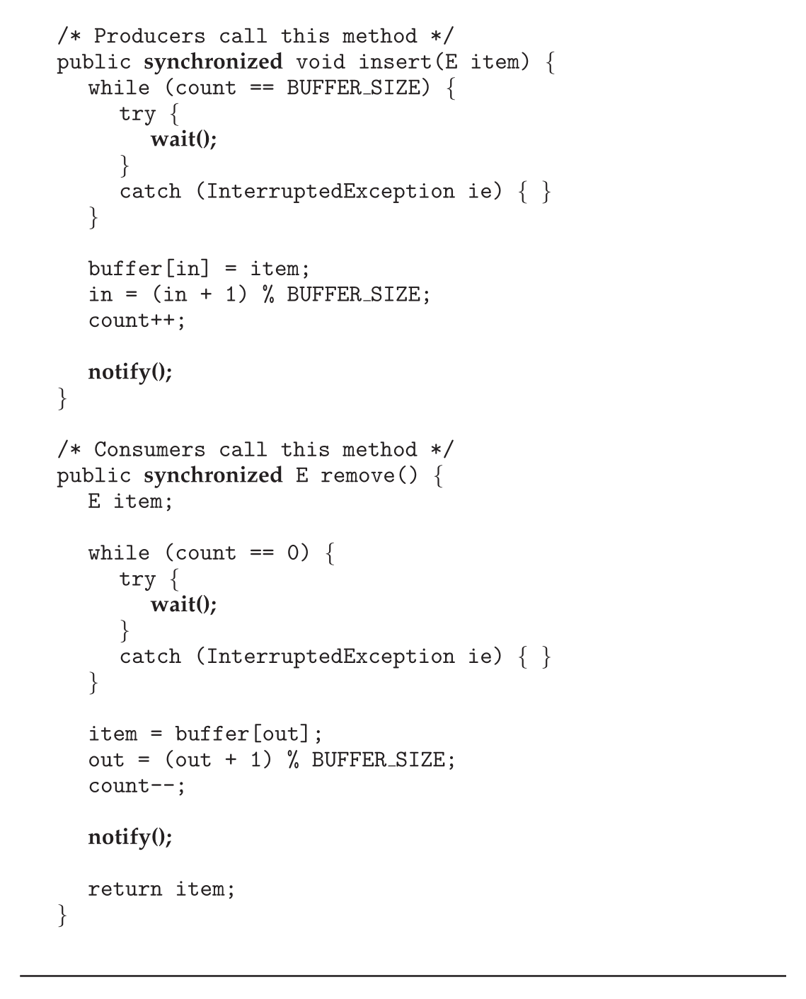</p>
<p align="center"><sub>Figure 7.11 · PDF p. 392 · Java BoundedBuffer의 insert()/remove()가 wait()와 notify()를 사용하는 방식</sub></p>

Figure 7.11에서 `insert()`와 `remove()`는 condition check를 `while` loop 안에서 수행한다.

```java
while (count == BUFFER_SIZE) {
    wait();
}

while (count == 0) {
    wait();
}
```

Loop를 사용하는 이유는 signal 이후에도 condition이 여전히 false일 수 있기 때문이다. 깨어난 thread는 lock을 다시 얻은 뒤 condition을 재검사하고, 여전히 불가능하면 다시 wait해야 한다.

`notify()`는 wait set에 있는 thread 하나를 깨우는 역할을 한다. 하지만 정확히 말하면 “깨운 thread에게 lock을 즉시 넘긴다”가 아니다. `notify()` 호출은 다음을 수행한다.

1. Wait set에서 임의의 thread `T`를 하나 선택한다.
2. `T`를 wait set에서 entry set으로 옮긴다.
3. `T`의 state를 blocked에서 runnable로 바꾼다.

<p align="center">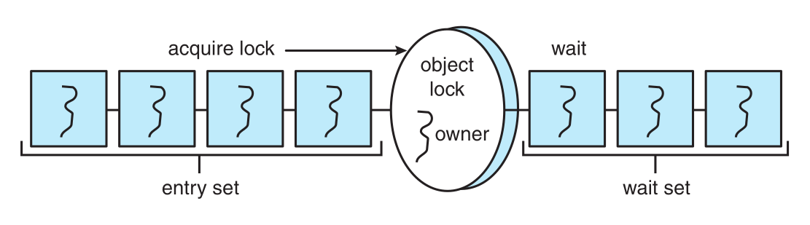</p>
<p align="center"><sub>Figure 7.12 · PDF p. 393 · Java object lock의 entry set과 condition 대기용 wait set의 관계</sub></p>

예를 들어 buffer가 full이고 lock이 available하다고 하자.

| Step | 동작 |
|---|---|
| 1 | Producer가 `insert()`에 들어가 buffer full을 확인하고 `wait()` 호출 |
| 2 | `wait()`가 lock을 release하고 producer를 wait set에 둠 |
| 3 | Consumer가 `remove()`에 들어가 item을 제거하고 `notify()` 호출 |
| 4 | `notify()`가 producer를 wait set에서 entry set으로 옮김. 이때 consumer는 아직 lock owner |
| 5 | Consumer가 `remove()`를 exit하며 lock release |
| 6 | Producer가 lock을 다시 얻고 `wait()` 이후부터 resume, while condition 재검사 |

Wait set에 아무 thread도 없으면 `notify()`는 ignored된다. Java의 `synchronized`, `wait()`, `notify()`는 오래된 기본 mechanism이지만, 이후 Java API는 더 flexible한 locking mechanisms를 추가했다.

### Reentrant Locks

Java API의 `ReentrantLock`은 `synchronized` statement와 비슷하게 shared resource에 대한 mutual exclusion을 제공한다. 하나의 thread가 lock을 owns하고, 다른 threads는 lock이 release될 때까지 기다린다. 하지만 `ReentrantLock`은 intrinsic lock보다 더 많은 feature를 제공한다. 예를 들어 `fairness parameter`를 설정해 longest-waiting thread에게 lock을 주는 정책을 선호하게 할 수 있다. Java object lock의 entry set ordering이 specification상 정해져 있지 않은 점과 대비된다.

`ReentrantLock`이 reentrant인 이유는, lock을 이미 소유한 thread가 같은 lock에 대해 다시 `lock()`을 호출해도 성공할 수 있기 때문이다. Lock이 available하거나 invoking thread가 이미 owner이면 `lock()`은 ownership을 부여하고 return한다. Lock이 unavailable이면 owner가 `unlock()`을 호출할 때까지 block된다.

일반 idiom은 다음과 같다.

```java
Lock key = new ReentrantLock();

key.lock();
try {
    /* critical section */
}
finally {
    key.unlock();
}
```

`unlock()`을 `finally`에 두는 이유는 critical section이 정상 종료되든 exception이 발생하든 lock release를 보장하기 위해서다. 다만 `lock()` 자체는 `try` 안에 넣지 않는 것이 좋다. `lock()` 호출 중 unchecked exception이 발생했는데 `finally`에서 `unlock()`이 실행되면, 실제로 lock을 얻지 않았으므로 `IllegalMonitorStateException`이 발생해 원래 실패 원인을 가릴 수 있다.

`ReentrantLock`도 mutual exclusion을 제공하기 때문에, shared data를 여러 threads가 읽기만 하는 상황에는 지나치게 conservative할 수 있다. 이런 readers-writers scenario를 위해 Java API는 `ReentrantReadWriteLock`을 제공한다. 이 lock은 multiple concurrent readers를 허용하지만 writer는 하나만 허용한다.

### Semaphores

Java API는 Section 6.6의 counting semaphore도 제공한다. Constructor는 다음 형태다.

```java
Semaphore(int value);
```

`value`는 initial semaphore value이며 negative value도 허용된다. `acquire()`는 semaphore를 얻으려 하며, waiting 중 interrupt되면 `InterruptedException`을 던질 수 있다. Mutual exclusion 용도로는 initial value 1을 사용한다.

```java
Semaphore sem = new Semaphore(1);

try {
    sem.acquire();
    /* critical section */
}
catch (InterruptedException ie) { }
finally {
    sem.release();
}
```

Semaphore에서도 `release()`를 `finally`에 두어 critical section 도중 exception이 나도 permit이 반환되도록 한다.

### Condition Variables

Java `Condition`은 `wait()`와 `notify()`에 대응하는 더 유연한 mechanism이다. `ReentrantLock`이 `synchronized`와 비슷하다면, `Condition`은 Java monitor의 wait/notify를 named condition variables 형태로 확장한다.

Condition variable은 `ReentrantLock`을 먼저 만들고, 그 lock의 `newCondition()`을 호출해 얻는다.

```java
Lock key = new ReentrantLock();
Condition condVar = key.newCondition();
```

얻은 `Condition`에는 `await()`와 `signal()`을 호출할 수 있다. 이들은 Section 6.7의 condition variable `wait()`와 `signal()`처럼 동작한다.

Java language-level monitor에는 object마다 하나의 unnamed condition variable만 있다. 따라서 `wait()`와 `notify()`는 단일 wait set에만 작동한다. `notify()`로 깨어난 thread는 왜 깨어났는지 정보를 받지 못하므로, 자신이 기다리던 condition이 만족됐는지 다시 확인해야 한다. `Condition` objects는 여러 named-like conditions를 만들 수 있게 해, 특정 condition을 기다리는 thread만 signal할 수 있다.

<p align="center">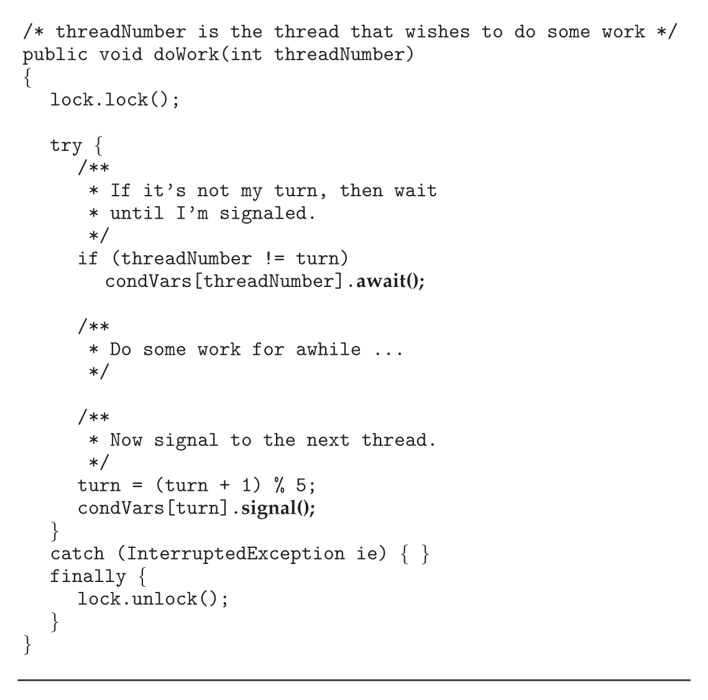</p>
<p align="center"><sub>Figure 7.13 · PDF p. 396 · threadNumber와 turn을 비교해 자기 condition variable에서 await/signal하는 Java Condition 예</sub></p>

Figure 7.13의 예에서는 thread 0-4가 있고 shared variable `turn`이 현재 차례인 thread를 나타낸다. 각 thread는 `doWork(threadNumber)`를 호출한다. 자기 번호가 `turn`과 다르면 자기 condition variable에서 `await()`한다. 일을 마친 thread는 `turn = (turn + 1) % 5`로 다음 차례를 정하고, 해당 condition variable에 `signal()`을 보낸다.

이를 위해 하나의 `ReentrantLock`과 다섯 condition variables를 만든다.

```java
Lock lock = new ReentrantLock();
Condition[] condVars = new Condition[5];

for (int i = 0; i < 5; i++)
    condVars[i] = lock.newCondition();
```

`doWork()`는 `synchronized`로 선언할 필요가 없다. Mutual exclusion은 `ReentrantLock`이 제공한다. Thread가 `await()`를 호출하면 associated `ReentrantLock`을 release하여 다른 thread가 lock을 acquire할 수 있게 한다. 반대로 `signal()`은 condition variable만 signal하며, lock release는 `unlock()` 호출에서 일어난다.

## 7.5 Alternative Approaches

Multicore systems가 일반화되면서 여러 cores를 활용하는 concurrent applications에 대한 압력이 커졌다. 그러나 core 수가 늘수록 race conditions와 deadlock 같은 liveness hazards를 피하면서 multithreaded application을 설계하기가 어려워진다. Traditional tools인 mutex locks, semaphores, monitors는 여전히 중요하지만, 높은 contention과 복잡한 lock ordering에서는 scalability와 correctness가 부담이 된다. 그래서 programming languages와 hardware는 thread-safe concurrent applications를 더 쉽게 만들기 위한 alternative approaches를 제공한다.

### Transactional Memory

`transactional memory`는 database transaction 개념을 memory synchronization에 적용한다. `memory transaction`은 memory read-write operations의 sequence를 atomic하게 실행하는 단위다. 모든 operations가 완료되면 transaction은 `committed`되고, 그렇지 않으면 operations는 `aborted`되고 rolled back된다.

전통적인 shared update function은 mutex lock으로 다음처럼 작성된다.

```c
void update()
{
    acquire();

    /* modify shared data */

    release();
}
```

문제는 lock 기반 code가 deadlock 위험을 만들고, threads 수가 많아질수록 lock ownership contention이 높아져 scalability가 떨어질 수 있다는 점이다. Transactional memory는 programmer가 lock acquire/release를 직접 배치하는 대신, language construct가 code block을 atomic transaction처럼 다루게 해 이러한 부담을 줄이려는 접근이다.

예를 들어 `atomic { S }` construct가 block `S`의 operations를 transaction처럼 실행한다고 하자. 그러면 `update()`는 다음처럼 쓸 수 있다.

```c
void update()
{
    atomic {
        /* modify shared data */
    }
}
```

이 방식의 장점은 atomicity 보장을 developer가 아니라 transactional memory system이 책임진다는 점이다. Lock이 없으므로 deadlock도 발생하지 않는다. 또한 transactional memory system은 atomic block 안의 statements 중 어떤 것들이 concurrently execute될 수 있는지, 예를 들어 shared variable에 대한 concurrent reads가 안전한지 판단할 수 있다. Programmer가 reader-writer locks로 직접 구분할 수도 있지만, thread 수와 shared state가 늘어나면 사람이 이를 정확히 식별하기 어렵다.

Transactional memory는 software 또는 hardware로 구현될 수 있다.

| 종류 | 방식 | 장점 | 한계 |
|---|---|---|---|
| `Software transactional memory (STM)` | compiler가 transaction block 안에 instrumentation code를 삽입해 conflict와 low-level locking을 관리 | special hardware 불필요 | instrumentation overhead |
| `Hardware transactional memory (HTM)` | hardware cache hierarchy와 cache coherency protocols로 cache 안 shared data conflicts를 관리 | STM보다 overhead가 낮고 special instrumentation 불필요 | cache/coherency hardware support 필요 |

Transactional memory는 오래전부터 연구되어 왔지만 널리 구현되지는 않았다. 다만 multicore systems와 concurrent/parallel programming 중요성이 커지면서 academic/commercial 양쪽에서 계속 연구되는 영역이다.

### OpenMP

`OpenMP`는 shared-memory parallel programming을 위한 compiler directives와 API를 제공한다. `#pragma omp parallel` 뒤의 code는 parallel region으로 식별되고, system의 processing cores 수에 맞춰 여러 threads가 실행한다. Thread creation과 management를 application developer가 직접 하지 않고 OpenMP library가 맡는 것이 장점이다.

Synchronization 측면에서 OpenMP는 `#pragma omp critical` directive를 제공한다. 이 directive 뒤의 code region은 한 번에 하나의 thread만 active할 수 있는 critical section이 된다.

```c
void update(int value)
{
    #pragma omp critical
    {
        counter += value;
    }
}
```

`counter += value`가 parallel region 안에서 실행될 수 있다면 `counter`에 race condition이 발생한다. `#pragma omp critical`은 binary semaphore나 mutex lock처럼 동작해 한 thread만 해당 critical section을 실행하게 한다.

여러 critical sections가 필요하면 각 critical section에 separate name을 줄 수 있고, 같은 name을 가진 critical section에는 동시에 하나의 thread만 active하도록 할 수 있다. OpenMP critical directive는 standard mutex locks보다 쓰기 쉽지만, application developer가 여전히 race condition이 생길 shared data를 식별하고 적절히 directive를 배치해야 한다. 또한 mutex lock처럼 동작하므로, 여러 critical sections를 잘못 설계하면 deadlock 가능성도 남는다.

### Functional Programming Languages

C, C++, Java, C# 같은 널리 쓰이는 imperative 또는 procedural languages는 state-based algorithms를 구현한다. Algorithm flow가 중요하고, state는 variables와 data structures로 표현된다. 이 state는 mutable이므로 시간이 지나며 값이 바뀐다. Race condition과 critical section 문제는 바로 이 mutable shared state에서 나온다.

`functional programming languages`는 다른 paradigm을 사용한다. 핵심 차이는 state를 유지하지 않는다는 것이다. Variable이 정의되고 value가 할당되면 그 value는 `immutable`이며 바뀌지 않는다. Mutable state를 허용하지 않으면, shared mutable data를 두 threads가 동시에 update하는 race condition 자체가 대부분 사라진다. 따라서 이 장에서 다룬 많은 critical-section/deadlock 문제가 functional languages에서는 구조적으로 덜 발생한다.

대표 예로 `Erlang`과 `Scala`가 언급된다. Erlang은 concurrency support와 parallel systems application 개발 용이성으로 주목받았고, Scala는 functional language이면서 object-oriented 성격도 가져 Java/C#과 유사한 syntax를 일부 공유한다. 여기서 중요한 point는 특정 언어 이름 암기가 아니라, concurrency 문제를 “lock으로 mutable state를 보호”하는 방식뿐 아니라 “mutable shared state를 줄이는 programming model”로도 접근할 수 있다는 것이다.

## 연결 관계

- Chapter 6의 `mutex locks`, `semaphores`, `monitors`, `condition variables`가 Chapter 7에서 bounded-buffer, readers-writers, dining-philosophers 문제에 직접 적용된다.
- Chapter 5의 CPU scheduling과 priority 문제는 Windows dispatcher object, Linux preemption, Java lock wait/entry set에서 실제 blocking/resume behavior로 이어진다.
- Chapter 6의 liveness 문제는 dining-philosophers deadlock/starvation, Java wait/notify misuse, OpenMP critical section deadlock 가능성으로 다시 등장한다.
- Chapter 8의 deadlock은 dining-philosophers와 semaphore ordering 문제를 일반 resource allocation problem으로 확장한다.
- Chapter 4의 parallelism/OpenMP는 이 장에서 shared-memory parallel region의 race condition과 critical directive로 연결된다.

## 오해하기 쉬운 내용

- `empty/full` semaphore와 `mutex` semaphore는 역할이 다르다. `empty/full`은 buffer count와 ordering이고, `mutex`는 buffer pool update의 mutual exclusion이다.
- Readers-writers problem에서 readers를 많이 허용하면 항상 좋은 것이 아니다. First readers-writers policy는 writers starvation을 만들 수 있다.
- Dining-philosophers semaphore solution은 neighbor 동시 eating은 막지만 deadlock-free는 아니다. Deadlock-free solution도 starvation-free를 자동 보장하지 않는다.
- Windows `event`와 Java `notify()`는 이름만 보고 동일하게 이해하면 안 된다. 각 runtime의 waiting queue/state transition semantics를 봐야 한다.
- Java `notify()`는 waiting thread에게 lock을 즉시 넘기지 않는다. Wait set에서 entry set으로 옮길 뿐이고, lock은 notifying thread가 synchronized method/block을 나갈 때 release된다.
- POSIX `pthread_cond_signal()`도 mutex를 release하지 않는다. Mutex release는 별도의 `pthread_mutex_unlock()`에서 일어난다.
- `ReentrantLock`에서 `unlock()`은 `finally`에 둬야 하지만, `lock()` 자체를 `try` 안에 넣으면 lock 획득 실패 시 원래 exception을 가릴 수 있다.
- OpenMP `#pragma omp critical`은 쉽게 쓸 수 있지만, developer가 race가 생기는 위치를 식별해야 하며 deadlock 가능성도 완전히 사라지지 않는다.
- Functional programming은 모든 concurrency 문제를 자동으로 없애는 것이 아니라, mutable shared state를 줄여 race condition과 critical section 필요성을 구조적으로 줄이는 접근이다.

## 면접 질문

1. Bounded-buffer problem에서 `empty`, `full`, `mutex` semaphore는 각각 어떤 역할을 하는가?
2. Producer와 consumer의 semaphore 호출 순서가 바뀌면 어떤 문제가 생길 수 있는가?
3. First readers-writers problem과 second readers-writers problem은 priority 정책이 어떻게 다른가?
4. Readers-writers solution에서 첫 reader와 마지막 reader가 특별한 이유는 무엇인가?
5. Reader-writer lock은 언제 mutex보다 유리하고, 어떤 overhead가 있는가?
6. Dining-philosophers의 단순 semaphore solution이 deadlock을 만드는 과정을 설명하라.
7. Dining-philosophers에서 deadlock을 피하는 세 가지 remedy는 무엇인가?
8. Monitor solution에서 `state[]`, `self[]`, `test()`는 각각 어떤 역할을 하는가?
9. Windows dispatcher object의 signaled/nonsignaled state는 thread state와 어떻게 연결되는가?
10. Windows critical-section object가 kernel mutex를 필요할 때만 allocate하는 이유는 무엇인가?
11. Linux에서 single processor와 multiprocessor의 spinlock 처리 방식이 다른 이유는 무엇인가?
12. Linux `preempt_count`는 kernel preemption safety를 어떻게 판단하는가?
13. POSIX named semaphore와 unnamed semaphore의 차이는 무엇인가?
14. `pthread_cond_wait()`가 mutex를 인자로 받고 내부에서 release하는 이유는 무엇인가?
15. Java object의 entry set과 wait set은 어떻게 다른가?
16. Java `notify()` 이후 waiting thread가 바로 실행되지 않는 이유는 무엇인가?
17. `ReentrantLock`과 intrinsic synchronized lock의 차이는 무엇인가?
18. Java `Condition`이 `wait()/notify()`보다 유연한 이유는 무엇인가?
19. Transactional memory가 lock 기반 synchronization과 다른 점은 무엇인가?
20. STM과 HTM은 conflict 관리 방식과 overhead 면에서 어떻게 다른가?
21. OpenMP `#pragma omp critical`은 mutex와 어떤 점에서 비슷하고 어떤 한계가 있는가?
22. Functional programming languages가 race condition 문제를 줄이는 근본 이유는 무엇인가?
