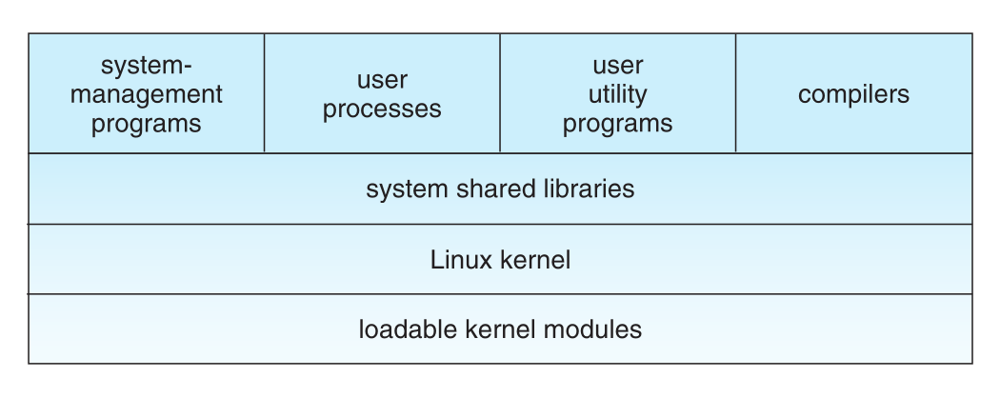
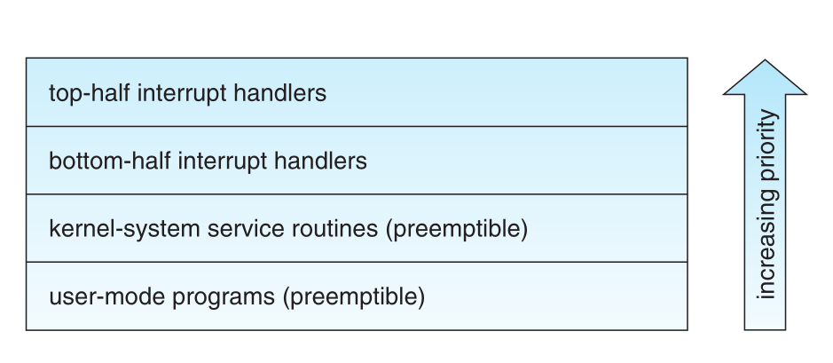
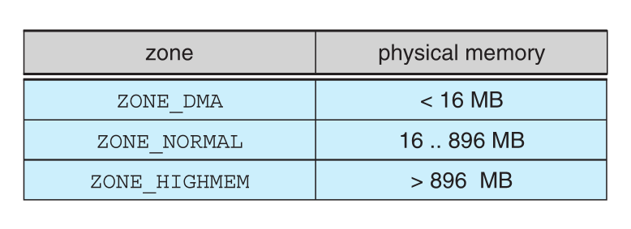
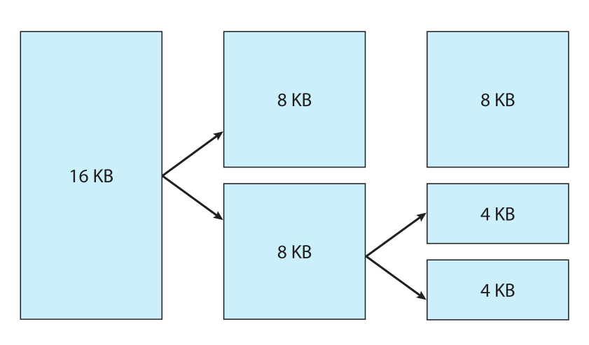
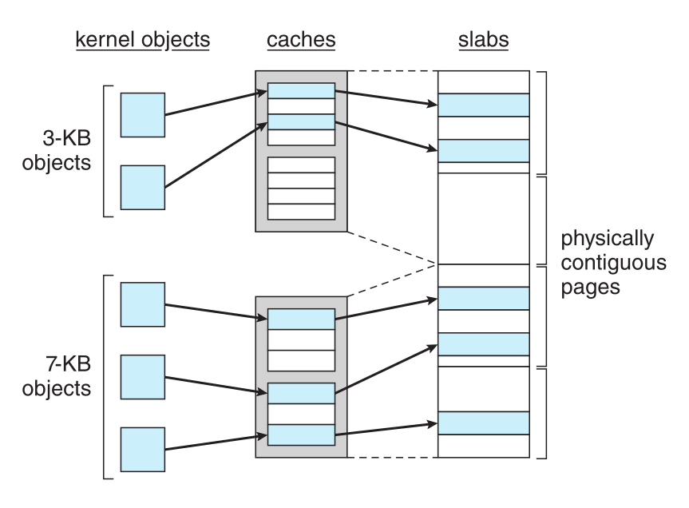
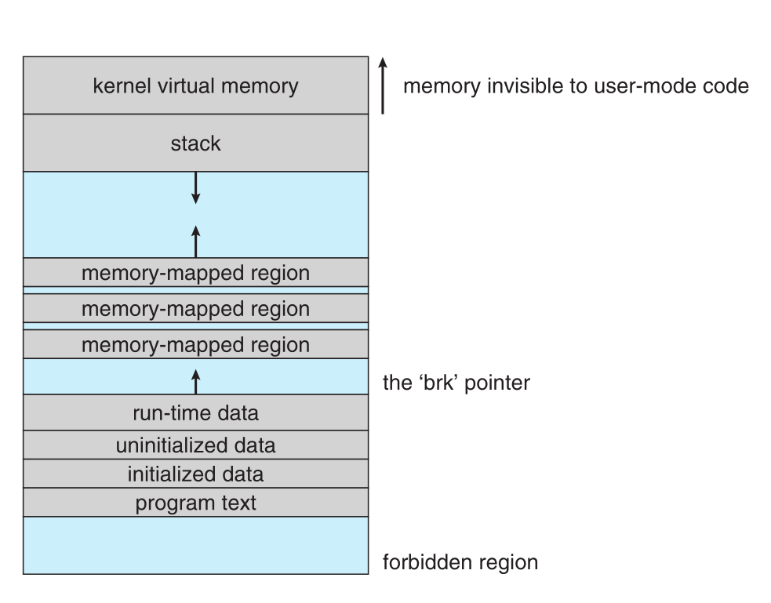
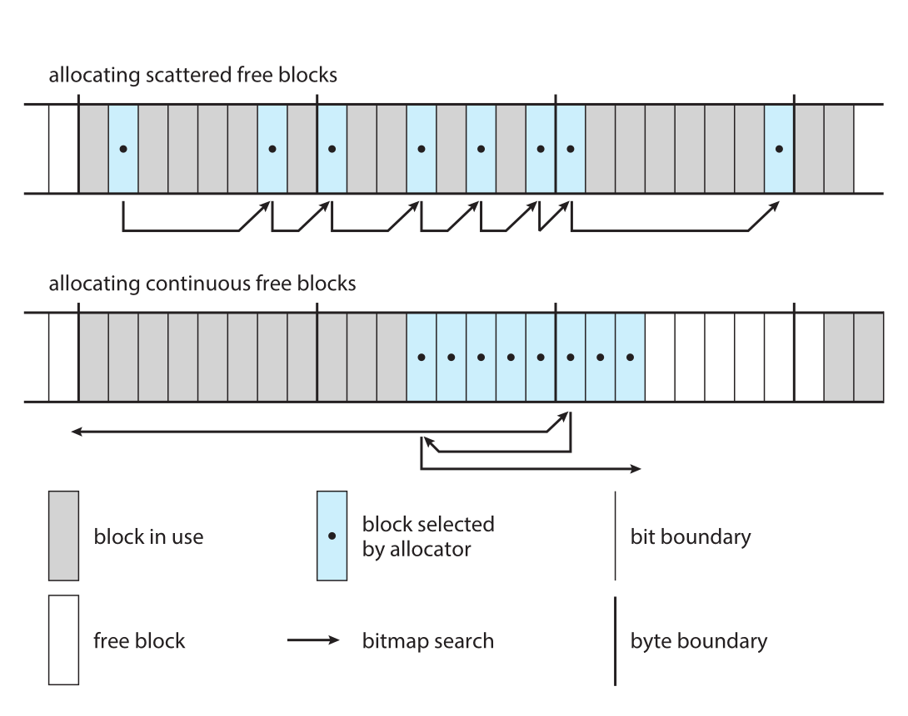
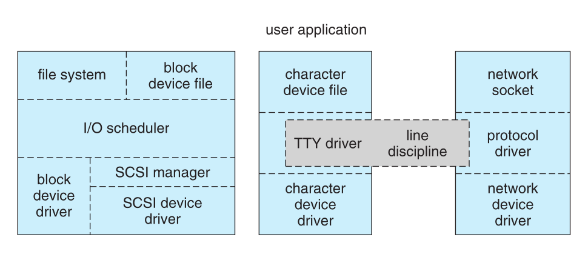

# Chapter 20. The Linux System

- 과목: Operating System
- 기준 교재: Operating System Concepts 10th
- 관련 페이지: PDF pp. 915-959 (20.12 Summary가 p. 959 첫 부분까지 이어짐)
- 우선순위: 필수

## 개요

Chapter 20은 앞 장들에서 배운 process, scheduling, memory management, file system, I/O, IPC, networking, security 개념이 실제 운영체제인 `Linux`에서 어떻게 결합되는지 보여 주는 case study다. Linux는 UNIX-compatible design을 강하게 따르지만, PC architecture에서 출발해 Internet-based collaborative development와 loadable kernel modules, broad hardware support, open-source licensing을 통해 modern general-purpose OS가 되었다.

핵심은 Linux가 “traditional UNIX semantics를 유지하면서도 practical performance와 portability를 얻기 위해 어떤 구조를 택했는가”다. Linux는 monolithic kernel이지만 run-time module loading으로 확장성을 확보하고, POSIX/UNIX interface를 system libraries가 제공하며, kernel은 processes, memory, file systems, I/O, networking, security의 protected core mechanisms를 담당한다.

## 핵심 개념

| 개념 | 핵심 의미 |
|---|---|
| `Linux kernel` | Linux project가 처음부터 작성한 privileged core. Processes, virtual memory, file systems, device drivers 등 system resources를 관리한다. |
| `Linux system` | Linux kernel에 GNU/BSD/X Window/system libraries/utilities/distribution tools 등이 결합된 complete OS environment. |
| `Linux distribution` | kernel과 standard system components에 installer, package management, admin tools, applications를 묶은 배포판. |
| `GPL(GNU General Public License)` | Linux kernel licensing. Copy/modify/use/sell은 가능하지만 GPL-covered components를 포함해 배포하면 source code를 제공해야 한다. |
| `POSIX` | UNIX-like OS behavior/interface 표준. Linux는 POSIX compatibility를 중요한 design goal로 둔다. |
| `kernel mode`, `user mode` | Kernel code는 privileged mode에서 full hardware access를 갖고, user code는 controlled subset만 접근한다. |
| `monolithic kernel` | Kernel code, device drivers, file systems, networking code 등이 single address space에 있는 UNIX-style kernel 구조. |
| `system libraries`, `libc` | Applications가 kernel system calls와 OS-level functions를 사용하게 해 주는 user-mode libraries. |
| `system utilities`, `daemons`, `shell`, `bash` | System initialization/administration, background services, command-line interface를 제공하는 user-mode programs. |
| `loadable kernel module` | Runtime에 kernel에 load/unload할 수 있는 privileged kernel code. Device driver, file system, protocol 등을 구현할 수 있다. |
| `module-management system` | Module load/unload, symbol resolution, kernel memory allocation, module requester를 관리하는 구조. |
| `exported symbol`, `kernel symbol table` | Kernel이 modules에게 공개하는 well-defined interface. Module unresolved references는 load time에 resolve된다. |
| `driver registration` | Loaded module이 자신이 제공하는 device driver/file system/network protocol/binary format 등을 kernel tables에 등록하는 과정. |
| `conflict resolution` | Modules/drivers가 hardware resources를 서로 충돌 없이 reserve/use하도록 중재하는 mechanism. |
| `fork()`, `exec()` | UNIX/Linux process model의 핵심. Process creation과 new program loading을 분리한다. |
| `PID`, `credentials`, `personality`, `namespace` | Linux process identity를 구성하는 주요 요소. |
| `process environment` | argument vector와 environment vector로 구성되며 parent에서 child로 inherited된다. |
| `process context` | scheduling context, accounting, file table, file-system context, signal-handler table, virtual memory context 등 실행 중 변화하는 상태. |
| `clone()` | Linux에서 threads/process-like tasks를 만드는 system call. Flags로 file system, memory, signal handlers, open files sharing을 지정한다. |
| `task` | Linux가 process/thread를 포괄해 부르는 flow of control. |
| `CFS(Completely Fair Scheduler)` | Linux time-sharing scheduler. 고정 time slice 대신 runnable tasks에 processor time proportion을 배분한다. |
| `target latency`, `minimum granularity` | CFS에서 모든 runnable tasks가 한 번씩 실행되어야 하는 기간과, context-switch cost를 막기 위한 최소 실행 시간. |
| `real-time scheduling`, `FCFS`, `round-robin` | POSIX real-time scheduling classes. Linux는 soft real-time을 제공한다. |
| `spinlock`, `semaphore`, `preempt_count` | Kernel synchronization을 위한 locking mechanisms와 preemption safety tracking. |
| `top half`, `bottom half` | Interrupt service routine을 빠른 interrupt-context 처리와 deferred processing으로 나누는 Linux kernel 구조. |
| `SMP(Symmetric Multiprocessing)`, `BKL(Big Kernel Lock)` | 여러 processors에서 kernel execution을 병렬화하는 구조와 초기 coarse-grained kernel lock. |
| `ZONE_DMA`, `ZONE_DMA32`, `ZONE_NORMAL`, `ZONE_HIGHMEM` | Hardware constraint와 kernel address-space mapping 가능성에 따라 나뉘는 Linux physical memory zones. |
| `buddy system` | Physical pages를 power-of-two 크기 buddy heap으로 split/merge하여 contiguous pages를 관리하는 allocator. |
| `kmalloc()`, `kfree()` | Kernel에서 arbitrary-sized small memory blocks를 할당/해제하는 allocator interface. |
| `slab allocator`, `cache`, `slab`, `object` | Kernel data structures를 type별 cache에 미리 만들어 빠르게 재사용하는 memory allocation 구조. |
| `page cache` | File contents를 page 단위로 cache하며 block-device I/O와 virtual memory system을 연결하는 핵심 cache. |
| `vm_area_struct`, `VMA` | Process virtual address space의 nonoverlapping region과 permissions/backing store를 표현하는 structure. |
| `copy-on-write` | `fork()` 이후 shared physical page를 read-only로 공유하다 write 시점에만 private copy를 만드는 VM optimization. |
| `paging`, `swap device`, `swap file` | Linux가 whole-process swapping 대신 page 단위로 memory pressure를 처리하는 mechanism. |
| `vmalloc()`, `vremap()` | Kernel virtual memory에서 physically noncontiguous pages를 virtually contiguous하게 쓰거나 device memory를 map하는 facilities. |
| `ELF`, `loader`, `dynamic linking`, `PIC` | Linux user program loading과 shared library 사용을 가능하게 하는 executable format/linking mechanisms. |
| `VFS(Virtual File System)` | 다양한 file/device/network/socket objects를 uniform UNIX file interface 뒤에 숨기는 abstraction layer. |
| `inode`, `file object`, `superblock`, `dentry` | VFS의 네 핵심 object types. File contents, open-file state, mounted file system, pathname entry를 각각 표현한다. |
| `ext3`, `block group`, `journaling` | Linux on-disk file system과 allocation locality, crash recovery를 위한 metadata transaction mechanism. |
| `/proc`, `sysctl()` | Kernel/process state를 file-like interface 또는 binary system call로 노출하는 pseudo file system/control path. |
| `block device`, `character device`, `network device` | Linux device-driver system의 세 device classes. Random block access, serial stream access, networking subsystem access로 나뉜다. |
| `I/O scheduler`, `C-SCAN`, `CFQ(Completely Fair Queueing)` | Block-device requests를 정렬/병합/분배해 disk bandwidth와 latency를 조절하는 scheduling mechanisms. |
| `tty`, `line discipline`, `PPP`, `SLIP` | Character terminal stream을 process stdio 또는 network-device driver로 해석·연결하는 terminal subsystem 개념. |
| `signal`, `wait queue`, `System V semaphore` | Linux에서 event notification과 kernel/process synchronization을 구현하는 IPC-related mechanisms. |
| `pipe`, `shared memory`, `message queue`, `socket` | Processes 사이 data passing을 제공하는 UNIX/System V/BSD communication mechanisms. |
| `socket interface`, `protocol driver`, `network-device driver`, `skbuff` | Linux network stack의 계층과 packet buffer abstraction. |
| `FIB(Forwarding Information Base)`, `route cache`, `firewall chain` | IP routing과 packet filtering을 위한 Linux network structures. |
| `PAM(Pluggable Authentication Modules)` | Authentication methods를 system-wide configuration으로 loadable하게 만드는 Linux authentication framework. |
| `UID`, `GID`, `root UID`, `setuid`, `effective UID`, `saved UID` | UNIX/Linux access control과 privilege transition을 구성하는 identifiers. |
| `fsuid`, `fsgid`, file descriptor passing | File access 권한을 limited하게 위임하거나 server가 client behalf로 file을 다루게 하는 Linux security mechanisms. |

## 세부 정리

### 20.1 Linux History

Linux는 UNIX와 매우 비슷하게 보이고 동작한다. 실제로 UNIX compatibility는 Linux project의 major design goal이었다. 하지만 Linux 자체는 다른 UNIX systems보다 훨씬 젊다. Development는 1991년 Linus Torvalds가 Intel 80386용 작은 self-contained kernel을 만들면서 시작되었다.

초기부터 Linux source code는 Internet에 free로 공개되었고, minimal distribution restrictions 덕분에 전세계 developers가 Internet 중심으로 협업했다. Linux는 UNIX services의 작은 subset을 partial하게 구현한 초기 kernel에서 modern UNIX system에 기대되는 기능을 대부분 포함하는 system으로 성장했다.

중요한 구분은 `Linux kernel`과 `Linux system`이다.

| 구분 | 의미 |
|---|---|
| `Linux kernel` | Linux community가 scratch로 개발한 privileged core software |
| `Linux system` | kernel, system libraries, utilities, tools, applications, admin layer가 결합된 full OS |
| `Linux distribution` | Linux system components와 install/upgrade/package/admin tools를 묶어 usable system으로 제공 |

#### 20.1.1 The Linux Kernel

첫 공개 Linux kernel 0.01은 1991년 5월 14일 공개되었다. Networking이 없고 80386-compatible Intel processors와 PC hardware에서만 실행되었으며, device-driver support도 제한적이었다. 그러나 이 초기 kernel도 shared pages with copy-on-write와 protected address spaces를 지원했다. File system은 Minix file system만 지원했다.

Linux 1.0은 1994년 3월 14일 release되었다. 가장 큰 변화는 networking이었다. UNIX standard `TCP/IP` protocols와 BSD-compatible socket interface가 들어갔고, Ethernet/PPP/SLIP 기반 IP support가 추가되었다. File system, SCSI disk support, swap files, file memory mapping, hardware support, System V-style IPC(shared memory, semaphores, message queues)도 확장되었다.

Linux는 한동안 odd minor version은 development kernels, even minor version은 stable production kernels라는 numbering convention을 사용했다. 1.2는 wider hardware support와 PCI, virtual 8086 mode, firewalling, dynamically loadable kernel modules를 추가했다. 2.0은 multiple architectures와 `SMP(Symmetric Multiprocessing)` support를 제공하며 major milestone이 되었다.

Linux 2.2, 2.4, 2.6은 networking, SMP, journaling file systems, memory management, block I/O, scheduling을 크게 개선했다. 2.6 kernel은 efficient `O(1)` scheduler와 preemptive kernel을 제공해 kernel mode 실행 중인 thread도 preempt될 수 있게 했다. 3.0은 Linux 20주년을 기념한 major version bump였고, CFS, virtualization support, memory-management improvements를 포함했다. 4.0 이후 version number는 release ordering 이상의 특별한 의미를 갖지 않게 되었다.

이 역사적 흐름에서 중요한 개념은 “Linux가 처음부터 완성된 UNIX clone이 아니라, hardware support, networking, VM, SMP, file systems, scheduling을 점진적으로 흡수하며 확장된 system”이라는 점이다.

#### 20.1.2 The Linux System

Linux kernel은 Linux project의 core이지만 complete Linux OS는 kernel만으로 구성되지 않는다. Linux system에는 BSD tools, MIT X Window System, GNU project의 system libraries와 compiler 같은 많은 UNIX-like components가 포함된다.

Linux의 main system libraries는 GNU project에서 출발했지만 Linux community가 omissions, inefficiencies, bugs를 고치며 개선했다. `gcc(GNU C compiler)`처럼 이미 높은 품질의 GNU tools는 그대로 사용되었다. BSD networking tools와 Linux code도 서로 영향을 주었다.

Linux system 전체는 Internet을 통해 협업하는 loose network of developers가 유지한다. Components별로 small groups나 individuals가 integrity를 책임지고, public FTP archive sites가 de facto standard repositories 역할을 했다. `File System Hierarchy Standard`는 configuration files, libraries, system binaries, run-time data files가 어떤 directory names 아래 있어야 하는지 정해 distribution 간 compatibility를 돕는다.

#### 20.1.3 Linux Distributions

초기 Linux user는 필요한 components를 FTP sites에서 받아 직접 compile해야 했다. Linux가 성숙하면서 precompiled packages와 installation tools를 제공하는 `Linux distributions`가 등장했다.

Distribution은 kernel과 basic Linux system뿐 아니라 installation/management utilities, package collections, network tools, browsers, editors, games 같은 applications를 포함한다. Modern distribution의 핵심 기여는 `package management`다. Package-tracking database를 통해 packages를 install, upgrade, remove할 수 있다.

SLS는 초기 complete distribution에 가까운 형태였고, Slackware는 품질을 개선했다. Red Hat, Debian, Canonical, SuSE 등 다양한 distributions가 생겼지만, package formats와 shared standards 덕분에 어느 정도 compatibility를 유지한다.

#### 20.1.4 Linux Licensing

Linux kernel은 `GPL version 2.0`으로 배포된다. Linux는 public-domain software가 아니다. Public domain은 authors가 copyright rights를 포기했다는 뜻이지만, Linux code의 copyright는 각 authors가 보유한다.

Linux는 free software다. Copy, modify, use, give away, sell이 가능하다. 하지만 GPL-covered components를 포함하거나 derivative를 배포하면 source code를 함께 제공해야 한다. GPL은 binary software distribution 자체를 금지하지 않지만, binaries를 받는 사람이 originating source code를 reasonable distribution charge로 받을 기회를 가져야 한다.

### 20.2 Design Principles

Linux는 traditional, nonmicrokernel UNIX implementations와 유사하다. Multiuser, preemptively multitasking system이고, UNIX-compatible tools와 traditional UNIX file-system semantics, standard UNIX networking model을 제공한다.

Linux design은 역사적 배경의 영향을 많이 받았다. 초기에는 PC architecture와 limited resources에서 출발했기 때문에 가능한 많은 functionality를 적은 resource로 구현하려 했다. 오늘날에는 multiprocessor machine과 large memory/disk에서도 잘 동작하지만, 여전히 작은 memory 환경에서도 useful하게 동작할 수 있다.

Linux의 주요 design goals는 다음과 같다.

| 목표 | 의미 |
|---|---|
| UNIX compatibility | UNIX-like tools, semantics, interfaces 제공 |
| speed/efficiency | PC resource constraints에서 출발한 성능 중심 설계 |
| standardization | POSIX 등 standards를 지원해 broad applications compatibility 확보 |

Linux는 POSIX documents를 준수하도록 설계되었고, Pthreads와 real-time process control 관련 POSIX extensions 일부도 지원한다. Formal certification은 비용 문제로 느릴 수 있지만, application base를 넓히기 위해 standards implementation은 중요한 목표다.

#### 20.2.1 Components of a Linux System

Linux system은 전통적 UNIX처럼 세 가지 주요 code body로 구성된다.

| 구성요소 | 역할 |
|---|---|
| `kernel` | virtual memory, processes 등 OS의 핵심 abstractions 유지 |
| `system libraries` | applications가 kernel과 상호작용하는 standard functions 제공. 핵심은 `libc` |
| `system utilities` | initialization, configuration, administration, daemons, file management, shell 등 user-mode programs |

Figure 20.1 · PDF p. 921 · Linux kernel, loadable modules, system shared libraries, user/system utilities의 계층 구조

Figure 20.1의 가장 중요한 구분은 kernel과 그 밖의 user-mode components다. Kernel code는 privileged `kernel mode`에서 실행되어 physical resources에 full access를 가진다. Linux에서는 user code가 kernel에 built-in되지 않는다. Kernel mode가 필요 없는 OS support code는 system libraries에 들어가 user mode에서 실행된다.

Linux kernel은 monolithic binary로 만들어진다. 모든 kernel code와 data structures가 single address space에 있으므로 OS function call이나 hardware interrupt 처리 시 불필요한 context switch가 없다. Kernel subsystems는 IPC 대신 C function invocation으로 비교적 싸게 data를 전달하고 requests를 수행할 수 있다. 이 single address space에는 core scheduling, virtual memory, device drivers, file systems, networking code가 모두 포함된다.

하지만 monolithic이라고 해서 modularity가 없는 것은 아니다. Linux kernel은 runtime에 modules를 dynamically load/unload할 수 있다. Kernel은 어떤 modules가 loaded될지 미리 알 필요가 없으며, modules는 truly independent loadable components로 동작한다.

Applications가 보는 OS interface는 kernel이 직접 유지하기보다 system libraries가 제공한다. System libraries는 system call arguments를 모으고 architecture-specific system-call transfer details를 처리한다. 또한 C buffered file I/O처럼 basic system calls보다 richer한 functions, sorting/math/string routines처럼 system call과 직접 대응되지 않는 functions도 제공한다.

System utilities는 system initialization/administration을 담당하는 programs와 user utilities를 포함한다. UNIX에서 long-running background service는 `daemon`이라고 부른다. User에게 중요한 utility 중 하나는 command-line interface인 shell이며, Linux에서 가장 흔한 shell은 `bash(bourne-again shell)`다.

### 20.3 Kernel Modules

Linux kernel은 필요한 kernel code sections를 on demand로 load/unload할 수 있다. `loadable kernel modules`는 privileged kernel mode에서 실행되므로 hardware capabilities에 full access를 가진다. Device driver, file system, networking protocol 등을 module로 구현할 수 있다.

Kernel modules가 유용한 이유는 다음과 같다.

| 이유 | 설명 |
|---|---|
| development speed | 새 driver 테스트를 위해 kernel 전체 recompile/relink/reboot를 반복하지 않아도 됨 |
| distribution convenience | users가 kernel rebuild 없이 새 driver/file system을 module로 추가 가능 |
| minimal kernel | 기본 kernel은 작게 유지하고 필요한 drivers를 startup 또는 demand 시 load |
| licensing boundary | GPL kernel 자체에 proprietary code를 직접 포함하지 않고 third-party module을 별도 배포할 수 있음 |

주의할 점도 있다. Module은 kernel mode에서 실행되므로 bug나 malicious behavior가 kernel 전체 안정성과 security에 직접 영향을 준다. Module flexibility는 kernel attack surface와 crash risk를 함께 늘린다.

Linux module support는 네 components로 구성된다.

| component | 역할 |
|---|---|
| module-management system | modules를 memory에 load하고 kernel과 communication하게 함 |
| module loader/unloader | user-mode utilities로 module-management system과 협력해 module load/unload 수행 |
| driver-registration system | module이 새 driver/functionality를 kernel tables에 등록 |
| conflict-resolution mechanism | device drivers가 hardware resources를 reserve하고 accidental conflict를 방지 |

#### 20.3.1 Module Management

Module loading은 binary contents를 kernel memory에 복사하는 것만으로 끝나지 않는다. Module이 참조하는 kernel symbols나 entry points를 현재 running kernel address space의 올바른 locations로 update해야 한다.

Linux는 kernel 내부 `symbol table`을 유지한다. 이 table에는 compilation 중 정의된 모든 symbols가 아니라 programmer가 explicit하게 export한 symbols만 들어간다. Exported symbols는 modules가 kernel과 상호작용할 수 있는 well-defined interface다.

Module writer는 C external linking을 사용한다. Module binary에 unresolved external symbols가 남아 있으면, load 전에 system utility가 kernel symbol table에서 해당 symbols를 찾아 현재 running kernel의 addresses로 대체한다. Resolve되지 않는 references가 있으면 module은 reject된다.

Module loading은 두 단계다.

| 단계 | 동작 |
|---|---|
| 1 | module-loader utility가 kernel에 continuous virtual kernel memory area 예약 요청 |
| 2 | kernel이 allocated address를 반환하면 loader가 module machine code를 그 load address에 맞게 relocate |
| 3 | 두 번째 system call로 module과 module이 export할 symbol table을 kernel에 전달 |
| 4 | kernel이 module을 reserved space에 copy하고 kernel symbol table을 update |

마지막 요소는 `module requester`다. Kernel은 module-management program이 연결할 수 있는 communication interface를 제공한다. Process가 currently loaded되지 않은 device driver, file system, network service를 요청하면 kernel은 manager에게 알리고, manager가 module을 load할 기회를 얻는다. 원래 service request는 module load 후 완료된다. Manager는 module 사용 여부를 주기적으로 확인하고 더 이상 필요 없으면 unload한다.

#### 20.3.2 Driver Registration

Module이 load되었다고 바로 kernel 기능이 되지는 않는다. Loaded module은 자신의 기능을 kernel에 알려야 한다. Kernel은 known drivers와 supported functionality를 담은 dynamic tables를 유지하고, drivers가 tables에 added/removed될 수 있게 routines를 제공한다.

Kernel은 module load 시 startup routine을 호출하고, unload 전 cleanup routine을 호출한다. 이 routines가 module functionality를 등록·해제한다.

Module이 등록할 수 있는 functionality는 다양하다.

| registration type | 예 |
|---|---|
| device drivers | character devices(printers, terminals, mice), block devices(disks), network interface devices |
| file systems | disk file system, network file system(NFS), virtual file system(`/proc`) |
| network protocols | TCP 같은 protocol 또는 firewall packet-filtering rules |
| binary format | 새로운 executable file type recognition/loading/execution 방식 |
| sysctl/proc entries | module runtime configuration interface |

#### 20.3.3 Conflict Resolution

PC hardware는 configurations가 매우 다양하고, network cards나 video adapters 같은 devices에 가능한 drivers도 많다. Modular drivers가 지원되면 active device set이 runtime에 바뀌므로 hardware resource conflict가 더 심각해진다.

Linux는 central conflict-resolution mechanism으로 hardware resource access를 중재한다. 목적은 두 가지다. 첫째, modules가 같은 hardware resources를 두고 충돌하지 않게 한다. 둘째, device-driver `autoprobes`가 이미 active인 driver를 방해하지 않게 한다. 즉 Linux module system은 load flexibility만 제공하는 것이 아니라, runtime hardware resource ownership도 관리해야 한다.

Conflict resolution은 allocated hardware resources lists에 기반한다. PC는 I/O ports, interrupt lines, DMA channels 수가 제한되어 있으므로, device driver는 resource 사용 전에 kernel database에 reserve해야 한다. Reservation이 rejected되면 module은 initialization을 fail하고 unload를 요청하거나 alternative resources를 사용해야 한다.

### 20.4 Process Management

Linux에서 process는 user-requested activity가 OS 안에서 service되는 기본 context다. UNIX compatibility를 위해 Linux는 UNIX process model과 비슷하게 동작하지만, threads와 processes를 구분하는 방식에서는 중요한 차이가 있다.

#### 20.4.1 The fork() and exec() Process Model

UNIX process management의 핵심은 new process creation과 new program execution을 분리하는 것이다.

| system call | 의미 |
|---|---|
| `fork()` | 현재 process를 duplicate하여 child process 생성. Child는 parent와 같은 program의 같은 지점에서 계속 실행 |
| `exec()` | 현재 process address space에 new binary object를 load하고 existing process context에서 새 program 실행 |

이 분리는 단순하면서 강력하다. New program의 environment를 `exec()` system call 하나에 모두 명시할 필요가 없다. Parent가 child를 `fork()`한 뒤, child 안에서 필요한 file descriptors, environment, permissions 등을 조정하고 마지막에 `exec()`로 new program을 실행하면 된다.

Linux process properties는 크게 identity, environment, context로 나뉜다.

##### 20.4.1.1 Process Identity

Process identity는 OS가 process를 구분하고 access rights를 판단하는 데 필요한 정보다.

| identity element | 의미 |
|---|---|
| `PID(Process ID)` | process를 식별하는 unique identifier. signal, modify, wait system calls에서 사용 |
| process group/session IDs | user command에서 fork된 process tree나 login session과 연결 |
| `credentials` | user ID와 group IDs. Process의 file/system resource access rights 결정 |
| `personality` | 일부 system call semantics를 UNIX variant에 맞게 조정하는 identifier. Emulation libraries가 사용 |
| `namespace` | process가 보는 file-system hierarchy view. Root directory와 mounted file systems가 달라질 수 있음 |

PID는 process termination까지 바뀌지 않는다. Credentials나 group/session identifiers는 security checks를 거쳐 제한적으로 바뀔 수 있다.

##### 20.4.1.2 Process Environment

Process environment는 parent에서 inherited되며 두 null-terminated vectors로 구성된다. `argument vector`는 command-line arguments 목록이고, 보통 program name으로 시작한다. `environment vector`는 `NAME=VALUE` 쌍의 environment variables 목록이다.

Environment는 kernel memory가 아니라 process의 user-mode address space, stack top 근처에 저장된다. `fork()`로 child가 만들어질 때 argument/environment vectors는 그대로 inherited된다. 반면 `exec()`를 호출하면 process는 new program을 위한 environment를 kernel에 제공하고, kernel은 이를 next program에 전달한다.

Environment variables는 user-mode system software에 flexible configuration channel을 제공한다. 예를 들어 `TERM`은 terminal type을 알려 cursor movement나 scrolling 방법을 결정하게 하고, `LANG`은 multilingual messages의 language를 결정한다. 이 mechanism은 OS behavior를 per-process basis로 custom-tailor할 수 있게 한다.

##### 20.4.1.3 Process Context

Process identity와 environment는 주로 creation 시 설정되고 비교적 덜 변하지만, `process context`는 running program의 순간 상태라 계속 바뀐다.

| context component | 의미 |
|---|---|
| `scheduling context` | process suspend/restart에 필요한 registers, scheduling priority, pending signals, kernel stack |
| accounting | process가 현재/전체 lifetime 동안 소비한 resources 정보 |
| file table | open files를 나타내는 kernel file structures pointers 배열. `fd(file descriptor)`로 index |
| file-system context | root directory, current working directory, namespace. New file open 시 사용 |
| signal-handler table | signal별 ignore/terminate/user handler routine 같은 action 정의 |
| virtual memory context | process private address space 전체 내용 |

Scheduling context에서 kernel stack이 중요하다. System calls나 process 실행 중 발생한 interrupts는 이 per-process kernel stack을 사용해 kernel-mode code를 실행한다.

#### 20.4.2 Processes and Threads

Linux는 `fork()`로 process를 duplicate하고, `clone()`으로 threads를 만들 수 있다. 그러나 Linux kernel은 processes와 threads를 본질적으로 구분하지 않는다. Linux는 program 안 control flow를 가리킬 때 보통 `task`라는 용어를 사용한다.

`clone()`은 `fork()`와 유사하지만 parent와 child가 어떤 resources를 share할지 flags로 지정할 수 있다.

| clone flag | shared resource |
|---|---|
| `CLONE_FS` | file-system information(current working directory 등) |
| `CLONE_VM` | same memory space |
| `CLONE_SIGHAND` | signal handlers |
| `CLONE_FILES` | set of open files |

`CLONE_FS`, `CLONE_VM`, `CLONE_SIGHAND`, `CLONE_FILES`를 함께 넘기면 parent와 child tasks가 file-system info, memory, signal handlers, open files를 공유하므로 다른 OS의 thread creation과 유사하다. 아무 flag도 set하지 않으면 resources를 share하지 않아 `fork()`와 비슷하다.

Linux가 process/thread를 구분하지 않을 수 있는 이유는 process의 전체 context를 하나의 main process structure 안에 넣지 않기 때문이다. File-system context, file-descriptor table, signal-handler table, virtual memory context가 각각 separate data structures로 존재하고, process data structure는 이 subcontexts에 대한 pointers를 가진다. 여러 tasks가 같은 subcontext를 가리키고 reference count를 증가시키면 쉽게 sharing할 수 있다.

새 task는 항상 new identity와 new scheduling context를 가진다. 이것이 Linux process/task의 핵심이다. 나머지 subcontexts는 `clone()` arguments에 따라 copy되거나 shared된다. `fork()`는 모든 subcontexts를 copy하고 아무것도 share하지 않는 `clone()`의 special case로 볼 수 있다.

### 20.5 Scheduling

Scheduling은 OS 안에서 여러 tasks에 CPU time을 배분하는 일이다. Linux는 UNIX처럼 preemptive multitasking을 지원한다. Process scheduler는 어떤 thread가 언제 실행될지 결정하며, modern workloads에서 fairness와 performance를 균형 있게 맞추는 것이 중요하다.

Linux scheduling은 user threads뿐 아니라 kernel tasks도 포함한다. Kernel tasks는 running thread가 system call/page fault 등으로 요청한 kernel-mode work와, I/O subsystem이 spawning한 internal kernel tasks 같은 작업을 포함한다.

#### 20.5.1 Thread Scheduling

Linux에는 두 scheduling algorithms가 있다.

| scheduler type | 목적 |
|---|---|
| time-sharing scheduler | multiple threads 사이 fair, preemptive scheduling |
| real-time scheduler | fairness보다 absolute priorities가 중요한 real-time tasks |

Linux time-sharing scheduler는 여러 번 크게 바뀌었다. 2.5 kernel은 number of tasks/processors와 무관하게 constant time에 next task를 고르는 `O(1)` scheduler를 도입했고, SMP support, processor affinity, load balancing을 개선했다. 하지만 interactive performance와 fairness 문제가 남아 2.6에서 `CFS(Completely Fair Scheduler)`가 도입되었다.

Linux scheduler는 preemptive, priority-based algorithm이며 priority ranges는 두 종류다. Real-time range는 0-99이고, normal tasks는 `nice` value -20부터 19를 사용한다. Smaller nice value가 higher priority를 의미한다. Nice value를 올리는 것은 priority를 낮춰 system의 다른 tasks에게 “nice”해지는 것이다.

CFS는 traditional UNIX scheduler와 다르다. Traditional scheduler는 priority와 fixed time slice가 중심이다. CFS는 fixed time slice를 제거하고, runnable threads에 processor time의 proportion을 배분한다.

기본 원리는 다음과 같다.

| CFS 개념 | 의미 |
|---|---|
| `N runnable threads` | 기본적으로 각 thread가 processor time의 `1/N`을 받아야 함 |
| nice weight | nice value에 따라 allotment를 가중. 높은 priority는 더 큰 weight |
| proportional run time | 각 thread는 `thread weight / total runnable weight`에 비례한 시간 실행 |
| `target latency` | 모든 runnable tasks가 적어도 한 번 실행되어야 하는 time interval |
| `minimum granularity` | runnable tasks가 너무 많을 때 context-switch cost를 막기 위한 최소 실행 시간 |

예를 들어 target latency가 10 ms이고 같은 priority의 runnable threads가 2개라면 각 thread는 5 ms씩 실행된다. 10개라면 1 ms씩 실행된다. 하지만 1,000개라면 1 microsecond씩 실행하면 context-switch cost가 너무 커진다. 그래서 CFS는 minimum granularity를 두어 모든 thread가 최소 그 시간만큼은 실행되게 한다. 이 경우 strict fairness는 약간 희생되지만 switching overhead를 제한한다.

CFS의 중요한 장점은 priority-to-time-slice mapping 문제를 피한다는 점이다. 각 task의 실행 시간은 runnable tasks 수와 weights에 따라 동적으로 결정된다. 이 방식은 mobile/desktop 같은 interactive workloads에서도 좋은 반응성을 제공하면서 large server throughput도 크게 해치지 않도록 설계되었다.

#### 20.5.2 Real-Time Scheduling

Linux real-time scheduler는 normal time-sharing보다 단순하다. POSIX.1b가 요구하는 두 real-time scheduling classes, `FCFS(first-come, first-served)`와 `round-robin`을 구현한다.

두 경우 모두 각 thread는 scheduling class와 priority를 가진다. Scheduler는 항상 highest-priority thread를 실행하고, 같은 priority에서는 가장 오래 기다린 thread를 실행한다. 차이는 equal-priority tasks 처리다.

| class | 동작 |
|---|---|
| `FCFS` | thread가 exit하거나 block될 때까지 계속 실행 |
| `round-robin` | 일정 시간 후 preempt되어 scheduling queue 끝으로 이동, 같은 priority끼리 time-share |

Linux real-time은 `soft real-time`이다. Real-time threads 사이의 relative priority에 대해서는 strict guarantee를 제공하지만, thread가 runnable이 된 뒤 얼마나 빨리 실행될지에 대한 minimum latency는 보장하지 않는다. Hard real-time system은 runnable 상태가 된 시점과 실제 실행 사이 latency bound를 보장해야 한다.

#### 20.5.3 Kernel Synchronization

Kernel operation scheduling은 user thread scheduling과 다르다. Kernel-mode execution request는 두 경로로 발생한다. Running program이 system call이나 page fault로 OS service를 요청하거나, device controller가 hardware interrupt를 발생시켜 kernel interrupt handler를 실행하게 한다.

문제는 여러 kernel tasks가 같은 internal data structures에 접근할 수 있다는 점이다. Interrupt service routine이 어떤 data structure를 수정하는 중에 다른 kernel task가 같은 data를 건드리면 corruption이 생길 수 있다. 따라서 kernel synchronization은 thread scheduling만이 아니라 interrupt context와 critical sections까지 포함한다.

Linux 2.6부터 kernel은 fully preemptive가 되었다. Kernel mode에서 실행 중인 task도 preempt될 수 있다. 그래서 shared kernel data를 보호하는 synchronization이 더 중요해졌다.

Linux kernel은 `spinlocks`, `semaphores`, reader-writer variants를 제공한다.

| 상황 | synchronization 방식 |
|---|---|
| SMP machine의 짧은 critical section | `spinlock` acquire/release |
| single-processor machine의 짧은 critical section | kernel preemption disable/enable |
| 긴 critical section | `semaphore` 사용 |

Linux는 `preempt_disable()`과 `preempt_enable()` interfaces를 제공한다. 또한 task의 `thread-info` 구조에는 `preempt_count`가 있다. Lock을 acquire하면 count가 증가하고 release하면 감소한다. 현재 task의 `preempt_count > 0`이면 lock을 들고 있으므로 kernel preemption이 안전하지 않다. Count가 0이고 outstanding `preempt_disable()`이 없으면 preempt 가능하다.

Interrupt service routines의 critical sections는 interrupt-control hardware와 bottom-half design이 핵심이다. Interrupts를 disable하면 concurrent access를 막을 수 있지만, interrupt enable/disable instructions가 비싸고, interrupts가 disabled된 동안 모든 I/O servicing이 지연된다.

Linux는 interrupt service routine을 두 부분으로 나눈다.

| 부분 | 의미 |
|---|---|
| `top half` | standard interrupt service routine. Same interrupt line의 recursive interrupts는 disabled하고 빠르게 처리 |
| `bottom half` | 복잡하거나 긴 처리를 all interrupts enabled 상태에서 deferred execution |

Bottom-half scheduler는 bottom halves가 자신을 interrupt하지 않도록 보장한다. Top half가 exit할 때 queued bottom halves가 실행될 수 있다. 어떤 bottom half가 실행 중일 때 같은 bottom half가 다시 requested되면 현재 실행이 끝날 때까지 deferred된다.

Figure 20.2 · PDF p. 934 · user mode, preemptible kernel service, bottom-half, top-half interrupt handlers의 interrupt protection priority 계층

Figure 20.2는 kernel code가 priority levels를 통해 interrupt와 preemption을 제어하는 구조를 보여 준다. 각 level은 더 높은 level code에 의해 interrupt될 수 있지만, 같은 level이나 낮은 level code에 의해 interrupt되지는 않는다.

#### 20.5.4 Symmetric Multiprocessing

Linux 2.0은 stable Linux kernel 중 처음으로 `SMP(Symmetric Multiprocessing)` hardware를 지원했다. 초기 SMP implementation은 한 번에 하나의 processor만 kernel code를 실행할 수 있게 제한했다.

Linux 2.2에서는 여러 processors의 threads가 동시에 kernel에 active할 수 있게 single kernel spinlock, 즉 `BKL(Big Kernel Lock)`을 사용했다. 하지만 BKL은 coarse-grained lock이라 many processors/threads에서는 scalability가 낮았다. 이후 kernel은 BKL을 여러 fine-grained locks로 분리하여 각 lock이 kernel data structures의 작은 subset만 보호하게 만들었다.

Linux 3.0/4.0 kernels는 더 fine-grained locking, processor affinity, load-balancing algorithms, hundreds/thousands of physical processors support 등 SMP support를 계속 확장했다.

### 20.6 Memory Management

Linux memory management는 크게 두 층으로 나뉜다. 첫째는 physical memory를 pages, page groups, small RAM blocks 단위로 allocate/free하는 일이다. 둘째는 running processes의 address space에 mapping되는 virtual memory를 관리하는 일이다. `exec()`로 새 program을 실행할 때 binary file의 구성요소를 process virtual memory에 배치하는 것도 이 흐름에 연결된다.

#### 20.6.1 Management of Physical Memory

Linux는 hardware constraint 때문에 physical memory를 architecture-specific zones로 나눈다. 핵심은 “모든 physical memory가 모든 용도에 똑같이 적합하지 않다”는 점이다. 어떤 legacy device는 낮은 주소 영역만 DMA로 접근할 수 있고, 32-bit architecture에서는 kernel address space에 직접 mapping되지 않는 high memory가 생긴다.

| zone | 의미 |
|---|---|
| `ZONE_DMA` | legacy DMA devices가 접근할 수 있는 낮은 physical memory 영역. x86-32 예시는 first 16 MB |
| `ZONE_DMA32` | 64-bit addressing을 지원하더라도 first 4 GB만 접근 가능한 devices를 위한 영역 |
| `ZONE_NORMAL` | kernel이 정상적으로 직접 mapping해서 사용하는 일반 physical pages |
| `ZONE_HIGHMEM` | kernel address space에 직접 mapping되지 않는 physical memory. 32-bit systems에서 중요 |

Figure 20.3 · PDF p. 935 · Intel x86-32에서 ZONE_DMA, ZONE_NORMAL, ZONE_HIGHMEM이 physical address range와 대응되는 방식

Figure 20.3은 x86-32에서 lower 16 MB는 `ZONE_DMA`, 16-896 MB는 `ZONE_NORMAL`, 896 MB 이상은 `ZONE_HIGHMEM`으로 나뉘는 예를 보여 준다. Modern x86-64에서는 보통 legacy용 작은 `ZONE_DMA`와 대부분의 `ZONE_NORMAL`만 있고 high memory가 필요하지 않다. Kernel은 zone마다 free-page list를 유지하고, memory request가 오면 용도에 맞는 zone에서 page를 제공한다.

Linux physical-memory manager의 중심은 `page allocator`다. 각 zone마다 allocator가 있고, allocator는 contiguous physical pages 요청도 처리할 수 있어야 한다. 이를 위해 Linux는 `buddy system`을 사용한다.

Buddy system의 기본 아이디어는 인접한 allocatable memory regions를 buddy pair로 묶는 것이다. 두 buddy가 모두 free되면 더 큰 free region으로 합쳐지고, 작은 요청을 만족할 free region이 없으면 큰 region을 둘로 쪼갠다. Separate linked lists가 가능한 크기별 free regions를 관리하며, Linux에서 이 mechanism의 최소 할당 단위는 single physical page다.

Figure 20.4 · PDF p. 936 · 16 KB free region을 8 KB, 4 KB buddy blocks로 쪼개 4 KB allocation을 만족하는 과정

Figure 20.4의 중요한 점은 buddy system이 “contiguous memory를 보존하려는 allocator”라는 것이다. 큰 free block을 유지하다가 필요한 크기까지 재귀적으로 split하고, later free 시 buddy가 모두 비어 있으면 merge한다. 따라서 fragmentation을 줄이면서 contiguous page allocation을 지원할 수 있다.

Kernel memory allocation은 최종적으로 boot-time static reservation 또는 page allocator 기반 dynamic allocation으로 이루어진다. 하지만 kernel 내부 code가 매번 basic page allocator를 직접 쓰지는 않는다. 여러 specialized subsystem이 page allocator 위에 자기 pool을 만든다.

| subsystem | 목적 |
|---|---|
| virtual memory system | process address space와 page fault, mapping 관리 |
| `kmalloc()` | size가 미리 고정되지 않은 small memory request 처리 |
| `slab allocator` | kernel data structures를 빠르게 allocate/reuse |
| `page cache` | files에 속한 pages를 cache |

`kmalloc()`은 C의 `malloc()`과 비슷하게 arbitrary-sized request를 처리한다. 내부적으로 physical pages를 받아 작은 pieces로 나누어 제공한다. `kmalloc()`으로 얻은 memory는 corresponding `kfree()`가 호출될 때까지 유지되며, memory shortage가 생겼다고 kernel이 임의로 reclaim하거나 resize하지 않는다. 따라서 kernel code는 lifetime과 ownership을 명확히 관리해야 한다.

`slab allocation`은 kernel data structures를 위한 allocator다. `slab`은 one or more physically contiguous pages로 구성되고, `cache`는 one or more slabs로 구성된다. 각 unique kernel data structure type마다 cache가 하나씩 존재할 수 있다. 예를 들어 process descriptor(`struct task_struct`), file object, inode 등에 대한 cache가 따로 있다.

Figure 20.5 · PDF p. 937 · kernel objects가 type/size별 cache와 slabs 안에 저장되는 Linux slab allocator 구조

Slab allocator는 object construction cost를 줄이는 데 강하다. Cache가 만들어질 때 objects가 cache 안에 준비되고, request가 오면 free object를 used로 표시해 제공한다. Slab 상태는 `full`, `empty`, `partial`로 나뉜다. Allocator는 먼저 partial slab의 free object를 찾고, 없으면 empty slab을 사용하며, 그것도 없으면 page allocator에서 contiguous pages를 받아 새 slab을 만든다.

`page cache`는 file contents를 page 단위로 cache하는 kernel의 핵심 구조다. Native disk file systems뿐 아니라 `NFS` 같은 networked file system도 page cache를 통해 I/O를 수행한다. Page cache는 block devices에 한정되지 않고 network data도 cache할 수 있다. Virtual memory system과 page cache는 밀접하다. File-backed page를 process address space에 mapping하면 process page table과 page cache가 같은 physical page를 가리킬 수 있기 때문이다.

#### 20.6.2 Virtual Memory

Linux virtual memory system은 각 process가 접근할 수 있는 address space를 유지한다. 필요한 virtual pages를 demand로 만들고, disk에서 load하거나 다시 disk로 page out한다. Linux는 process address space를 두 관점으로 관리한다.

| view | 내부 표현 | 의미 |
|---|---|---|
| logical view | `vm_area_struct` regions | address space layout, permissions, backing file 같은 정책적 설명 |
| physical view | hardware page tables | 각 virtual page가 현재 physical memory에 있는지, disk에 있는지, 어디에 있는지 |

Logical view에서 address space는 겹치지 않는 page-aligned regions의 집합이다. 각 region은 `vm_area_struct`로 표현되며 read/write/execute permissions, file association 같은 속성을 가진다. Regions는 balanced binary tree로 연결되어 특정 virtual address가 어느 region에 속하는지 빠르게 찾을 수 있다.

Physical view는 process의 hardware page tables에 저장된다. Page-table entry는 virtual page의 현재 위치를 나타낸다. Process가 page table에 없는 page를 접근하면 page fault가 발생하고, kernel의 software-interrupt handler가 해당 `vm_area_struct`의 function table로 요청을 dispatch한다. 이 구조 덕분에 central memory manager는 file-backed region, anonymous region 등 모든 region type의 세부 구현을 직접 알 필요가 없다.

##### 20.6.2.1 Virtual Memory Regions

Virtual memory region은 backing store와 write behavior로 구분된다.

| 구분 | 동작 |
|---|---|
| no backing store | `demand-zero memory`. 처음 읽으면 zero-filled page를 제공 |
| file-backed region | file의 특정 부분을 viewport처럼 address space에 mapping |
| private mapping | write 시 `copy-on-write`로 process-local 변경 유지 |
| shared mapping | write가 mapped object에 반영되어 다른 mapping process에도 보임 |

File-backed region은 page cache와 직접 연결된다. Process가 해당 region의 page를 접근하면, page table은 file offset에 대응하는 page cache page를 가리키도록 채워진다. 같은 file region을 여러 processes가 mapping하면 동일한 physical page를 공유할 수 있다. File system이 file을 변경하면 mapped processes도 같은 page를 보므로 변화가 즉시 보일 수 있다.

Private mapping에서는 write가 process-local이어야 한다. 따라서 pager는 copy-on-write가 필요한지 감지하고, shared physical page를 그대로 수정하지 않도록 새 page를 만든다. Shared mapping에서는 반대로 write가 mapped object 자체를 갱신하므로 다른 processes에게도 변화가 보인다.

##### 20.6.2.2 Lifetime of a Virtual Address Space

Kernel은 두 경우에 new virtual address space를 만든다. `exec()`는 현재 process에 completely empty virtual address space를 부여한 뒤 loader가 program regions를 채운다. `fork()`는 parent address space를 복사해 child를 만든다.

`fork()`에서 Linux는 parent의 `vm_area_struct` descriptors를 복사하고 child를 위한 page tables를 만든다. Parent page tables를 child page tables에 복사하면서 각 covered page의 reference count를 증가시킨다. 즉 fork 직후 parent와 child는 physical pages를 공유한다.

Private mapped region은 특별히 copy-on-write로 처리된다. Page-table entries는 read-only로 설정되고 copy-on-write 표시가 붙는다. 둘 중 하나가 write하려 하면 reference count를 확인한다. Page가 여전히 shared라면 새 physical page를 만들고 내용을 복사한 뒤 해당 process만 그 private copy를 사용한다. 이 방식은 fork 후 바로 exec하는 흔한 path에서 불필요한 full memory copy를 피한다.

##### 20.6.2.3 Swapping and Paging

Linux는 whole-process swapping을 구현하지 않고 `paging`만 사용한다. 즉 process 전체를 통째로 disk로 내보내는 대신 individual virtual pages를 physical memory와 disk 사이에서 이동한다.

Paging은 두 부분으로 나뉜다.

| 부분 | 역할 |
|---|---|
| policy algorithm | 어떤 pages를 언제 backing store로 write out할지 결정 |
| paging mechanism | 실제 transfer를 수행하고 필요할 때 다시 physical memory로 page in |

Linux pageout policy는 standard clock 또는 second-chance algorithm의 변형이다. Multiple-pass clock을 사용하고 각 page에 age를 둔다. 자주 접근된 page는 높은 age를 얻고, 덜 접근된 page는 pass마다 age가 0에 가까워진다. 결과적으로 pager는 LFU(least frequently used)에 가까운 기준으로 page out 대상을 고른다.

Paging mechanism은 dedicated swap devices/partitions와 normal files를 모두 지원한다. 다만 swap file은 file system overhead 때문에 느리다. Swap blocks는 memory에 유지되는 bitmap으로 관리되고, allocator는 `next-fit algorithm`으로 contiguous secondary-storage blocks를 찾으려 한다. Page가 disk로 나갔다는 사실은 page-table entry의 page-not-present bit와 나머지 index field를 이용해 기록된다.

##### 20.6.2.4 Kernel Virtual Memory

Linux는 모든 process의 virtual address space 중 architecture-dependent region을 kernel internal use로 예약한다. 이 pages는 protected로 표시되어 user mode에서는 보이지 않고 수정할 수 없다. Kernel virtual memory area는 두 영역으로 볼 수 있다.

| kernel VM region | 의미 |
|---|---|
| static area | every available physical page에 대한 page-table references를 포함. kernel code 실행 시 physical-to-virtual translation이 단순해짐 |
| flexible area | kernel이 page-table entries를 바꿔 임의 memory areas를 가리키게 할 수 있는 영역 |

`vmalloc()`은 physically contiguous하지 않은 arbitrary number of physical pages를 virtually contiguous kernel memory region으로 묶는다. 반면 `vremap()`은 device driver의 memory-mapped I/O 영역을 virtual addresses에 map한다. 둘 다 kernel code가 physical contiguity와 virtual contiguity를 분리해 사용할 수 있게 해 준다.

#### 20.6.3 Execution and Loading of User Programs

Linux에서 user program 실행은 `exec()` system call로 시작된다. `exec()`는 current process 안에서 new program을 실행하도록 kernel에 요청하며, 기존 execution context를 new program의 initial context로 덮어쓴다. Kernel은 먼저 executable file에 대한 permission rights를 확인하고, 이후 loader routine을 호출한다.

Linux에는 단 하나의 loader routine만 있는 것이 아니라 possible loader functions table이 있다. 이는 `a.out`과 `ELF(Executable and Linkable Format)` 같은 여러 binary formats를 동시에 지원하기 위한 구조다. Modern Linux는 ELF를 중심으로 사용한다. ELF는 section 추가가 쉽고 extensible해서 debugging information 같은 추가 정보를 binary에 넣어도 loader가 혼란을 덜 겪는다.

##### 20.6.3.1 Mapping of Programs into Memory

Linux binary loader는 binary file을 곧장 physical memory에 모두 읽어 넣지 않는다. ELF file의 pages를 virtual memory regions에 mapping하고, 실제 physical page loading은 program이 접근할 때 page fault와 demand paging으로 일어난다.

ELF loader는 header를 읽고 page-aligned sections를 별도 virtual memory regions로 mapping한다. 초기 mapping에는 stack, program text, initialized data, uninitialized data, runtime data area가 포함된다.

Figure 20.6 · PDF p. 942 · ELF loader가 process virtual address space에 kernel area, stack, memory-mapped regions, data/text regions를 배치하는 방식

Figure 20.6에서 kernel virtual memory는 user-mode code에 invisible한 privileged region이다. User-mode virtual memory의 위쪽에는 downward-growing stack이 있고, `exec()`에 전달된 arguments와 environment variables가 stack에 복사된다. 아래쪽에는 program text, initialized data, uninitialized data가 놓인다. Program text와 read-only data는 write-protected region으로 mapping되고, uninitialized data는 private demand-zero region으로 만들어진다.

Fixed-size regions 바로 뒤에는 runtime data를 위한 variable-sized region이 있다. Process는 `brk` pointer를 가지며, `sbrk()` system call로 이 region을 늘리거나 줄일 수 있다. Loader가 mappings를 설정한 뒤 ELF header에 기록된 start point로 program-counter register를 초기화하면 process는 scheduling될 준비가 된다.

##### 20.6.3.2 Static and Dynamic Linking

Program이 실행되려면 executable 자체뿐 아니라 system libraries의 functions도 필요하다. `static linking`은 필요한 library functions를 executable binary 안에 직접 포함한다. Statically linked executable은 load 후 바로 실행할 수 있지만, 여러 programs가 동일한 library functions의 copy를 각자 binary와 memory에 중복 보유한다.

`dynamic linking`은 system libraries를 memory에 한 번만 load하고 여러 programs가 공유할 수 있게 한다. Linux는 user mode의 special linker library로 dynamic linking을 구현한다. Dynamically linked program에는 시작 시 호출되는 작은 statically linked function이 있고, 이 function이 linker library를 memory에 map하고 실행한다. Linker library는 ELF sections를 읽어 필요한 dynamic libraries와 symbols를 파악한 뒤, libraries를 virtual memory 중간 영역에 map하고 symbol references를 resolve한다.

Shared libraries는 정확히 어느 address에 mapping되는지가 중요하지 않도록 `PIC(position-independent code)`로 compile된다. 이것이 dynamic linking의 유연성과 memory/disk efficiency를 가능하게 한다.

### 20.7 File Systems

Linux는 UNIX standard file-system model을 유지한다. UNIX에서 file은 반드시 disk에 저장된 object일 필요가 없다. Input/output stream을 처리할 수 있으면 device drivers, IPC channels, network connections도 file처럼 보일 수 있다.

Linux kernel은 이런 다양한 file types의 구현 세부를 `VFS(Virtual File System)` layer 뒤에 숨긴다. VFS 덕분에 applications는 disk file, device file, network socket, directory를 모두 유사한 file interface로 다룰 수 있다.

#### 20.7.1 The Virtual File System

Linux VFS는 object-oriented principles로 설계되어 있다. VFS에는 두 부분이 있다. 하나는 file-system objects가 어떤 모양이어야 하는지 정의하는 object definitions이고, 다른 하나는 그 objects를 조작하는 software layer다.

VFS가 정의하는 네 가지 main object types는 다음과 같다.

| VFS object | 의미 |
|---|---|
| `inode object` | individual file을 표현. 실제 file contents가 있는 disk blocks에 대한 pointers와 owner/size/modified time 같은 metadata를 가짐 |
| `file object` | open file의 point of access를 표현. current file position, open permissions, adaptive read-ahead state 등을 추적 |
| `superblock object` | mounted disk file system 또는 connected network file system 같은 self-contained file system 전체를 표현 |
| `dentry object` | pathname 안의 directory entry 하나를 표현. 예: `/`, `usr`, `include`, `stdio.h` |

각 object는 operation set을 가지고, object 안에는 function table pointer가 있다. 예를 들어 file object의 operations에는 `open()`, `read()`, `write()`, `mmap()`이 포함된다. VFS layer는 object가 disk file인지 networked file인지 socket인지 directory인지 몰라도, function table의 정해진 위치에 있는 function을 호출해 operation을 수행한다.

`inode`와 `file object`의 차이가 중요하다. Thread는 inode contents에 직접 접근하지 않고 먼저 inode를 가리키는 file object를 얻어야 한다. File object는 open instance마다 하나씩 생기며 보통 single process에 속한다. 반면 inode object는 file 자체를 대표하므로 process와 독립적이고, file이 열려 있지 않아도 VFS cache에 남아 성능을 높일 수 있다.

Directory operations는 일반 file read/write와 다르게 취급된다. `create`, `delete`, `rename` 같은 directory operations는 해당 file을 먼저 open하지 않아도 system call로 수행된다. 그래서 VFS는 directory operations를 file object가 아니라 inode object 쪽에 정의한다.

`superblock`은 file system/inode number pair를 통해 특정 inode를 찾게 해 주는 중심 object다. `dentry`는 pathname translation을 빠르게 하기 위한 object다. 예를 들어 `/usr/include/stdio.h`를 열려면 `/`, `usr`, `include`, `stdio.h` 각각의 directory entry를 따라가며 inode를 찾아야 한다. 이 과정은 expensive할 수 있으므로 Linux는 `dentry cache`를 유지한다.

#### 20.7.2 The Linux ext3 File System

Linux의 standard on-disk file system으로 설명되는 것은 `ext3(third extended file system)`이다. 역사적으로 Minix-compatible file system의 제한을 넘기 위해 `extfs`, `ext2`가 등장했고, journaling capability가 추가되며 ext3가 되었다. Ext4는 extents 같은 modern features를 추가했지만, 이 장은 ext3를 중심으로 설명한다.

Ext3는 BSD `FFS(Fast File System)`와 비슷하게 data-block pointers와 indirect blocks를 사용한다. Directory file도 disk에는 normal file처럼 저장되지만, contents는 directory entries로 해석된다. 각 directory entry는 entry length, file name, inode number를 포함한다.

Ext3와 FFS의 큰 차이는 allocation policy다.

| 비교 | FFS | ext3 |
|---|---|---|
| allocation unit | 8 KB blocks + 1 KB fragments | fragments 없이 smaller units |
| supported block sizes | 전통적으로 block/fragment 구조 | 1, 2, 4, 8 KB |
| locality unit | cylinder groups | `block groups` |
| 목표 | locality와 space efficiency | clustering 가능한 contiguous allocation과 fragmentation control |

Disk I/O 성능을 위해 OS는 가능한 큰 chunk로 I/O를 수행하려 한다. Physically adjacent requests를 clustering하면 device driver, disk, disk-controller overhead를 줄일 수 있다. Ext3는 logically adjacent file blocks를 physically adjacent disk blocks에 배치하려고 allocation policy를 설계한다.

Ext3 file system은 여러 `block groups`로 나뉜다. Data blocks는 가능하면 file의 inode가 있는 block group에 배치한다. Non-directory file의 inode는 parent directory가 있는 block group에 배치한다. Directory files는 한 곳에 몰지 않고 available block groups에 분산한다. 목적은 related information을 같은 block group에 두면서도 특정 disk area의 fragmentation과 load concentration을 줄이는 것이다.

Block group 내부에서는 free-block bitmap을 사용한다. New file의 first blocks를 할당할 때는 block group beginning에서 search하고, existing file을 확장할 때는 most recently allocated block 근처에서 search를 이어 간다. Search는 먼저 bitmap에서 entire free byte를 찾고, 실패하면 free bit를 찾는다. Free byte search는 가능하면 at least eight blocks 단위로 disk space를 할당하기 위한 것이다.

Figure 20.7 · PDF p. 947 · ext3가 fragmented free blocks와 continuous free blocks를 bitmap 기반으로 선택하고 preallocate하는 정책

Figure 20.7의 핵심은 ext3가 완벽한 연속성만 고집하지 않는다는 점이다. Search 시작점 근처에 fragmented free blocks가 있으면 seek 없이 읽을 가능성이 높으므로 어느 정도 받아들인다. 반대로 가까운 곳에 없으면 entire free byte를 찾아 continuous allocation을 시도한다. Free byte를 찾은 뒤에는 allocation을 backward로 확장해 gap을 줄이고, forward로 up to eight blocks를 preallocate한다. Preallocation은 interleaved writes의 fragmentation과 allocation CPU cost를 줄이고, file close 시 사용하지 않은 preallocated blocks는 free-space bitmap으로 반환된다.

#### 20.7.3 Journaling

Ext3의 핵심 추가 기능은 `journaling`이다. File system modifications를 actual file-system structures에 random하게 바로 반영하기 전에, sequential journal에 transaction으로 기록한다.

| 용어 | 의미 |
|---|---|
| `transaction` | 특정 task를 수행하는 file-system operations 묶음 |
| `committed` | transaction이 journal에 written되어 recovery 기준점이 된 상태 |
| `replay` | committed transaction의 journal entries를 실제 file-system structures에 적용하는 과정 |
| circular journal | journal 공간을 순환 buffer처럼 재사용하는 구조 |

Crash가 발생하면 journal에 남은 committed transactions를 recovery 시 replay하면 된다. 반대로 crash 전 commit되지 못한 aborted transaction이 일부 file-system structures에 적용되었다면 undo해야 한다. 이 과정을 통해 file-system consistency checking의 부담을 크게 줄인다.

Journaling은 consistency뿐 아니라 performance에도 영향을 준다. Metadata-oriented operations, 예를 들어 file creation/deletion은 random synchronous writes가 많아질 수 있다. Journaling은 이를 cheaper synchronous sequential writes to journal로 바꾸고, 실제 random writes는 asynchronous replay로 처리한다. 그래서 ext3는 metadata만 journal하고 file data는 journal하지 않는 configuration도 가능하다. Trade-off는 metadata consistency와 data contents durability가 분리될 수 있다는 점이다.

#### 20.7.4 The Linux Proc File System

`/proc` file system은 persistent storage를 갖지 않는 pseudo file system이다. VFS의 유연성을 이용해 kernel/process state를 file interface로 노출한다. Contents는 disk에서 읽히는 것이 아니라 user file I/O request에 따라 계산된다.

전통적인 `/proc`는 process namespace에 대한 효율적인 interface였다. 각 active process마다 PID를 이름으로 갖는 directory가 있고, debugging이나 process state inspection에 사용된다. Linux는 이를 확장해 kernel statistics, loaded drivers, performance information, free memory, kernel version 같은 global information도 `/proc` 아래 plain text files로 제공한다.

이 설계의 실용적 효과는 크다. 예전 UNIX의 `ps` command는 privileged process로 kernel virtual memory를 직접 읽어 process state를 얻어야 했다. Linux에서는 unprivileged program이 `/proc`의 text files를 parse/format하는 방식으로 구현될 수 있다.

`/proc`는 directory structure와 file contents를 모두 구현해야 한다. UNIX file system은 inode numbers로 file/directory를 식별하므로, `/proc`도 각 virtual entry에 unique/persistent inode number mapping을 제공한다. Linux는 32-bit inode number를 두 필드로 나누어 top 16 bits를 PID로, remaining bits를 requested information type으로 해석한다. PID 0은 invalid하므로 global information entry를 뜻하는 데 사용된다.

Drivers는 `/proc` dynamic entry tree에 entries를 register/deregister할 수 있다. `/proc/sys` subtree는 kernel variables를 위한 reserved section이며, administrator가 ASCII decimal 값을 file에 write하는 방식으로 kernel parameters를 조정할 수 있다. Application이 file-system overhead 없이 이 변수들에 접근하도록 `sysctl()` system call도 제공된다. `sysctl()`은 별개의 독립 facility가 아니라 `/proc` dynamic entry tree를 binary interface로 읽고 쓰는 경로다.

### 20.8 Input and Output

Linux I/O system은 user에게 가능한 한 UNIX file model처럼 보이도록 설계된다. Device driver도 file system 안의 special file로 나타날 수 있고, user는 일반 file을 열듯 device access channel을 open한다. Administrator는 file protection system을 이용해 device별 access permissions를 정할 수 있다.

Linux devices는 세 classes로 나뉜다.

| device class | 특징 | 예 |
|---|---|---|
| `block device` | independent fixed-size blocks에 random access 가능 | hard disk, floppy disk, CD-ROM, Blu-ray, flash memory |
| `character device` | fixed block random access가 아니라 serial stream 중심 | mouse, keyboard, terminal |
| `network device` | user가 직접 read/write하지 않고 networking subsystem의 connection을 통해 indirect access | Ethernet/Wi-Fi interface 등 |

Figure 20.8 · PDF p. 950 · file system, block/character device files, network socket이 각각 driver subsystem으로 연결되는 Linux device-driver 구조

Figure 20.8은 user application이 같은 “file-like” 입구를 사용하더라도 내부 경로가 달라지는 것을 보여 준다. File system path는 block-device side와 연결되고, character device file은 TTY driver와 line discipline을 거칠 수 있으며, network socket은 protocol driver와 network-device driver로 이어진다.

#### 20.8.1 Block Devices

Block devices는 disk devices의 main interface다. Disk performance는 OS 전체 성능에 큰 영향을 주므로, block-device system은 I/O scheduling을 통해 access를 빠르게 해야 한다.

Kernel이 I/O를 수행하는 unit은 `block`이고, block이 memory로 읽히면 `buffer`에 저장된다. `request manager`는 buffer contents를 block-device driver로 읽고 쓰는 software layer다. 각 block-device driver마다 separate request list가 유지된다.

전통적으로 Linux block requests는 unidirectional elevator, 즉 `C-SCAN` 방식으로 scheduling되었다. Request lists는 increasing starting-sector number 순서로 유지된다. Active request는 driver가 processing을 시작해도 list에서 바로 제거되지 않고, I/O complete 후 제거된다. 이후 driver는 active request 뒤의 next request로 진행한다. New I/O requests가 들어오면 request manager는 인접하거나 결합 가능한 requests를 merge하려고 한다.

Linux 2.6부터 default I/O scheduler는 `CFQ(Completely Fair Queueing)`가 되었다. CFQ는 requests를 하나의 sorted list로만 보지 않고, 기본적으로 process마다 request list를 둔다. 각 process에서 나온 I/O는 그 process의 list에 들어가고, 각 list 내부는 C-SCAN 방식으로 유지된다.

| scheduler | 기준 | 장점 |
|---|---|---|
| elevator / `C-SCAN` | sector order 중심 | disk head movement를 줄여 throughput 개선 |
| `CFQ` | process별 list + round-robin service | process-level fairness와 interactive I/O latency 개선 |

CFQ는 각 process list에서 configurable number of requests를 꺼낸 뒤 다음 list로 넘어간다. 기본값은 four requests다. 따라서 특정 process가 disk bandwidth를 독점하기 어렵고, interactive workloads에서 latency가 줄어든다. 실무적으로도 대부분의 workloads에서 좋은 성능을 보인다.

#### 20.8.2 Character Devices

Character-device driver는 fixed-size block random access를 제공하지 않는 거의 모든 device driver가 될 수 있다. Linux kernel에 등록되는 character-device driver는 자신이 처리할 file I/O operations function set을 함께 등록해야 한다. Kernel은 character device의 read/write request를 거의 preprocessing하지 않고 해당 driver에 넘긴다.

예외적으로 terminal devices는 kernel이 `tty_struct` structures를 통해 standard interface를 제공한다. `tty_struct`는 terminal device에서 오는 data stream에 buffering과 flow control을 제공하고, 그 data를 `line discipline`으로 넘긴다.

`line discipline`은 terminal device data를 해석하는 layer다. 가장 흔한 `tty discipline`은 terminal stream을 user process의 standard input/output streams에 붙인다. 여러 processes가 같은 terminal에 연결되고 suspend/awaken될 수 있으므로, line discipline은 input/output attachment를 적절히 붙였다 떼는 책임도 가진다.

`PPP`와 `SLIP`은 terminal device, 예를 들어 serial line 위에 networking connection을 encoding하는 protocols다. Linux에서는 이들이 한쪽 끝에서는 terminal system의 line discipline처럼 보이고, 다른 쪽 끝에서는 networking system의 network-device driver처럼 보인다. 즉 character-device subsystem과 network subsystem이 line discipline을 통해 만날 수 있다.

### 20.9 Interprocess Communication

Linux는 processes가 서로 event를 알리거나 data를 전달할 수 있는 풍부한 IPC mechanisms를 제공한다. 여기서 중요한 구분은 “event notification”과 “data passing”이다.

#### 20.9.1 Synchronization and Signals

Linux에서 event occurrence를 process에게 알리는 표준 mechanism은 `signal`이다. Process는 다른 process에게 signal을 보낼 수 있지만, 다른 user 소유 process에 보내는 signal은 restriction을 받는다. Signal은 limited number만 존재하고 payload를 담을 수 없다. Process가 알 수 있는 것은 어떤 signal이 발생했다는 사실뿐이다.

Kernel도 내부적으로 signals를 생성한다. Network channel에 data가 도착했음을 server process에 알리거나, child process termination을 parent에게 알리거나, timer expiration을 waiting process에 알릴 수 있다.

하지만 Linux kernel은 kernel mode에서 실행 중인 processes와 통신할 때 signal을 쓰지 않는다. Kernel-mode process가 event를 기다릴 때는 scheduling states와 `wait queue` structures를 사용한다. Process가 event completion을 기다리고 싶으면 해당 event의 wait queue에 자신을 넣고 scheduler에게 더 이상 실행 가능하지 않다고 알린다. Event가 완료되면 wait queue의 모든 processes가 깨어난다. 여러 processes가 같은 disk read completion 같은 single event를 기다릴 수 있다는 점이 중요하다.

Linux는 System V UNIX의 `semaphore` mechanism도 구현한다. Semaphore는 signal보다 두 가지 장점이 있다. 많은 semaphores를 multiple independent processes가 공유할 수 있고, multiple semaphores에 대한 operations를 atomically 수행할 수 있다. 내부적으로는 standard Linux wait queue mechanism이 semaphore communication을 동기화한다.

#### 20.9.2 Passing of Data among Processes

Data passing mechanisms는 여러 층으로 제공된다.

| mechanism | 특징 | 주의점 |
|---|---|---|
| `pipe` | parent-child 사이 inherited communication channel. One end에 쓴 data를 other end에서 읽음 | VFS에는 또 다른 inode type처럼 보이고 reader/writer wait queues를 가짐 |
| networking/socket facilities | local 또는 remote processes에 data streams 전달 | Network structure는 20.10과 연결 |
| `shared memory` | mapped processes가 같은 memory region을 즉시 읽고 쓸 수 있어 매우 빠름 | 자체적으로 synchronization을 제공하지 않음 |
| System V mechanisms | message queues, semaphores, shared memory 제공 | synchronization/data passing 목적에 따라 조합 필요 |

Shared memory는 large/small data 모두 빠르게 전달할 수 있지만, “누가 언제 썼는지”를 OS에 물어보거나 write가 발생할 때까지 자동으로 suspend하는 기능은 없다. 그래서 semaphore나 signal 같은 다른 IPC mechanism과 함께 쓸 때 강력해진다.

Linux shared-memory region은 process가 create/delete할 수 있는 persistent object다. 작은 independent address space처럼 취급되며, paging algorithm은 shared-memory pages도 process data pages처럼 disk로 page out할 수 있다. Shared-memory object는 memory-mapped file의 backing store와 유사하게 동작한다. 어떤 process도 현재 mapping하지 않아도 shared-memory object는 contents를 기억할 수 있다.

### 20.10 Network Structure

Networking은 Linux의 핵심 기능 영역이다. Linux는 standard Internet protocols뿐 아니라 PC networks에서 많이 쓰였던 AppleTalk, IPX 같은 non-UNIX-native protocols도 지원했다. 내부적으로 Linux networking은 세 software layers로 구현된다.

| layer | 역할 |
|---|---|
| `socket interface` | user applications의 모든 networking requests를 받는 BSD-compatible interface |
| protocol drivers / protocol stack | TCP/IP, UDP, ICMP 등 protocol-specific routing, retransmission, error reporting, packet transformation 처리 |
| network-device drivers | hardware/network interface와 실제 packet transmission/reception 수행 |

User applications는 `socket interface`를 통해 network를 사용한다. 이 interface는 4.3 BSD socket layer처럼 설계되어 Berkeley sockets를 사용하는 programs가 source-code change 없이 Linux에서 실행될 수 있게 한다. BSD socket interface는 다양한 protocols의 network addresses를 표현할 만큼 general하다.

Protocol stack은 application socket 또는 network-device driver에서 온 data를 처리한다. Data에는 어떤 protocol인지 나타내는 identifier가 붙어 있어야 한다. Protocol layer는 packets를 rewrite, create, split, reassemble, discard할 수 있다. 최종적으로 local connection으로 갈 data는 socket interface로 올리고, remote transmission이 필요한 data는 device driver로 내린다.

Linux networking layers 사이의 communication은 `skbuff(socket buffer)` structures를 넘기는 방식으로 수행된다. `skbuff`는 continuous memory buffer 안의 packet data 범위를 pointers로 표현한다. Valid data는 buffer 처음부터 시작할 필요도, 끝까지 채울 필요도 없다. Networking code는 unnecessary data copying 없이 packet headers와 checksums를 앞뒤로 붙이거나 제거할 수 있다. CPU speed에 비해 memory performance가 상대적으로 느린 modern systems에서 이 구조는 중요하다.

Linux networking에서 가장 중요한 protocol suite는 `TCP/IP`다.

| protocol | 역할 |
|---|---|
| `IP` | hosts 사이 routing |
| `UDP` | arbitrary individual datagrams 전달 |
| `TCP` | reliable connection, in-order delivery, lost data retransmission |
| `ICMP` | error/status messages 전달 |

Incoming packet은 device driver가 protocol identifier를 해석해 appropriate protocol로 넘긴다. Known networking-protocol identifiers는 hash table로 관리되고, new protocols는 loadable kernel modules로 추가될 수 있다.

IP layer의 핵심은 routing이다. IP driver는 packet을 local protocol driver로 보낼지, 다른 host로 forward하기 위해 network-device-driver queue에 다시 넣을지 결정한다. Routing decision에는 두 tables가 쓰인다.

| structure | 의미 |
|---|---|
| `FIB(Forwarding Information Base)` | persistent routing configuration. specific destination 또는 wildcard routes를 저장 |
| route cache | recent routing decisions를 specific destination 기준으로 cache. wildcard 없음, 빠른 lookup 가능 |

FIB는 destination address로 index되는 hash tables로 구성되고, 가장 specific한 routes를 먼저 검색한다. Successful lookup은 route cache에 추가되고, cache entry는 일정 시간 hit가 없으면 expire된다.

Linux IP software는 packet filtering을 위해 `firewall chains`도 사용한다. Chain은 forwarded packets, host input packets, host-generated packets처럼 목적별로 나뉘며, 각 chain은 ordered rule list다. Rule은 firewall decision function과 matching data를 포함한다.

IP driver는 large packets의 fragmentation/reassembly도 처리한다. Outgoing packet이 device queue에 넣기 너무 크면 smaller fragments로 쪼개고, receiving host에서는 fragments를 다시 조립한다. Linux는 reassembly 대기 중인 fragments를 `ipfrag`, datagram assembly state를 `ipq`로 관리한다. 모든 fragments가 도착하면 새 `skbuff`를 만들어 IP driver로 다시 전달한다.

TCP와 UDP는 source/destination addresses와 source/destination port numbers의 네 값으로 connected socket pair를 식별한다. Socket lists는 이 네 값을 key로 하는 hash tables에 연결되어 incoming packet lookup을 빠르게 한다. TCP는 unreliable network 위에서 reliable stream을 제공해야 하므로, unacknowledged outgoing packets와 out-of-order incoming packets의 ordered lists를 유지한다.

### 20.11 Security

Linux security model은 traditional UNIX security mechanisms와 밀접하다. 크게 authentication과 access control로 나뉜다.

| 구분 | 목적 |
|---|---|
| `authentication` | user가 system에 들어올 권리가 있음을 증명하게 함 |
| `access control` | authenticated user/process가 특정 object를 access할 권리가 있는지 검사하고 제한 |

#### 20.11.1 Authentication

전통적 UNIX authentication은 publicly readable password file을 사용했다. User password를 random `salt`와 결합하고 one-way transformation function으로 encode한 값을 password file에 저장한다. Login 시 입력된 password에 같은 salt와 transformation을 적용해 stored value와 비교한다. One-way function 때문에 password file에서 original password를 직접 deduce하기 어렵다.

하지만 오래된 방식에는 약점이 있었다. Password length가 8 characters로 제한되거나, salt value 종류가 적어 dictionary attack과 모든 salt 조합을 미리 계산하기 쉬웠다. 이를 보완하기 위해 encrypted password를 public-readable file이 아닌 secret file에 보관하거나, longer passwords와 stronger encoding methods를 사용하는 extensions가 도입되었다. User가 접속할 수 있는 time periods를 제한하거나 network 내 systems에 authentication information을 distribute하는 mechanisms도 생겼다.

Linux는 `PAM(Pluggable Authentication Modules)`을 지원한다. PAM은 user authentication이 필요한 components가 사용할 수 있는 shared library 기반 framework다. System-wide configuration file에 따라 authentication modules를 demand로 load한다. 새로운 authentication mechanism이 추가되면 configuration에 넣기만 해도 관련 system components가 사용할 수 있다.

PAM modules는 단순 password check만 담당하지 않는다. Authentication methods, account restrictions, session-setup functions, password-changing functions를 지정할 수 있다. 따라서 password 변경 시 필요한 여러 authentication mechanisms를 한 번에 update하도록 만들 수 있다.

#### 20.11.2 Access Control

UNIX/Linux access control은 numeric identifiers에 기반한다. `UID(User Identifier)`는 single user 또는 access-rights set을 나타내고, `GID(Group Identifier)`는 multiple users가 공유하는 rights를 나타낸다. Files뿐 아니라 shared-memory sections, semaphores 같은 shared objects에도 같은 access system이 적용된다.

모든 object는 하나의 UID와 하나의 GID를 가진다. User process는 하나의 UID와 여러 GID를 가질 수 있다. Access check는 다음 순서로 이해하면 된다.

| 조건 | 부여되는 rights |
|---|---|
| process UID == object UID | user/owner rights |
| UID는 다르지만 process의 GID 중 하나 == object GID | group rights |
| 둘 다 아님 | world rights |

각 object는 owner/group/world 각각에 대해 read, write, execute access modes를 지정하는 protection mask를 가진다. 예를 들어 owner는 full access, group은 read-only, world는 no access 같은 식으로 설정할 수 있다.

예외는 privileged `root UID`다. Root UID를 가진 process는 normal access checks를 우회해 system의 모든 object에 자동 access할 수 있고, physical memory read나 reserved network socket open 같은 privileged operations도 수행할 수 있다. Kernel internal resources가 사실상 root UID 소유인 것도 이 model과 연결된다.

Linux는 standard UNIX `setuid` mechanism을 구현한다. `setuid` program은 실행한 user와 다른 privilege로 실행될 수 있다. UNIX는 `real UID`와 `effective UID`를 구분한다. Real UID는 program을 실행한 user이고, effective UID는 access checks에 사용되는 file owner의 UID가 될 수 있다.

Linux는 이를 두 방식으로 확장한다.

| enhancement | 의미 |
|---|---|
| `saved user-id` | process가 effective UID를 drop했다가 다시 reacquire할 수 있음 |
| `fsuid`, `fsgid` | file access checks에만 쓰이는 limited identity. Server가 다른 user behalf로 file을 access하되 전체 process identity를 바꾸지 않게 함 |

Saved UID는 security-sensitive program이 대부분의 시간에는 safe mode로 권한을 낮춰 실행하고, 필요한 순간에만 setuid privileges를 다시 쓰게 해 준다. `fsuid`/`fsgid`는 file access 권한만 따로 다루므로, server process가 client behalf로 file을 제공하면서 client에게 kill/suspend될 취약성을 줄일 수 있다.

마지막으로 Linux는 local network socket을 통해 `file descriptor passing`을 제공한다. 두 local processes 사이 socket이 있으면 한 process가 open file의 file descriptor를 다른 process에게 보낼 수 있다. Receiver는 같은 file에 대한 duplicate descriptor를 얻는다. 이 방식은 특정 file 하나에 대한 access만 server에게 넘기고 다른 privileges는 주지 않는 fine-grained delegation을 가능하게 한다. 예를 들어 print server가 user의 모든 files를 읽을 필요 없이, print client가 출력할 file descriptors만 넘기면 된다.

### 20.12 Summary

Linux는 UNIX standards에 기반한 modern, free operating system이다. Common PC hardware에서 효율적이고 reliable하게 동작하도록 설계되었지만, mobile phones를 포함한 다양한 platforms로 확장되었다. Programming interface와 user interface는 standard UNIX systems와 compatible하고, 많은 UNIX applications를 실행할 수 있다.

Complete Linux system은 Linux kernel만으로 이루어지지 않는다. Core kernel은 original implementation이지만, GNU/BSD/X Window 등 독립적으로 개발된 components와 결합해 proprietary UNIX code 없이 UNIX-compatible operating system을 이룬다.

Linux kernel은 performance를 위해 traditional monolithic kernel로 구현되지만, runtime loadable modules 덕분에 drivers와 many kernel features를 dynamic하게 load/unload할 수 있다. Multiuser protection, time-sharing scheduler, selective context sharing via `clone()`, System V IPC, BSD socket interface, multiple networking protocols, demand paging, copy-on-write, LFU-like pageout, VFS abstraction, page cache와 통합된 file-system I/O가 하나의 system 안에서 연결된다.

## 연결 관계

Chapter 20은 앞 장들의 추상 개념을 Linux라는 concrete system에 매핑한다. Chapter 3의 process creation은 Linux에서 `fork()`, `exec()`, `clone()`과 task/subcontext sharing으로 나타난다. Chapter 5의 CPU scheduling은 `CFS`, real-time `FCFS`, `round-robin`, `target latency`, `minimum granularity`로 구체화된다.

Chapter 6의 synchronization은 Linux kernel의 `spinlock`, `semaphore`, `preempt_count`, `top half`, `bottom half`, wait queue로 이어진다. Chapter 9-10의 memory management는 Linux의 zones, buddy system, slab allocator, page cache, `vm_area_struct`, copy-on-write, paging, ELF demand loading으로 연결된다. Chapter 13-15의 file-system concepts는 `VFS`, inode/file/superblock/dentry, ext3 block groups, journaling, `/proc`에서 실제 구현 예를 갖는다.

I/O와 networking은 UNIX의 “everything is file-like” 관점을 유지하면서도 내부적으로 block/character/network devices, `I/O scheduler`, `skbuff`, protocol drivers, firewall chains 같은 specialized structures로 분기한다. Security는 UNIX UID/GID/protection mask model 위에 PAM, saved UID, fsuid/fsgid, file descriptor passing 같은 practical extensions를 얹는다.

## 오해하기 쉬운 내용

Linux는 “microkernel처럼 modular하다”가 아니라 monolithic kernel에 loadable modules를 결합한 구조다. Modules는 runtime에 load/unload되지만, load된 뒤에는 privileged kernel mode에서 실행되므로 kernel stability와 security에 직접 영향을 준다.

`fork()`가 항상 전체 address space를 물리적으로 복사하는 것은 아니다. Linux는 page tables와 `vm_area_struct`를 복사하고 physical pages는 copy-on-write로 공유한다. 실제 data copy는 write가 발생할 때만 일어난다.

`thread`와 `process`가 kernel 내부에서 완전히 다른 존재라고 생각하면 Linux를 잘못 이해하게 된다. Linux kernel은 둘을 모두 `task`로 보고, file table, memory, signal handlers, file-system context 같은 subcontexts를 얼마나 공유하느냐로 차이를 만든다.

Shared memory는 빠른 IPC지만 synchronization을 자동으로 제공하지 않는다. Data visibility와 event ordering은 semaphore, signal, pipe, socket 같은 다른 IPC mechanism과 조합해야 한다.

`/proc`는 disk에 저장된 일반 file system이 아니다. VFS interface를 따르지만 contents는 kernel/process state에서 demand로 생성된다. `/proc/sys`와 `sysctl()`도 같은 kernel variable tree를 text/file interface와 binary system call interface로 노출하는 관계다.

Root UID는 powerful하지만, modern Linux security가 root 하나만으로 끝나는 것은 아니다. PAM, setuid/saved UID, fsuid/fsgid, descriptor passing처럼 privilege를 얻고, 낮추고, 일부만 위임하는 mechanisms가 함께 쓰인다.

## 면접 질문

1. Linux가 monolithic kernel이면서도 loadable kernel modules를 지원한다는 말은 어떤 의미인가?
2. `fork()`와 `exec()`를 분리한 UNIX/Linux process model의 장점은 무엇인가?
3. Linux에서 `clone()` flags가 process와 thread의 경계를 어떻게 흐리게 만드는가?
4. CFS가 fixed time slice scheduler와 다른 점은 무엇이며, `target latency`와 `minimum granularity`는 왜 필요한가?
5. Linux kernel synchronization에서 `spinlock`, `semaphore`, `preempt_count`, `top half`, `bottom half`는 각각 어떤 문제를 해결하는가?
6. `ZONE_DMA`, `ZONE_NORMAL`, `ZONE_HIGHMEM`처럼 physical memory를 zones로 나누는 이유는 무엇인가?
7. Buddy system과 slab allocator는 각각 어떤 allocation 문제를 해결하는가?
8. Linux virtual memory에서 `vm_area_struct`, page table, page fault handler는 어떻게 역할을 나누는가?
9. `copy-on-write`가 `fork()` 성능을 어떻게 개선하는지 설명하라.
10. ELF loader가 program을 physical memory에 바로 올리지 않고 virtual memory에 mapping하는 이유는 무엇인가?
11. VFS의 `inode`, `file object`, `superblock`, `dentry`는 각각 무엇을 나타내는가?
12. ext3 journaling은 crash recovery와 file-system metadata performance에 어떤 영향을 주는가?
13. Block device I/O에서 CFQ scheduler가 C-SCAN elevator 방식과 다른 점은 무엇인가?
14. Linux IPC에서 signal, wait queue, pipe, shared memory, semaphore는 각각 어떤 종류의 communication에 적합한가?
15. Linux network stack에서 `socket interface`, protocol drivers, network-device drivers, `skbuff`는 어떻게 연결되는가?
16. Linux access control에서 real UID, effective UID, saved UID, fsuid/fsgid가 필요한 이유를 설명하라.
