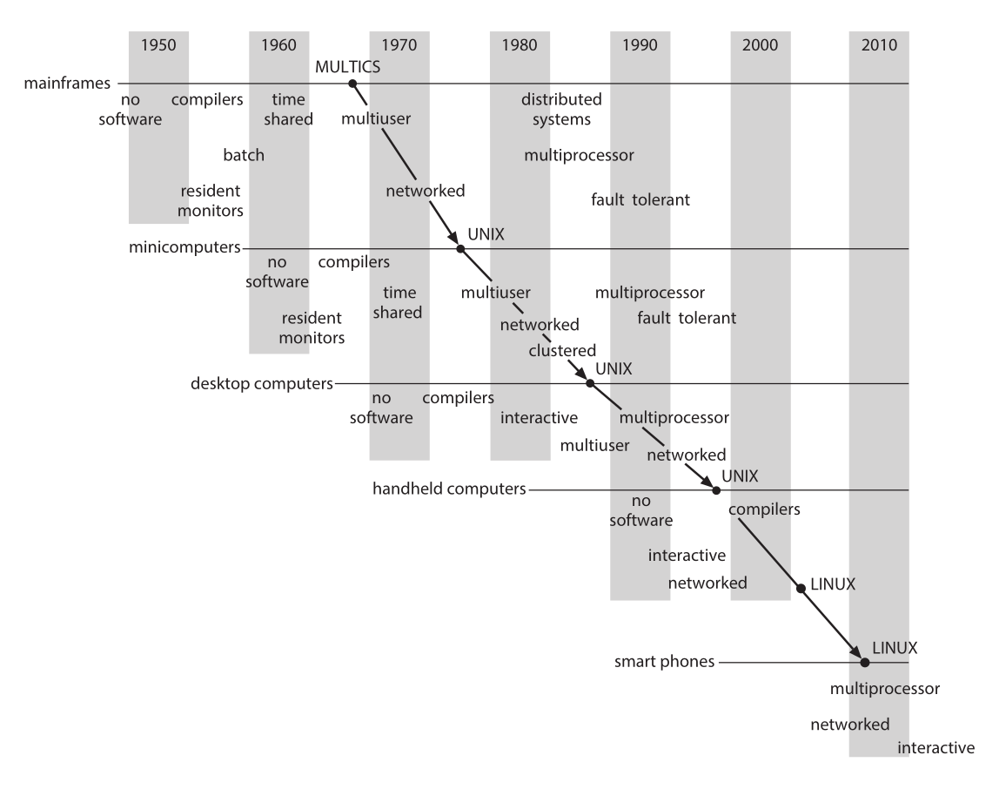
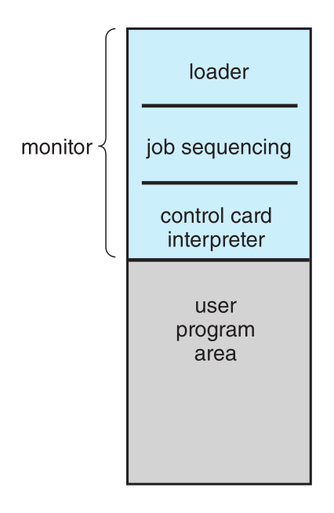
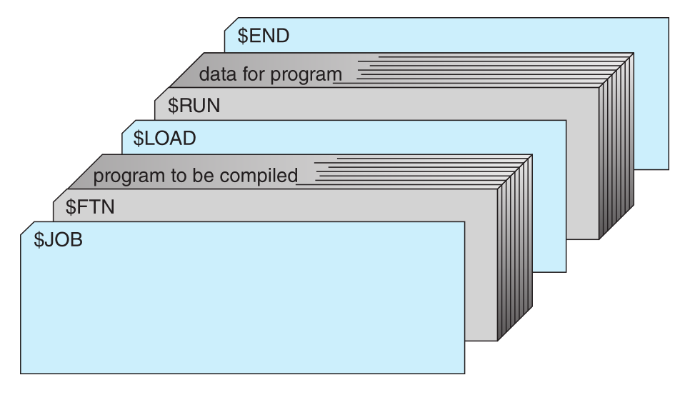
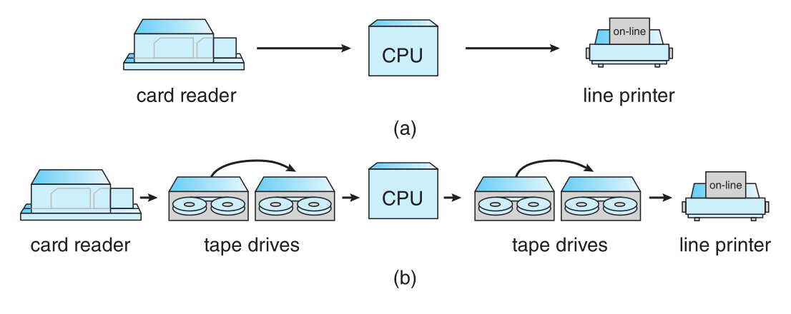
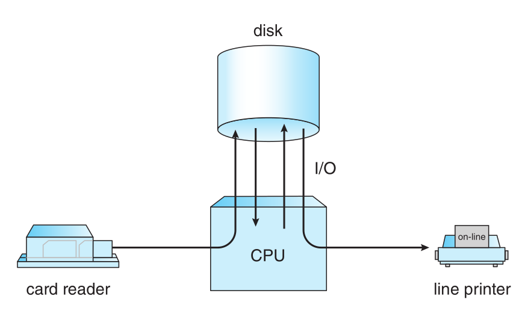

# Chapter A. Influential Operating Systems

- 과목: Operating System
- 기준 교재: Operating System Concepts 10th
- 관련 페이지: PDF pp. 1043-1067
- 우선순위: 보류

## 개요

Chapter A는 현대 운영체제의 핵심 개념들이 갑자기 등장한 것이 아니라, 초기 대형 시스템에서 시작해 minicomputer, desktop computer, handheld computer, smartphone으로 이동해 온 과정을 보여 준다. 본문은 CPU scheduling, memory management, process, protection, file system, time sharing 같은 개념이 어떤 실제 시스템에서 어떤 문제를 풀기 위해 만들어졌는지 추적한다.

이 장의 목적은 특정 옛 제품 이름을 암기하는 것이 아니다. `resident monitor`, `batch system`, `spooling`, `time sharing`, `demand paging`, `segmentation`, `protection ring`, `microkernel`, `capability` 같은 개념이 어떤 historical pressure에서 생겼는지 이해하는 데 있다. 현대 OS에서 당연하게 보이는 기능 대부분은 초기 시스템의 비용, 속도 차이, hardware limit, 사용자 수 증가, protection 요구가 누적되면서 만들어졌다.

## 핵심 개념

| 개념 | 핵심 의미 |
|---|---|
| `feature migration` | mainframe의 고급 OS 기능이 시간이 지나면서 minicomputer, desktop, handheld, smartphone으로 내려오는 현상 |
| `resident monitor` | memory에 상주하며 control cards를 해석하고 job을 자동으로 이어 실행하는 초기 OS 형태 |
| `batch system` | 비슷한 준비 작업이 필요한 jobs를 묶어 setup time을 줄이는 실행 방식 |
| `automatic job sequencing` | operator가 다음 job을 수동으로 시작하던 시간을 OS software가 제거하는 기법 |
| `control card`, `JCL` | resident monitor에게 어떤 compiler, assembler, loader, program을 실행할지 알려 주는 지시 카드 |
| `off-line I/O` | card reader/printer 같은 느린 장치를 main CPU에서 떼어 내고 tape 등을 통해 간접 처리하는 방식 |
| `spooling` | disk를 큰 buffer로 사용해 input/output을 미리 읽고 나중에 출력하며 computation과 I/O를 겹치는 방식 |
| `time sharing` | 여러 interactive users가 terminal을 통해 동시에 computer를 쓰는 것처럼 보이게 하는 OS 방식 |
| `demand paging` | 필요한 page가 없을 때 page fault로 backing store에서 가져오는 virtual memory 방식 |
| `segmentation`, `paged segmentation` | program/file/protection 단위를 segment로 보고, segment 내부를 pages로 나누는 memory model |
| `microkernel` | kernel에는 primitive mechanism만 남기고 OS personality 또는 UNIX-specific service를 user-mode servers로 밀어내는 구조 |
| `capability-based protection` | object 접근 권한을 unforgeable capability로 표현해 access control을 수행하는 protection model |
| `rights amplification` | 신뢰된 procedure가 호출 중에만 caller보다 큰 권한을 일시적으로 얻어 abstract object를 조작하는 방식 |

## 세부 정리

### A.1 Feature Migration

초기 OS를 공부하는 이유는 오래된 기능 자체가 아니라 `feature migration` 때문이다. 과거에는 거대한 mainframe에서만 가능했던 기능이 시간이 지나면서 작은 시스템으로 이동한다. Figure A.1은 이 흐름을 보여 준다. `time sharing`, `multiuser`, `multiprocessor`, `networked`, `fault tolerant`, `UNIX`, `LINUX` 같은 기능과 계열이 mainframe에서 minicomputer, desktop, handheld, smartphone으로 확산된다.

Figure A.1 · PDF p. 1044 · operating-system concepts and features가 큰 시스템에서 작은 시스템으로 이동하는 흐름

대표 사례는 `MULTICS`에서 `UNIX`로 이어지는 흐름이다. MULTICS는 1965-1970년에 MIT에서 computing utility를 목표로 개발되었고, GE-645 같은 대형 mainframe에서 실행되었다. Bell Laboratories는 MULTICS 개발에 참여하다가 이후 PDP-11 minicomputer용 `UNIX`를 설계했다. UNIX의 많은 개념은 다시 microcomputer의 UNIX-like OS, Microsoft Windows, Windows XP, macOS, Linux, handheld environments로 이동했다.

핵심은 “같은 OS 개념이 여러 규모의 컴퓨터에 반복 적용된다”는 점이다. 따라서 현대 OS를 이해할 때도 mainframe, minicomputer, desktop, handheld를 별개 세계로만 보면 안 된다. CPU와 memory가 작고 비쌌던 시절에 나온 기법이 오늘날 더 작은 장치에서 다시 등장하거나, cloud/datacenter 같은 큰 시스템에서 다른 형태로 재등장한다.

### A.2 Early Systems

초기 computer는 특정 작업만 하도록 설계된 장치였고, 작업을 바꾸려면 physical rewiring 또는 수작업이 필요했다. 1940년대에 Alan Turing, John von Neumann 등이 `stored-program computer` 개념을 발전시키면서 program store와 data store를 가진 general-purpose computer가 등장했다. Manchester Mark 1과 Ferranti Mark 1은 이 흐름의 초기 예다.

초기 general-purpose computer는 console 중심으로 동작했다. programmer가 곧 operator였고, program을 front panel switches, paper tape, punched cards로 memory에 넣었다. 실행 중에는 console lights로 상태를 보고, 오류가 나면 memory/register를 직접 확인해 debugging했다. 이 단계에는 OS라기보다 “사람이 hardware를 직접 운영하는 방식”이 중심이었다.

#### A.2.1 Dedicated Computer Systems

시간이 지나면서 card reader, line printer, magnetic tape, assembler, loader, linker, function library가 등장했다. 특히 `device driver` 개념이 중요하다. 각 I/O device는 buffer, flag, register, control bit, status bit 사용 방식이 다르므로, device-specific sequence를 매번 직접 작성하지 않고 reusable subroutine으로 분리했다.

compiler도 등장했다. 예를 들어 FORTRAN program을 실행하려면 compiler tape를 mount하고, source cards를 읽고, assembly output을 만들고, assembler tape를 mount하고, object program을 link한 뒤 binary를 load해야 했다. 이 과정은 여러 개의 job step으로 구성되었고, 중간 오류가 나면 처음부터 다시 준비해야 할 수도 있었다.

초기 dedicated system의 병목은 `setup time`이었다. tape를 갈아 끼우거나 console을 조작하는 동안 CPU는 idle 상태였다. 당시 computer는 매우 비싸고 희소했기 때문에 CPU utilization을 높이는 것이 핵심 목표였다. 이 압력이 batch processing과 resident monitor를 낳았다.

#### A.2.2 Shared Computer Systems

첫 번째 개선은 professional computer operator를 두는 것이었다. programmer는 cards/tapes와 실행 설명을 넘기고, operator가 job을 계속 돌렸다. 오류가 나면 operator는 memory/register dump를 남기고 다음 job으로 넘어갔다. 이는 machine utilization을 높였지만, programmer는 console debugging 대신 dump를 보고 더 어렵게 debugging해야 했다.

두 번째 개선은 비슷한 요구를 가진 jobs를 묶는 `batching`이었다. FORTRAN job, COBOL job, FORTRAN job을 그대로 실행하면 compiler setup을 반복해야 하지만, FORTRAN jobs를 batch로 묶으면 setup을 한 번만 해도 된다. 그러나 job이 끝난 뒤 operator가 종료 이유를 확인하고, dump하고, 다음 장치를 준비하고, restart하는 동안 CPU는 여전히 idle이었다.

이 idle time을 줄이기 위해 `automatic job sequencing`이 등장했고, 여기서 초기 OS인 `resident monitor`가 만들어졌다. Resident monitor는 memory에 상주하며 한 job이 끝나면 다음 job으로 control을 넘긴다. Figure A.2는 resident monitor가 loader, job sequencing, control-card interpreter, user program area로 구성된 memory layout을 보여 준다.

Figure A.2 · PDF p. 1047 · resident monitor가 memory에 상주하며 loader와 control-card interpreter를 통해 job을 이어 실행하는 구조

Resident monitor가 무엇을 실행할지 알기 위해 `control cards`가 사용되었다. 예를 들어 `$FTN`은 FORTRAN compiler 실행, `$ASM`은 assembler 실행, `$RUN`은 user program 실행을 뜻한다. `$JOB`, `$END`는 job boundary를 나타내며 account number, job name, resource accounting 같은 정보를 담을 수 있다. IBM의 `JCL(Job Control Language)`은 `//`로 control card를 구분했다.

Figure A.3 · PDF p. 1048 · batch job card deck에서 $JOB, $FTN, $LOAD, $RUN, data, $END가 순서대로 배치되는 예

Resident monitor의 구성요소는 다음처럼 볼 수 있다.

| 구성요소 | 역할 |
|---|---|
| `control-card interpreter` | control card 지시를 읽고 실행 지점을 결정 |
| `loader` | system program과 application program을 memory에 load |
| `device drivers` | monitor, loader, system/application program이 공통으로 사용하는 I/O routines |

이 구조의 설계 이유는 명확하다. 사람이 job sequencing을 하면 CPU가 기다리지만, monitor가 자동으로 control을 넘기면 transition overhead가 줄어든다. 즉 초기 OS의 출발점은 “사용자 편의”보다 “비싼 CPU를 놀리지 않는 것”에 가까웠다.

#### A.2.3 Overlapped I/O

Batch system이 automatic job sequencing을 제공해도 느린 mechanical I/O 때문에 CPU가 자주 idle이었다. CPU는 microsecond 단위로 instruction을 처리하지만, card reader는 초당 수십 장 수준이었다. CPU 성능은 I/O 장치보다 더 빠르게 증가했기 때문에 CPU-I/O speed gap은 계속 커졌다.

`off-line I/O`는 이 문제를 줄이기 위해 card reader와 line printer를 main CPU에서 분리했다. Cards를 먼저 magnetic tape로 복사하고, CPU는 tape에서 빠르게 input을 읽는다. Output도 tape에 쓰고 나중에 printer로 출력한다. Figure A.4는 CPU가 card reader/printer를 직접 다루는 on-line 방식과 tape를 거치는 off-line 방식을 비교한다.

Figure A.4 · PDF p. 1049 · card reader와 line printer를 CPU에 직접 붙인 on-line I/O와 tape를 경유하는 off-line I/O 비교

Off-line operation의 장점은 여러 reader-to-tape, tape-to-printer system을 하나의 CPU에 붙여 CPU를 더 바쁘게 만들 수 있다는 점이다. 단점은 job turnaround time이 길어진다는 것이다. Job은 tape에 먼저 쌓이고, tape가 충분히 차면 rewind, unload, transport, mount 과정을 거쳐 CPU로 간다. Batch system에서는 이 지연이 어느 정도 받아들여질 수 있었다.

Disk가 등장하면서 tape의 sequential-access 한계가 줄었다. Tape는 한쪽에서 card reader가 쓰는 동시에 다른 쪽에서 CPU가 읽을 수 없지만, disk는 random-access device라 input area와 CPU가 읽을 area 사이를 빠르게 전환할 수 있다. OS는 card images 위치를 table에 기록하고, program이 card reader input을 요청하면 disk에서 대신 읽어 준다.

이 방식이 `spooling(simultaneous peripheral operation on-line)`이다. Disk를 큰 buffer처럼 사용해 input을 가능한 한 미리 읽고, output은 device가 받을 수 있을 때까지 disk에 보관한다. Figure A.5는 disk가 CPU와 느린 I/O devices 사이의 buffer 역할을 하는 spooling 구조를 보여 준다.

Figure A.5 · PDF p. 1050 · disk를 buffer로 사용해 card reader, CPU, line printer의 동작을 겹치는 spooling 구조

Spooling은 한 job의 computation과 다른 job의 I/O를 겹치게 한다. Spooler가 어떤 job의 input을 읽는 동안, 다른 job의 output을 print queue에 쌓고, 또 다른 job이 CPU에서 실행될 수 있다. Disk space와 몇 개의 table 비용으로 CPU와 I/O device utilization을 모두 높일 수 있다. 이 때문에 spooling은 자연스럽게 `multiprogramming`으로 이어졌고, multiprogramming은 현대 OS의 기반이 되었다.

### A.3 Atlas

`Atlas`는 1950년대 말-1960년대 초 University of Manchester에서 설계되었다. Batch OS였고 spooling을 사용했으며, device drivers와 `extra codes`라는 special instructions를 통해 system calls를 제공했다. Atlas가 중요한 이유는 현대 OS에서 당연한 memory management 기법을 매우 이른 시기에 구현했기 때문이다.

Atlas는 drum을 main memory처럼 사용하고, 작은 core memory를 drum cache처럼 사용했다. `demand paging`으로 core memory와 drum 사이의 transfer를 자동화했다. 당시 core memory는 새롭고 비쌌고, address space는 매우 큰 편이었으므로 실제 physical core보다 큰 logical memory를 다루는 방법이 필요했다.

Atlas의 address는 24-bit decimal encoding으로 1 million words를 표현했다. Physical memory는 98K-word drum과 16K words core였고, 512-word pages를 사용해 core에는 32 frames가 있었다. 32-register associative memory가 virtual-to-physical mapping을 구현했다. 현대의 TLB와 유사한 발상으로 볼 수 있다.

Atlas page replacement는 program이 loops를 돈다는 가정을 사용했다. 각 frame의 reference bit history를 1,024 instructions마다 읽고 최근 32 values를 유지했다. `t1`은 가장 최근 reference 이후 시간, `t2`는 마지막 두 reference 사이 간격이다.

| 조건 | replacement 판단 |
|---|---|
| `t1 > t2 + 1` | 예상 주기보다 오래 reference가 없으므로 더 이상 쓰지 않는 page로 보고 교체 |
| 모든 page에서 `t1 <= t2` | 아직 사용 중이라 보고, 예상 next reference가 가장 늦은 `max(t2 - t1)` page 교체 |

이 알고리즘은 오늘날 관점에서 optimal하지는 않지만, locality와 reference prediction을 OS가 활용하려는 초기 시도라는 점이 중요하다. 특히 page fault가 나면 즉시 drum transfer를 시작할 수 있도록 항상 empty frame 하나를 유지했다는 점도 I/O latency를 줄이려는 설계다.

### A.4 XDS-940

`XDS-940`은 1960년대 초 UC Berkeley에서 설계된 time-shared system이다. Atlas처럼 paging을 사용했지만, XDS-940의 paging은 demand paging이 아니라 relocation을 위한 것이었다. User process virtual memory는 16K words, physical memory는 64K words였고, page size는 2K words였다. Physical memory가 virtual memory보다 커서 여러 user processes가 동시에 memory에 있을 수 있었다.

XDS-940의 중요성은 time sharing을 제대로 지원하기 위해 hardware와 OS가 함께 바뀌었다는 점이다. 기존 XDS-930에 `user-monitor mode`가 추가되었고, I/O와 halt 같은 instructions는 `privileged instructions`가 되었다. User mode에서 privileged instruction을 실행하면 OS로 trap된다. 이는 현대 dual-mode operation과 system call protection의 원형이다.

또한 user-mode instruction set에 `system-call instruction`이 추가되었다. Files는 drum의 256-word blocks로 allocation되었고, free blocks는 bitmap으로 관리되었다. 각 file은 data block pointers를 담는 index block을 가졌고, index blocks는 chain으로 연결되었다. 이는 later file system indexing의 초기 형태로 볼 수 있다.

XDS-940은 processes가 subprocesses를 create, start, suspend, destroy할 수 있는 system calls도 제공했다. Process creation은 tree structure를 만들고, separate processes는 memory sharing을 통해 communication과 synchronization을 수행했다. 현대 process hierarchy와 shared memory IPC의 연결점을 보여 주는 시스템이다.

### A.5 THE

`THE` operating system은 1960년대 중반 Netherlands의 Technische Hogeschool Eindhoven에서 EL X8 computer용으로 설계되었다. THE의 핵심은 기능 자체보다 “깨끗한 구조”다. Layered structure, concurrent processes, `semaphores` synchronization으로 유명하다.

XDS-940과 달리 THE의 process set은 static이었다. OS 자체가 cooperating processes의 집합으로 설계되었고, user program compile/execute/print를 담당하는 5개의 user processes가 있었다. 한 job이 끝나면 process는 input queue로 돌아가 다음 job을 고른다.

CPU scheduling은 priority algorithm을 사용했다. Priorities는 2초마다 다시 계산되며 최근 8-10초 동안 사용한 CPU time에 반비례했다. 그 결과 I/O-bound processes와 new processes가 높은 priority를 받았다. 오늘날 interactive responsiveness를 높이기 위한 priority boost 계열과 닮아 있다.

Memory management는 hardware support 부족 때문에 제한적이었다. User programs는 Algol로만 작성될 수 있었고, compiler가 system routines 호출을 자동 생성해 필요한 information이 memory에 있는지 확인하게 했다. Backing store는 512K-word drum, page size는 512 words, replacement는 `LRU`였다.

THE는 `deadlock control`도 중시했다. `banker's algorithm`을 사용해 deadlock avoidance를 제공했다. 이 점은 Chapter 8 Deadlocks의 이론이 실제 OS design problem에서 나온 것임을 보여 준다.

THE와 관련된 `Venus` system도 layered design과 semaphore synchronization을 사용했다. 다만 lower levels를 microcode로 구현해 더 빠르게 만들었고, paged-segmented memory와 time-sharing design을 사용했다.

### A.6 RC 4000

`RC 4000`은 Brinch-Hansen이 Danish 4000 computer를 위해 설계한 system이다. 목적은 batch system이나 time-sharing system 같은 특정 완제품 OS가 아니라, 그 위에 다양한 OS를 만들 수 있는 `operating-system nucleus`, 즉 kernel을 제공하는 것이었다.

RC 4000 kernel은 concurrent processes와 round-robin CPU scheduler를 지원했다. Processes는 memory sharing도 할 수 있었지만, primary communication/synchronization mechanism은 kernel이 제공하는 message system이었다. Processes는 8-word fixed-sized messages를 주고받았고, message buffers는 common buffer pool에서 관리되었다.

각 process에는 message queue가 있었고, 도착했지만 아직 receive되지 않은 messages가 FIFO order로 저장되었다. 기본 message primitives는 다음 네 가지였다.

| primitive | 의미 |
|---|---|
| `send-message` | receiver에게 message를 보내고 buffer를 얻음 |
| `wait-message` | sender, message, buffer를 기다림 |
| `send-answer` | 받은 message에 대한 result를 보냄 |
| `wait-answer` | result와 message/buffer를 기다림 |

이 방식은 process가 message queue를 FIFO로 service하고, 다른 process가 자신의 message를 처리하는 동안 block되는 제약이 있었다. 이를 완화하기 위해 `wait-event`, `get-event`가 추가되어 queue service order를 더 유연하게 만들었다.

RC 4000에서 I/O devices도 processes로 취급되었다. Device driver는 device interrupts와 registers를 messages로 변환하는 code였다. Terminal에 write하려면 terminal process에 message를 보내고, input character interrupt가 발생하면 driver가 message를 만들어 waiting process에 보낸다. 이 설계는 device를 uniform IPC model에 넣는다는 점에서 microkernel-style I/O 구조와 연결된다.

### A.7 CTSS

`CTSS(Compatible Time-Sharing System)`는 MIT에서 설계된 experimental time-sharing system으로 1961년에 등장했다. IBM 7090에서 구현되었고 최대 32 interactive users를 지원했다. Users는 terminal에서 files를 조작하고, programs를 compile/run할 수 있는 interactive commands를 제공받았다.

CTSS는 32K 36-bit word memory 중 monitor가 5K를 사용하고, 나머지 27K를 user용으로 남겼다. User memory images는 main memory와 fast drum 사이에서 swapped되었다. Scheduling은 `multilevel-feedback-queue`를 사용했다. Level `i`의 time quantum은 `2 * i` time units였고, CPU burst를 quantum 안에 끝내지 못한 program은 다음 level로 내려가 더 긴 quantum을 받았다.

초기 level은 program size에 따라 결정되었다. 중요한 이유는 swap time보다 quantum이 짧으면 process가 제대로 실행되기도 전에 swapping overhead만 만들 수 있기 때문이다. CTSS는 time sharing이 실용적인 computing mode임을 보여 주었고, 이후 MULTICS 개발을 자극했다.

### A.8 MULTICS

`MULTICS(Multiplexed Information and Computing Services)`는 CTSS의 자연스러운 확장으로 MIT, GE, Bell Laboratories가 1965-1970년에 설계했다. 목표는 city-wide computing utility였다. 즉 전기처럼 computing service를 제공하고, terminal들이 telephone wires로 대형 time-shared system에 연결되는 모델을 상상했다.

MULTICS는 GE 645에서 실행되었고, paged-segmentation memory hardware가 추가되었다. Virtual address는 18-bit segment number와 16-bit word offset으로 구성되며, segment는 1K-word pages로 paging되었다. Page replacement는 `second-chance` algorithm을 사용했다.

가장 중요한 설계는 segmented virtual address space와 file system의 통합이다. MULTICS에서 각 segment는 file이고, segment는 file name으로 address된다. File system은 multilevel tree structure를 제공해 users가 자신의 subdirectory structure를 만들 수 있었다. 현대 memory-mapped file, persistent object, namespace 설계의 선구적 형태로 볼 수 있다.

MULTICS도 CTSS처럼 `multilevel feedback queue` scheduling을 사용했다. Protection은 각 file의 access list와 executing processes의 `protection rings`로 수행했다. 약 300,000 lines of PL/1 code로 작성되었고, multiprocessor system으로 확장되어 CPU를 maintenance 때문에 제거해도 system이 계속 실행될 수 있었다.

### A.9 IBM OS/360

`IBM OS/360`은 small business machine부터 large scientific machine까지 하나의 software set으로 지원하려는 시도였다. 목표는 maintenance burden을 줄이고, users가 IBM systems 사이에서 programs/applications를 자유롭게 이동하게 하는 것이었다.

문제는 OS/360이 너무 많은 요구를 동시에 만족하려 했다는 점이다. File system은 fixed-length/variable-length records, blocked/unblocked files 등을 구분하는 type field를 가졌고, contiguous allocation 때문에 user가 output file size를 미리 예측해야 했다. `JCL(Job Control Language)`은 모든 가능한 option을 parameter로 제공하면서 average user에게 매우 어려운 언어가 되었다.

Memory management도 architecture의 제약을 받았다. Base-register addressing은 있었지만 program이 base register를 접근/수정할 수 있어 CPU가 absolute address를 생성했다. 이 때문에 dynamic relocation이 어렵고, program은 load time에 physical memory에 bound되었다. OS/MFT는 fixed regions, OS/MVT는 variable regions를 사용했다.

OS/360은 assembly language로 수천 명이 작성한 millions of lines of code였고, OS code와 tables가 많은 memory를 사용했다. Overhead가 CPU cycles의 절반을 차지하기도 했다. Bug fix가 remote part의 다른 bug를 만들기 쉬운 거대한 system의 복잡성 문제가 드러났다.

IBM/370 architecture로 넘어가며 virtual memory가 추가되었다. OS/VS1은 OS/MFT를 하나의 큰 virtual address space에서 실행했고, OS/VS2 Release 1은 OS/MVT를 virtual memory에서 실행했다. OS/VS2 Release 2, 즉 `MVS`,는 각 user에게 독립 virtual memory를 제공했다.

IBM의 time-sharing 시도인 `TSS/360`은 MULTICS처럼 큰 utility를 목표로 했지만 너무 크고 느려 실패했다. 대신 `TSO` under MVS, `CMS` under `CP/67` 또는 `VM`이 time sharing을 제공했다. 여기서 중요한 교훈은 advanced system이 기술적으로 야심적이어도, 너무 복잡하고 느리면 실제 adoption에 실패할 수 있다는 점이다.

### A.10 TOPS-20

`TOPS-20`은 DEC 계열의 영향력 있는 time-sharing OS다. BBN의 TENEX에서 시작했다. BBN은 DEC PDP-10에 hardware memory-paging system을 추가해 virtual memory를 구현하고, 이를 활용하는 general-purpose time-sharing system인 TENEX를 만들었다. DEC는 TENEX 권리를 사서 hardware pager가 내장된 DECSYSTEM-20과 TOPS-20을 만들었다.

TOPS-20의 중요한 특징은 advanced command-line interpreter였다. 사용자가 필요할 때 help를 제공했고, computer의 성능과 합리적인 가격이 결합되어 당시 인기 있는 time-sharing system이 되었다. 기술적으로는 virtual memory 기반 time sharing과 interactive usability가 결합된 예로 이해하면 된다.

### A.11 CP/M and MS/DOS

초기 hobbyist computers는 kit로 조립되고 한 번에 하나의 program만 실행했다. `CP/M(Control Program/Monitor)`은 1970년대 personal computer 계열의 초기 표준 OS였고, Gary Kildall의 Digital Research가 작성했다. 주로 8-bit Intel 8080에서 실행되었고, 64 KB memory만 지원했으며, single-program, text-based command interpreter 환경이었다.

IBM PC용으로 등장한 `MS-DOS`는 16-bit Intel 8086을 대상으로 했고 CP/M과 비슷했지만 built-in commands가 더 풍부했다. TOPS-10 command style의 영향을 받았다. MS-DOS는 1981년부터 2000년까지 개발되며 개인용 컴퓨터의 대표 OS가 되었지만, 현대 OS의 핵심인 `protected memory`가 없었다.

이 절의 핵심은 개인용 OS가 처음부터 현대적이지 않았다는 점이다. PC의 하드웨어 제약과 사용 방식 때문에 single-tasking, no protection, command interpreter 중심이었다. 이후 32-bit CPU와 protected memory, context switching이 보급되면서 mainframe/minicomputer 기능이 PC OS로 이동했다.

### A.12 Macintosh Operating System and Windows

16-bit CPU가 보급되면서 personal computer OS는 더 feature-rich하고 usable해질 수 있었다. Apple Macintosh는 home users를 위한 GUI computer의 대표적 초기 성공 사례다. Mouse 기반 pointing/selection과 GUI utility programs를 제공했고, 1984년 당시 hard disk가 비쌌기 때문에 기본 400-KB floppy drive를 사용했다.

Original Mac OS는 Apple computers에서만 실행되었다. 반면 Microsoft Windows는 1985년 Version 1.0부터 여러 회사의 다양한 computers에서 실행되도록 licensed되었고, 이 차이가 확산에 큰 영향을 주었다. Microprocessor가 32-bit로 발전하고 protected memory, context switching 같은 hardware feature가 생기자, desktop OS도 mainframe/minicomputer의 기능을 흡수했다.

본문은 PC와 server의 역할 분화도 지적한다. Minicomputer는 점차 general-purpose/special-purpose servers로 대체되었고, personal computers는 desk 위에서 network를 통해 서로 및 servers와 통신하게 되었다. Apple과 Microsoft의 desktop rivalry는 usability, features, applications를 중심으로 계속되었고, Linux는 technical users와 일부 nontechnical environments에서 점차 확산되었다.

### A.13 Mach

`Mach`는 CMU의 Accent operating system에서 영향을 받은 OS다. Communication system과 철학은 Accent에서 왔지만, virtual memory, task/thread management 등은 새로 개발되었다. Mach의 목표는 세 가지였다.

| 목표 | 의미 |
|---|---|
| `4.3 BSD UNIX emulation` | UNIX executable files가 Mach에서 올바르게 실행되도록 함 |
| modern OS support | 여러 memory models, parallel computing, distributed computing 지원 |
| simpler kernel | 4.3 BSD보다 수정하기 쉬운 kernel 제공 |

Mach는 BSD UNIX에서 진화했다. 처음에는 4.2 BSD kernel 안에서 Mach components를 개발하고, 완성되는 부분부터 BSD components를 대체했다. Release 2까지는 BSD code 상당 부분을 kernel에 포함해 BSD compatibility를 제공했기 때문에 kernel이 커졌다.

`Mach 3`는 BSD code를 kernel 밖으로 이동시켜 작은 `microkernel`을 만들었다. Kernel에는 basic Mach features만 남기고, UNIX-specific code는 user-mode servers에서 실행했다. 이 방식은 BSD 대신 다른 OS personality를 올리거나, 여러 OS interfaces를 동시에 실행할 가능성을 열었다. Hardware-defined virtual machine과 달리 여기서는 Mach kernel interface가 software-defined virtual machine 역할을 한다.

Mach는 multiprocessing support를 처음부터 깊게 포함했다. UNIX가 multiprocessing을 염두에 두지 않고 발전한 것과 대비된다. Mach는 하나의 task(address space) 안에 multiple threads of execution을 두는 lightweight processes를 사용해 multiprocessing과 parallel computation을 지원했다.

Mach의 communication은 message 중심이다. Messages를 유일한 communication method로 삼아 protection mechanism을 완전하고 효율적으로 만들려 했다. Virtual memory system과 messages를 통합해 message handling cost를 줄였고, backing store를 관리하는 daemons와도 message로 통신하게 하여 memory-object-managing tasks를 유연하게 만들었다.

오늘날 pure Mach 구현은 거의 남아 있지 않지만, Mach는 Apple의 `XNU` kernel 안에 살아 있다. XNU는 NeXTSTEP 계열에서 온 Mach core 위에 BSD APIs layer가 얹힌 형태이며, macOS와 iOS variants의 kernel 기반이다. Mach APIs는 traps와 Mach Messages 형태로 계속 유지된다.

### A.14 Capability-based Systems: Hydra and CAP

`capability-based protection`은 object에 대한 접근권을 capability라는 권한 token으로 표현한다. Appendix A는 널리 쓰인 시스템은 아니지만 protection theory를 시험한 두 시스템, `Hydra`와 `Cambridge CAP`,을 다룬다. 두 시스템의 차이는 complexity와 policy 표현 방식에 있다.

#### A.14.1 Hydra

`Hydra`는 매우 flexible한 capability-based protection system이다. System-defined rights에는 memory segment에 대한 read, write, execute 같은 기본 권한이 있고, user가 추가 rights를 선언할 수도 있다. User-defined rights의 의미 해석은 user program이 담당하지만, 그 rights 사용 자체에 대한 access protection은 system이 제공한다.

Hydra에서 object operations는 procedures로 정의된다. Operation을 구현하는 procedures도 object의 한 형태이며 capability를 통해 indirect access된다. User-defined type의 object를 protection system이 다루려면 해당 type의 operations 이름을 system에 알려야 한다. 그러면 그 operation names가 `auxiliary rights`가 되고, object instance capability는 어떤 auxiliary rights를 포함하는지 명시한다.

따라서 process가 typed object에 operation을 수행하려면, 자신이 가진 capability에 그 operation name이 auxiliary right로 들어 있어야 한다. 이 구조는 instance-by-instance, process-by-process로 access discrimination을 가능하게 한다. 단순히 “read/write/execute”만 있는 것이 아니라 abstract operation 단위로 보호할 수 있다.

Hydra의 중요한 개념은 `rights amplification`이다. 신뢰된 procedure는 특정 type의 formal parameter에 대해 caller보다 큰 권한을 일시적으로 얻을 수 있다. 예를 들어 process가 object A에 대해 operation P를 호출할 권리는 있지만 A의 representation segment를 직접 read/write할 권한은 없을 수 있다. P의 code body로 control이 넘어가면 A에 대한 capability가 amplified되어 P가 representation을 읽거나 수정할 수 있고, return하면 원래 unamplified state로 복구된다.

이 방식은 abstract data type consistency를 보장하기 위한 dynamic rights adjustment다. Caller는 object representation을 직접 건드릴 수 없고, 오직 허용된 operation을 통해서만 접근한다. 그러나 amplification이 너무 넓으면 procedure가 원래 caller가 의도한 read-only 제한을 우회할 수 있다. Hydra는 amplification을 type과 procedure에 제한해 `mutually suspicious subsystems` 문제를 다룬다.

`mutually suspicious subsystems`는 service program과 caller가 서로를 완전히 신뢰하지 못하는 상황이다. Caller는 service가 data를 손상하거나 권한을 보관해 나중에 남용할 위험을 걱정하고, service는 자신의 private files가 caller에게 직접 노출되는 것을 막아야 한다. Hydra는 protection kernel, kernel-defined primitives, capability system을 통해 subsystem designer가 policy를 만들고 system이 enforcement를 맡는 구조를 제공한다.

#### A.14.2 Cambridge CAP System

`Cambridge CAP`은 Hydra보다 단순한 capability system을 사용한다. CAP에는 두 종류의 capabilities가 있다.

| capability | 해석 주체 | 제공 권한/의미 |
|---|---|---|
| `data capability` | CAP machine microcode | storage segment에 대한 standard read/write/execute |
| `software capability` | protected procedure | subsystem-specific object/policy 표현, microcode는 보호만 하고 의미 해석은 하지 않음 |

Software capability는 CAP microcode가 보호하지만 직접 해석하지 않는다. 대신 privileged protected procedure가 해석한다. Protected procedure 실행 중에는 process가 software capability의 contents를 read/write할 권한을 일시적으로 얻는다. 이는 capability에 대한 `seal`과 `unseal` primitives를 구현하는 rights amplification으로 볼 수 있다.

CAP의 설계는 universal trust를 줄인다. Microcode 외의 code를 전부 신뢰하지 않고, protected procedure도 자기 protection environment에 속하지 않는 storage segment나 capabilities에는 접근할 수 없다. User-defined protected procedure가 잘못되어도 전체 system security가 깨지는 것이 아니라, 해당 subsystem의 protection breakdown으로 제한된다.

Hydra는 풍부한 system-defined procedure library와 reference manual을 제공해 programmers가 protection system을 직접 활용할 수 있게 했다. CAP은 더 작은 mechanism을 제공하고, subsystem designer가 protection principles와 techniques를 이해해 policy를 만들어야 했다. 즉 Hydra는 richer framework, CAP은 smaller trusted mechanism에 가깝다.

### A.15 Other Systems

본문은 다른 시스템들도 짧게 언급한다. Burroughs computer family의 `MCP`는 system programming language로 작성된 최초의 OS였고, segmentation과 multiple CPUs를 지원했다. CDC 6600의 `SCOPE`도 multi-CPU system이었으며, multiple processes의 coordination과 synchronization이 잘 설계되었다고 평가된다.

Chapter A의 마지막 메시지는 운영체제의 생멸이다. 어떤 OS는 특정 시기와 목적에 잘 맞았지만, hardware 변화, 더 많은 기능, 더 나은 usability, marketing, ecosystem의 차이로 사라지거나 대체되었다. 그러나 사라진 시스템의 개념은 다른 형태로 남아 현대 OS에 흡수되었다.

## 연결 관계

Chapter A는 앞 장들의 개념을 historical implementations에 연결한다. Chapter 1의 computer-system operation과 I/O bottleneck은 early systems의 operator, batch, off-line I/O, spooling에서 구체화된다. Chapter 3의 process 개념은 XDS-940 subprocess tree, THE static processes, RC 4000 concurrent processes, Mach task/thread model에서 서로 다른 방식으로 나타난다.

Chapter 5의 CPU scheduling은 THE priority scheduling, CTSS/MULTICS multilevel feedback queue, RC 4000 round-robin scheduler로 연결된다. Chapter 6의 synchronization은 THE/Venus의 semaphores, RC 4000의 message primitives, Mach Messages로 이어진다. Chapter 8의 deadlock avoidance는 THE의 banker's algorithm 사용에서 실제 OS 설계 문제로 등장한다.

Chapter 9-10의 memory management는 Atlas demand paging, XDS-940 relocation paging, THE software paging, MULTICS paged segmentation, OS/370 virtual memory, Mach virtual memory system으로 연결된다. Chapter 13-15의 file system 개념은 XDS-940 index blocks, MULTICS segment-file integration, OS/360 file type/JCL complexity와 이어진다. Chapter 16-17의 protection은 MULTICS access lists/protection rings, Hydra/CAP capability systems에서 깊어진다.

## 오해하기 쉬운 내용

`feature migration`은 단순히 “옛 기술이 새 기계로 복사되었다”는 뜻이 아니다. 같은 OS 문제, 예를 들어 I/O bottleneck, memory scarcity, user isolation, interactive response가 hardware scale과 cost 변화에 맞춰 다른 형태로 반복 해결된다는 뜻이다.

`resident monitor`는 현대 OS 전체와 같지 않다. 핵심은 memory에 상주하며 job sequencing과 loading을 자동화했다는 점이다. Protection, multiprogramming, virtual memory, interactive time sharing은 이후 별도로 발전했다.

`spooling`은 단순 buffering보다 넓은 개념이다. Disk를 이용해 느린 peripheral I/O와 CPU computation을 겹치게 만들고, 여러 jobs의 input/output을 동시에 진행해 multiprogramming으로 이어지는 bridge 역할을 했다.

`Atlas demand paging`은 현대 virtual memory와 완전히 같은 구현은 아니지만, core memory를 drum의 cache처럼 사용하고 page fault와 replacement를 통해 자동 transfer를 수행했다는 점에서 매우 중요한 선구적 구조다.

`MULTICS`는 상업적으로 압도적 성공을 거둔 시스템이라기보다, segment-file integration, protection rings, utility computing, UNIX에 준 영향 때문에 중요하다.

`OS/360`의 문제는 단순히 오래된 OS라서 생긴 문제가 아니다. 너무 넓은 hardware/product range와 feature set을 하나로 포괄하려 한 complexity가 maintainability, usability, performance 문제를 만들었다.

`Mach microkernel`은 “작은 kernel이면 항상 빠르고 좋다”는 단순 결론을 주지 않는다. Mach의 의의는 primitive mechanism, messages, virtual memory integration, user-mode OS personalities를 통해 extensibility와 emulation을 실험했다는 데 있다.

`capability`는 password나 ACL entry와 다르다. Capability는 object에 대한 권한을 나타내는 token이며, 해당 token을 가진 process가 그 object에 대해 무엇을 할 수 있는지를 직접 표현한다. Hydra/CAP의 관심사는 추상 자료형과 subsystem boundary에서 권한을 어떻게 안전하게 조정할지다.

## 면접 질문

1. `feature migration`이 운영체제 역사에서 중요한 이유를 설명하라.
2. 초기 dedicated computer system에서 CPU utilization이 낮았던 원인은 무엇이고, batch system은 이를 어떻게 줄였는가?
3. `resident monitor`, `control card`, `loader`, `device driver`는 batch system에서 어떻게 협력하는가?
4. `off-line I/O`와 `spooling`의 차이를 설명하고, spooling이 `multiprogramming`으로 이어지는 이유를 말하라.
5. `Atlas`의 demand paging은 어떤 hardware/resource 제약을 해결하려 했는가?
6. XDS-940에서 user-monitor mode와 privileged instruction이 time-sharing OS에 왜 필요한가?
7. THE system의 layered design, semaphores, banker's algorithm이 현대 OS 개념과 어떻게 연결되는가?
8. RC 4000의 message-based kernel nucleus가 microkernel 설계와 닮은 점은 무엇인가?
9. CTSS와 MULTICS가 time sharing을 실용적인 computing model로 만든 방식은 무엇인가?
10. MULTICS에서 segment와 file system을 통합한 설계의 장점과 부담은 무엇인가?
11. OS/360이 “모든 사람을 위한 하나의 OS”를 지향하면서 겪은 trade-off는 무엇인가?
12. TOPS-20이 time-sharing system으로 영향력을 가진 이유를 technical usability 관점에서 설명하라.
13. CP/M과 MS-DOS가 현대 OS와 비교해 부족했던 핵심 protection feature는 무엇인가?
14. Macintosh OS와 Windows가 mainframe/minicomputer 기능을 desktop으로 가져오게 된 hardware 변화는 무엇인가?
15. Mach 3가 BSD code를 kernel 밖으로 옮긴 이유와 그 결과를 설명하라.
16. Mach의 task/thread/message/virtual memory 통합이 parallel/distributed computing에 어떤 장점을 주는가?
17. `capability-based protection`이 ACL 기반 접근 제어와 개념적으로 다른 점은 무엇인가?
18. Hydra의 `auxiliary rights`와 `rights amplification`은 abstract data type 보호에 어떻게 쓰이는가?
19. Cambridge CAP의 `data capability`와 `software capability`는 무엇이 다르고, 왜 두 종류로 나누었는가?
20. Hydra와 CAP의 protection design을 “풍부한 framework”와 “작은 trusted mechanism” 관점에서 비교하라.
