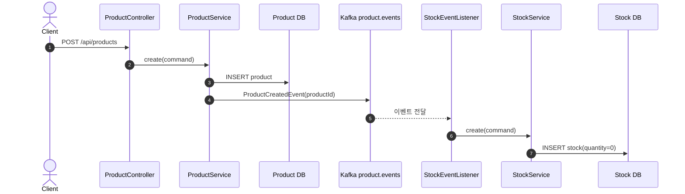
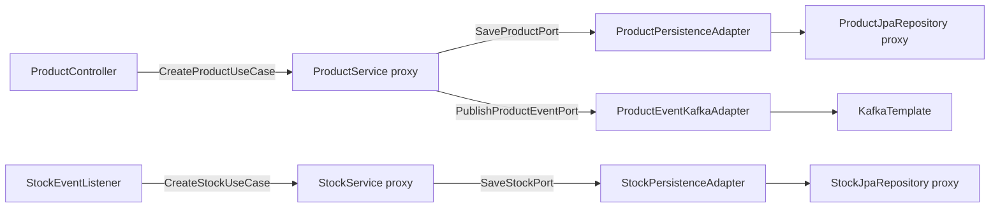
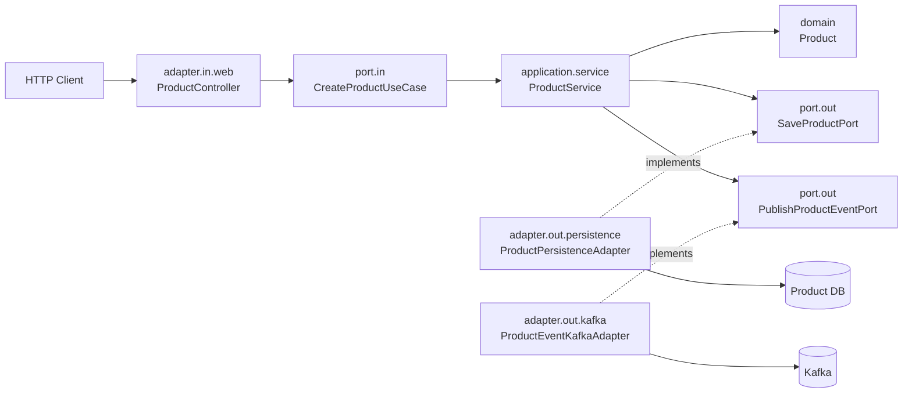
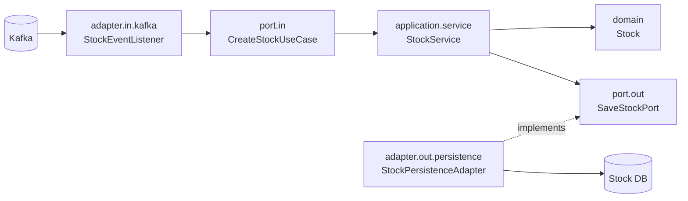
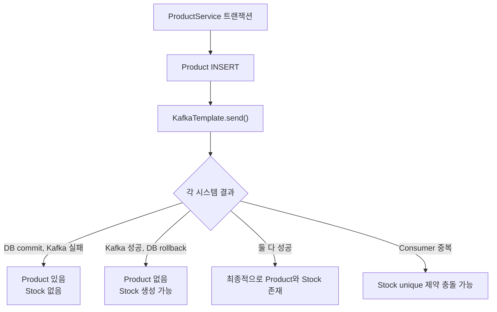
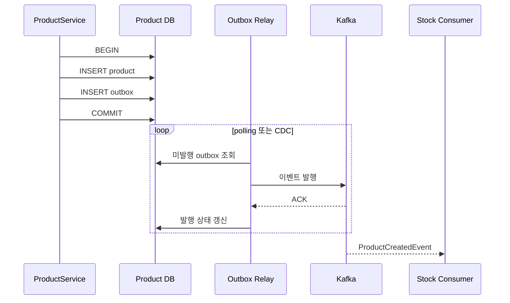

# Product–Stock 코드로 이해하는 Spring, 헥사고날 아키텍처, MSA와 EDA

> 이 문서는 테스트 코드를 분석 대상으로 삼지 않고, 현재 운영 코드에서 1차 구현이 완료된 `common`, `product`, `stock`과 상품 생성–재고 생성 흐름만 상세히 다룬다. `order`와 `payment`는 Gradle 모듈과 애플리케이션 골격 및 도메인 초안이 있지만 주문–결제 이벤트 흐름은 아직 구현되지 않았으므로 향후 모듈로만 언급한다. 문서보다 코드가 우선이며, 현재 실제 상품 생성 URI는 `/api/products`이다.

## 1. 프로젝트 전체 개요

이 저장소는 한 Git 저장소와 한 Gradle 빌드 안에 여러 서비스를 둔 **모노레포(Monorepo) 기반 MSA 학습 구조**다. 멀티모듈이라는 빌드 구조와 마이크로서비스 아키텍처(Microservices Architecture, MSA)라는 런타임 구조는 별개다. `product`와 `stock`은 각각 `main()`과 내장 서버, 설정, 스키마, Docker 컨테이너를 가진 별도 Spring Boot 애플리케이션이므로 독립 프로세스로 실행할 수 있다.

| 모듈 | 현재 상세 범위 | 책임 | 포트/스키마 |
|---|---|---|---|
| `common` | 완료 흐름의 공유 기반 | `BaseEntity`, JPA 설정, 공통 응답/예외, `ProductCreatedEvent` 계약 | 서버 없음 |
| `product` | 상세 분석 | 상품 등록, `product` 스키마 저장, 상품 생성 이벤트 발행 | 8083 / `product` |
| `stock` | 상세 분석 | 상품 생성 이벤트 소비, 수량 0 재고 생성, `stock` 스키마 저장 | 8084 / `stock` |
| `order` | 언급만 | 향후 주문 흐름 | 설정상 8081 / `order` |
| `payment` | 언급만 | 향후 결제 흐름(현재 웹 없음) | 설정상 8082 / `payment` |

Product와 Stock을 나눈 핵심 이유는 **데이터 소유권과 변경 이유가 다르기 때문**이다. 상품명·가격·판매 상태는 Product가, 판매 가능한 수량은 Stock이 소유한다. Product는 Stock 테이블에 직접 쓰지 않고 Kafka 이벤트를 발행한다. 두 서비스가 잠시 동시에 살아 있지 않아도 브로커가 시간 차를 흡수할 수 있는 대신, 즉시 일관성이 아니라 최종 일관성(Eventual Consistency)을 받아들인다.



PostgreSQL 인스턴스와 `eda` 데이터베이스는 하나지만 Hibernate의 `default_schema`가 서비스별로 다르다. 이는 논리적 격리이지 물리적 데이터베이스 독립은 아니다. Kafka 토픽은 `product.events`, 키는 상품 ID 문자열, Stock 소비자 그룹은 `stock-service-product`다.

**핵심 정리**

- 상세 대상은 실제 완료된 Product–Kafka–Stock 흐름이다.
- `common`은 애플리케이션이 아니라 공유 계약 라이브러리다.
- 별도 애플리케이션·포트·스키마·컨테이너가 서비스 경계를 만든다.
- `order`, `payment`의 전체 이벤트 흐름은 향후 범위다.

## 2. Spring Boot 애플리케이션 시작 과정

`product/src/main/java/com/eda/product/ProductApplication.java`

```java
@Import({JpaConfig.class, GlobalExceptionHandler.class})
@SpringBootApplication
public class ProductApplication {
    public static void main(String[] args) {
        SpringApplication.run(ProductApplication.class, args);
    }
}
```

Stock도 시작 클래스 이름만 다를 뿐 같은 구조다. JVM이 `main()`을 호출하면 `SpringApplication.run()`은 대략 다음 순서로 부트스트랩한다.

1. 애플리케이션 종류를 서블릿 웹 애플리케이션으로 판별하고 초기화 리스너를 준비한다.
2. 명령행 인자, 시스템 속성, 환경 변수, `application.yml` 등을 합쳐 `Environment`를 구성한다. 우선순위가 높은 환경 변수가 YAML 값을 덮어쓸 수 있다.
3. `ApplicationContext`를 만들고 `ProductApplication` 또는 `StockApplication`을 기본 구성 소스로 등록한다.
4. 구성 클래스 파싱, 컴포넌트 스캔(Component Scan), 자동 구성(Auto Configuration), `@Import` 처리를 통해 `BeanDefinition`을 등록한다. `BeanDefinition`은 객체 자체가 아니라 타입, 생성 방법, 스코프, 의존성 같은 생성 설계도다.
5. `BeanFactory`가 기본 Singleton Bean을 만들며 생성자 의존성을 해결한다. JPA Repository 프록시, 트랜잭션 프록시도 이 과정에서 준비된다.
6. 웹 자동 구성이 내장 Tomcat(Embedded Tomcat)과 `DispatcherServlet`을 초기화하고 8083 또는 8084 포트에서 요청을 받기 시작한다.
7. Stock에서는 `@KafkaListener` 기반 `KafkaMessageListenerContainer`가 시작되어 poll loop를 수행한다. Product에서는 `KafkaTemplate`과 ProducerFactory가 준비된다.

ApplicationContext는 Bean을 보관하는 상자만이 아니다. Bean 생명주기, 이벤트 발행, 리소스 조회, Environment 접근을 통합하는 Spring 컨테이너다. 종료 신호를 받으면 컨텍스트가 닫히면서 수명주기 콜백이 실행되고 Tomcat, Kafka listener/producer, 커넥션 풀, EntityManagerFactory 같은 관리 리소스가 정리된다.

`application.yml`은 단순 파일 읽기로 끝나지 않는다. Spring Boot의 설정 바인딩이 `server.port`, `spring.datasource`, `spring.jpa`, `spring.kafka` 속성을 각 자동 구성 조건과 설정 객체에 제공한다. 클래스패스에 웹, JPA, Kafka 라이브러리가 있고 필요한 속성이 존재하므로 관련 자동 구성이 활성화된다.

**핵심 정리**

- `SpringApplication.run()`의 결과가 실행 중인 ApplicationContext다.
- Environment 구성 후 BeanDefinition 등록, Singleton 생성, 서버 시작이 이어진다.
- Stock의 Kafka Listener Container도 컨텍스트 생명주기에 따라 시작·종료된다.
- 종료 시 Spring이 관리하는 인프라 리소스가 함께 정리된다.

## 3. `@SpringBootApplication`의 내부 구성

`@SpringBootApplication`은 세 가지 중심 애노테이션을 합성한 편의 애노테이션이다.

| 구성 | 역할 | 이 프로젝트의 효과 |
|---|---|---|
| `@SpringBootConfiguration` | 해당 클래스를 Boot의 주 구성 클래스로 표시하며 내부적으로 `@Configuration` 포함 | `ProductApplication`, `StockApplication`이 Bean 정의 소스가 됨 |
| `@EnableAutoConfiguration` | 클래스패스, 기존 Bean, 설정 속성 조건에 맞는 자동 구성 후보를 가져옴 | DataSource, EntityManagerFactory, 트랜잭션 관리자, MVC, Kafka 인프라 구성 |
| `@ComponentScan` | 시작 클래스 패키지부터 하위 패키지의 stereotype 탐색 | `com.eda.product..` 또는 `com.eda.stock..` 탐색 |

Product의 기본 스캔 루트는 `com.eda.product`, Stock은 `com.eda.stock`이다. 형제 패키지인 `com.eda.common`은 이 하위가 아니므로 자동 스캔되지 않는다. 그래서 두 시작 클래스가 다음을 명시적으로 가져온다.

```java
@Import({JpaConfig.class, GlobalExceptionHandler.class})
```

`JpaConfig`는 JPA Auditing을 켜고, `GlobalExceptionHandler`는 공통 REST 예외 처리기를 Bean으로 등록한다. `@Import`가 없으면 Product/Stock 엔티티 자체의 탐색이 멈추는 것은 아니지만 공통 감사 설정과 예외 처리기가 활성화되지 않는다. 특히 감사 필드가 `nullable=false`이므로 감사 값이 채워지지 않으면 저장 실패로 이어질 수 있다.

자동 구성은 무조건 모든 Bean을 만드는 마법이 아니다. 예를 들어 DataSource 자동 구성은 JDBC 클래스와 설정을 보고 커넥션 풀/DataSource를, JPA 자동 구성은 DataSource와 JPA 클래스를 보고 EntityManagerFactory와 트랜잭션 관리자를 구성한다. Spring Data는 Repository 인터페이스를 탐색해 구현 프록시를 등록한다. Kafka 자동 구성은 `spring.kafka.*`를 바탕으로 ProducerFactory, ConsumerFactory, `KafkaTemplate` 및 listener 기반 시설을 준비한다. 사용자 정의 Bean이 있으면 `@ConditionalOnMissingBean` 같은 조건 때문에 기본 Bean이 물러날 수 있다.

**핵심 정리**

- `@SpringBootApplication`은 구성, 자동 구성, 컴포넌트 스캔을 묶는다.
- 스캔은 시작 클래스의 패키지 아래로 한정된다.
- 형제인 `common` 구성은 `@Import`로 명시적으로 연결한다.
- 자동 구성은 클래스패스·설정·기존 Bean 조건에 따라 작동한다.

## 4. Spring Container와 Bean

Bean은 Spring Container가 생성과 의존성, 생명주기를 관리하는 객체다. 기본 Bean 이름은 클래스명 첫 글자를 소문자로 바꾼 형태(예: `productService`)이며, Repository 프록시는 보통 인터페이스 이름 기반(`productJpaRepository`)으로 등록된다. 타입 기반 주입이므로 실제 연결은 다음과 같다.



Lombok `@RequiredArgsConstructor`가 `final` 필드 생성자를 컴파일 시 만든다. Spring은 생성자 파라미터 타입을 보고 후보 Bean을 찾는다. `CreateProductUseCase`의 구현은 `ProductService` 하나, `SaveProductPort`의 구현은 `ProductPersistenceAdapter` 하나이므로 모호하지 않다. 인터페이스 구현이 두 개 이상이면 `NoUniqueBeanDefinitionException`이 발생할 수 있다. 그때 기본 후보에 `@Primary`를 붙이거나 주입 지점과 Bean에 `@Qualifier("이름")`를 사용해 의도를 지정한다.

Singleton은 컨테이너당 Bean 인스턴스 하나라는 뜻이지 JVM 전체에 하나라는 뜻이 아니다. 이 Bean들은 요청별 상태를 필드에 저장하지 않으므로 여러 스레드가 공유하기 적합하다. 일반 Java 객체는 `new`로 직접 만들면 Spring의 주입, AOP 프록시, 트랜잭션, 생명주기 콜백을 받지 않는다. 반면 도메인 `Product`와 `Stock`은 JPA가 관리할 수 있는 Entity지만 일반적인 singleton Spring Bean은 아니다.

객체 생성은 대체로 저수준 의존성부터 해결된다. Repository 프록시와 인프라 Bean을 사용할 수 있게 한 뒤 Persistence Adapter, Service, Controller/Listener가 만들어진다. 정확한 전체 순서는 내부 의존 그래프와 지연 초기화 여부에 따라 달라지므로 소스 선언 순서와 같다고 보면 안 된다.

순환 의존성은 A→B→A처럼 생성에 서로가 필요한 상태다. 생성자 주입에서는 객체를 완성할 출발점이 없어 컨텍스트 시작이 실패한다. 이를 setter 주입으로 숨기기보다 책임을 재분리하거나 이벤트/중간 서비스를 사용해 그래프를 단방향으로 만들어야 한다.

**핵심 정리**

- Bean은 컨테이너가 관리하는 객체이며 기본 스코프는 Singleton이다.
- 생성자 타입으로 구현체를 찾고, 여러 후보면 `@Primary`/`@Qualifier`가 필요하다.
- Spring Data가 JpaRepository 구현 프록시를 런타임에 만든다.
- 순환 의존성은 설계 경계가 꼬였다는 신호다.

## 5. 주요 Spring 및 Lombok 애노테이션

아래 표의 **처리 시점**은 컴파일 시, 컨텍스트 시작 시, 호출 시, JPA 매핑/수명주기 시로 구분한다.

| 애노테이션 | 소속·처리 시점 | Bean 등록? | 현재 위치와 내부 효과 | 제거 시 문제 / 자주 하는 오해 |
|---|---|---|---|---|
| `@Component` | Spring, 스캔 시 | 예 | Kafka/Persistence Adapter와 Listener를 후보로 등록 | 제거하면 주입 후보/Listener가 사라짐. 모든 객체에 붙이는 표시가 아님 |
| `@Service` | Spring, 스캔 시 | 예 | `ProductService`, `StockService`; 내부적으로 `@Component` 포함 | 제거하면 UseCase 구현 Bean이 없음. 자체적으로 트랜잭션을 만들지는 않음 |
| `@RestController` | Spring MVC, 스캔 시 | 예 | `ProductController`; `@Controller`+`@ResponseBody` | 제거하면 HTTP 핸들러가 아님. 객체를 자동으로 DB에 저장하지 않음 |
| `@Configuration` | Spring, 구성 파싱 시 | 예 | `JpaConfig`를 구성 클래스로 처리 | 제거하면 명시적 구성 의미가 약해짐. 단순 설정값 파일이 아님 |
| `@Import` | Spring, 구성 파싱 시 | 가져온 타입 등록 | 시작 클래스가 `JpaConfig`, 예외 처리기를 가져옴 | 제거하면 common의 두 타입이 스캔 밖에 남음 |
| `@RequiredArgsConstructor` | **Lombok**, 컴파일 시 | 아니오 | `final` 필드용 생성자 생성 | 제거 후 생성자를 직접 쓰지 않으면 컴파일 실패. Spring 애노테이션이 아님 |
| `@Transactional` | Spring, Bean 후처리/호출 시 | 아니오 | Service 프록시가 트랜잭션 경계를 적용 | 제거하면 여러 DB 작업의 원자 경계가 없음. 메서드 내부에 코드가 삽입되는 것이 아님 |
| `@KafkaListener` | Spring Kafka, 컨텍스트 시작/메시지 수신 시 | 메서드 소유 Bean은 별도 필요 | Listener Container endpoint 등록 | 제거하면 토픽을 소비하지 않음. 메서드가 스스로 poll하는 것이 아님 |
| `@Entity` | Jakarta Persistence, JPA 매핑 시 | **일반 Spring Bean 아님** | `Product`, `Stock`을 영속 엔티티로 매핑 | 제거하면 Repository 관리 대상이 아님. `@Component`와 다름 |
| `@Table` | Jakarta Persistence, JPA 매핑 시 | 아니오 | `product`, `stock` 테이블명과 Stock unique 제약 지정 | 제거하면 기본 명명 전략 사용, 테이블 제약 선언 손실 가능 |
| `@Column` | Jakarta Persistence, JPA 매핑 시 | 아니오 | null, 길이, 정밀도, 이름 등 DDL/매핑 힌트 | 제거하면 기본 매핑. Java 검증을 대신하지 않음 |
| `@Id` | Jakarta Persistence, JPA 매핑 시 | 아니오 | `BaseEntity.id`를 식별자로 지정 | 제거하면 엔티티 매핑 실패 |
| `@GeneratedValue` | Jakarta Persistence, 저장 시 | 아니오 | `IDENTITY`로 DB 생성 ID 사용 | 제거하면 ID 직접 할당 필요. 객체 생성 즉시 ID가 생기는 것이 아님 |
| `@MappedSuperclass` | Jakarta Persistence, 메타모델 구성 시 | 아니오 | 하위 Entity에 ID/감사 필드 매핑 상속 | 제거하면 공통 필드의 영속 매핑 상속이 깨짐. 자체 테이블 Entity가 아님 |
| `@EntityListeners` | Jakarta Persistence, 엔티티 수명주기 시 | 아니오 | `AuditingEntityListener`가 저장/수정 콜백 처리 | 제거하면 감사 애노테이션만으로 값이 자동 생성되지 않음 |
| `@CreatedDate` | Spring Data, persist 감사 시 | 아니오 | 최초 저장 시 `createdAt` 설정 | 제거하면 자동 최초 시간이 없음 |
| `@LastModifiedDate` | Spring Data, persist/update 감사 시 | 아니오 | 저장/수정 시 `updatedAt` 설정 | 제거하면 자동 수정 시간이 없음 |
| `@EnableJpaAuditing` | Spring Data JPA, 구성 시 | 관련 인프라 등록 | `JpaConfig`에서 auditing 활성화 | 제거하면 listener가 사용할 감사 인프라가 비활성 |
| `@Getter` | **Lombok**, 컴파일 시 | 아니오 | Entity/enum/예외 getter 생성 | 제거하면 호출 코드가 컴파일되지 않을 수 있음. 캡슐화 정책을 대신 결정하지 않음 |
| `@NoArgsConstructor` | **Lombok**, 컴파일 시 | 아니오 | JPA용 protected 기본 생성자 생성 | 제거하면 JPA 인스턴스화 요건 위반 가능. 비즈니스 생성 경로가 아님 |

추가로 `@Enumerated(EnumType.STRING)`은 `Product.status`를 숫자 순서가 아니라 문자열로 보존한다. enum 선언 순서가 바뀌어도 기존 데이터 의미가 뒤틀리지 않는 장점이 있다.

`@Transactional`은 Spring Bean 프록시를 통과하는 호출에 적용된다. `new ProductService(...)`로 만든 객체나 같은 인스턴스 내부의 self invocation에는 일반적인 프록시 가로채기가 작동하지 않는다. 마찬가지로 `JpaRepository`는 개발자가 구현체를 쓰지 않아도 Spring Data의 Repository Factory가 호출을 해석하는 Proxy를 만든다.

**핵심 정리**

- stereotype 애노테이션만 컴포넌트 스캔을 통한 Bean 등록과 직접 관련된다.
- Lombok은 컴파일 시 코드를 만들며 Spring Container 기능이 아니다.
- Entity는 JPA 관리 대상이지 singleton Spring Bean이 아니다.
- 트랜잭션과 Repository는 Proxy 메커니즘을 이해해야 오해를 피할 수 있다.

## 6. HTTP 요청이 처리되는 전체 과정

```http
POST /api/products
Content-Type: application/json

{
  "name": "티셔츠",
  "price": 10000
}
```

호스트에서 Docker로 실행한 경우 `localhost:8083` 포트 매핑을 통해 Product 컨테이너의 8083으로 들어간다. 로컬 `bootRun`이면 바로 로컬 내장 Tomcat 8083에 도달한다. 그 뒤 실행 흐름은 다음과 같다.

1. Tomcat이 연결과 HTTP 파싱을 처리하고 Servlet Filter Chain을 거친다.
2. `DispatcherServlet`이 중앙 진입점이 된다.
3. `RequestMappingHandlerMapping`이 클래스의 `/api/products`와 메서드의 `POST` 조합으로 `ProductController#createProduct`를 찾는다.
4. `RequestMappingHandlerAdapter`가 컨트롤러 메서드 호출과 인자 해석을 담당한다.
5. `@RequestBody` 때문에 Jackson 기반 `HttpMessageConverter`가 JSON을 `CreateProductRequest`로 역직렬화한다. JSON 숫자 10000은 `BigDecimal` 필드로 변환된다.
6. `@Valid`가 Jakarta Bean Validation을 실행한다. `@NotBlank`는 이름, `@NotNull`과 `@Positive`는 가격을 검증한다. 실패하면 컨트롤러에 진입하지 않고 `GlobalExceptionHandler`가 400 응답을 구성한다.
7. `request.toCommand()`가 웹 DTO를 애플리케이션 입력인 `CreateProductCommand`로 바꾼다.
8. `CreateProductUseCase` 타입으로 주입된 ProductService 프록시의 `create()`를 호출한다.
9. 성공하면 `ProductResponse.from(product)`로 외부 응답을 만들고 `ResponseEntity.status(HttpStatus.CREATED)`가 HTTP 201을 지정한다.
10. `ApiResponse.ok("상품이 등록되었습니다.", response)`가 공통 응답 본문을 만들며, Jackson이 이를 JSON으로 직렬화한다.

`product/src/main/java/com/eda/product/adapter/in/web/ProductController.java`

```java
@RestController
@RequiredArgsConstructor
@RequestMapping("/api/products")
public class ProductController {
    private final CreateProductUseCase createProductUsecase;

    @PostMapping
    public ResponseEntity<ApiResponse<ProductResponse>> createProduct(
            @Valid @RequestBody CreateProductRequest request) {
        Product product = createProductUsecase.create(request.toCommand());
        ProductResponse response = ProductResponse.from(product);
        return ResponseEntity.status(HttpStatus.CREATED)
                .body(ApiResponse.ok("상품이 등록되었습니다.", response));
    }
}
```

`@RequestMapping`은 공통 경로, `@PostMapping`은 HTTP POST 핸들러, `@RequestBody`는 본문 변환, `@Valid`는 중첩 검증 진입점이다. 제약 애노테이션만 붙이고 `@Valid`를 빼면 이 메서드 인자에 대한 자동 검증이 시작되지 않는다. `ResponseEntity`는 상태·헤더·본문을 함께 표현하고, `ApiResponse`는 애플리케이션의 일관된 본문 포맷이다.

**핵심 정리**

- 실제 엔드포인트는 코드 기준 `POST /api/products`다.
- DispatcherServlet이 매핑, 인자 변환, 검증, 응답 변환을 조율한다.
- 웹 Request는 Controller 경계에서 Command로 변환된다.
- 성공 상태는 201이며 본문은 `ApiResponse<ProductResponse>`다.

## 7. Request, Command, Domain, Response의 차이

| 객체 | 계층 | 생성자 → 수신자 | 기술 의존 | 포함할 것 / 제외할 것 | 수명 |
|---|---|---|---|---|---|
| `CreateProductRequest` | inbound web adapter | Jackson → Controller | Validation/Jackson 사용 맥락 | HTTP 입력과 검증 / DB ID·내부 상태 제외 | 한 HTTP 요청 |
| `CreateProductCommand` | application port.in | Request → UseCase | 순수 Java record | 유스케이스 수행에 필요한 이름·가격 / HTTP 세부사항 제외 | 한 유스케이스 호출 |
| `Product` | domain + 현재는 JPA Entity | Domain factory/JPA → Service·Repository | 현재 JPA/Lombok 의존 | 불변식, 상태, 행위 / HTTP 응답 포맷 제외 | 영속 데이터와 대응 |
| `ProductResponse` | outbound web 표현 | Controller → Client | 웹 응답 사용 맥락 | 공개할 상품 필드 / Entity 내부 구현 제외 | 한 HTTP 응답 |
| `ProductCreatedEvent` | 서비스 간 계약 | ProductService → Kafka→Stock | common의 순수 Java record | 이미 발생한 사실의 최소 계약인 `productId` / Entity 전체 제외 | 브로커 보존 및 소비까지 |

Request와 Command의 현재 필드가 같아도 변경 이유가 다르다. HTTP 필드명·검증·버전은 웹 계약이고 Command는 유스케이스 계약이다. 둘을 합치면 웹 변경이 애플리케이션 핵심으로 전파된다. 작은 학습 코드에서는 중복 두 필드의 비용보다 경계 학습 효과가 크다.

Product를 직접 반환하면 지연 로딩 필드, 내부 필드, JPA 구조가 API 계약으로 새어 나가고 Entity 변경이 API 호환성 변경이 된다. Command에는 Product의 모든 필드가 아니라 호출자가 결정할 권한이 있는 값만 둔다. 예를 들어 ID, 상태, 감사 시간은 시스템/도메인이 결정한다.

Command는 "상품을 생성하라"는 의도이며 거절될 수 있다. Event는 "상품이 생성되었다"는 과거 사실이다. 이벤트 이름과 내용은 소비자가 아니라 발생 사실을 중심으로 설계한다.

**핵심 정리**

- 같은 모양의 객체도 소유 계층과 변경 이유가 다르면 분리할 가치가 있다.
- Command는 의도, Event는 이미 발생한 사실이다.
- Domain Entity를 API 계약으로 직접 노출하지 않는다.
- 각 경계에는 필요한 최소 데이터만 전달한다.

## 8. 헥사고날 아키텍처 심화

헥사고날 아키텍처(Hexagonal Architecture)는 핵심 로직이 웹, DB, Kafka 같은 외부 기술에 끌려가지 않도록 **Port**라는 경계를 두고 **Adapter**가 외부와 번역하게 한다.





| 역할 | Product | Stock |
|---|---|---|
| Inbound Adapter | `ProductController` | `StockEventListener` |
| Inbound Port | `CreateProductUseCase` | `CreateStockUseCase` |
| Application Service | `ProductService` | `StockService` |
| Domain | `Product`, `ProductStatus` | `Stock` |
| Outbound Port | `SaveProductPort`, `PublishProductEventPort` | `SaveStockPort` |
| Outbound Adapter | `ProductPersistenceAdapter`, `ProductEventKafkaAdapter` | `StockPersistenceAdapter` |

Inbound Adapter는 외부 프로토콜을 Command로 번역한다. Inbound Port는 애플리케이션이 제공하는 기능의 입구다. Service는 흐름과 트랜잭션을 조정하고 Domain은 불변식과 상태 변화를 책임진다. Outbound Port는 핵심이 외부에 요구하는 능력, Outbound Adapter는 그 능력을 JPA/Kafka로 구현한 것이다.

의존성 역전 원칙(Dependency Inversion Principle, DIP)의 핵심은 Service가 구체 `ProductPersistenceAdapter`나 `KafkaTemplate`에 의존하지 않고 자신 쪽의 추상 Port에 의존한다는 데 있다. Adapter가 Port를 구현하므로 기술을 교체해도 Service의 유스케이스 코드는 덜 흔들린다.

Controller나 Kafka Listener가 Repository를 직접 호출하면 입력 변환, 트랜잭션 조율, 도메인 생성 규칙이 어댑터마다 중복된다. Service가 `KafkaTemplate`을 직접 사용하면 Kafka topic/serializer/send API가 애플리케이션 핵심에 침투한다. Port는 이런 경계를 명시하고 테스트 대역뿐 아니라 책임의 언어를 제공한다.

**핵심 정리**

- Adapter는 외부 기술과 애플리케이션 언어를 번역한다.
- Port는 핵심이 제공하거나 요구하는 능력의 인터페이스다.
- 의존 방향은 Adapter에서 안쪽으로, 구현 관계는 바깥 Adapter가 안쪽 Port를 향한다.
- Controller/Listener/Service가 외부 기술을 직접 넘나들지 않게 한다.

## 9. 현재 구조는 얼마나 순수한 헥사고날인가

현재 `Product`와 `Stock`은 도메인 객체이면서 JPA Entity다.

`product/src/main/java/com/eda/product/domain/Product.java`

```java
@Entity
@Table(name = "product")
public class Product extends BaseEntity {
    // 생략
}
```

즉 현재의 실용적 구조는 `Domain Entity = JPA Entity`다. 엄격한 구조는 순수 Domain Model과 별도 JPA Entity 사이에 Mapper를 둔다.

| 기준 | 현재 실용적 구조 | 엄격한 헥사고날 구조 |
|---|---|---|
| 구현량 | 적다 | Entity, Mapper, 변환 코드가 늘어난다 |
| 중복 객체 | 거의 없다 | 유사 필드를 가진 모델이 둘 이상 생긴다 |
| 매핑 비용 | 없다 | 코드·런타임 변환 비용이 있다 |
| 테스트 편의성 | JPA 기본 생성자 등 제약이 섞임 | 도메인을 순수 Java로 검증하기 쉽다 |
| 프레임워크 독립성 | JPA/Lombok에 결합 | 높다 |
| 기술 교체 | 영향 범위가 도메인까지 닿음 | Adapter 교체로 국소화하기 쉽다 |
| 학습 난이도 | 낮고 흐름이 선명 | 경계는 선명하지만 처음엔 복잡하다 |
| 적합한 상황 | 작은 팀, 단순 CRUD+도메인, 초기 학습 | 복잡한 도메인, 장기 수명, 저장 모델과 도메인 모델 차이가 큼 |

현재 선택은 헥사고날의 핵심인 의존 경계와 Port/Adapter를 익히면서 매핑 보일러플레이트를 피한다. JPA 애노테이션이 도메인에 있다는 이유만으로 전체 구조가 헥사고날이 아니라고 단정할 수는 없다. 다만 도메인이 `BaseEntity`와 Jakarta Persistence에 의존한다는 기술 결합은 실제다. 저장 모델과 도메인 모델의 변화 속도가 달라지거나 JPA 편의 때문에 도메인 설계가 왜곡되기 시작할 때 분리를 검토하는 것이 경제적이다.

**핵심 정리**

- 현재는 Domain Entity와 JPA Entity를 합친 실용적 절충안이다.
- 엄격한 분리는 독립성을 얻는 대신 객체와 매핑 비용을 낸다.
- 현재 학습 단계에는 흐름을 선명하게 하는 실용적 구조가 적절하다.
- 기술 제약이 도메인을 왜곡할 때 분리 비용을 지불할 근거가 생긴다.

## 10. Product 생성 유스케이스 코드 추적

`product/src/main/java/com/eda/product/application/service/ProductService.java`

```java
@Override
@Transactional
public Product create(CreateProductCommand command) {
    Product product = Product.register(command.name(), command.price());
    Product savedProduct = saveProductPort.save(product);
    ProductCreatedEvent event = new ProductCreatedEvent(savedProduct.getId());

    publishProductEventPort.publish(event);
    return savedProduct;
}
```

1. `CreateProductCommand`는 이미 HTTP 세부사항이 제거된 유스케이스 입력이다.
2. `Product.register()`가 이름 공백과 가격 양수 불변식을 다시 검증하고 상태가 `ACTIVE`인 Product를 만든다. 웹 검증은 사용자 친화적 조기 실패, 도메인 검증은 어떤 진입점에서도 유효한 객체를 보장하는 최종 방어선이다.
3. `SaveProductPort.save()`가 영속성 Adapter를 거쳐 Repository `save()`를 호출한다.
4. 새 Entity는 ID가 없으므로 JPA가 persist 경로를 사용한다. `GenerationType.IDENTITY`는 INSERT로 DB의 식별값을 얻어야 하므로 저장 호출 과정에서 SQL이 실행되고 반환 객체에서 ID를 읽을 수 있다.
5. 저장된 ID로 `ProductCreatedEvent`를 만든다. 저장 전에 만들면 아직 ID가 null일 수 있다.
6. `PublishProductEventPort.publish()`가 Kafka Adapter로 위임한다. 이벤트에 Product 전체를 넣지 않고 `productId`만 넣어 계약 크기와 결합도를 낮춘다.
7. 저장된 Product를 Controller에 반환한다.

Controller가 `Product.register()`를 호출하면 도메인 생성과 유스케이스 순서가 웹 Adapter에 고정되어 다른 진입점이 같은 흐름을 재사용하기 어렵다. Service는 "생성→저장→이벤트"를 조율하고, Domain은 "어떤 Product가 유효하며 어떻게 상태가 변하는가"를 책임진다.

주의할 점은 `KafkaTemplate.send()`가 비동기라는 것이다. 이 메서드가 예외 없이 반환했다고 브로커 ACK까지 완료됐다는 뜻은 아니다. 따라서 코드 줄 순서는 저장 후 발행이지만, DB commit과 브로커 기록의 원자성은 보장되지 않는다.

**핵심 정리**

- 도메인은 불변식을, Service는 유스케이스 순서를 책임진다.
- IDENTITY ID가 필요하므로 저장 결과로 이벤트를 만든다.
- 이벤트의 최소 계약은 Product와 Stock의 결합을 줄인다.
- 현재 DB 트랜잭션과 비동기 Kafka 발행은 하나의 원자 작업이 아니다.

## 11. JPA와 영속성 컨텍스트

EntityManager는 JPA의 핵심 API이며, 트랜잭션 동안 Entity를 영속성 컨텍스트(Persistence Context)에 연결한다. 컨텍스트는 식별자별 한 인스턴스를 유지하는 1차 캐시와 변경 감지(Dirty Checking)의 기반이다.

| 상태 | 의미 | 현재 흐름 예 |
|---|---|---|
| Transient | 새 Java 객체, 영속성 컨텍스트와 무관 | `Product.register()` 직후 |
| Managed | 컨텍스트가 추적 | 새 Product를 persist한 뒤 |
| Detached | 컨텍스트 종료/분리 후 더는 추적하지 않음 | 트랜잭션 밖으로 반환된 Entity |
| Removed | 삭제 예약 상태 | 현재 완료 흐름에서는 사용하지 않음 |

`ProductJpaRepository`와 `StockJpaRepository`는 빈 인터페이스처럼 보이지만 `JpaRepository<Entity, Long>`을 확장한다. Spring Data Repository Factory가 애플리케이션 시작 시 Proxy를 생성하고, `save()` 호출을 Entity 정보와 EntityManager 작업으로 연결한다. 새 Entity 판단은 보통 ID null 여부를 사용한다. 새 객체면 `persist()`, 기존 객체로 판단되면 `merge()` 경로다. `merge()`는 전달 객체 자체를 managed로 바꾸는 것이 아니라 상태를 관리 인스턴스에 복사하고 그 인스턴스를 반환하므로 반환값을 쓰는 습관이 중요하다.

IDENTITY는 DB INSERT가 ID 생성의 전제라 sequence 전략보다 INSERT를 늦추기 어렵다. 다만 일반적으로 **flush**는 영속성 컨텍스트 변경을 SQL로 DB에 동기화하는 것이고 **commit**은 트랜잭션을 확정하는 것이다. 로그에 INSERT가 보여도 뒤에서 rollback되면 데이터는 확정되지 않는다.

Managed Entity의 필드를 트랜잭션 안에서 바꾸면 commit 전 flush 때 스냅샷과 비교해 UPDATE를 만드는 것이 Dirty Checking이다. 현재 생성 흐름은 INSERT가 중심이지만 `Product.deactivate()`나 `Stock.add()` 같은 행위는 해당 Entity가 managed인 유스케이스에서 이 메커니즘을 활용할 수 있다.

`Product.status`의 `@Enumerated(EnumType.STRING)`은 `ACTIVE` 같은 이름을 저장한다. `@Column(nullable=false)`는 DDL/DB 수준 null 제약이며 도메인 검증과 역할이 다르다. Stock의 `@Table(... uniqueConstraints=...)`와 `productId`의 `unique=true`는 같은 상품 ID 중복 행을 DB에서 막는 마지막 안전장치다.

`common/src/main/java/com/eda/common/domain/BaseEntity.java`

```java
@MappedSuperclass
@EntityListeners(AuditingEntityListener.class)
public abstract class BaseEntity {
    @Id
    @GeneratedValue(strategy = GenerationType.IDENTITY)
    private Long id;

    @CreatedDate
    @Column(updatable = false, nullable = false)
    private LocalDateTime createdAt;

    @LastModifiedDate
    @Column(nullable = false)
    private LocalDateTime updatedAt;
}
```

`@MappedSuperclass`로 하위 테이블에 필드 매핑이 상속된다. `JpaConfig`의 `@EnableJpaAuditing`이 감사 인프라를 켜고 `AuditingEntityListener`가 persist/update 콜백에서 `createdAt`, `updatedAt`을 채운다. 별도 AuditorAware가 필요 없는 시간 감사만 사용 중이다.

**핵심 정리**

- 영속성 컨텍스트가 Entity 동일성, 상태 추적, Dirty Checking을 제공한다.
- Repository 구현은 Spring Data가 Proxy로 생성한다.
- flush는 SQL 동기화, commit은 트랜잭션 확정이다.
- IDENTITY에서는 ID 획득을 위해 INSERT가 비교적 일찍 필요하다.
- JPA Auditing은 활성화 설정, listener, 필드 애노테이션이 함께 작동한다.

## 12. `@Transactional`과 Spring AOP Proxy

AOP(Aspect-Oriented Programming)는 여러 유스케이스에 공통인 트랜잭션 경계를 핵심 코드와 분리한다. Spring은 `ProductService` Bean을 그대로 주입하는 대신 호출을 가로챌 Proxy를 노출한다.

```text
ProductController
→ ProductService Proxy
→ TransactionInterceptor
→ 실제 ProductService#create()
```

Interceptor는 적용할 `TransactionManager`를 찾고 트랜잭션을 시작한다. 실제 메서드가 정상 반환하면 flush 후 commit하고, 예외가 나오면 규칙에 따라 rollback한다. 기본 규칙은 `RuntimeException`과 `Error` rollback, checked exception은 commit이다. 이 프로젝트의 `BusinessException`은 `RuntimeException` 계열이므로 기본 rollback 대상이다.

클래스의 `@Transactional(readOnly = true)`는 기본값이고 메서드 `create()`의 `@Transactional`이 더 구체적이므로 쓰기 트랜잭션으로 덮어쓴다. `readOnly=true`는 데이터베이스와 JPA 구현에 읽기 의도를 전달하고 flush 최적화에 사용될 수 있지만 모든 DB에서 쓰기를 물리적으로 금지하는 보안 장치라고 가정하면 안 된다.

Proxy는 **Bean 외부에서 Proxy를 거친 호출**만 가로챈다. 같은 객체의 메서드가 `this.otherMethod()`를 호출하면 Proxy를 우회하는 자기 호출(Self Invocation) 문제가 생긴다. `private` 메서드는 외부 Proxy 호출 지점이 될 수 없으므로 붙여도 기대한 독립 트랜잭션 경계가 만들어지지 않는다. 경계가 정말 다르면 별도 Bean으로 책임을 나누는 편이 명확하다.

현재 Product 트랜잭션에는 JPA 저장뿐 아니라 `publish()` 호출도 메서드 안에 들어 있다. 그러나 KafkaTemplate 전송이 DB TransactionManager에 자동으로 묶인 단일 분산 트랜잭션이라는 뜻은 아니다. 현재는 DB와 Kafka의 이중 쓰기 위험이 남는다.

**핵심 정리**

- `@Transactional`은 Proxy와 Method Interceptor가 구현한다.
- 메서드 애노테이션이 클래스 기본 설정보다 우선한다.
- 기본 rollback 규칙은 unchecked 예외 중심이다.
- self invocation과 private 메서드는 일반 Proxy 경계를 우회한다.
- DB 트랜잭션만으로 Kafka까지 원자성이 생기지는 않는다.

## 13. Kafka Producer 내부 동작

`product/src/main/java/com/eda/product/adapter/out/kafka/ProductEventKafkaAdapter.java`

```java
kafkaTemplate.send(
        TOPIC,
        key,
        event
);
```

`KafkaTemplate<String, ProductCreatedEvent>`은 Spring Kafka의 producer 편의 API다. 자동 구성된 ProducerFactory가 Kafka Producer를 만들고 `application.yml`의 serializer 설정을 적용한다.

```yaml
spring:
  kafka:
    bootstrap-servers: localhost:9092
    producer:
      key-serializer: org.apache.kafka.common.serialization.StringSerializer
      value-serializer: org.springframework.kafka.support.serializer.JacksonJsonSerializer
```

키 `productId.toString()`은 StringSerializer가 byte 배열로, 값 record는 JacksonJsonSerializer가 JSON byte 배열로 바꾼다. Spring JSON serializer는 역직렬화에 쓸 수 있는 타입 헤더도 기본적으로 추가할 수 있다. Record는 topic `product.events`로 전송된다.

파티션을 직접 지정하지 않았으므로 Producer의 partitioner가 키를 이용해 파티션을 고른다. 파티션 수가 변하지 않는 동안 같은 직렬화 키는 같은 파티션으로 가는 것이 일반적이며, **순서는 topic 전체가 아니라 한 partition 안에서만** 보장된다. 브로커 전송 전에는 accumulator의 record batch에 모여 압축/배치 효율을 얻을 수 있다.

`send()`는 `CompletableFuture<SendResult<...>>`를 반환하는 비동기 API다. 직렬화 실패처럼 호출 과정에서 드러나는 오류가 있는 반면, 브로커 연결·ACK·재시도 소진처럼 future에서 나중에 드러나는 오류도 있다. ACK 수준, retry, `enable.idempotence` 등의 실제 최종값은 코드에 명시되지 않아 클라이언트/Boot 기본값을 따른다. 따라서 현재 문서가 특정 ACK나 retry 횟수를 보장한다고 말할 수 없다. Producer idempotence는 한 producer session의 재시도 중복 완화이지 비즈니스 이벤트의 end-to-end exactly-once나 DB와 Kafka 원자성을 뜻하지 않는다.

현재 Adapter는 반환 future에 callback을 붙이거나 기다리지 않는다. 그러므로 비동기 발행 실패를 유스케이스에 반영하거나 운영 로그/메트릭으로 명확히 관찰하지 못한다. 이것이 현재 구현의 중요한 한계다.

**핵심 정리**

- KafkaTemplate은 ProducerFactory와 serializer를 사용해 record를 보낸다.
- key는 파티션 선택에 쓰이며 순서 보장은 파티션 내부 범위다.
- `send()`는 비동기이고 오류 시점도 동기/비동기로 나뉜다.
- 현재는 future 결과를 확인하지 않아 발행 성공을 확정하지 못한다.

## 14. Kafka Consumer 내부 동작

`stock/src/main/java/com/eda/stock/adapter/in/kafka/StockEventListener.java`

```java
@KafkaListener(topics = "product.events", groupId = "stock-service-product")
public void handleProductCreated(ProductCreatedEvent event) {
    CreateStockCommand command = new CreateStockCommand(event.productId());
    createStockUseCase.create(command);
}
```

컨텍스트 시작 시 `@KafkaListener` 처리기가 이 메서드를 endpoint로 등록하고 Listener Container가 Kafka Consumer를 관리한다. Consumer는 `poll()` loop로 배치를 가져오고 메시지 변환 후 메서드를 호출한다. Listener 메서드 자체가 무한 루프를 작성하지 않는 이유다.

`stock/src/main/resources/application.yml`

```yaml
spring:
  kafka:
    consumer:
      auto-offset-reset: earliest
      key-deserializer: org.apache.kafka.common.serialization.StringDeserializer
      value-deserializer: org.springframework.kafka.support.serializer.JacksonJsonDeserializer
      properties:
        spring.json.trusted.packages: com.eda.common.event
```

StringDeserializer가 key를 복원하고 JacksonJsonDeserializer가 JSON 값을 `ProductCreatedEvent`로 만든다. Producer의 type header와 메서드 파라미터 타입이 타입 판단에 관여한다. `trusted.packages`는 헤더가 임의 클래스 역직렬화를 유도하지 못하도록 허용 패키지를 제한한다.

Consumer group은 `stock-service-product`다. 같은 그룹의 인스턴스끼리 topic partition을 나눠 처리하므로 수평 확장이 가능하지만 인스턴스 출입이나 partition 변화 때 rebalancing이 발생한다. offset은 그룹이 partition별로 어디까지 처리했는지를 나타낸다. `auto-offset-reset: earliest`는 **저장된 유효 offset이 없을 때만** 가장 오래 남은 record부터 시작하라는 뜻이며 실행할 때마다 처음부터 읽는 설정이 아니다.

현재 설정에는 ack mode, error handler, retry, DLQ가 명시되어 있지 않으므로 Spring Kafka/Boot 기본 동작에 의존한다. Listener가 예외를 던지면 container error handling과 offset commit 시점에 따라 재전달될 수 있다. Kafka 소비는 일반적으로 최소 한 번 전달(At-least-once) 가능성을 전제로 설계해야 하며, 처리 성공 후 offset commit 전 장애가 나면 같은 이벤트를 다시 받을 수 있다. 현재 코드에는 명시적 멱등 처리기가 없다.

Rebalancing 중에는 할당이 회수되고 다시 배정되므로 처리가 잠시 멈출 수 있다. 처리 시간이 poll 관련 제한을 넘으면 그룹에서 이탈한 것으로 간주되어 중복 처리 가능성을 키울 수도 있다.

**핵심 정리**

- Listener Container가 Consumer, poll loop, 메서드 호출을 관리한다.
- group offset이 소비 진행 위치이며 earliest는 offset 부재 시 정책이다.
- type header와 trusted package는 JSON 타입 복원과 보안에 관여한다.
- 실패·rebalancing·commit 경계 때문에 중복 수신을 전제로 해야 한다.

## 15. MSA 심화 분석

현재 Product와 Stock은 별도 시작점, 프로세스, 포트, Docker 컨테이너와 논리 스키마를 가지며 Kafka로 통신한다. Product가 Stock의 Java 서비스나 테이블을 직접 호출하지 않는 점은 서비스 자율성과 장애 격리에 유리하다.

동시에 결합도도 남아 있다.

- 한 Git repository, 한 Gradle 멀티모듈 빌드, 한 Docker Compose를 공유한다.
- `common` 모듈과 `ProductCreatedEvent` Java 타입을 컴파일 시 공유한다.
- PostgreSQL 인스턴스와 `eda` 데이터베이스를 공유하고 스키마만 나눈다.
- 독립 배포 파이프라인이나 계약 버전 관리가 코드에 드러나지 않는다.

| 용어 | 의미 | 현재 프로젝트 |
|---|---|---|
| 모노레포 | 여러 구성요소를 한 저장소에서 관리 | 해당 |
| 멀티모듈 | 빌드가 여러 Gradle module로 분리 | 해당 |
| 모놀리식 애플리케이션 | 한 배포/프로세스에 기능이 함께 실행 | Product–Stock 런타임에는 해당하지 않음 |
| 분산 모놀리스 | 프로세스는 나뉘어도 변경·배포·장애가 강하게 결박 | 위험 요소는 있으나 현재 코드만으로 단정 불가 |
| 마이크로서비스 | 업무 능력과 데이터 소유권별 독립 서비스 | 학습 구조로 상당 부분 구현 |

따라서 가장 정확한 표현은 **모노레포 기반의 MSA 학습 구조**다. 멀티모듈이라는 사실만으로 MSA가 되지는 않으며, 반대로 저장소가 하나라는 이유만으로 MSA가 아닌 것도 아니다. 독립 배포, 조직 소유, 운영 관측과 장애 격리 수준은 현재 코드만으로 완성됐다고 할 수 없다.

**핵심 정리**

- 빌드 분리와 런타임 서비스 분리는 서로 다른 축이다.
- 현재 Product/Stock은 프로세스와 데이터 소유권 경계를 가진다.
- common 타입과 인프라 공유는 남은 결합이다.
- 현재 단계는 운영 완성형보다 MSA 경계를 익히는 구조다.

## 16. 서비스별 데이터 소유권

Product 서비스만 Product의 이름·가격·상태를 기록하고, Stock 서비스만 상품별 수량을 기록한다. Stock은 Product 존재 여부를 Product 테이블이나 `product` 스키마 join으로 확인하지 않고 `ProductCreatedEvent.productId`를 받아 자신의 표현을 만든다.

물리 DB가 같아도 cross-schema join을 허용하면 Stock의 실행 가능성과 배포가 Product 스키마에 묶인다. Product 컬럼/테이블 변경이 Stock을 깨뜨리고, 향후 DB를 분리하기 어려워지며 장애·권한 경계도 흐려진다. JPA Entity 연관관계나 외래 키 대신 `Long productId` 값만 보관하는 이유도 서비스 밖 aggregate와 객체 그래프를 만들지 않기 위해서다.

다른 서비스 데이터가 로컬 판단에 필요하다면 이벤트로 필요한 스냅샷을 복제하는 방법을 고려한다. 이 중복은 정규화 위반을 무조건 방치하는 것이 아니라 서비스 자율성을 위해 의도적으로 지불하는 비용이다. 대신 이벤트 지연, 재처리, 스키마 진화, 정합성 모니터링 책임이 생긴다.

현재 완료 흐름에서 Stock은 `productId`만 필요하므로 최소 이벤트로 충분하다. 상품명까지 저장할 필요가 생겼을 때도 Product 테이블을 직접 조회하기보다 계약과 데이터 신선도 요구를 검토해 이벤트 스냅샷을 설계해야 한다.

**핵심 정리**

- Product와 Stock은 각자 자신의 스키마만 소유한다.
- 같은 DB 인스턴스라도 cross-schema join은 서비스 경계를 무너뜨린다.
- 서비스 간 참조는 객체/FK가 아니라 ID 값으로 유지한다.
- 자율성을 위한 데이터 복제는 합리적이지만 최종 일관성 비용이 따른다.

## 17. EDA와 최종 일관성

현재 타임라인은 한 ACID 트랜잭션이 아니라 두 서비스의 로컬 트랜잭션과 Kafka 전달로 구성된다.

```text
Product DB 저장
→ Kafka 이벤트 발행
→ Stock 이벤트 수신
→ Stock DB 저장
```

동기 HTTP 호출에서는 Product가 Stock 응답을 기다리므로 결과를 즉시 알기 쉽지만 Stock의 위치와 가용성에 시간적·공간적으로 결합된다. 비동기 이벤트에서는 Producer가 특정 Consumer의 주소를 모르고 topic만 안다. Stock이 잠시 중단되어도 Product는 브로커에 기록할 수 있고, Stock은 복구 후 consumer group offset 이후 이벤트를 처리할 수 있다. Kafka가 retention 기간(Compose 설정상 168시간) 동안 record를 보관하기 때문이다.

그 대가로 HTTP 201 응답 직후 Stock 행이 반드시 보인다고 보장할 수 없다. 이벤트가 broker에 전달되고 Consumer가 poll하고 로컬 트랜잭션을 commit할 때까지 지연 구간이 있다. 이것이 최종 일관성이다. "언젠가 자동으로 반드시 맞는다"는 낙관이 아니라 재시도, 멱등성, 장애 알림, 보존 기간 안 복구 같은 운영 장치가 있을 때 수렴하도록 만드는 설계다.

공간적 결합은 상대 서비스 주소/구현을 아는 정도, 시간적 결합은 동시에 가동되어 응답을 기다려야 하는 정도다. Kafka는 둘을 낮추지만 이벤트 스키마와 topic이라는 계약 결합은 남긴다.

**핵심 정리**

- Product commit과 Stock commit 사이에는 일시적 불일치가 정상적으로 존재한다.
- Kafka 보존과 group offset 덕분에 Consumer가 나중에 복구해 처리할 수 있다.
- 비동기는 시간적·공간적 결합을 낮추지만 계약 결합을 없애지는 않는다.
- 최종 일관성은 재시도·멱등·관측이 있어야 운영 가능한 약속이 된다.

## 18. 현재 구현의 실패 시나리오



### DB 저장 성공, Kafka 발행 실패

Product 트랜잭션이 commit됐지만 비동기 send가 실패하면 Product는 존재하고 Stock은 생성되지 않는다. 특히 현재는 send future를 관찰하지 않으므로 실패를 호출자에게 알리지 못할 가능성이 크다. 단순 재호출은 새 Product를 만들 수 있어 안전한 복구 방법도 아니다.

### Kafka 발행 성공, DB Commit 실패

메서드 안에서 send가 먼저 broker에 기록되고 그 뒤 commit이 실패할 수 있다. Stock은 존재하지 않는 Product ID의 재고를 만들 수 있다. JPA 트랜잭션 애노테이션이 Kafka record를 되감지는 않는다.

### 같은 이벤트 중복 수신

처리 후 offset commit 전 장애 같은 at-least-once 상황에서 같은 event가 다시 올 수 있다. `Stock.createFor()`는 매번 새 Entity를 만들고 Repository에 저장한다. `product_id` unique constraint가 두 번째 INSERT를 막지만 예외가 계속 재전달된다면 정상 수렴이 아니라 반복 실패가 된다. 제약은 안전장치이지 완전한 멱등 처리 정책은 아니다.

### Consumer 처리 실패

역직렬화 이후 `StockService` 또는 DB 저장이 실패하면 listener 밖으로 예외가 전파된다. 실제 재시도 횟수, backoff, offset commit은 현재 코드에 명시된 error handler/ack 설정이 없어 기본값에 의존한다. 따라서 "무한 재시도"나 "자동 DLQ"라고 단정할 수 없고, 명시 정책이 필요하다.

### Poison Pill

JSON이 깨졌거나 type header/계약이 맞지 않아 역직렬화 자체가 불가능한 record는 listener 메서드에 들어오기 전에 실패한다. 적절한 `ErrorHandlingDeserializer`, 복구기, Dead Letter Topic(DLT/DLQ) 정책이 없으면 같은 partition의 진행을 반복 방해할 수 있다. 현재 설정에는 이런 정책이 보이지 않는다.

**핵심 정리**

- DB와 Kafka 이중 쓰기에는 양방향 불일치 창이 있다.
- unique constraint는 중복 데이터는 막아도 중복 이벤트를 성공 처리로 바꾸지 않는다.
- Consumer 오류 정책과 Poison Pill 격리는 현재 명시돼 있지 않다.
- 실패를 정확히 알리고 재처리할 관측·복구 설계가 다음 단계에 필요하다.

## 19. Transactional Outbox

Transactional Outbox는 Product와 "발행할 사건"을 같은 로컬 DB 트랜잭션에 저장해 DB–Kafka 이중 쓰기를 DB 단일 쓰기로 바꾸는 패턴이다.



> 개선 예시이며 현재 구현에는 아직 적용되지 않았다.

Outbox 행에는 보통 `eventId`, `aggregateId`, `eventType`, 직렬화 payload, 발행 상태, 생성 시간 등이 필요하다. Product와 Outbox INSERT가 같은 TransactionManager 아래 commit되면 Product만 있고 발행 의도가 없는 상태를 피한다.

Relay는 미발행 행을 polling해 Kafka로 보내고 ACK 뒤 상태를 갱신할 수 있다. 또는 Change Data Capture(CDC)가 DB 변경 로그를 읽어 발행할 수 있다. ACK 후 상태 갱신 전에 Relay가 죽으면 같은 행을 다시 보낼 수 있으므로 Outbox도 중복 발행 가능성이 있다. 따라서 Exactly Once를 자동 보장하지 않으며 Consumer 멱등성이 여전히 필요하다.

현재 `SaveOutboxPort`는 인터페이스가 아니라 내용 없는 class이고, `OutboxRelayScheduler` 역시 애노테이션과 동작이 없는 빈 class다. Outbox Entity, 저장 Adapter, Service 호출, 스케줄 활성화, relay 쿼리/상태 모델이 없으므로 **현재 Outbox는 구현되지 않았다**. 두 타입은 향후 역할을 암시하는 자리표시에 불과하다.

**핵심 정리**

- Outbox는 Product와 발행 의도를 한 DB 트랜잭션에 저장한다.
- Relay는 polling 또는 CDC로 Kafka 전송을 분리한다.
- ACK와 상태 갱신 사이 장애 때문에 중복 발행은 여전히 가능하다.
- 현재의 빈 두 클래스는 완료된 Outbox 구현이 아니다.

## 20. Idempotent Consumer

멱등 소비자(Idempotent Consumer)는 같은 이벤트를 한 번 또는 여러 번 처리해도 최종 결과가 같게 만든다.

| 방법 | 장점 | 한계 |
|---|---|---|
| `existsByProductId()` 후 저장 | 이해하기 쉬움 | 두 Consumer가 동시에 확인하면 둘 다 없음: Check-Then-Act race |
| DB unique constraint | 원자적으로 중복 행 차단 | 예외를 "이미 처리됨"으로 해석하고 offset을 전진시키는 정책이 별도 필요 |
| 처리 이벤트 테이블 | `eventId`별 처리 여부와 감사 가능 | 저장 공간·정리 정책·트랜잭션 설계 필요 |
| Event ID 중복 확인 | 같은 사건을 명확히 식별 | 현재 이벤트에 eventId가 없음 |
| 원자적 INSERT/upsert | 경합에도 DB가 단일 판단 | DB별 SQL과 업무 의미 설계 필요 |

가장 중요한 원칙은 중복 판정과 업무 변경을 가능하면 **같은 로컬 트랜잭션** 안에서 원자적으로 처리하는 것이다. 먼저 `exists`를 읽고 나중에 INSERT하는 Check-Then-Act는 읽기와 쓰기 사이에 경쟁 창이 있다.

현재 `ProductCreatedEvent`는 `productId`만 가지므로 같은 Product에 대한 서로 다른 사건을 구분할 event ID가 없다. 이 유스케이스는 상품당 Stock 하나라는 자연 키와 unique constraint를 활용할 수 있지만, 충돌을 정상적인 "이미 완료"로 처리하는 로직이 없다. 그러므로 현 제약을 완전한 멱등 구현이라고 부르면 안 된다.

**핵심 정리**

- at-least-once 환경에서는 중복이 예외가 아니라 설계 입력이다.
- 단순 exists 확인은 동시성 경쟁에 취약하다.
- unique constraint는 좋은 마지막 방어선이지만 처리 정책까지 완성하지 않는다.
- event ID와 원자적 처리 기록은 일반화된 멱등성에 유용하다.

## 21. Docker 네트워크와 설정

| 출발지 | 목적지 주소 | 이유 |
|---|---|---|
| 호스트(Windows/IntelliJ/macOS) Kafka Client | `localhost:9092` | Kafka EXTERNAL listener와 host port 공개 |
| Docker Container | `kafka:29092` | Compose network DNS의 서비스명과 INTERNAL listener |
| 호스트 HTTP Client | `localhost:8083` | Product `8083:8083` port mapping |
| Product Container | `postgres:5432` | Compose 내부 DNS, 컨테이너 포트 직접 접근 |
| Stock Container | `postgres:5432` | 동일 |

컨테이너 안의 `localhost`는 호스트나 다른 컨테이너가 아니라 **그 컨테이너 자신**이다. Compose는 기본 네트워크와 서비스명 기반 DNS를 제공하므로 `kafka`, `postgres`로 서로 찾는다. Port mapping은 `호스트 포트:컨테이너 포트`이며, 컨테이너 간 통신에는 보통 호스트 공개 포트를 우회하지 않는다.

Kafka는 `EXTERNAL://localhost:9092`와 `INTERNAL://kafka:29092`를 advertised listener로 분리한다. 처음 bootstrap 주소에 연결한 뒤 broker가 광고한 주소로 실제 연결하므로 접속 주체가 도달 가능한 주소를 광고해야 한다.

Compose는 Product/Stock에 다음 환경 변수를 준다.

```yaml
SPRING_DATASOURCE_URL: "jdbc:postgresql://postgres:5432/eda"
SPRING_KAFKA_BOOTSTRAP_SERVERS: "kafka:29092"
```

Spring Boot의 외부 설정 우선순위에서 환경 변수가 packaged `application.yml`보다 높으므로 로컬용 `localhost` 값을 덮어쓴다. Relaxed Binding은 대문자와 underscore 이름을 `spring.datasource.url`, `spring.kafka.bootstrap-servers` 같은 속성명에 연결한다.

`docker-compose.yml`에는 Product와 Stock 모두 `restart: unless-stopped`가 있고 Kafka는 KRaft 단일 broker, 기본 partition 4, 자동 topic 생성 허용으로 설정되어 있다. 이는 학습 편의 설정이며 다중 broker 복제와 운영 내구성을 제공하지 않는다.

**핵심 정리**

- 컨테이너의 localhost는 자기 자신이다.
- Compose 서비스명은 내부 DNS 이름으로 쓰인다.
- Kafka advertised listener는 접속 주체별 도달 가능한 주소여야 한다.
- 환경 변수가 YAML의 로컬 기본값을 덮어 Docker 주소를 주입한다.

## 22. 현재 설계의 장점과 한계

| 분류 | 현재 판단 | 이유/다음 선택 |
|---|---|---|
| 잘된 설계 | Port/Adapter와 생성자 주입 | 핵심 흐름과 외부 기술 경계가 읽힌다 |
| 잘된 설계 | Product/Stock 데이터 소유권 및 ID 참조 | cross-service 객체 관계와 join을 피한다 |
| 잘된 설계 | 도메인 factory의 불변식 | 웹 외 진입점에서도 유효성을 지킨다 |
| 잘된 설계 | Kafka key에 productId 사용 | 같은 상품 이벤트의 partition ordering 기반을 만든다 |
| 학습을 위해 단순화 | 한 저장소·한 DB 인스턴스·한 Compose | 로컬 실행과 전체 흐름 학습이 쉽다 |
| 학습을 위해 단순화 | Domain Entity=JPA Entity | Mapper 보일러플레이트 없이 핵심에 집중한다 |
| 운영 전 보완 | DB–Kafka 원자성 | Transactional Outbox 등 필요 |
| 운영 전 보완 | Producer future 관찰 | 비동기 실패 로깅, 메트릭, 복구 정책 필요 |
| 운영 전 보완 | Consumer 멱등·retry·DLQ | 중복과 poison pill을 명시적으로 처리해야 함 |
| 운영 전 보완 | 단일 Kafka broker, 자동 topic 생성 | 복제, topic 관리, 보안, 관측 필요 |
| 당장 바꾸지 않아도 됨 | 별도 JPA Entity/Mapper 도입 | 현재 도메인 복잡도에는 비용이 더 클 수 있음 |
| 다음 단계 | Outbox + event ID + 처리 기록 | 신뢰성 있는 전달과 멱등성 학습으로 이어짐 |

현재 설계는 완성형 운영 플랫폼은 아니지만 1차 목표인 Spring MVC→도메인→JPA→Kafka→Consumer→JPA 흐름과 서비스 경계를 학습하기에는 적절하다. 당장 모든 분산 시스템 패턴을 넣으면 핵심 실행 흐름이 가려진다. 다음 단계는 실패를 실제로 관찰할 수 있게 만든 뒤 Outbox와 멱등 소비자를 작은 단위로 추가하는 것이다.

아직 상세히 다루지 않는 `order`와 `payment`는 로드맵상 재고 차감, 결제, 보상, 환불 흐름의 주체다. 현재 문서에서는 그 흐름이 연결된 구현이라고 가정하지 않는다.

**핵심 정리**

- 현재 구조의 단순함은 1차 학습 목표에 맞춘 의도적 선택이다.
- 경계와 도메인 규칙은 유지하되 신뢰성 장치는 보완해야 한다.
- 운영 보완의 우선순위는 발행 보장, 멱등 처리, 오류 격리, 관측이다.
- 미완료 Order/Payment 흐름을 현재 기능처럼 과장하지 않는다.

## 23. 핵심 용어 사전

| 용어 | 의미 |
|---|---|
| Bean | Spring Container가 생성, 의존성, 생명주기를 관리하는 객체 |
| ApplicationContext | BeanFactory에 Environment, 이벤트, 리소스와 애플리케이션 생명주기를 더한 Spring 컨테이너 |
| Dependency Injection | 객체가 의존 객체를 직접 만들지 않고 외부에서 받는 방식 |
| IoC | 객체 생성과 연결의 제어권을 애플리케이션 코드에서 컨테이너로 역전하는 원리 |
| Component Scan | 지정 패키지에서 stereotype 타입을 찾아 BeanDefinition 후보로 등록하는 과정 |
| Auto Configuration | 클래스패스, 속성, 기존 Bean 조건으로 일반 인프라 Bean을 구성하는 Boot 기능 |
| Proxy | 대상 객체 앞에서 호출을 가로채 Repository 구현이나 트랜잭션 같은 동작을 제공하는 대리 객체 |
| AOP | 트랜잭션처럼 여러 모듈에 걸친 관심사를 핵심 로직과 분리하는 방식 |
| Transaction | 여러 DB 변경을 commit 또는 rollback하는 원자 작업 경계 |
| Persistence Context | Entity의 동일성과 상태 변경을 추적하는 EntityManager의 관리 공간 |
| Port | 애플리케이션이 제공하거나 외부에 요구하는 능력을 표현한 경계 |
| Adapter | HTTP, Kafka, JPA 같은 외부 방식과 Port 사이를 변환하는 구현체 |
| Use Case | 외부에 제공하는 하나의 업무 목적과 실행 흐름 |
| Domain | 업무 규칙, 상태, 불변식이 위치하는 핵심 모델 |
| Aggregate | 일관성 경계 안에서 루트를 통해 함께 변경되는 도메인 객체 묶음 |
| Event | 이미 발생한 사실을 나타내며 여러 Consumer가 반응할 수 있는 메시지 |
| Topic | Kafka record가 논리적으로 모이는 이름 있는 스트림 |
| Partition | Topic을 나눈 순서 보장·병렬 처리 단위 |
| Consumer Group | partition을 구성원끼리 나눠 한 논리 소비자로 동작하는 집합 |
| Offset | Consumer group이 partition에서 처리 위치를 추적하는 번호 |
| Rebalancing | group 구성 변화에 따라 partition 할당을 다시 나누는 과정 |
| Eventual Consistency | 서비스별 변경 시점은 달라도 정상 처리 후 최종 상태가 수렴하는 모델 |
| Idempotency | 같은 요청/이벤트를 반복 적용해도 결과가 한 번 적용한 것과 같은 성질 |
| Outbox | 업무 데이터와 발행할 이벤트를 같은 DB 트랜잭션에 저장하는 패턴 |
| DLQ | 반복 실패 메시지를 정상 소비 흐름에서 격리하는 별도 queue/topic |

**핵심 정리**

- Spring 용어는 컨테이너와 Proxy 실행 모델로 연결된다.
- 헥사고날 용어는 핵심과 외부 기술 사이의 의존 방향을 설명한다.
- Kafka 용어는 분산 저장, 순서, 병렬성, 재처리의 단위다.
- Outbox와 멱등성, DLQ는 실패를 정상 설계 범위로 가져온다.

## 24. 최종 요청 흐름 요약

전체 실행을 다시 한 줄로 연결하면 다음과 같다.

```text
HTTP 요청
→ Spring MVC
→ ProductController
→ CreateProductUseCase
→ ProductService Proxy
→ DB Transaction
→ Product Domain
→ Persistence Port
→ JPA Adapter
→ Product DB
→ Event Port
→ Kafka Adapter
→ Kafka Broker
→ Stock Listener Container
→ StockEventListener
→ CreateStockUseCase
→ StockService Proxy
→ Stock DB Transaction
→ Stock Domain
→ Persistence Adapter
→ Stock DB
```

| 단계 | Spring 기능 | 헥사고날 계층 | MSA 역할 | EDA 역할 | 외부 기술 |
|---|---|---|---|---|---|
| HTTP 수신→Controller | Tomcat, MVC, Jackson, Validation | Product inbound adapter | Product 진입점 | - | HTTP/JSON |
| Controller→UseCase | DI | inbound port | 서비스 내부 계약 | - | - |
| Service Proxy | AOP, TransactionInterceptor | application service | 로컬 트랜잭션 경계 | 이벤트 생성 조율 | Spring Tx |
| `Product.register()` | - | domain | Product 업무 규칙 | 발생 사실의 원인 | Java |
| SaveProductPort→Adapter | Spring Data Proxy, JPA | outbound port/adapter | Product 데이터 소유 | 이벤트 전 상태 변경 | PostgreSQL |
| PublishPort→Kafka Adapter | KafkaTemplate | outbound port/adapter | 서비스 간 결합 완화 | Producer | Kafka |
| Broker | - | 외부 시스템 | 비동기 서비스 연결 | 저장·partition·전달 | Kafka broker |
| Listener Container→Listener | `@KafkaListener`, 역직렬화 | Stock inbound adapter | Stock 진입점 | Consumer | Kafka Consumer |
| Listener→CreateStockUseCase | DI | inbound port | 내부 계약 | 이벤트→Command 변환 | - |
| StockService Proxy | AOP, TransactionInterceptor | application service | Stock 로컬 트랜잭션 | 소비 처리 조율 | Spring Tx |
| `Stock.createFor()` | - | domain | 수량 0 규칙 | 이벤트의 로컬 결과 | Java |
| SaveStockPort→DB | Spring Data Proxy, JPA | outbound port/adapter | Stock 데이터 소유 | 최종 일관성 수렴 | PostgreSQL |

HTTP 201은 Product 요청 성공을 의미한다. 현재 코드에서는 Stock 생성 완료까지 동기 보장하거나 Kafka ACK를 확인하지 않는다. 정상 경로에서는 Stock Consumer가 이벤트를 처리해 `stock` 스키마에 `quantity=0` 행을 저장하면서 두 서비스 상태가 수렴한다. 실패 경로까지 신뢰성 있게 수렴시키는 Outbox, 멱등 소비자, retry/DLQ는 다음 구현 단계다.

**핵심 정리**

- Spring MVC와 DI/AOP가 요청을 유스케이스 및 트랜잭션 경계로 연결한다.
- 헥사고날 Port/Adapter가 HTTP, JPA, Kafka를 핵심 흐름에서 분리한다.
- Kafka는 Product의 사실을 Stock의 로컬 상태로 비동기 전달한다.
- 현재 완료 범위의 끝은 수량 0 Stock 저장이며 이후 주문·결제 흐름은 향후 범위다.
