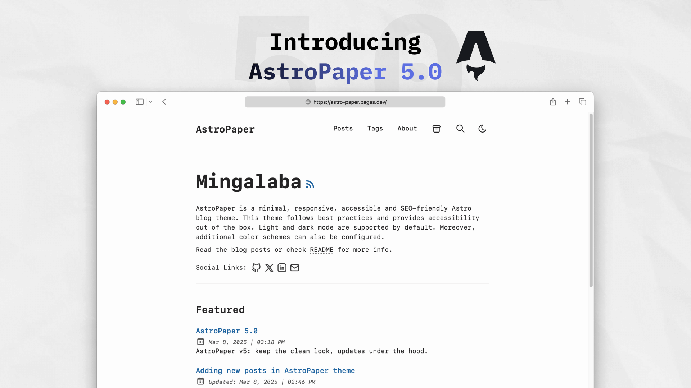
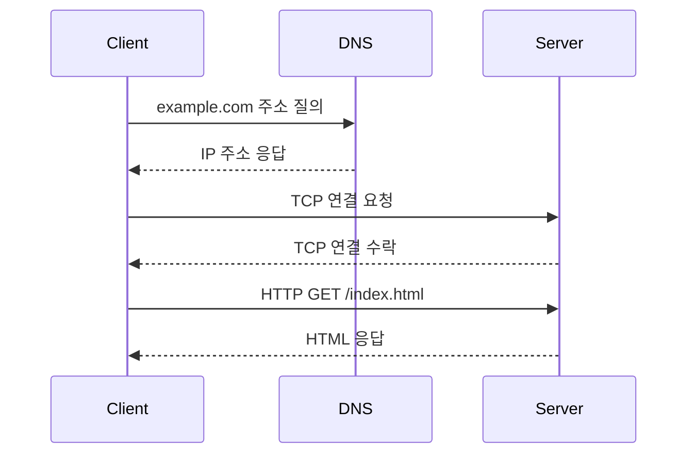

이 글은 깊은 폴더 구조가 실제로 동작하는지 확인하기 위한 예시입니다.

파일 위치는 다음과 같습니다.

```txt
src/data/blog/대학교/1학년/컴퓨터개론/첫-번째-노트.md
```

`category`를 일부러 넣지 않았기 때문에 카테고리 목록에서는 `General`로 분류됩니다.

## 이미지 불러오기 예시

Markdown에서는 `src/assets` 아래 이미지를 `@/assets/...` 경로로 불러올 수 있습니다.


같은 이미지를 상대경로로 쓰고 싶다면 현재 md 파일 위치를 기준으로 계산해야 합니다.

```md

```

## HTML img 태그 예시

아래처럼 기존 정리 파일에서 쓰던 raw HTML `` 구조는 빌드는 통과하지만, Astro가 이미지 파일을 처리하지 않아 배포 페이지에서는 404가 납니다.

```html
<p align="center"></p>
<p align="center"><sub>Figure 1.1 · PDF p. 14 · Internet을 이루는 host, server, router, link-layer switch, ISP, datacenter, access network의 큰 그림</sub></p>
```

같은 이미지를 실제 페이지에 올릴 때는 Markdown 이미지 문법을 쓰는 편이 안전합니다.


<p align="center"><sub>Figure 1.1 · PDF p. 14 · Internet을 이루는 host, server, router, link-layer switch, ISP, datacenter, access network의 큰 그림</sub></p>

## Markdown 기능 테스트

### Mermaid sequence diagram



### Markdown table

| 계층 | 예시 프로토콜 | 핵심 역할 |
| --- | --- | --- |
| Application | HTTP, DNS | 애플리케이션 메시지 교환 |
| Transport | TCP, UDP | 프로세스 간 데이터 전달 |
| Network | IP | 호스트 간 패킷 전달 |
| Link | Ethernet, Wi-Fi | 인접 노드 간 프레임 전달 |

### ASCII packet layout

```txt
+----------------------+----------------------+----------------------+
| Ethernet Header      | IP Header            | TCP Header           |
+----------------------+----------------------+----------------------+
| Application Payload                                      ...       |
+-------------------------------------------------------------------+
```

### 수식

Inline 수식 예시: $d_{nodal} = d_{proc} + d_{queue} + d_{trans} + d_{prop}$

Block 수식 예시:

$$
d_{trans} = \frac{L}{R}
$$
